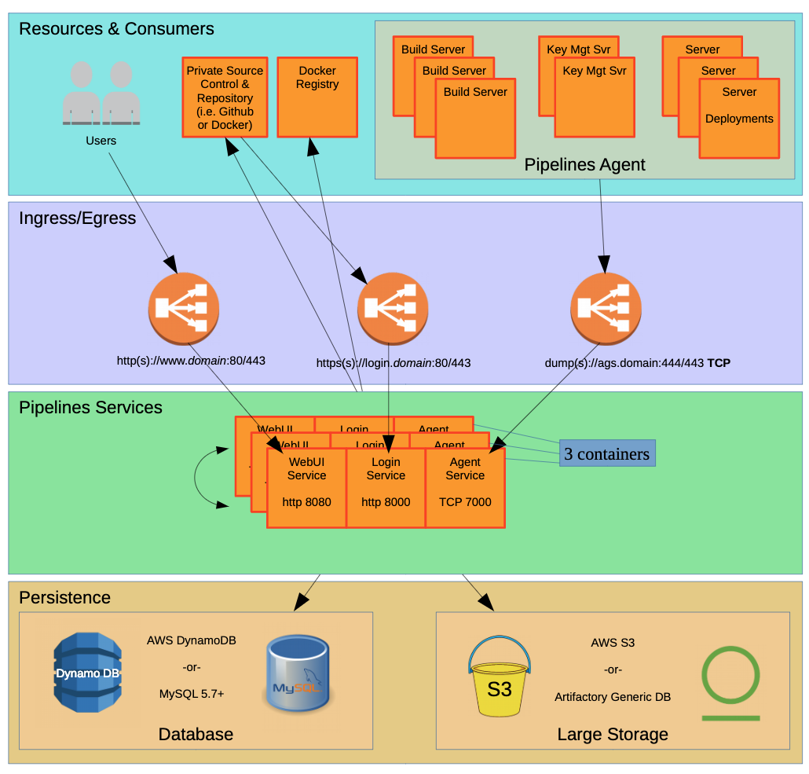

## Understanding the architecture of on-premises Pipelines for Applications 

The following diagram provides an architectural overview of an on-premises installation of enterprise edition Pipelines for Applications. 

An on-premises installation is made up of the following four layers:

* Resources and consumers
* Ingress and egress
* Pipelines services
* Persistence

### The resources and consumers layer

This layer includes: 

* Users accessing Pipelines for Applications
* Resources that Pipelines for Applications needs to access, such as your software registry, Docker registry, and notification services 
* Resources that need to access Pipelines for Applications, such as webhooks from a software registry 

### The ingress and egress layer

This layer provides access for the Pipelines for Applications services' inbound and outbound communications. It can also be used to provide security. 

The ingress and egress layer includes three load balancers, one for each Pipelines service endpoint. DNS entries for each endpoint are required, such as the following examples:

* http(s)://www.domain:80/443
* http(s)://login.domain:80/443
* dump(s)://ags.domain:XX/443 (A TCP connection is required)

### Pipelines services layer

This layer includes the Pipelines for Applications containers. In a typical installation of this type, two or more containers are used to provide high availability (HA) and redundancy. The diagram above shows three containers in use on this layer. 

Each container runs all three Pipelines for Applications services:

* The web UI service (HTTP) on port 8080
* The login service (HTTP) on port 8000
* The agent service (TCP) on port 7000

These services must be able to: 

* Send communications to the resources and consumers layer
* Receive communications from the ingress and egress layer
* Communicate directly with each other
* Communicate with the persistence layer

If your installation includes both Pipelines for Applications and Pipelines for Containers, be aware that these products each run in separate, standalone containers. 

### Persistence layer

The ongoing availability of the persistence layer is most critical to your installation. The three other layers can be replaced, rebuilt, or exchanged without disturbing the persistence layer. You can hot-swap the containers in the Pipelines services layer without impacting end users, so long as the persistence layer is available and uncompromised. 

The persistence layer includes:

* Database (AWS DynamoDB or MySQL version 5.7 or later in the 5.x series)
* Large object storage (AWS s3, an S3 emulator, or Artifactory generic database)

## On-premises installation upgrade paths

The following table provides upgrade paths for the on-premises installation of enterprise edition Pipelines for Applications. 

> **Note:** Beginning in April 2019, enterprise edition Puppet Pipelines is delivered as a single container, containing the enterprise editions of Pipelines for Applications and Pipelines for Containers. 

| **Starting version** | **Upgrade path** | 
| --- | --- | 
| 4.2.2 | n/a |
| 4.2.0 | 4.2.0 > 4.2.2 |
| 4.1.0 | 4.1.0 > 4.2.0 > 4.2.2|
| 4.0.0 | 4.0.0 > 4.1.0 > 4.2.0 > 4.2.2 |
| 3.4.2 | 3.4.2 > 4.0.0 > 4.1.0 > 4.2.0 > 4.2.2 |
| 3.4.0 | 3.4.0 > 3.4.2 > 4.0.0 > 4.1.0 > 4.2.0 > 4.2.2 |
| 3.3.3 | 3.3.3 > 3.4.0 > 3.4.2 > 4.0.0 > 4.1.0 > 4.2.0 > 4.2.2 |
| 2.1.05 | 2.1.05 > 3.3.3 > 3.4.0 > 3.4.2 > 4.0.0 > 4.1.0 > 4.2.0 > 4.2.2 |
| 2.1.02 | 2.1.02 > 2.1.05 > 3.3.3 > 3.4.0 > 3.4.2 > 4.0.0 > 4.1.0 > 4.2.0 > 4.2.2 |
| 2.1.01 | 2.1.01 > 2.1.02 > 2.1.05 > 3.3.3 > 3.4.0 > 3.4.2 > 4.0.0 > 4.1.0 > 4.2.0 > 4.2.2 |

