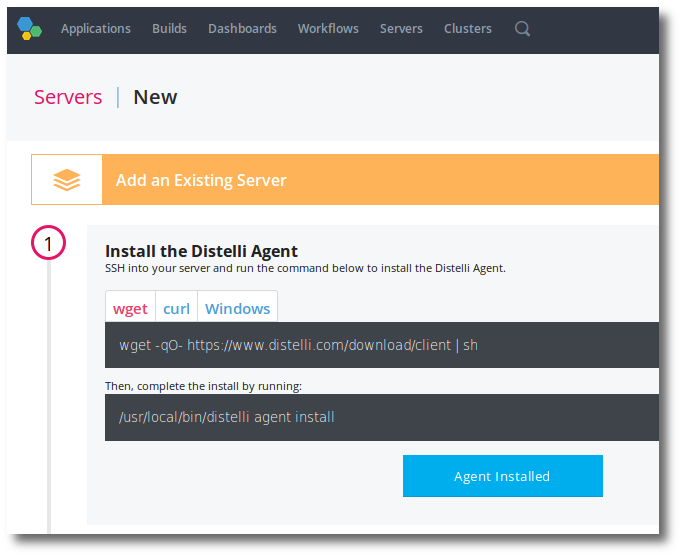

## Running the Pipelines installation script

These instructions are specific to Linux.

Before getting started, ensure you have the latest Pipelines installation script.
Please [contact our team](http://info.puppet.com/Pipelines-Request-Demo) to obtain the Pipelines on premises install script.

Also ensure you have reviewed the AWS requirements for your installation.

<h3>Pipelines Installation Script</h3>

The following fields should be configured before running the script:

<table>
<tr><th>Option</th><th>Information</th></tr>

<tr><td>ENTERPRISE_VERSION</td><td>This value will be supplied by Pipelines.</td></tr>

<tr><td>AWS_ACCESS_KEY</td><td>If the install is being run on an EC2 instance in AWS and the instance has already been assigned an appropriate IAM role, then enter the value <code>INSTANCE</code>. 
Otherwise, enter the <b>AWS Access Key</b> that has the appropriate role/permissions for Pipelines. This includes access to S3 and/or DynamoDB. 
It installing on bare metal, leave this blank.</td></tr>

<tr><td>AWS_SECRET_KEY</td><td>If the install is being run on an EC2 instance in AWS and the instance has already been assigned an appropriate IAM role, then enter the value <code>INSTANCE</code>. 
Otherwise, enter the <b>AWS Secret Key</b> that has the appropriate role/permissions for Pipelines. This includes access to S3 and/or DynamoDB. 
It installing on bare metal, leave this blank.</td></tr>

<tr><td>MYSQL_CREDS</td><td>If using MySQL, enter the <b>username=password</b> that Pipelines will use to access the MySQL database. 
<code>root=secretpassword</code></td></tr>

<tr><td>HTTPS_PROXY</td><td><b>Deprecated</b> Use S3_PROXY_ENDPOINT and DDB_PROXY_ENDPOINT. 
If there exists an HTTPS Proxy in your environment that Pipelines will have to use, enter the <b>full URL for the proxy server</b>. 
<code>https://192.168.0.112:8888/</code> 
Otherwise, leave the field <b>BLANK</b>.</td></tr>

<tr><td>S3_PROXY_ENDPOINT</td><td>If there exists an S3 Proxy in your environment that Pipelines will have to use, enter the <b>full URL for the proxy server</b>. 
Otherwise, leave the field <b>BLANK</b>.</td></tr>

<tr><td>S3_ENDPOINT</td><td>If using an S3 emulator or Artifactory, this specifies <b>full URL for the endpoint</b> of the service for Pipelines. 
<code>http://artifactory.example.com</code> 
Otherwise, leave the field <b>BLANK</b>.</td></tr>

<tr><td>S3_PROVIDER</td><td>If using S3 or an S3 emulator, set to <b>S3</b>. Otherwise if using Artifactory, set this to <b>ARTIFACTORY</b></td></tr>

<tr><td>DDB_PROXY_ENDPOINT</td><td>The DynamoDB Proxy in your environment that Pipelines will have to use, enter the <b>full URL for the proxy server</b>. 
Otherwise, leave the field <b>BLANK</b>.</td></tr>

<tr><td>REGION</td><td>Enter the <b>AWS Region</b> this Pipelines instance will operate in. This is the same region that the DynamoDB and S3 Bucket are in. <code>us-west-2</code></td></tr>

<tr><td>STAGE</td><td>There are only 3 valid values: <code>beta</code>, <code>gamma</code>, or <code>prod</code>. This choice affects the naming of DynamoDB tables and the DNS names.</td></tr>

<tr><td>DISTELLI_EMAIL</td><td>This is the initial Pipelines SuperUser email login. Use this email for first login into Pipelines.</td></tr>

<tr><td>DISTELLI_PASSWORD</td><td>This is the initial Pipelines SuperUser login password. Use this for first login into Pipelines.</td></tr>

<tr><td>S3_BUCKET</td><td>Enter the <b>AWS S3 Bucket Name</b> that Pipelines will use for <b>user release artifacts</b> data. 
If using Artifactory, this will be the Artifactory Generic Binary Repository.</td></tr>

<tr><td>S3_SUBDIR</td><td>Enter the <b>AWS S3 Bucket subdirectory</b> that Pipelines will use for <b>user release artifacts</b> data. 
Only used for S3.</td></tr>

<tr><td>S3_SSE</td><td>Valid options: <code>true</code> or <code>false</code> 
Is there S3 Encryption?</td></tr>

<tr><td>web UI_ENDPOINT</td><td>This is the URL or IP address and port for the Pipelines web UI. Typically this points to a <b>load balancer</b>.</td></tr>

<tr><td>BACKEND_ENDPOINT</td><td>This is the URL or IP address and port for the Pipelines backend service.</td></tr>

<tr><td>AGENT_ENDPOINT</td><td>This is the URL or IP address and port for the Pipelines agent service.</td></tr>

<tr><td>DDB_CIPHER_KEY</td><td>This is the database cipher key. This is required and must be the same for all Pipelines instances using the DDB. This can be created with the following syntax: 
<code>dd bs=1 if=/dev/urandom count=16 2>/dev/null | base64</code></td></tr>

<tr><td>DDB_TABLE_PREFIX</td><td>This is the database table name prefix.</td></tr>

<tr><td>SUDO</td><td>This is the tool used to provide an advanced access to system resources. Typically this is <code>sudo</code>.</td></tr>

<tr><td>DISTELLI_TOOLS</td><td>The default file location for Pipelines tools. Typically this is <code>/usr/local</code>.</td></tr>

<tr><td>DISTELLI_CONFIG</td><td>The default file location for Pipelines configuration files. Typically this is <code>/etc</code>.</td></tr>

<tr><td>DISTELLI_USER</td><td>The user that Pipelines uses for local deployments of Pipelines releases. Typically this is <code>distelli</code>.</td></tr>

<tr><td>ROOT_USER</td><td>The system root user. Typically this is <code>root</code>.</td></tr>

<tr><td>DATA_DIR</td><td>The directory the Pipelines agent will deploy to. Typically this is <code>/disetlli</code>.</td></tr>

<tr><td>CUSTOM_MANAGER</td><td>Use this option to set any <b>distelli agent install</b> options.</td></tr>

<tr><td>MYSQL_ENDPOINT</td><td>If using MySQL, set this to the database endpoint, port, and database name 
<code>mysql://localhost:3306/distelliDB</code>  
If using SSL with MySQL, specify the certificate also. 
<code>mysql://distelli-alpha.cabc012efgh3.us-east-8.rds.amazonaws.com:3306/onprem?useSSL=true&serverSslCert=$DISTELLI_CONFIG/rds-combined-ca-bundle.pem</code> 
</td></tr>
</table>

## Installing on MySQL

Pipelines on-premise supports installing on MySQL.

**Note:** Pipelines must use MySQL 5.7 or later in the 5.x release series.

<h3>Pipelines with MySQL Prerequisites</h3>

Before beginning the Pipelines install script with MySQL, the database must first be created.

<h3>Install Pipelines with MySQL</h3>

There are 2 specific variables in the Pipelines install shell script that pertain specificly to installing Pipelines with MySQL.

<table>
<tr><th>Option</th><th>Information</th></tr>

<tr><td>MYSQL_CREDS</td><td>If using MySQL, enter the <b>username=password</b> that Pipelines will use to access the MySQL database. 
<code>root=secretpassword</code></td></tr>

<tr><td>MYSQL_ENDPOINT</td><td>If using MySQL, set this to the database endpoint, port, and database name 
<code>mysql://localhost:3306/distelliDB</code>  
If using SSL with MySQL, specify the certificate also. 
<code>mysql://distelli-alpha.cabc012efgh3.us-east-8.rds.amazonaws.com:3306/onprem?useSSL=true&serverSslCert=$DISTELLI_CONFIG/rds-combined-ca-bundle.pem</code> 
</td></tr>

</table>

<h3>Upgrading Pipelines on MySQL</h3>

Upgrading Pipelines on MySQL will automatically handle any database migrations, changes, and new index creations.

<h3>Obtain the Pipelines on premises Install Script</h3>

Please contact our team to obtain the Pipelines on premises install script.

<h3>Install MySQL 5.7 on Ubuntu</h3>

<ol>
<li>Get the apt-get configurator.</li>

<code>wget http://dev.mysql.com/get/mysql-apt-config_0.6.0-1_all.deb</code>

<li>Install the apt-get configurator.</li>

<code>sudo dpkg -i mysql-apt-config_0.6.0-1_all.deb</code>

<li>Update apt-get.</li>

<code>sudo apt-get update</code>

<li>Install MySQL 5.7.</li>

<code>sudo apt-get install mysql-server</code>

</ol>

<h3>Create the MySQL Database</h3>

<ol>
<li>Login to MySQL.</li>

<code>mysql -u USER -p</code>

You will be prompted for the <b>USER</b> password.

<li>Create database.</li>

<code>create database DISTELLI_DB;</code>

<li>Add a user and grant permissions to the database.</li>

<code>grant all privileges on DISTELLI_DB.* to USER identified by "PASSWORD";</code>

<li>Exit MySQL.</li>

<code>exit;</code>

</ol>

## Set up on-premises Docker build images

Shared build servers can be offered as a resource to the users of a Pipelines on-premises install.

When building on a shared build server, in Pipelines, users select a Docker image. Pipelines offers several flavors of images, including:
<ul>
    <li>Base - The base image</li>
    <li>Android - For building Android apps</li>
    <li>Go - For the Go Language</li>
    <li>JVM - For Java</li>
    <li>JavaScript - For JavaScript applications</li>
    <li>Perl - For Perl</li>
    <li>PHP - For PHP</li>
    <li>Python - For Python</li>
    <li>Ruby - For Ruby</li>
</ul>

For more technical details on the images, please see [Pipelines Build Environment Details](./build-environment.html).

A hosted on-premises version of Pipelines can offer none, some, or all of the images. Further, after this is configured, users can add their own personal Docker image to build from. For more info see [Creating Docker Build Images for Pipelines](./docker-build-image.html).

An outline of the steps involved to set this up:

<ul>
    <li>Determine a docker registry where the docker build images will be stored.</li>
    <li>Ensure the on-premises environment is up and working with its specific Pipelines agent.</li>
    <li>Setup a build server in the D1, default Pipelines, account.</li>
    <li>Rebuild the existing Pipelines docker build images into the above registry with the on-premises Pipelines agent.</li>
    <li>Update the Pipelines shared image docker config file.</li>
    <li>Restart the Pipelines web UI.</li>
</ul>

### Select registry

The Pipelines shared docker build images must sit in a valid docker registry.

<a href="https://hub.docker.com/">Docker Hub</a> is a free service.

### Install on-premises

Work with the Pipelines customer success team to:
<ul>
    <li>Install your Pipelines stack.</li>
    <li>Ensure the Pipelines agent is working.</li>
</ul>

### Set up shared build server

Setup and configure a shared build server in the D1, default Pipelines account.

For more information on provisioning a build server in Pipelines see: [Using your own Build Server](./server.html).

This server <b>must</b> have Docker installed also.
The <b>Pipelines</b> user <b>must</b> be added to the "docker" group.

**Note:** After adding the Pipelines user to the docker group, you must restart the `distelli supervise` process.

~~~
sudo distelli supervise stop
sudo distelli supervise start
~~~

You do not configure build tools on this server, the Docker containers include the build tools.

### Build Docker images

You must now:
<ul>
    <li>Copy each Pipelines docker build image. The images are on Docker Hub here:</li>
    <ul>
        <li>distelli/travis-ruby</li>
        <li>distelli/travis-base</li>
        <li>distelli/travis-javascript</li>
        <li>distelli/travis-jvm</li>
        <li>distelli/travis-android</li>
        <li>distelli/travis-erlang</li>
        <li>distelli/travis-go</li>
        <li>distelli/travis-haskell</li>
        <li>distelli/travis-perl</li>
        <li>distelli/travis-php</li>
        <li>distelli/travis-python</li>
    </ul>
    <li>Create a new image (Dockerfile) based on this image.</li>
    <ul>
        <li>Include the Pipelines agent for this on-premises install.</li>
<code>
    FROM distelli/travis-base
    RUN wget -qO- https://pipelines.puppet.com/download/client | sh
</code>
    </ul>
    <li>Build the image.</li>
    <li>Push the image to the on-premises registry.</li>
</ul>

This process can easily be done from the build server created in the previous step. This should be done from the <b>Pipelines</b> user.

You will need to login the <b>Pipelines</b> user to the on-premises destination registry before beginning.

The below code exemplifies automating the steps outlined above.

~~~
DESTINATION_REGISTRY=123456789.dkr.ecr.us-east-1.amazonaws.com
DISTELLI_AGENT_URL=https://www-distelli.example.com/download/client
#The following is login for destination registry
eval "$(aws --region us-west-1 ecr get-login)"
for L in base android go jvm javascript perl php python ruby; do
  docker pull distelli/travis-$L || break
  printf "FROM distelli/travis-$L\nRUN wget -qO- $DISTELLI_AGENT_URL | sh\n" > Dockerfile
  docker build -t $DESTINATION_REGISTRY/distelli-build-$L . || break
  docker push $DESTINATION_REGISTRY/distelli-build-$L || break
done
~~~

* DESTINATION_REGISTRY - The docker url to the registry. If using Docker Hub, it is simply your Docker Hub user name.
* DISTELLI_AGENT_URL - This URL can be found here:
	1. Servers
	1. Add Server
	1. Add Existing Server

Here you can find the URL to download the Pipelines agent from this on-premises install of Pipelines.

You must ensure the "Pipelines" user on the build server has access to pull the images from the source and destination registries and push to the destination registry.

### Update config file

Update the Pipelines shared image Docker config file. This can be found on the Pipelines server at:

<code>/etc/distelli-config.json</code>

Look for the entry <b>DockerImages</b> in the JSON blob.

<code>  "DockerImages" : { }</code>

Adding new entries for shared docker build images is in the format:

<code> "registry/image":"Description"</code>

For Pipelines, this looks like this:

~~~
"stage/*/DockerImages": {
    "distelli/travis-base": "Distelli Base", 
    "distelli/travis-jvm": "Distelli Java", 
    "distelli/Javascript": "Distelli Javascript", 
}
~~~

Adjust your file settings and save it.

### Restart the Pipelines web UI

Finally, restart the Pipelines web UI. This is best done from the Pipelines D1 master account.

[Restarting an Application](./application-manage.html)

## Trusted servers

The above scenario uses Docker in Docker to build. This is a secure environment where one tenant can not affect another tenants process. That is to say, you can not see other docker builds or images in the host from a build.

You can tell Pipelines that your shared build servers have "Trusted" docker daemons. Which will run docker builds directly on the host instead of Docker in Docker. Realize this means builds will have access to the build server docker processes on the host and can maliciously affect other docker containers running, which includes other Pipelines builds.

### Enable trusted servers

You must have Pipelines agent 3.66.25 or greater on your build server.

You must have access to the Pipelines [administrator console](./admin-console.html).

1. In the console, navigate to the <b>Enterprise</b> tab.
1. In the Console / Enterprise Settings click the <b>Configuration</b> tab.
1. Check the [x] <b>Trust local Docker Daemon on Shared Build Servers</b> button.

You have now enabled trusted docker for your Pipelines shared builds.

## Add a server

Adding an extra Pipelines instance, for redundancy, is relatively easy. When hosting more than one Pipelines instance, the instances must be behind some form of load-balancer or proxy. This should have been configured on initial bootstrap of Pipelines.

First step is to instantiate a server. The minimum requirements for a Pipelines instance are:

<ul>
  <li>2 cpu</li>
  <li>8 GB RAM</li>
  <li>50 GB Volume</li>
</ul>

Of note, Pipelines works best with Ubuntu 14 & 16, but can work with many flavors of Linux.

Realize, if your existing Pipelines instances are using an IAM role (or similar security features) you may need to ensure the new server has the same role(s).

### Install agent

On the new server, install the Pipelines agent from your existing Pipelines onpremise installation.,

Auth (login) the agent to the <b>root</b> D1 account of your Pipelines onpremise installation.

<h3>Copy configuration files</h3>

<ol>
  <li>Login (ssh) to the command prompt of your existing working Pipelines onpremise server.</li>
  <li>Copy <code>/etc/distelli-config.json</code> and <code>/etc/distelli-creds.json</code> to the new server.</li>
  <li>Ensure the files are owned by the distelli user (created when you installed the agent.) <code>chown distelli /etc/distelli-c*.json</code></li>
  <li>Ensure the files permissions are set appropriate <code>chmod 600 /etc/distelli-c*.json</code>.</li>
</ol>

<h3>Install infrabase</h3>

The next step is to install the Pipelines OnPremInfraBase package to the server. This package includes the basics to run Pipelines, including Java 8.

<ol>
  <li>Login (browser) to your onpremise Pipelines web UI with the <b>root</b> D1 account.</li>
  <li>Ensure you are on the <b>Pipelines for Applications</b> web UI.</li>
  <li>Click <b>OnPremInfraBase</b> application.</li>
  <li>Click <b>Environments</b>.</li>
  <li>Click the production environment name which should resemble this <code>infrabase-REGION-STAGE</code>.</li>
  <li>Click the <b>(+)</b> icon link to add a server to this environment.</li>
  <li>Ensure the <b>[x] Deploy app to added servers</b> option is checked (enabled).</li>
  <li>In the list, select the new server you just installed the Pipelines agent on, and click <b>Add Servers</b>.</li>

  
You should be prompted to deploy the active release to this one server now. See an example below.

  

  
If you are not prompted to deploy, see the <b>Troubleshooting</b> section below.

  <li>Click <b>Deploy</b> to deploy the infrabase to the new server.</li>
</ol>

<h3>Install packages</h3>

Now you will follow the same procedure, as you did to install Infrabase, for all the other Pipelines services. It is important that these are deployed in this specific order:

<ol>
  <li>AgentService</li>
  <li>DeploymentMonitor</li>
  <li>DistelliBackendService</li>
  <li>Pipelines web UI</li>
</ol>

The idea is that you will go to each of those Applications, in order, in Pipelines; go to the environment and add the server. This will initiate a deployment of the active release of that Pipelines service to just that server.

Let each one finish successfully before continuing to the next.

<h3>Add server to load balancer</h3>

Finally, add the new Pipelines instance to any load-balancer or proxy. You should be up and running.

<h3>Troubleshooting</h3>

**Issue: Not prompted to deploy when adding server to environment**

This occurs when there have been no physical deploys of the Application, except for the initial bootstrap deploy. This can be resolved by:

1. Removing all the existing working Pipelines servers from the environment.
2. Ensure only the new Pipelines server is in the environment.
3. Initiated a deploy of the active release.
4. After the deploy successfully completes, add all the existing working Pipelines servers back into the environment.

> **Warning:** Do **NOT** deploy to the existing working Pipelines servers! This may cause an outage!

## Set up log pruner

Pipelines services are good at providing logs. Logs are kept in the DISTELLI_APPHOME directory. 

In a default install, these are located at:

~~~
/distelli/envs/agent-service-REGION-STAGE/logs
/distelli/envs/backend-service-REGION-STAGE/logs
/distelli/envs/dmon-REGION-STAGE/logs
/distelli/envs/proxy-REGION-STAGE/logs
/distelli/envs/web UI-REGION-STAGE/logs
~~~

The <b>REGION</b> and <b>STAGE</b> can be found in the original <b>distelli-install.sh</b> that was used to bootstrap the first Pipelines server.

<h3>Clone the repository</h3>

The pruner is already created here <a href="https://github.com/Distelli/onprem-log-pruner">github.com/Distelli/onprem-log-pruner</a>. You can simply clone that repository and add it to your software repository.

If you are opposed to cloning that repository, you can simply create yourself a new repository that has the single following file <b>distelli-manifest.yml</b> in it.

~~~
distelli/onprem-log-pruner:
  Build:
    - echo "...Nothing to build..."
  Env:
    - LOG_DIRS: '( "/distelli/envs/agent-service-REGION-STAGE/logs" "/distelli/envs/backend-service-REGION-STAGE/logs" "/distelli/envs/dmon-REGION-STAGE/logs" "/distelli/envs/proxy-REGION-STAGE/logs" "/distelli/envs/web UI-REGION-STAGE/logs" )'
    - LOG_EXPIRE_DAYS: '30'
    - LOG_SLEEP_SECONDS: '1800'
    - LOG_DO_IT_FOR_REAL: 'false'
  Exec:
    - echo "Starting Log Pruner"
    - while true
    - echo "Pruning"
    - do
    -     for LOG_DIR in "${LOG_DIRS[@]}"
    -     do
    -         'echo "LOGDIR: $LOG_DIR"'
    -         find $LOG_DIR -name *.log.gz -mtime +$LOG_EXPIRE_DAYS
    -         if [ "$LOG_DO_IT_FOR_REAL" = true ] ; then
    -             echo "Deleting above files!"
    -             echo "---------------------"
    -             find $LOG_DIR -name *.log.gz -mtime +$LOG_EXPIRE_DAYS -exec rm {} \;
    -         fi
    -     done
    - sleep $LOG_SLEEP_SECONDS
    - done
    - 'true'
~~~

After you have cloned or created the repository, you will have to edit the <b>distelli-manifest.yml</b> and set the LOG_DIRS environment variable. Note, you can override the environment variables in the Pipelines web UI application environment.

**Warning:** This script will indiscriminately delete files in the LOG_DIRS that are 30 days old with the extension `log.gz`. If you set the LOG_DIRS to the wrong directory, you may damage your server or the Pipelines install.

When initially setting this up, it will not actually delete anything but report what is to be deleted. This way you can validate that things are setup correctly before the actual deletion.

<h3>Create Pipelines application</h3>

Next you will want to create an application in the <b>root</b> D1 account in Pipelines for Applications. This will be connected to the above created repository.

<h3>Create Pipelines application environment</h3>

After the application is created, you will need to create an environment to deploy the application. The servers in this environment should be your actual Pipelines instances that are running the Pipelines services with logs, since this is where the onpremise log pruner must run.

<h3>Set environment variables</h3>

You may opt to override the environment variables in the distelli-manifest.yml. This can be done in the application environment.

The values for <b>LOG_EXPIRE_DAYS</b> and <b>LOG_SLEEP_SECONDS</b> are specifically set to the appropriate values for Pipelines logs.

You should wait to set <b>LOG_DO_IT_FOR_REAL</b> to <b>true</b> until you have verified the appropriate LOG_DIRS have been set.

<h3>Deploy the pruner</h3>

When you added the application, a build should have initiated and created a release. If not, ensure you create a release by building the application.

Now deploy the release to the environment.

You can see in the <b>STDOUT LOGS</b> of the deployment, the files that would be deleted. To actually delete the files you will have to set <b>LOG_DO_IT_FOR_REAL</b> to <b>true</b>.

When you are ready, set <b>LOG_DO_IT_FOR_REAL</b> to <b>true</b> and re-deploy the application to the environment. The log prunner will now automatically run and prune files for you. You can see the files that are deleted.

You can leave the pruner running and check on its status at any time in the STDOUT logs.

