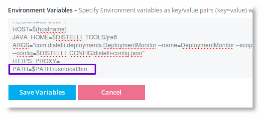
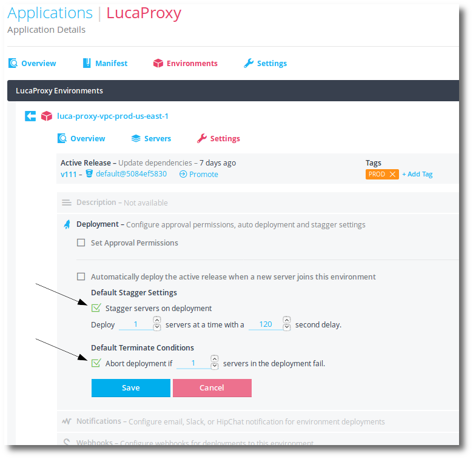
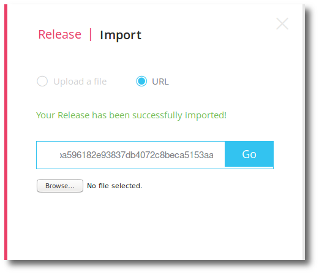
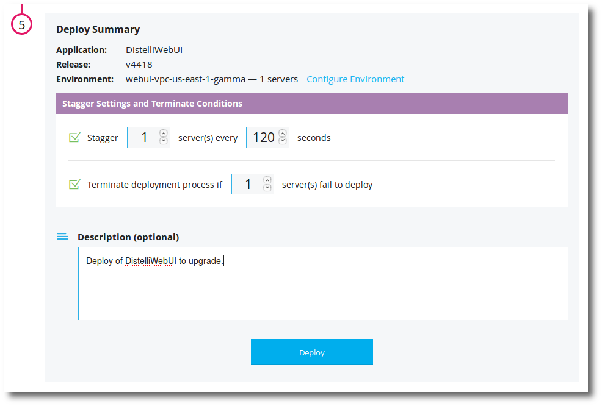
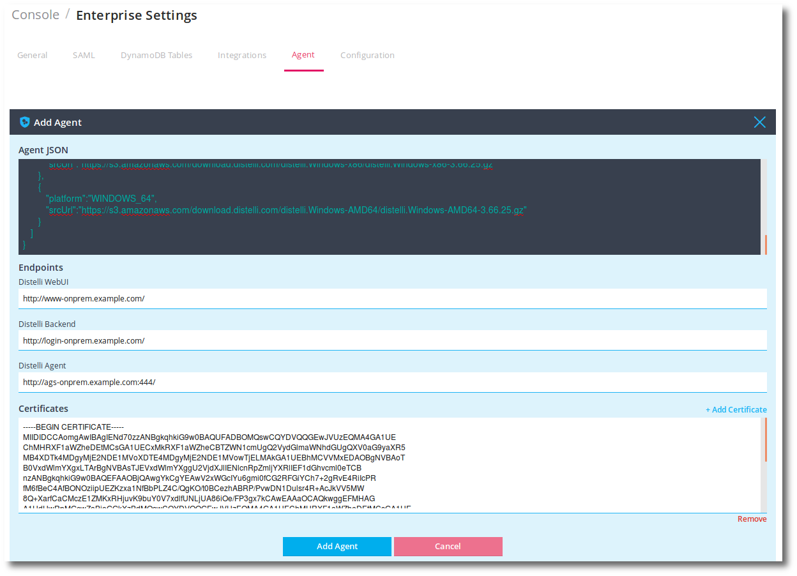

## Select your upgrade method

There are two ways to upgrade an on-premises Pipelines for Applications installation. Which method you use depends on the circumstances of your installation. 

1. **Import.**  An installation of Pipelines for Applications can update itself by importing releases and deploying them.

    If you are using two or more Pipelines instances behind a load balancer, use the <b>Import</b> method. This method is very clean and designed for ease of use.

1. **Bootstrap.** A new on-premises Pipelines for Applications installation uses the bootstrap to do the initial install. A bootstrap can also be run to re-install Pipelines.

    If you are running Pipelines for Applications on a single server, you must do a bootstrap upgrade. This upgrade depends on the persistent data in the database, large object store, and two configuration files.

> **Tip:** With either update method, inform your users in advance that an upgrade is occurring and may incur some downtime. Allow yourself an hour to do the upgrade. A bootstrap upgrade will require an outage.

## Pipelines services

There are four services that make up Pipelines for Applications. You can see these by logging in to Pipelines with the master login that was configured at install, or by logging in as a superuser and hacking the URL to /distelli.

Ensure you are viewing the Pipelines for Applications web UI, and click **Applications**.

The services are as follows:

<ul>
  <li><b>AgentService</b> - The service the Pipelines agents communicate with.</li>
  <li><b>DeploymentMonitor</b> - The task monitor to monitor builds and deploys.</li>
  <li><b>DistelliBackendService</b> - The backend services that handle most system calls.</li>
  <li><b>Distelliweb UI</b> - The web UI frontend.</li>
</ul>

You will also see the <b>OnPreminfraBase</b> application. This installs prerequisites onto a new Pipelines server (java8 for example). This package will not need upgraded.

If doing an import upgrade; you will upgrade each service that has an available update, in succession.

> **Note:** If upgrading from any Pipelines enterprise onpremise release earlier than 2.0.76, you must update the <b>Deployment Monitor</b> environment variables to add a PATH location to the Pipelines agent executable. This is typically `/usr/local/bin`. Below is an example of adding that. Ensure you "Deploy" the deployment monitor application after setting this so the change is deployed.

## Upgrading with the import method

You can use Pipelines to update Pipelines. To do so requires that there are two or more Pipelines instances running behind a load balancer. This will allow a staggered deploy of Pipelines services to each instance separately.

This update must be done in the default d1 account of Pipelines by a superuser.

### Set environment defaults

When deploying updates to Pipelines with Pipelines, you must ensure you have your environment deployment default settings set accurately. Deploys should be staggered to one server every 120 seconds. Terminate conditions should be set to terminate the deploy on a single failure.

It is best to set these as the default to avoid any mishaps.

Go to each of the five Pipelines services' production environments and set their deployment settings as indicated above.

### Upload new releases

Updates are coordinated and scheduled with Pipelines. When doing an update, a Pipelines representitive will send you a list of Pipelines services to be updated and a URL, or import package, for each to retrieve the new release.

Navigate to the application and click the <b>Import</b> icon.

Here you can either import a release from file or import from URL. Importing from URL will require that your Pipelines server has access to Pipelines services on the Internet to download the release file.

Realize that if using the URL method, the release URLs will expire after a period of time. You should use them to import the releases as soon as possible. The deploy can be initiated at a later time.

### Order is important

The four Pipelines services must be upgraded in the correct order. This order is as follows.

<ol>
  <li>AgentService</li>
  <li>DeploymentMonitor</li>
  <li>BackendService</li>
  <li>web UI</li>
</ol>

If updating multiple services, that is to say that you have been given multiple release updates for multiple applications, then the applications must be updated in the order prescribed above.

For example, you are given updates for: AgentService, BackendService, and web UI. The must be updated in this order:

<ol>
  <li>Agent Service</li>
  <li>BackendService</li>
  <li>web UI</li>
</ol>

### Deploying the update

When all the above is in place, you are ready to do the deploy.

You should take note of the release that is currently running. This will be helpful in the case of a failure and needing to roll back.

Navigate to the application and deploy the imported release. Remember to ensure the stagger and terminate options are set.

If during the deploy, a single server fails, the balance of the deploy will abort assuring that you always have at least 1 server up with the appropriate service.

In the case of a deploy failure, you can rollback to the previous release that was running before the upgrade. 

## Upgrading with the bootstrap method

If you are running Pipelines on a single server or Pipelines has instructed you to, you may have to do a bootstrap upgrade.

A bootstrap upgrade consists of running a Pipelines install script on a clean server with specific values for your existing install.

This relies heavily on having access to the original script that was run to install Pipelines originally.

Realize that new bootstrap versions may have new fields, so you will be shipped a new <code>distelli-install.sh</code> script with all the latest required fields.

You will take values from your original `distelli-install.sh` script and place them in the new `distelli-install.sh`. Here is some information on these values:

<table>
<tr><th>Option</th><th>Information</th></tr>

<tr><td>ENTERPRISE_VERSION</td><td>This value will be supplied by Pipelines.</td></tr>

<tr><td>AWS_ACCESS_KEY</td><td>If the install is being run on an EC2 instance in AWS and the instance has already been assigned an appropriate IAM role, then enter the value <code>INSTANCE</code>. 
Otherwise, enter the <b>AWS Access Key</b> that has the appropriate role/permissions for Pipelines. This includes access to S3 and/or DynamoDB. 
If installing on bare metal, leave this blank.</td></tr>

<tr><td>AWS_SECRET_KEY</td><td>If the install is being run on an EC2 instance in AWS and the instance has already been assigned an appropriate IAM role, then enter the value <code>INSTANCE</code>. 
Otherwise, enter the <b>AWS Secret Key</b> that has the appropriate role/permissions for Pipelines. This includes access to S3 and/or DynamoDB. 
If installing on bare metal, leave this blank.</td></tr>

<tr><td>MYSQL_CREDS</td><td>If using MySQL, enter the <b>username=password</b> that Pipelines will use to access the MySQL database. 
<code>root=secretpassword</code></td></tr>

<tr><td><del>HTTPS_PROXY</del></td><td><b>Deprecated</b> Use S3_PROXY_ENDPOINT and DDB_PROXY_ENDPOINT. 
If there exists an HTTPS Proxy in your environment that Pipelines will have to use, enter the <b>full URL for the proxy server</b>. 
<code>https://192.168.0.112:8888/</code> 
Otherwise, leave the field <b>BLANK</b>.</td></tr>

<tr><td>S3_PROXY_ENDPOINT</td><td>If there exists an S3 Proxy in your environment that Pipelines will have to use, enter the <b>full URL for the proxy server</b>. 
Otherwise, leave the field <b>BLANK</b>.</td></tr>

<tr><td>S3_ENDPOINT</td><td>If using an S3 emulator or Artifactory, this specifies <b>full URL for the endpoint</b> of the service for Pipelines. 
<code>http://artifactory.example.com</code> 
Otherwise, leave the field <b>BLANK</b>.</td></tr>

<tr><td>S3_PROVIDER</td><td>If using S3 or an S3 emulator, set to <b>S3</b>. Otherwise if using Artifactory, set this to <b>ARTIFACTORY</b></td></tr>

<tr><td>ARTIFACTORY_API_KEY</td><td>If using artifactory for large object store, set this to the Artifactory API key that has access to the genreic binary repository.</td></tr>

<tr><td>FORCE_S3SIGN_V4</td><td>If using S3 should Pipelines use v4 signatures. Defaults to v2.</td></tr>

<tr><td>DDB_PROXY_ENDPOINT</td><td>The DynamoDB Proxy in your environment that Pipelines will have to use, enter the <b>full URL for the proxy server</b>. 
Otherwise, leave the field <b>BLANK</b>.</td></tr>

<tr><td>REGION</td><td>Enter the <b>AWS Region</b> this Pipelines instance will operate in. This is the same region that the DynamoDB and S3 Bucket are in. <code>us-west-2</code></td></tr>

<tr><td>STAGE</td><td>There are only 3 valid values: <code>beta</code>, <code>gamma</code>, or <code>prod</code>. This choice affects the naming of DynamoDB tables and the DNS names.</td></tr>

<tr><td>DISTELLI_EMAIL</td><td>This is the initial Pipelines SuperUser email login. Use this email for first login into Pipelines.</td></tr>

<tr><td>DISTELLI_PASSWORD</td><td>This is the initial Pipelines SuperUser login password. Use this for first login into Pipelines.</td></tr>

<tr><td>S3_BUCKET</td><td>Enter the <b>AWS S3 Bucket Name</b> that Pipelines will use for <b>user release artifacts</b> data. 
If using Artifactory, this will be the Artifactory Generic Binary Repository.</td></tr>

<tr><td>S3_SUBDIR</td><td>Enter the <b>AWS S3 Bucket subdirectory</b> that Pipelines will use for <b>user release artifacts</b> data. 
Only used for S3.</td></tr>

<tr><td>S3_SSE</td><td>Valid options: <code>true</code> or <code>false</code> 
Is there S3 Encryption?</td></tr>

<tr><td>web UI_ENDPOINT</td><td>This is the URL or IP address and port for the Pipelines web UI. Typically this points to a <b>load balancer</b>.</td></tr>

<tr><td>BACKEND_ENDPOINT</td><td>This is the URL or IP address and port for the Pipelines backend service.</td></tr>

<tr><td>AGENT_ENDPOINT</td><td>This is the URL or IP address and port for the Pipelines agent service.</td></tr>

<tr><td>DDB_CIPHER_KEY</td><td>This is the database cipher key. This is required and must be the same for all Pipelines instances using the DDB. This can be created with the following syntax: 
<code>dd bs=1 if=/dev/urandom count=16 2>/dev/null | base64</code></td></tr>

<tr><td>DDB_TABLE_PREFIX</td><td>This is the database table name prefix.</td></tr>

<tr><td>SUDO</td><td>This is the tool used to provide an advanced access to system resources. Typically this is <code>sudo</code>.</td></tr>

<tr><td>DISTELLI_TOOLS</td><td>The default file location for Pipelines tools. Typically this is <code>/usr/local</code>.</td></tr>

<tr><td>DISTELLI_CONFIG</td><td>The default file location for Pipelines configuration files. Typically this is <code>/etc</code>.</td></tr>

<tr><td>DISTELLI_USER</td><td>The user that Pipelines uses for local deployments of Pipelines releases. Typically this is <code>distelli</code>.</td></tr>

<tr><td>ROOT_USER</td><td>The system root user. Typically this is <code>root</code>.</td></tr>

<tr><td>DATA_DIR</td><td>The directory the Pipelines agent will deploy to. Typically this is <code>/disetlli</code>.</td></tr>

<tr><td>CUSTOM_MANAGER</td><td>Use this option to set any <b>distelli agent install</b> options.</td></tr>

<tr><td>MYSQL_ENDPOINT</td><td>If using MySQL, set this to the database endpoint, port, and database name 
<code>mysql://localhost:3306/distelliDB</code>  
If using SSL with MySQL, specify the certificate also. 
<code>mysql://distelli-alpha.cabc012efgh3.us-east-8.rds.amazonaws.com:3306/onprem?useSSL=true&serverSslCert=$DISTELLI_CONFIG/rds-combined-ca-bundle.pem</code> 
</td></tr>

<tr><td>MYSQL_POOL_SIZE</td><td>If using MySQL, the connection pool size to use. Defaults to 4. Recommended is 3.</td></tr>
</table>

Important things to consider when upgrading:

<ul>
  <li><b>DDB_CIPHER_KEY</b> MUST be the same on upgrade. You can find this value in /etc/distelli-config.json as <b>dbCipherKey</b>.</li>
  <li>If you change any database values and Pipelines can't find the database, you may end up in a situation where Pipelines does a new install.</li>
  <li>If you change large object store (S3, Artifactory), previous logs and releases will be unavailable.</li>
  <li>If you change a Pipelines ENDPOINT (i.e. AGENT, BACKEND, or web UI), existing installed agents will not have the new endpoints and may not be able to reach Pipelines.</li>
</ul>

<h3>Back up files</h3>

You should back up the following files:

<ul>
  <li>distelli-install.sh (original)</li>
  <li>distelli-install.sh (new)</li>
  <li>/etc/distelli-config.json</li>
  <li>/etc/distelli-creds.json</li>
  <li>/etc/distelli.yml</li>
</ul>

<h3>Remove all</h3>

The following script will scrub Pipelines from your server to enable you to do a bootstrap upgrade. Realize, this script shutsdown Pipelines completely and removes it from the computer. Until you complete the upgrade, Pipelines will be down.

This script is suitable for Ubuntu 14 / 16.

~~~
sudo distelli agent stop
sudo distelli supervise stop
echo "The following may hang."
sudo distelli agent uninstall -y
echo "Agent removed."
sudo rm -Rf /distelli
sudo rm /etc/distelli.yml
sudo rm /etc/distelli-config.json
sudo rm /etc/distelli-creds.json
sudo rm /usr/local/bin/distelli
sudo rm /usr/local/bin/ec2-metadata
sudo rm -Rf /usr/local/jdk1.8.0_25
sudo rm -Rf /usr/local/jre8
sudo initctl stop dtk-supervise-cc1233c06f7ad94a8d34ac610381242f9ae28bb8
sudo userdel distelli
~~~

<h3>distelli-install.sh</h3>

You are ready to run the bootstrap upgrade.

~~~
./distelli-install.sh
~~~

<h2>Upgrade the Pipelines agent</h2>

After updating a Pipelines on-premises install, you may need to also upgrade the Pipelines agent. 

This can be accomplished by:

1. Login as the Pipelines root user or superuser.
1. Hack the Pipelines URL to <b>/console</b>.
1. Click <b>Enterprise</b>.
1. Click <b>Agent Upload</b>.
1. Click <b>+ Add Agent</b>.

    The Agent JSON will be supplied to you by Pipelines. This information defines the release and agent version location. It looks like this:

~~~
{
   "version":"3.67.0",
   "executables":[
      {
         "platform":"MAC_64",
      "srcUrl":"https://s3.amazonaws.com/download.distelli.com/distelli.Darwin-x86_64/distelli.Darwin-x86_64-3.67.0.gz"
      },
      {
         "platform":"LINUX_32",
         "srcUrl":"https://s3.amazonaws.com/download.distelli.com/distelli.Linux-i686/distelli.Linux-i686-3.67.0.gz"
      },
      {
         "platform":"LINUX_64",
         "srcUrl":"https://s3.amazonaws.com/download.distelli.com/distelli.Linux-x86_64/distelli.Linux-x86_64-3.67.0.gz"
      },
      {
         "platform":"SMART_OS",
         "srcUrl":"https://s3.amazonaws.com/download.distelli.com/distelli.SunOS-i86pc/distelli.SunOS-i86pc-3.67.0.gz"
      },
      {
         "platform":"WINDOWS_32",
         "srcUrl":"https://s3.amazonaws.com/download.distelli.com/distelli.Windows-x86/distelli.Windows-x86-3.67.0.gz"
      },
      {
         "platform":"WINDOWS_64",
         "srcUrl":"https://s3.amazonaws.com/download.distelli.com/distelli.Windows-AMD64/distelli.Windows-AMD64-3.67.0.gz"
      },
      {
         "platform":"ALPINE_LINUX_64",
         "srcUrl":"https://s3.amazonaws.com/download.distelli.com/distelli.Linux_musl-x86_64/distelli.Linux_musl-x86_64-3.67.0.gz"
      },
      {
         "platform":"RASPBERRY_PI",
         "srcUrl":"https://s3.amazonaws.com/download.distelli.com/distelli.Linux-armv7l/distelli.Linux-armv7l-3.67.0.gz"
      },
      {
         "platform":"RASPBERRY_PI6",
         "srcUrl":"https://s3.amazonaws.com/download.distelli.com/distelli.Linux-armv6l/distelli.Linux-armv6l-3.67.0.gz"
      }
   ]
}
~~~

The endpoints can be found in the initial <b>distelli-install.sh</b> script. Here is an example:

~~~
web UI_ENDPOINT="http://www-onprem.example.com/"
BACKEND_ENDPOINT="http://login-onprem.example.com/"
AGENT_ENDPOINT="dump://agent-onprem.example.com:444/"
~~~

**Note:** AGENT_ENDPOINT must begin with either `dump` for non-SSL or `dumps` for SSL.

Finally, enter any custom CA certificates.

**Note:** For successful embedding of certs, the Pipelines agent running on your Pipelines instances MUST be version 3.66.23 or greater. You may be required to do an update and then do another update to embed certificates.

**Note:** These certificates will <b>replace</b> all of the existing Pipelines agent default certificates. If you want to use the default Pipelines agent certificates, include no certificates.

  

1. Click <b>Add Agent</b>.
