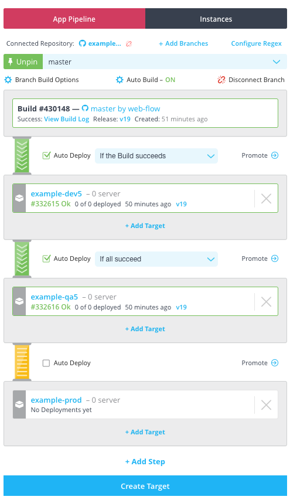
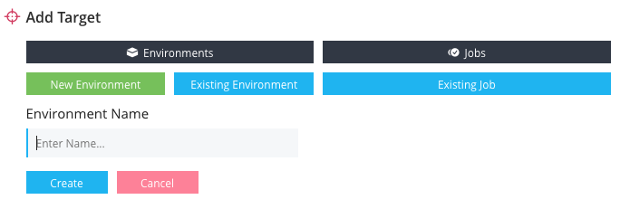
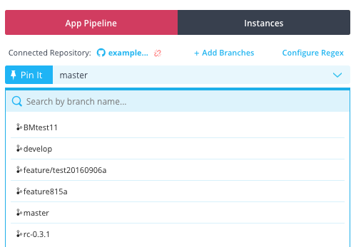

Application pipelines allow you to graphically configure the automation of your build and deployments of your application. With this feature you can enable continuous integration and continuous deployments.

Above is an example pipeline for an application. It depicts:

* Auto Build is enabled. This means when new code it checked into the repository <b>example-node</b> on branch <b>master</b>, it will be automatically be built.
* If the build succeds the release will be automatically deployed to the **example-dev5** environment.
* If that deployment succeeds, then the release will be deployed to <b>example-qa5</b>.
* The pipeline will not automatically deploy to <b>example-production</b>, but you can deploy it manually by clicking **Promote**.

A pipeline is where you set your deployment automation. You will want to manage your deployment "big picture" from a [dashboard](./dashboard.html).

## Create a new application pipeline

An app pipeline is automatically created for all applications that are connected to at least one repository branch.

When working with a new application and a new application pipeline you should consider the following:

<ul>
<li>To add a step to a pipeline requires at least one application environment.</li>
<li>You can create environments from the pipeline UI by clicking <b>Create Target</b>.</li>
</ul>

1. In the Pipelines for Applications web UI click <b>Applications</b> and select the application from your list.
1. Ensure you are on the <b>Overview</b> tab.
1. If you have not yet connected a repository, click <b>Connect Repository</b> and see [Connecting a Repository to an Application](./application-manage.html).
1. Click <b>Add Pipeline for <i>XXXXXXX</i> branch</b>.

Your new pipeline is created and ready to be set up. Next steps include:

* [Enable Auto Build](./build.html)
* [Enable Auto Deploy](./application-deploy.html)
* Set up a [dashboard](./dashboard.html)

## Create an environment from an application pipeline

Environments are a grouping of servers that consume deployments. Environments are specific to applications. For more information on application environments, see [Environments](./environment.html).

To create application environments from an application pipeline, follow these steps: 

1. In the Pipelines for Applications web UI, click **Applications**, and select the application you're interested in. 
1. At the bottom of the **App Pipeline** screen, click **Add Target**, then **New Enviroment**.
   

1. Enter a unique name for your environment.

    > **Note:** All environments must have unique names.

1. Click <b>Create</b> to create the new environment.

## Pin a default pipeline branch

If you have multiple branches connected to your pipeline, you can pin the branch you work with most frequently so that it is shown by default whenever you view your application's pipeline.

1. In the Pipelines for Applications web UI click <b>Applications</b> and select an application from your list. 
1. In the **App Pipeline** area, open the branch selection drop-down. Browse the list of branches or use the **Search by branch name** field to locate the branch you want. 

   

1. Select the branch you wish to see whenever you open this application and click **Pin It**. 

