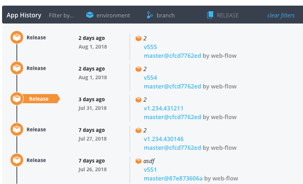
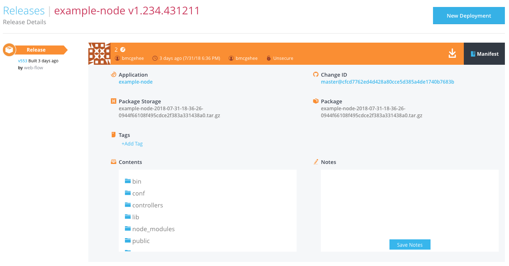

---
layout: default
title: "Releasing applications"
--- 

Releases are bundled packages of software that include build, test, and deployment instructions.

## Deploying a release

When you have created a release of an application, you can use Pipelines for Applications to deploy the application to the servers in an environment.

Releases can also be created by a successful build. 

See [Deploying an Application](./application-deploy.html)

## Navigating to a release and viewing release details

To interact with or view details of a release you must first navigate to the release.

Releases are application specific. To see a release, you must:

1. Navigate to the application. See [Navigating to an Application](./application-manage.html).
1. On the Application Details page, in the **Filter by...** area, click **type** and select **RELEASE**.
1. From the list of previous releases, click on the release you wish to navigate to.

You have navigated to a specific release. Here you can view the release's details. 

Release details include:
<ul>
<li>The release description.</li>
<li>The release tags.</li>
<li>Who created the release.</li>
<li>When the release was created.</li>
<li>The repository change ID, if a repo is connected.</li>
<li>The release package (bundle) name.</li>
<li>The release package (bundle) storage.</li>
</ul>

## Release details

### Description

This represents a user entered description. This can be specified in the web UI and during the Pipelines CLI push process, for example:

~~~
distelli push -m \Enter Release Description Here\
~~~

To edit the description in the web UI, click the <b>Edit Description</b> link.

### Tags

You can have up to three tags per release. Release tags are searchable. See the **Find a release by tag or version** section.
A tag can be added by clicking on the little tag icon.
Tags can be removed by clicking on the <b>X</b> on the tag.

### Created by

This shows which Pipelines user is attributed to creating the release.

### Change ID

This is the repository change ID when you have integrated your application with your repository using the [Pipelines Manifest CommitData Section](./manifest.html).

### Package

This is the bundled release file. For more information see [Pipelines Bundle](./cli-command.html).

### Package Storage

This shows the location the bundled release is kept. For more information see [Using Amazon S3 Bucket](./integrate-amazon.html).

## Custom release IDs

Each Pipelines for Applications release has a unique ID in the form of `v##`. Pipelines for Applications automatically assigns incremental release ID numbers to your application's releases. You can also specify custom release IDs.

Using a custom release ID makes it easier to track specific information about a given release, such as the version of included components, release dates, or other business data. 

When a custom release ID is set, Pipelines for Applications will assign an incremental release ID number to your release as usual, but will display the custom release ID instead of the default incremental release ID number in most places. 

For example, in the following image, the release that would have been incrementally numbered `v553` has instead been given a custom release ID, `v1.234.431211`. 

On the release details page for `v1.234.431211`, the custom release ID is shown in the page header. Note that the incremental version number, `v553`, is also displayed at the left of the screen.  

> **Note:** The custom release IDs you create do not currently appear in the Pipelines for Applications API or CLI. When working with the API or CLI, you must use your release's incremental version number. 

### Creating a custom release ID

To create a custom release ID, add a `CustomVersionCmd` section to the Build section of your application's `distelli-manifest.yml` file. 

> **Note:** Custom release IDs cannot be created with an in-app manifest.

When composing your manifest's `CustomVersionCmd` section, keep the following in mind:

* Custom release IDs are not case-sensitive. 
* Release IDs must be unique. Therefore, a custom release ID can be used only one time on a given application. 

An example `CustomVersionCmd` section:

~~~
CustomVersionCmd:
  - "MVNVERSION=$(mvn -q -Dexec.executable=\"echo\" -Dexec.args='${project.version}' --non-recursive org.codehaus.mojo:exec-maven-plugin:1.3.1:exec)"
  - echo "${MVNVERSION}-$DISTELLI_BUILDNUM"
~~~

For more information, see [Application manifest: Build section](./manifest-build.html#CustomVersionCmd)

## Finding a release ID with the Pipelines CLI

To deploy a specific application release from the Pipelines CLI, you will need the release ID. The Pipelines CLI provides `list` commands to list releases. 

To use this command you must have the [Pipelines CLI](./cli.html) installed.

The syntax to use this command is:

~~~
distelli list releases -n APPLICATION_NAME
~~~

Here is an example session:

~~~
$ distelli list releases -n BashSimpleApp
+---------------+------------+----------------------------------------+-------------+
| App Name      | Release Id | Created                                | Description |
+---------------+------------+----------------------------------------+-------------+
| BashSimpleApp | v1         | 2015-05-08 20:57:42 UTC (3 months ago) | Test1       |
| BashSimpleApp | v2         | 2015-05-08 21:00:21 UTC (3 months ago) | Test2       |
| BashSimpleApp | v3         | 2015-05-11 17:03:54 UTC (3 months ago) | Test3       |
| BashSimpleApp | v4         | 2015-05-12 00:20:58 UTC (3 months ago) | Test4       |
+---------------+------------+----------------------------------------+-------------+
~~~

For more information on deploying a specific release from the Pipelines CLI see [Pipelines CLI](./cli-command.html).

## Finding a release ID with the Pipelines web UI

To find a specific release ID via the Pipelines web UI:

1. First [Navigate to the application that contains the release](./application-manage.html).
2. On the Application Details page, in the **Filter by...** area, click **type** and select **RELEASE**.
3. From the list of previous releases, click on the release you wish to navigate to.

## Release notes

### Creating release notes 

When creating a new release with a `distelli push` you can provide textual release notes.

#### Create release notes from CLI

When pushing a new release to a Pipelines account you can use the option `--release-notes`.

~~~
distelli push --release-notes
~~~

When using this option, the Pipelines CLI will provide a mechanism for entering text release notes.
Here is an example session:

~~~
$ distelli push --release-notes
Enter Release Notes (Ctrl-D to Finish):

This release fixes issues found in the following bugs:
</i> Bug #4373
</i> Bug #4201
</i> Bug #3293

Packaged 1 files in 1 directories
Pushing App: SimpleApp
Uploading Bundle: [=========] 100%

Creating Release... DONE
Uploading Release Notes... DONE
~~~

#### Create release notes from the manifest

You can automate the creation of release notes with the Pipelines manifest `ReleaseNotesCmd` section. This step occurs during a `distelli push` after the `PreRelease` section. If using builds on Pipelines for Applications, this step occurs after the build and test have completed successfully. This step will occur on the build server.

An example manifest with `ReleaseNotesCmd`:

~~~
ReleaseNotesCmd:
- echo "Application X Release Notes"
- echo "==========================="
- echo ""
- 'hg log -l 10 -b default'
~~~

For more information see [Pipelines Manifest](./manifest.html).

### Editing release notes

Editing release notes allows you the ability to add or edit notes for an existing application release.

To edit or add release notes to an existing application release:
<ol>
<li>Navigate to the application that you wish to edit/add release notes.</li>

<li>Navigate to the release that you wish to edit/add release notes.</li>

<li>From the release page click the <b>Notes</b> link.</li>

You will find yourself at the Release Note page. Here you can add or edit the note.
<li>When finished click <b>Save Note</b>.</li>

</ol>

### Viewing release notes

You can view release notes in the Pipelines web UI.

To view the existing release notes for an existing release:
<ol>
<li>Navigate to the release that you wish to view release notes.</li>
<li>From the release page click the <b>Notes</b> link.</li>

</ol>
You will find yourself at the Release Note page. Here you can view the notes.

## Exporting a release

Releases can be exported and imported. 

To export a release:

<ol>
<li>Navigate to the application.</li>
<li>Click the <b>Releases</b> tab.</li>
<li>Click the release you wish to export.</li>
<li>Click the <b>Export Release</b> button.</li>
</ol>

## Importing a release

Releases can be exported and imported. 

You can import only a release with the exact same application name.

You can not import a [Secure](./application-secure.html) release.

To import a release:

<ol>
<li>Navigate to the application.</li>
<li>Click the <b>Releases</b> tab.</li>
<li>Click the <b>Import Release</b> button.</li>

A dialog box will come from the right.

<li>Click the <b>Select a File</b> button.</li>
<li>Navigate to the release (file) that was previously exported and select it.</li>
<li>Click the <b>Import</b> button.</li>
</ol>

