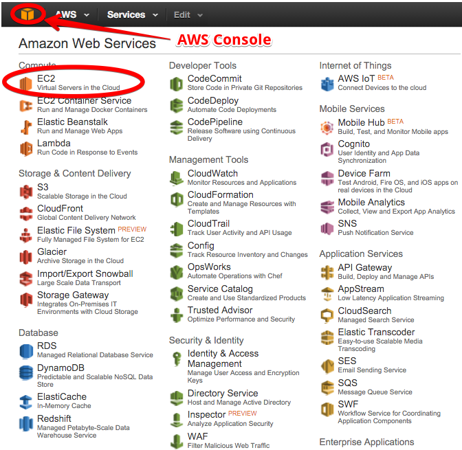

## Introduction

Amazon Elastic Compute Cloud (EC2) is a virtual server that can be scaled up and down to meet app traffic demands. This tutorial walks through the steps to configure and launch AWS EC2 Instance. 

To complete this tutorial, you need register a free account with <a href="https://aws.amazon.com/free/" target="_blank">AWS</a> (the AWS Free-Tier gives you access to AWS's basic services, which are sufficient to complete this tutorial), and <a href="http://pipelines.puppet.com/signup/" target="_blank">Pipelines</a>. Save your login credentials as you will need them for this tutorial. 

## Step 1. Create key pairs

Amazon EC2 uses public–key cryptography to encrypt and decrypt login information and we will have to create a Key Pair to log into our instance.
<ol>
<li>Navigate to the <b>AWS Console</b>, then click on <b>EC2</b>. </li>

<li>On the left pane, click on <b>Key Pairs</b>, then click on <b>Create Key Pair</b></li>

<li>Enter a name for your key, then click <b>Create</b>. The Key Pair will be automatically downloaded. You should move this key to a perminent location. </li>

<li>To use SSH client on Mac or Linux you will need to change the permissions of this key to <b>ready-only</b>.</li>
</ol>

~~~            
chmod 400 youKeyName.pem
~~~

## Step 2. Create a security group

Security Group is a traffic control layer to your instance. You can specify which IP address is welcome for a particular protocal. For example, HTTP and SSH. 
<ol>
<li>Navigate to the left pane of your EC2, and click on <b>Security Groups</b>, then click <b>Create Security Group</b>.</li>

<li>Fill out the **Security group name** and give it a **Description**.
On the **Inbound** tab, click **Add Rules** create the following 3 rules:</li>
</ol>

* Rule 1. Seletect HTTP under **Type**, make sure **Source** is set to **Anywhere*.
* Rule 2. Select HTTPS, make sure **Source** is set to **Anywhere**.
* Rule 3. Select SSH, make sure **Source** is set to **My IP**.

## Step 3. Launching an EC2 instance

We are now ready to launch our EC2 instance. There are only a few steps left until your EC2 instance is up and running and ready for code to be deployed!
<ol>
<li>On the left pane, click on <b>EC2 Dashboard</b>, then click on <b>Launch Instance</b></li>

<li>Choose your server operating system and proceed. </li>

<li>Select <b>Configure Security Group</b> on top of  the page. </li>
<li>Check the option <b>Select an existing security group</b>, then seleted the name of your group. </li>

<li>Click <b>Review and Launch</b>. </li>

<li>Click <b>Launch</b>. Select the key pair you created, then select <b> Launch Instances</b>. </li>
</ol>

To make sure you have successfully launched your instance, navigate to the left pane of the EC2 page, and click on <b>Instances</b>. Check out <b>Instance State</b>, and make sure that it is running. You will need your instance IP address to connect to your instance. Your instance IP address can be found in the instance's details. Refer to the image below:

## Step 4. Connect to EC2 instance

With your running instance, let's connect to your it using SSH.

1. Open your terminal. Navigate to the directory where your Key Pairs are saved. Enter this command:
    
~~~
ssh -i "YOUR_KEY_PAIR_NAME.pem" ec2-user@YOUR_INSTANCE_IP_ADDRESS
~~~

2. Enter the following command to update your instance:

~~~
sudo apt-get update 
~~~

Congratulations, you now have access your server!

## Step 5. Install the Pipelines agent

The Pipelines agent facilitates the auto deploy process. Install the Pipelines agent with the following command:

<h3>Linux and macOS X</h3>

To install on Linux or macOS X you can use either curl <b>or</b> wget with one of the following syntaxes.

<h4>wget example</h4>

~~~
wget -qO- https://pipelines.puppet.com/download/client | sh
~~~

<h4>curl example</h4>

~~~
curl -sSL https://pipelines.puppet.com/download/client | sh
~~~

<h3>Windows</h3>

To install on Windows, copy and paste the following PowerShell command into a command (cmd) window.

~~~
powershell -NoProfile -ExecutionPolicy Bypass -Command "iex ((new-object net.webclient).DownloadString('https://pipelines.puppet.com/download/client.ps1'))" & SET PATH=%PATH%;%ProgramFiles%/Distelli
~~~

<h3>Complete the install</h3>

After downloading the agent, you must run the install command to install the agent. To do so use the `agent install` command.

> **Note:** This installation requires root (administrator) permissions.

~~~
jdoe@ServerB:~$ <b>wget -qO- https://pipelines.puppet.com/download/client | sh</b>
This script requires superuser privileges to install packages
Please enter your password at the sudo prompt

[sudo] password for jdoe:
    Installing Distelli CLI 3.55 for architecture 'Linux-x86_64'...
    Downloading https://s3.amazonaws.com/download.distelli.com/distelli.Linux-x86_64/distelli.Linux-x86_64-3.55.gz
To install the agent, run:
    sudo /usr/local/bin/distelli agent install
jdoe@ServerB:~$ <b>sudo /usr/local/bin/distelli agent install</b>
Distelli Email: <b>jdoe@distelli.com</b>
      Password:
    1: User: jdoe
    2: Team: janedoe/teamjane
Team [2]: <b>1</b>
Server Info: https://www.distelli.com/jdoe/servers/d0c4b300-9fcf-2846-ba90-080027c8277c
Starting upstart daemon with name:  dtk-supervise-cc1233c06f7ad94a8d34ac610381242f9ae28bb8
jdoe@ServerB:~$
~~~

<h3>Verify the install</h3>

To validate the agent is installed and working use the `agent status` command.

~~~
/usr/local/bin/distelli agent status
Distelli Agent (serverA) is Running with id 766b88c8-e925-11e4-ae8b-080027cc07f7
~~~

## Step 6. Add the new instance to Pipelines

You installed the Pipelines agent to your server. The agent will allow Pipelines to communicate with your server, and facilitate the auto deploy process. Let's add the server to Pipelines. 

<ol>
<li> Login to your Pipelines account </li> 
<li> At the top menu, click <b>Servers</b> </li>
<li> In the top right on the page, click <b>Add Server</b></li>
<li> Click <b>Add existing server</b></li>
<li> Next, click <b>Install complete</b> since you have already installed the Pipelines Agent.</li>
<li> In step 3 of adding server, Pipelines makes connection with the Pipelines Agent. In the final step of the process, select <i>BETA</i> environment, then click <b>Add Environments</b>. </li>
</ol>

> **Note:** You can save this EC2 instance as an Amazon Machine Image. This will allow you to launch identical EC2 instances without going through the entire set up process. 

## Step 7. Deploy your application

Now that our AWS EC2 Instance is launched and the Pipelines agent is installed on our server, we are now ready to deploy our application. See the **Deployment tutorials** section for information on deployments.
