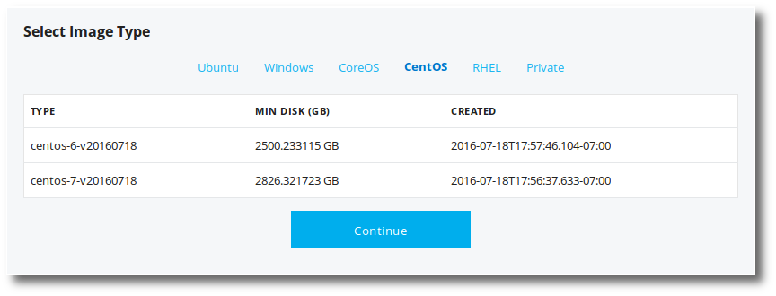

---
layout: default
title: "GCE and EC2 servers"
--- 

## Provision a GCE server

Using Pipelines you can provision GCE instances (servers) and have them immediately available for deploys and builds.

> **Note:** Provisioning and launching GCE instances may incur charges on your Google Cloud Account.

For more information on getting started with Amazon and EC2 see [https://cloud.google.com/compute/docs/quickstarts](https://cloud.google.com/compute/docs/quickstarts).

<ol>
<li>Click the <b>Servers</b> link at the top of the Pipelines web UI.</li>

<li>Click the <b>Add Server</b> button at the top right.</li>

This will begin the new server workflow.

<li>Click the <b>New Google Compute Instance</b> button.</li>

<li>Enter your <b>Google credentials</b>, if necessary.</li>

Ensure that your connected account has enabled the <a href="https://console.cloud.google.com/apis/api/iam.googleapis.com/overview">IAM</a>, <a href="https://console.cloud.google.com/apis/api/cloudresourcemanager.googleapis.com/overview">Cloud Resource Manager</a>, and <a href="https://console.cloud.google.com/apis/api/compute_component/overview">Compute Engine APIs</a> before proceeding.

<li>If you just added your EC2 credentials, click <b>Update Credentials</b>.</li>

<li>Select which <b>Project</b> you wish to create the instance in, then click <b>Continue</b>.</li>

<li><b>Name your Instances</b>, then click <b>Continue</b>.</li>

Names must start with a lowercase letter followed by up to 29 lowercase letters (max length is 30), numbers, or hyphens, and cannot end with a hyphen.

<li><b>Select Zone</b>, then click <b>Continue</b>.</li>

<li><b>Select Machine Type</b>, then click <b>Continue</b>.</li>

<li><b>Select Image Type</b>. Note that you can select an operating system type from the top list, then select the image. When you are ready click <b>Continue</b>.</li>

<li><b>Configure Boot Disk</b>. Here you select the disk type and the disk size, in GB. Then click <b>Continue</b>.</li>

<li><b>Configure Firewall</b>. Select which protocols you wish to have opened up to this GCE Instance, then click <b>Continue</b>.</li>

<li><b>Configure SSH Keys</b>.</li>

Here you can enter one or more SSH keys to provide login (ssh) access to the instance. An SSH key is not required, but realize, you can't login to the instance without one.

<li><b>Configure Tags and Startup Script</b>, then click <b>Continue</b>.</li>

<li>Click <b>Continue</b> when you are ready.</li>

<li><b>Add Environments</b>. At this step, you can add Pipelines environments to your server. Realize that if the environment is configured to, which it is by default, it will automatically deploy the <a href="./environment.html">active release</a> to the server when it comes up. For more information see <a href="./environment.html">Environment Settings</a>. You do not need to select an environment.</li>

<li>Click <b>Continue</b> when you are ready.</li>

<li><b>Select Service Account</b> for making Googla Cloud API calls. You may also be prompted to select any Access Scopes. When you are ready click <b>Continue</b>.</li>

<li>Finally select the number of instances you wish to launch, and click <b>Launch</b>.</li>

Your instance(s) are being provisioned.

<li> Click <b>Go to Servers</b> button.</li>

</ol>

> **Note:** GCE instances take a bit of time to completely provision (come up) and communicate on the internet. Be patient. 

> **Note:** If you run into trouble, you can inspect and terminate the instances from the GCE cloud console. <a href="https://console.cloud.google.com/" target="_blank">console.cloud.google.com/ec2</a>

## Provision an EC2 server

Using Pipelines you can provision EC2 instances (servers) and have them immediately available for deploys and builds.

> **Note:** Provisioning and launching EC2 instances may incur charges on your Amazon AWS account.

For more information on getting started with Amazon and EC2 see [http://docs.aws.amazon.com/AWSEC2/latest/UserGuide/get-set-up-for-amazon-ec2.html](http://docs.aws.amazon.com/AWSEC2/latest/UserGuide/get-set-up-for-amazon-ec2.html).

<ol>
<li>Click the <b>Servers</b> link at the top of the Pipelines web UI.</li>

<li>Click the <b>Add Server</b> button at the top right.</li>

This will begin the new server workflow.

<li>Click the <b>New Amazon EC2 Instance</b> button.</li>

<li>Enter your EC2 credentials, if necessary.</li>

For more information on setting up your Amazon Access Key see <a href="http://docs.aws.amazon.com/AWSSimpleQueueService/latest/SQSGettingStartedGuide/AWSCredentials.html" target="_blank">docs.aws.amazon.com/AWSSimpleQueueService/latest/SQSGettingStartedGuide/AWSCredentials.html</a>.

  

Ensure the AWS user has the correct permission policy applied that allows the user to create EC2 instances. If the credentials do not have EC2 permissions you will get an "\"Invalid Credentials"\" error message in Pipelines.

<li>If you just added your EC2 credentials, click <b>Update Credentials</b>.</li>

<li>Select configuration type. Choose <b>New EC2 Configuration</b>.</li>

<li>Select your <b>AWS Region</b>.</li>

The region you select will determine what values are available going forward.

<li>Select your <b>instance type</b> from the list of possible instances. The tabs at top will offer different options.</li>

<li>Select your <b>OS Image.</b></li>

<li>Select your <b>Virtual Private Cloud</b> (vpc).</li>

<li>Select your <b>Subnet</b></li>

The EC2 instance you provision must have Internet access. To provision it, ensure your subnet provides an associated public IP address. For more information see <a href="http://docs.aws.amazon.com/AmazonVPC/latest/UserGuide/vpc-ip-addressing.html" target="_blank">docs.aws.amazon.com/AmazonVPC/latest/UserGuide/vpc-ip-addressing.html</a>.

<li> Select your <b>Key Pair</b>. Using key pairs is important for accessing your server with SSH after it is up.</li>

<li> Select your <b>IAM Role</b>.</li>

<li> Select your <b>Security Group(s)</b>.</li>

<li> Click <b>Done</b>.</li>

<li> Set any <b>Tags, User Data, and Environments</b>.</li>

<ul>
<li>Tags - allow you to tag the server. For more information see <a href="http://docs.aws.amazon.com/AWSEC2/latest/UserGuide/Using_Tags.html" target="_blank">AWS Using Tags</a>. An example tag that will set the EC2 server name is:</li>

<code>
Name=MyHost001
</code>

<li>User Data - allows you to specific commands to run when the server first comes up. For more information see <a href="http://docs.aws.amazon.com/AWSEC2/latest/UserGuide/user-data.html" target="_blank">AWS User Data</a>. An example might be:</li>

<code>
#!/bin/bash
sudo apt-get -y update
sudo apt-get -y install nodejs
</code>

<li>Environments - allows you to specify which application environments, in Pipelines, to have the server join.</li>
</ul>

<li> Select the <b>Number of EC2 instances</b> you wish to provision and <b>Launch</b>.</li>

Remember, provisioning EC2 servers may incur charges.

<li> Click <b>Launch</b>.</li>

Your instances are being provisioned.

<li> Click <b>Go to Servers</b> button.</li>

</ol>

> **Note:** EC2 instances take a bit of time to completely provision (come up) and communicate on the Internet. Be patient. 
  
If you've been waiting for longer than 10 minutes, there may be a problem. Are you sure the subnet you chose provides Internet access to the instance?

> **Note:** If you run into trouble, you can inspect and terminate the instances from the EC2 console. <a href="https://console.aws.amazon.com/ec2" target="_blank">console.aws.amazon.com/ec2</a>

## Start an EC2 instance

This assumes the EC2 instance has been previously stopped. You can not start a running EC2 instance. It is already started.
<ol>
<li>Click <b>Servers</b> link from the to[p of the Pipelines web UI.</li>

<li>Find the server you wish to start and click the server link.</li>

This will take you to the server page.
<li>Click the blue gear icon on the right.</li>

<li>Click the <b>Start</b> button.</li>

</ol>

> **Note:** If the EC2 instance is already started, there will be no start button.

You have started the EC2 instance.

## Stop an EC2 instance

This assumes the EC2 instance has been previously started. You can not stop an already stopped EC2 instance.
<ol>
<li>Click <b>Servers</b> link from the top of the Pipelines web UI.</li>

<li>Find the server you wish to stop and click the server link.</li>

This will take you to the server page.
<li>Click the blue gear icon on the right.</li>

<li>Click the <b>Stop</b> button.</li>

</ol>

> **Note:** If the EC2 instance is already stopped there will be no stop button.

You have stopped the EC2 instance.

## Reboot an EC2 instance

You can reboot only started EC2 instances.
<ol>
<li>Click <b>Servers</b> link from the to[p of the Pipelines web UI.</li>

<li>Find the server you wish to reboot and click the server link.</li>

This will take you to the server page.
<li>Click the blue gear icon on the right.</li>

<li>Click the <b>Reboot</b> button.</li>

</ol>
Your server is now rebooting.

## Terminate an EC2 instance

You can terminate an EC2 instance. Terminate will completely destroy the EC2 instance.
<ol>
<li>Click <b>Servers</b> link from the to[p of the Pipelines web UI.</li>

<li>Find the server you wish to terminate and click the server link.</li>

This will take you to the server page.
<li>Click the blue gear icon on the right.</li>

<li>Click the <b>Terminate</b> button.</li>

</ol>
