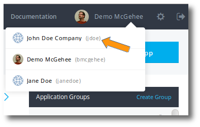

---
layout: default
title: "Managing your account"
--- 

A Puppet Pipelines account gives you access to the Puppet Pipelines platform, website, license portal, and services. 

## Creating an account

To sign up for a Puppet Pipelines account:

1. Navigate to the [Puppet Pipelines sign-up page](https://pipelines.puppet.com/signup).
1. Fill in your name, company name (optional), and email address. 
   > **Note:** If you are creating a shared organization account, ensure you are using an email adress that is accessible to the people in your organization. 
1. Create a username. The username is required when creating and deploying applications using Pipelines. It must be unique.
1. Create a strong password. 
1. Click **Sign Up**.

## Signing in

After you have created an account, you can sign in at anytime via the Pipelines web UI.

1. Point your browser at [pipelines.puppet.com](https://pipelines.puppet.com/).
1. Enter the email and password you used to set up your account. 
1. Click **Sign In**.

> **Important:** If you enter your password incorrectly too many times, a **THROTTLED** message will appear on the sign-in screen, and your account will be locked as a security precaution. The lock expires in two hours.  

## Editing your profile

1. Sign in to the Pipelines web UI at [pipelines.puppet.com](https://pipelines.puppet.com/).
1. Click the word <b>Owner</b> in the top right. If you are currently in a team view, click the team name. 

This will take you to your Profile page, where you can change your full name and company name, and verify your email address. 

## Finding your username

Many interactions with Puppet Pipelines require your Pipelines username.

1. Sign in to the Pipelines web UI at [pipelines.puppet.com](https://pipelines.puppet.com/).
1. On the top right, hover your mouse over your name.

You can find your Pipelines username at the top of the list on the right between the paranthesis. In this scenario, the current user's username is <b>jdoe</b>.

## Changing or recovering your password

Follow these instructions to change your password or to set a new password if yours has been lost or forgotten.

1. Navigate to the Pipelines web UI at [pipelines.puppet.com](https://pipelines.puppet.com/).
1. Click <b>Forgot your password?</b>
1. Enter the email address you used to create your Pipelines account.
1. Click <b>Send Reset Instructions</b>.

You will be sent an email with a link to change your password.

## Adding an avatar to your profile

Pipelines profiles can be configured to use your Gravatar Avatar.

1. If you haven't already done so, set up an avatar by creating a free [Gravatar account](https://gravatar.com/).
1. While signed in to the Pipelines web UI, click the word **Owner** in the top right. If you are currently in a team view, click the team name.
1. Enter your <b>Gravatar email.</b>
1. Click <b>Save Changes</b>. Your Pipelines profile will now use your Gravatar Avatar.

## Account settings

To navigate to account settings, click on the gear icon in the upper right corner of the Pipelines web UI. 

Here you will find information about:

**API tokens:** This is where you create, activate, deactivate, and delete API tokens. For usage, see the Pipelines API documentation. 

**Agent credentials:** This is your Pipelines accesss token and secret key. For usage, see the distelli.yml documentation. 

**Users:** On this screen, you can add Pipelines users to your team. 

**Groups:** Here you can create or delete groups, edit group membership, and see what teams you are on. For more information see the Groups documentation.

**SSH keys:** On this screen, you can generate SSH keys and view your stored keys. 

**Integrations:** This screen shows your existing integrations with Puppet Pipelines, and the options available to set up new integrations. From this screen, you can integrate with your:

   * Source control (GitHub, BitBucket, GitLab)
   * Registry (Docker Hub, Google Cloud, AWS, private Docker registry)
   * Notification system (Slack and HipChat)

**Billing:** Puppet Pipelines offers several billing plans, including a free plan. When you are ready to upgrade you can do so from the this screen.
