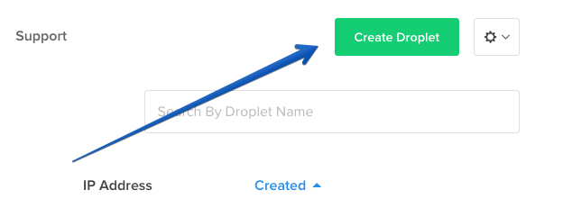
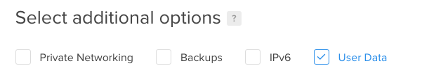
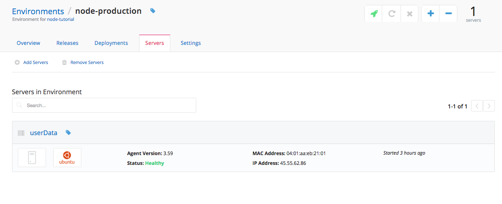

## Automate the installation of the Pipelines agent

You can automate installation of the Pipelines agent using a distelli.yml configuration file. For more information on the distelli.yml see [distelli.yml Usage](./distelliyml.html).

<h3>distelli.yml</h3>

The `distelli.yml` file syntax options for automating agent installs are as follows:

~~~
DistelliAccessToken: 'DISTELLI_ACCESS_TOKEN'
DistelliSecretKey: 'DISTELLI_SECRET_KEY'
Environments:
  - ENV_NAME1
  - ENV_NAME2
BuildCapabilities:
  - CAPABILITY1
  - CAPABILITY2
IsBuildServer: true
~~~

<ul>
<li><b>DISTELLI_ACCESS_TOKEN</b> - The Pipelines agent access token. <i>See below on how to retrieve.</i></li>
<li><b>DISTELLI_SECRET_KEY</b> - The Pipelines agent secret key. <i>See below on how to retrieve.</i></li>
<li><b>ENV_NAME#</b> - The Pipelines application environment that the server should join. Note that the server will join these environments in order (top to bottom) and, if enabled, deploy the current active release.</li>
<li><b>CAPABILITY#</b> - A capability that should be assigned to the server. Accepts a case-sensitive string.</li>
</ul>

These fields are tied to a Puppet Pipelines account. Ensure you are [using the correct account](./users.html) when retrieving these values.

<h4>Retrieving credentials</h4>

<ol>
<li>Click the <b>gear</b> icon from the top right.</li>
<li>Click the <b>Agent</b> icon on the left.</li>
<li>Under <i>Secret Key</i> click the <b>Show</b> button.</li>
</ol>

Here you will find the agent's Access Token and Secret Key. Add them to the `distelli.yml` file. For example:

~~~
DistelliAccessToken: '12345678901234567890123456'
DistelliSecretKey: '1234567890123456789012345678901234567'
~~~

<h3>Placing the File</h3>

The default location for placing the distelli.yml file is <b>/etc</b>.

On Windows, the default location is <b>%SystemDrive%\distelli.yml</b>.

You can override the default location with the [`-conf` option](./agent.html#installation-options).

<h3>How to</h3>

The following list outlines, from a high level, the steps to automate the install of the Pipelines agent. These are the steps your "tool" would need to take to when provisionining your server.

<ol>
<li>Write the distelli.yml file in the correct directory with the appropriate values.</li>
<li>Download the Pipelines agent install script and execute it.</li>
<li>Run the Pipelines agent install command.</li>
<li>Log in to the Pipelines CLI (for builds).</li>
</ol>

> **Note:** For the agent to complete installation in step 3, the system/server must have access to the network.

<h3>User Data</h3>

Many cloud computing platforms provide <b>user-data</b> when provisioning an instance. This is true of Amazon EC2 and Digital Ocean droplets. Below is a working example of EC2 user-data that will install the Pipelines agent on provisioning an EC2 instance. 

~~~
#!/bin/bash
echo "DistelliAccessToken: '12345678901234567890123456'" > /etc/distelli.yml
echo "DistelliSecretKey: '1234567890123456789012345678901234567'" >> /etc/distelli.yml
echo "Environments:" >> /etc/distelli.yml
echo "  - java_app_dev" >> /etc/distelli.yml
wget -qO- https://pipelines.puppet.com/download/client | sh
/usr/local/bin/distelli agent install -conf /etc/distelli.yml
/usr/local/bin/distelli login -conf /etc/distelli.yml
~~~

## Automatic agent install on Amazon EC2 instances

While installing the agent manually is easy, there may be several cases where it is desirable to have the agent installed automatically when a new instance is launched on Amazon EC2. In this guide, we'll walk through the steps required to configure the EC2 User Data so that the Pipelines agent is automatically installed when a new EC2 Instance is started. This can be especially useful when instances are started via AWS Auto Scaling.

Amazon EC2 allows you to specify shell scripts or commands in the User Data section, that run on your Linux instance at launch. To automatically install the agent on instance launch add the following commands to the User Data section of your launch configuration or in the AWS Console when launching a new instance:

~~~
#!/bin/bash

echo "
DistelliAccessToken: 'DISTELLI_ACCESS_TOKEN'
DistelliSecretKey: 'DISTELLI_SECRET_KEY'
" > /etc/distelli.yml

wget -qO- https://pipelines.puppet.com/download/client | sh
/usr/local/bin/distelli agent install
~~~

The Pipelines Access Token and the Pipelines Secret Key register this agent with your Pipelines account. You can obtain your access token and secret key from your Pipelines Account by clicking <b>Settings () > Credentials > Agent Credentials</b>. The wget command installs the agent and starts it.

With the script in the User Data, section, launch your EC2 instance and it will automatically install the agent and start it. When the agent is installed and running, the server will appear in your Pipelines Console under servers and you can add it to an environment and deploy your code to it.

<h3>Auto Deploy from an Environment</h3>

In addition to installing an agent on a new EC2 Instance, you can also specify a list of environments the new server should join and Pipelines will automatically add the server to those environments and deploy the correct release for the applications associated with those environments.

To specify the environments that the server should add itself to, add the Environments entry to the distelli.yml config file in the User Data. Here is a complete example:

~~~
#!/bin/bash

echo "
DistelliAccessToken: 'DISTELLI_ACCESS_TOKEN'
DistelliSecretKey: 'DISTELLI_SECRET_KEY'

Environments:
  - node-js-runtime-prod
  - app-dependencies-prod
  - web-server-prod
" > /etc/distelli.yml

wget -qO- https://pipelines.puppet.com/download/client | sh
/usr/local/bin/distelli agent install
~~~

In the example above, we included the Environments section in the distelli.yml config file that specifies that this EC2 instance should be added to the three environments specified (node-js-runtime-prod, app-dependencies-prod and web-server-prod) in that order. Pipelines will then automatically start deployments from each environment in turn and wait for each deployment to complete before starting the next one.

Auto deployments deploy the active release associated with each environment. The active release is the last release deployed within that environment. If an environment has received no deployments, then the auto deployments will have no effect. To ensure that your auto deployments are successful, please ensure that the last deployment to an environment completes successfully.

## Automatic agent install with Chef

Installing the Pipelines agent can also be accomplished as part of a Chef bootstrap.

The following procedures assumes you have familiarity with Chef, have a login to [Chef Manage](https://api.chef.io/login), and have [a Pipelines account](https://pipelines.puppet.com/signup).

<h3>Download the Cookbook</h3>

The cookbook and recipe for installing the Pipelines Agent with chef can be found in the GitHub repository [here](https://github.com/Distelli/DistelliAgentCookbook). 

1. On the Chef server navigate to the cookbook directory.
1. Enter the following command to clone the DistelliAgentCookbook:

~~~
git clone https://github.com/Distelli/DistelliAgentCookbook.git
~~~

1. Rename the directory (cookbook).

~~~
mv DistelliAgentCookbook/ distelli
~~~

You have downloaded the Pipelines Agent Chef cookbook.

<h3>Create a Chef Role</h3>

1. Create a role to run the Pipelines Agent installer recipe.

~~~
knife role create distelli_agent
~~~

> **Note:** You may have to set the EDITOR environment variable for the previous command.       For example:

    `export EDITOR=vi`

    Or provide the `--editor` option with the knife command.

    `knife role create distelli_agent --editor vi`

1. Enter the following information into the role.

~~~
{
  "name": "distelli_agent",
  "description": "",
  "json_class": "Chef::Role",
  "default_attributes": {
    <b>"distelli": {
      "agent": {
        "access_token": "DISTELLI_ACCESS_TOKEN",
        "secret_key": "DISTELLI_SECRET_KEY"
      }
    }</b>
  },
  "override_attributes": {

  },
  "chef_type": "role",
  "run_list": [
    <b>"recipe[distelli]"</b>
  ],
  "env_run_lists": {

  }
}
~~~

The <b>DISTELLI_ACCESS_TOKEN</b> and <b>DISTELLI_SECRET_KEY</b> fields are tied to a Pipelines account. 

> **Retrieving Credentials** 
   1. Click the <b>gear</b> icon from the top right of the Pipelines web UI.
   1. Click the <b>Agent</b> icon on the left.
   1. Under <i>Secret Key</i> click the <b>Show</b> button.

1. Save the above role.

You have created a role to run the Pipelines Agent cookbook.

<h3>Update Chef Manage Cookbooks</h3>

1. Update your cookbooks at Chef Manage.

~~~
knife cookbook upload distelli
~~~

You can now bootstrap a remote server to install the Pipelines Agent.

<h3>Running the Chef Recipe Bootstrap</h3>

1. Run the knife bootstrap for role distelli_agent to install the agent on a new node.

~~~
knife bootstrap --run-list "role[distelli_agent]" --ssh-user root --ssh-password pa55w0rd 192.0.2.67
~~~

The agent is now installed, authenticated, and running on your server. If you navigate to your servers list in Pipelines, you will see the server.

<h3>Other Pipelines Agent Install Options</h3>

You can further provide Pipelines Application Environments for the server to automatically join. If the environment has the [Automatically deploy the active release when a new Server joins this environment](./environment.html) enabled, the the server will automatically consume a deployment of the active release.

When specifying environments for the Pipelines agent to join, realize that the order of the environments is relevant in that the server will join each environment in order, completing any deployments before joining the next environment, in order. There is a 30 second delay between each deployment.

The settings for this can be found in the Chef role created earlier. To edit the role, use the following command:

~~~
knife role edit distelli_agent
~~~

An example below shows the addition of three environments: test-dev, test-qa, and test-prod.

~~~
{
  "name": "distelli_agent",
  "description": "",
  "json_class": "Chef::Role",
  "default_attributes": {
    "distelli": {
      "agent": {
        "access_token": "DISTELLI_ACCESS_TOKEN",
        "secret_key": "DISTELLI_SECRET_KEY"<b>,
        "environments": [
          "test-dev",
          "test-qa",
          "test-prod"
        ]</b>
      }
    }
  },
  "override_attributes": {

  },
  "chef_type": "role",
  "run_list": [
    "recipe[distelli]"
  ],
  "env_run_lists": {

  }
}
~~~

> **Important:** Don't forget the comma at the end of the "secret key" line!

After making this change and saving the role, you can run the `chef-client` command, on your nodes, to have the new changes take effect.

## Automatic agent install with DigitalOcean

This tutorial will walk you through how to automatically install the Pipelines Agent and add your new Droplet to your specific environment using Digital Ocean's Droplet User Data.

### Prerequisites

To complete this tutorial you will need to have the following:

* [Pipelines Account](https://pipelines.puppet.com/signup)
* [Pipelines Application](./application-create.html)
* [DigitalOcean Account](https://www.digitalocean.com)

### Launch Your Droplet

To start login to your DigitalOcean account and click <b>Create Droplet</b> in the upper right hand corner.

Select your <b>Image</b>, <b>Size</b>, and <b>Region</b>. In the <b>Additional Options</b> section check the box next to <b>User Data</b>

This will open a text area for you to enter in your <b>User Data</b>. To automate the install of the Pipelines Agent, use the script below:

~~~
#!/bin/bash

export DISTELLI_ACCESS_TOKEN='YOUR DISTELLI ACCESS TOKEN'
export DISTELLI_SECRET_KEY='YOUR DISTELLI SECRET KEY'

echo "DistelliAccessToken: $DISTELLI_ACCESS_TOKEN" > /etc/distelli.yml
echo "DistelliSecretKey: $DISTELLI_SECRET_KEY" >> /etc/distelli.yml
echo "Environments:" >> /etc/distelli.yml
echo "  - YOUR DISTELLI ENVIRONMENT" >> /etc/distelli.yml
apt-get -y install wget
wget -qO- https://pipelines.puppet.com/download/client | sh
/usr/local/bin/distelli agent install -conf /etc/distelli.yml
/usr/local/bin/distelli login -conf /etc/distelli.yml
~~~

You will need to insert your own Pipelines <b>Access Token</b> and <b>Secret Key</b>. These fields are tied to a Pipelines account.
<h4>Retrieving Credentials</h4>

<ol>
<li>Click the <b>gear</b> icon from the top right.</li>
<li>Click the <b>Agent</b> link on the left.</li>
<li>Under <i>Agent Credentials</i> click the <b>Show</b> button.</li>
</ol>

You will see your <b>Access Token</b> and <b>Secret Key</b> here. Please insert them into your <b>User Data</b> script, and insert the Pipelines environment you want to add your server to.

> **Caution:** If the environment setting "Auto Deploy the Active Release when a new Server joins this environment" is enabled (checked) and there is an active release, an auto deploy will occur when servers join an environment using distelli.yml.
For more info, see [Environment Settings](./environment.html).

After you have inserted your <b>Access Token</b>, <b>Secret Key</b>, and <b>Environment</b> into your <b>User Data</b> script you can finishing configuring your Droplet. When you are done, launch your Droplet and the Pipelines agent will be automatically installed and added to your specified environment. After the Droplet has finished launching, navigate to your Pipelines environment to ensure your server was added successfully.

