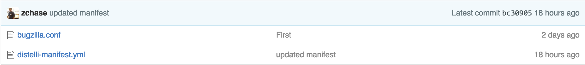
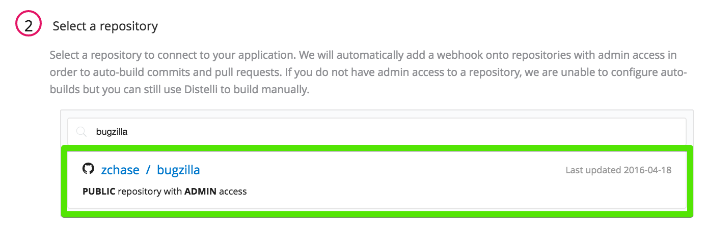
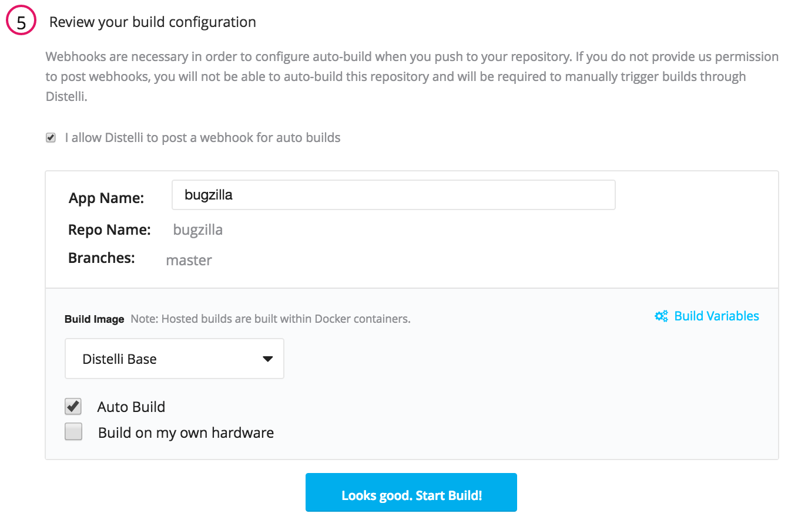
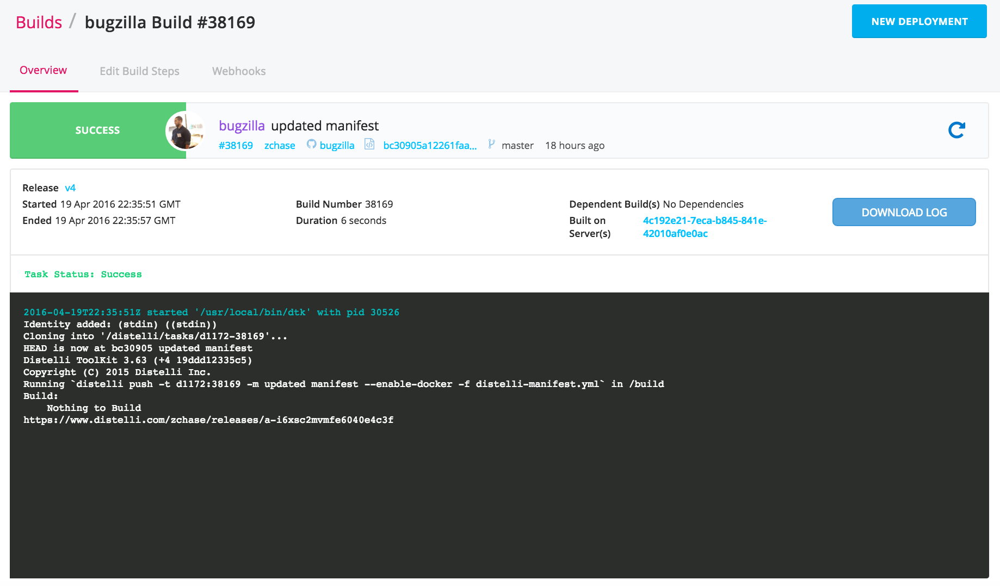
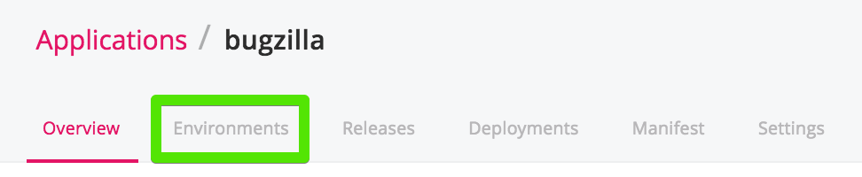
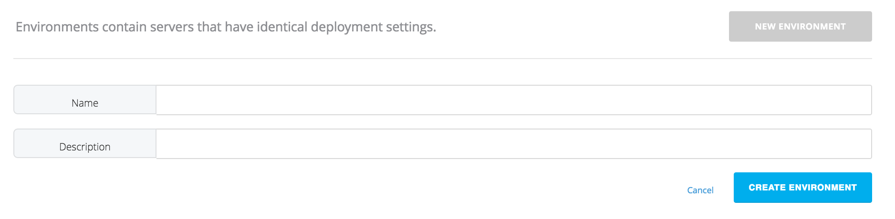
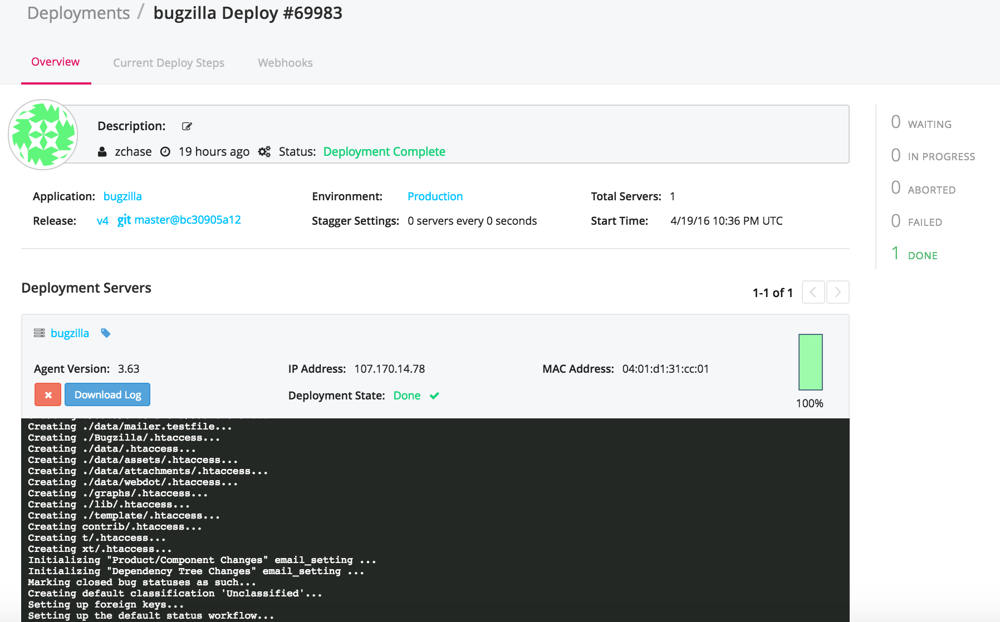
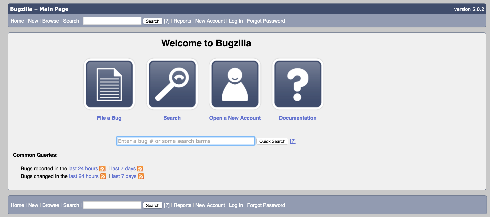

Bugzilla is an open-source bugtracking and testing application. This tutorial will walk you through how to automate the install and configuration of the Bugzilla application on your server. This tutorial installs Bugzilla on an Ubuntu 14.04 server.

## Prerequisites

To complete this tutorial you will need:

* A [Pipelines for Applications](https://pipelines.puppet.com/signup) account
* A [GitHub](https://www.github.com) or [BitBucket](https://bitbucket.org/) account
* A server to deploy Bugzilla to

> **Note:** This tutorial uses an Ubuntu 14.04 server. 

## Step 1. Set up your server

The first step in deploying our application is to make sure you have a server to run your application on. You can use any type of server - public cloud, private cloud, or physical. Pipelines for Applications will let you deploy your code to  Vagrant VMs or servers in a VPC. You can even deploy to the server under your desk. For this tutorial I am going to be deploying to a server hosted by DigitalOcean. 

> **Note:** You will need remote access to the server you are deploying to, and root (administrator) permissions.

### Install the Pipelines agent on your server

To be able to deploy your application to your server you will need to install the Pipelines agent. You will need remote access to your server to complete the installation. 

To install on Linux or macOS X you can use either curl or Wget with one of the following syntaxes:

~~~~
wget -qO- https://pipelines.puppet.com/download/client | sh
~~~~

~~~~
curl -sSL https://pipelines.puppet.com/download/client | sh
~~~~

To complete the install of the agent, you must issue the `/usr/local/bin/distelli agent install` command.

~~~~
/usr/local/bin/distelli agent install
~~~~

~~~~
ServerA:~$ <b>wget -qO- https://pipelines.puppet.com/download/client | sh</b>
This script requires superuser privileges to install packages
Please enter your password at the sudo prompt

[sudo] password for bmcgehee: 
    Installing Distelli CLI 3.51 for architecture 'Linux-x86_64'...
    Downloading https://s3.amazonaws.com/download.distelli.com/distelli.Linux-x86_64/distelli.Linux-x86_64-3.51.gz
To install the agent, run:
    sudo /usr/local/bin/distelli agent install
ServerA:~$ <b>sudo /usr/local/bin/distelli agent install</b>
Distelli Email: jdoe@distelli.com
      Password: 
    1: User: jdoe
    2: Team: janedoe/TeamJane
Team [2]: <b>1</b>
Server Info: https://www.distelli.com/jdoe/servers/12345678-4765-ac42-bd7a-080027c8277c
Starting upstart daemon with name:  
~~~~

### Verify the install

To validate the agent is installed and working use the `/usr/local/bin/distelli agent status` command.

> **Note:** This command requires root (administrator) access.

~~~~
/usr/local/bin/distelli agent status
Distelli Agent (serverA) is Running with id 
~~~~

If you would like more information on installing the Pipelines agent, visit [Installing the Pipelines Agent](./agent.html). 

## Step 2. Create distelli-manifest.yml and bugzilla.conf

Our next step is to create a `distelli-manifest.yml` file and a `bugzilla.conf` file. The manifest will be our instructions for automating the install and set up of Bugzilla.

#### distelli-manifest.yml

The manifest will provide the instructions to install and configure Bugzilla on your server. Below are the contents of our `distelli-manifest.yml`:

> **Note:** Replace <-username-> with your Pipelines username and <-app name-> with your application's name. 

~~~~
<-username->/<-app name->:
  Build:
    - echo "Nothing to Build"
  PkgInclude:
    - '*'
  PostInstall:
    - if [ -z "$USER" ]; then
    -   echo "You must set env var USER"
    -   exit 1
    - fi
    - doesexist="$(id $USER || true)"
    - if [[ ${doesexist:0:3} == "uid" ]]; then
    -   echo "User $USER exists"
    - else
    -   echo "User $USER doesn't exist. Creating..."
    -   sudo useradd $USER
    - fi
    - sudo apt-get -y clean
    - sudo apt-get -y update
    - sudo apt-get -fy install
    - 'sudo debconf-set-selections <<< "mysql-server mysql-server/root_password password $MYSQL_ROOT"'
    - 'sudo debconf-set-selections <<< "mysql-server mysql-server/root_password_again password $MYSQL_ROOT"'
    - sudo apt-get -y install mysql-server
    - sudo apt-get -y install apache2 libappconfig-perl libdate-calc-perl libtemplate-perl libmime-perl build-essential libdatetime-timezone-perl libdatetime-perl libemail-sender-perl libemail-mime-perl libemail-mime-modifier-perl libdbi-perl libdbd-mysql-perl libcgi-pm-perl libmath-random-isaac-perl libmath-random-isaac-xs-perl apache2-mpm-prefork libapache2-mod-perl2 libapache2-mod-perl2-dev libchart-perl libxml-perl libxml-twig-perl perlmagick libgd-graph-perl libtemplate-plugin-gd-perl libsoap-lite-perl libhtml-scrubber-perl libjson-rpc-perl libdaemon-generic-perl libtheschwartz-perl libtest-taint-perl libauthen-radius-perl libfile-slurp-perl libencode-detect-perl libmodule-build-perl libnet-ldap-perl libauthen-sasl-perl libtemplate-perl-doc libfile-mimeinfo-perl libhtml-formattext-withlinks-perl libfile-which-perl libgd-dev libmysqlclient-dev lynx-cur graphviz python-sphinx rst2pdf
    - sudo apt-get -y install git
    - cd /var/www/html
    - sudo git clone --branch release-5.0-stable https://git.mozilla.org/bugzilla/bugzilla bugzilla
    - sudo sed -i "s|max_allowed_packet\t= 16M|max_allowed_packet\t= 100M|g" /etc/mysql/my.cnf
    - sudo sed -i "s|\[mysqld\]|\[mysqld\]\nft_min_word_len\t= 2|g" /etc/mysql/my.cnf
    - mysql -u root -p$MYSQL_ROOT -e "GRANT ALL PRIVILEGES ON bugs.* TO bugs@localhost IDENTIFIED BY '$BUG_PW'"
    - sudo service mysql restart
    - sudo mv "$DISTELLI_INSTALLHOME"/bugzilla.conf /etc/apache2/sites-available/
    - sudo a2ensite bugzilla
    - sudo a2enmod cgi headers expires
    - sudo service apache2 restart
    - cd /var/www/html/bugzilla
    - sudo /usr/bin/perl install-module.pl DateTime::TimeZone
    - sudo /usr/bin/perl install-module.pl Email::Sender
    - sudo /usr/bin/perl install-module.pl PatchReader
    - sudo /usr/bin/perl install-module.pl Email::Reply
    - sudo /usr/bin/perl install-module.pl Apache2::SizeLimit
    - sudo /usr/bin/perl install-module.pl Cache::Memcached
    - sudo /usr/bin/perl install-module.pl File::Copy::Recursive
    - sudo ./checksetup.pl
    - sudo sed -i "s|\$webservergroup = 'apache';|\$webservergroup = 'www-data';|g" localconfig
    - sudo sed -i "s|\$db_pass = '';|\$db_pass = '$BUG_PW';|g" localconfig
    - echo "\$answer{'ADMIN_EMAIL'} = '$ADMIN_EMAIL';" > /tmp/bugzilla_install_options.txt
    - echo "\$answer{'ADMIN_PASSWORD'} = '$ADMIN_PASSWORD';" >> /tmp/bugzilla_install_options.txt
    - echo "\$answer{'ADMIN_REALNAME'} = '$ADMIN_REALNAME';" >> /tmp/bugzilla_install_options.txt
    - sudo ./checksetup.pl /tmp/bugzilla_install_options.txt
    - sudo ./testserver.pl http://localhost/bugzilla
~~~~

#### bugzilla.conf

~~~~
ServerName localhost

&#60;Directory /var/www/html/bugzilla&#62;
  AddHandler cgi-script .cgi
  Options +ExecCGI
  DirectoryIndex index.cgi index.html
  AllowOverride All
&#60;/Directory&#62;
~~~~

## Step 3. Push code into repository

For Pipelines for Applications to automate the install of Bugzilla on your server you will need to push the files you just created into a either a [GitHub](https://github.com/) or [BitBucket](https://bitbucket.org/) repository.

After you have pushed your files to your repository, you are ready to deploy them to your servers. 

## Step 4. Create Pipelines application

Navigate to the Pipelines for Applications web UI and make sure you are logged in. After you are logged in, go the **Applications** age and click <b>New App</b>.

Name your app and then select the repository type you pushed your code to in Step 3. 

After you click the button to connect to your repository, select the appropriate repo that contains your code.

Then select the appropriate branch for your deployment. I only have a master branch, but you can deploy any branch from your repo!

Next Pipelines for Applications will ask you set your build steps. We have created a `distelli-manifest.yml`, so we will check the checkbox to use this file:

The final step is select our Build Image. In this case we are going to select "Distelli Base" for our Go Application. Select the <b>Auto Build</b> checkbox and the the <b>Looks good. Start Build!</b>.

> **Note:** The Auto-Build feature builds your application every time you commit code to your repository.

Now your app should be automatically building. You can watch its progress on the **Builds** page. You should see that your build has been built successfully and is now ready to deploy.

### Environment variables

Before we can deploy our application we need to set a few environment variables for our application. These will contain our login information for Bugzilla and MySQL. Navigate to your application's page and click <b>Environments</b>.

On the Environments page click <b>Create Environment</b>. Enter in a name for your new environment and then click <b>Create</b>.

You will then be directed to your new environment's page. This is where we are going to set our environment variables. Click on the environment variable section.

Enter the following variables:

> **Note:** Make sure to fill out the variables with your information. Do not leave them blank.

~~~~
USER=""
BUG_PW=""
MYSQL_ROOT=""
ADMIN_EMAIL=""
ADMIN_PASSWORD=""
ADMIN_REALNAME=""
NO_PAUSE="1"
~~~~

After you have defined your variables click <b>Save Variables</b>. Now we are ready to deploy our application. Navigate back to the <b>Builds</b> page to start deploying your application.

## Step 5. Deploy your application

Now that we have successfully built our application, we are ready to deploy to our server. On the **Builds** page click <b>New Deployment</b>.

After you click the button, you are directed to the deployment page. The first step is to select the <b>Deploy a Release</b> option.

Select the application you want to deploy. Please select the application we created earlier in the tutorial.

Select the release you would like to deploy. For now there should be only one release for deployment.

Select the environment you created earlier.

Now Pipelines for Applications will ask you to add your server. Click the <b>Add Servers</b> button to get started. Select the server you configured earlier in the tutorial and add it to your account. After you have added your server, you can close the <b>Add Servers</b> panel and continue with your deployment. You will see a final option to set your delay between deployments on your servers and a <b>Deploy</b> button.

Click the <b>Deploy!</b> button to begin your deployment. You will redirected to a page where you can view the progress of your deployment. Click the <b>log</b> button on the left side to view real time streaming logs for the deployment.

And that's it! You should now be able to point your browser to <b>http://<-Your Server's IP Address->/bugzilla</b> and see your Go Application!

