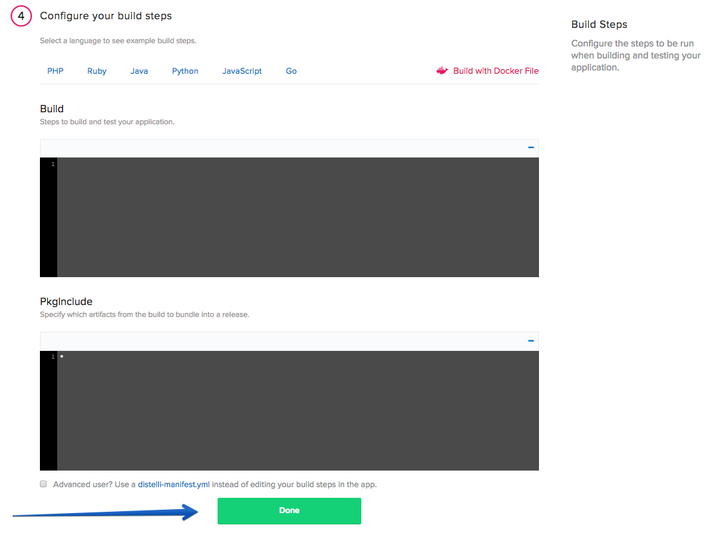

In this tutorial we will go through how to automate the build and deployment of an Ember.js App. We will be using the Quick Start Example from the Ember.js documentation.

## Before you begin

Before we begin, make sure to have the following:

- A server to deploy to
- An Ember.js Application that is ready to be deployed. Please consult the [Ember.js documentation](https://guides.emberjs.com/v2.4.0/getting-started/quick-start/) for help.

## Step 1. Create NGINX config file

To ensure that our application is served correctly, we need to create an NGINX config file. We are going to call this file `emberConfig`. Below are the contents of `emberConfig`:

~~~~
server {
  listen 80;
  root /distelli/envs/<b>Pipelines Environment Name</b>/dist/;

  location / {
    try_files $uri /index.html;
  }
}
~~~~

You will need to replace "<b>Pipelines Environment Name</b>" with the name of your environment. Remember what you have named your environment here, as we will create the environment in Pipelines for Applications later on. I named my environment `Production`, so my root section looks like: `/distelli/env/Production/dist/`.

## Step 2. Push files to a repository

To build and deploy our application, our application needs to stored in a source control repository. Create a GitHub or BitBucket repository to store your code (I am using a GitHub repository for this tutorial).

Create a repository and then push your code to that repository.

For more information on how to create a repository:

* [GitHub](https://help.github.com/articles/adding-an-existing-project-to-github-using-the-command-line/)
* [BitBucket](https://confluence.atlassian.com/bitbucket/create-a-repository-221449521.html)

## Step 3. Set up your server

If you do not have a Pipelines account, [sign up](https://pipelines.puppet.com/signup) for one now. To add your server, follow these steps:

> **Note:** You will need remote access to the server you are deploying to.

The next step is to set up our server to serve our Ember.js app. For this tutorial, the only thing we need to do is install the Pipeines agent on your server. For demonstration purposes, I am using an Ubuntu 14.04 server.

### Install the Pipelines agent on your server

To be able to deploy your application to your server you will need to install the Pipelines agent. You will need remote access to your server to complete the installation. 

> **Note:** This installation requires root (administrator) permissions.

To install on Linux or macOS X you can use either curl or Wget with one of the following syntaxes:

~~~~
wget -qO- https://pipelines.puppet.com/download/client | sh
~~~~

~~~~
curl -sSL https://pipelines.puppet.com/download/client | sh
~~~~

To install on Windows, copy and paste the following PowerShell command into a command (cmd) window.

~~~~
powershell -NoProfile -ExecutionPolicy Bypass -Command "iex ((new-object net.webclient).DownloadString('https://pipelines.puppet.com/download/client.ps1'))" & SET PATH=%PATH%;%ProgramFiles%/Distelli
~~~~

### Complete the install

To complete the install of the agent, you must issue the `sudo /usr/local/bin/distelli agent install` command.

~~~~
sudo /usr/local/bin/distelli agent install
~~~~

~~~~
ServerA:~$ <b>wget -qO- https://pipelines.puppet.com/download/client | sh</b>
This script requires superuser privileges to install packages
Please enter your password at the sudo prompt

[sudo] password for bmcgehee: 
    Installing Distelli CLI 3.51 for architecture 'Linux-x86_64'...
    Downloading https://s3.amazonaws.com/download.distelli.com/distelli.Linux-x86_64/distelli.Linux-x86_64-3.51.gz
To install the agent, run:
    sudo /usr/local/bin/distelli agent install
ServerA:~$ <b>sudo /usr/local/bin/distelli agent install</b>
Distelli Email: jdoe@distelli.com
      Password: 
    1: User: jdoe
    2: Team: janedoe/TeamJane
Team [2]: <b>1</b>
Server Info: https://www.distelli.com/jdoe/servers/12345678-4765-ac42-bd7a-080027c8277c
Starting upstart daemon with name:  
~~~~

For more information on installing the agent see [Installing the Pipelines agent](./agent.html).

## Step 4. Create a new application

In the Pipelines for Applications web UI, click **Applications**, then click <b>New App</b>.

Select the repository type where you are storing your applications files. 

After we click the button to connect to our repository, we select the appropriate repository that contains our files.

Select the appropriate branch for your deployment. I only have a master branch, but you can deploy any branch from your repo.

Next, we are prompted to set our build steps. Leave this section blank for now. We will set our build steps after our application has been created.

The final step is select our Build Image. In this case, we are going to select "Distelli Javascript (Docker)" for our Ember.js App. We want to use this <b>Build Image</b> because it has many popular Javascript tools pre-installed, therefore speeding up our build time. Make sure the <b>Auto Build</b> checkbox is enabled, and click <b>Looks good. Start Build!</b>.

This will kick off a build of your application, but we have not set our <b>Build and Deploy Steps</b>, so we will ignore this specific build. After we have set our <b>Build and Deploy Steps</b> we will manually kick off a new build of our application.

### Configure the build and deploy steps

Once your application has been created, navigate to your <b>Applications</b> page and open your newly created application.

Click <b>Manifest</b>.

Expand the <b>Build Manifest</b> section by clicking on the plus sign. This is where we are going to configure the commands to run during our deployment.

Scroll down to your **PreBuild** section and enter the following:

~~~~
nvm install 0.12
npm install ember-cli@2.4 bower
~~~~

Scroll down to your **Build** section and enter the following:

~~~~
nvm use 0.12
npm install
bower install
ember test
ember build --env production
~~~~

Scroll down to your **PkgInclude** section and enter the following:

~~~~
dist/*
~~~~

Save your build manifest by clicking the <b>Save</b> button at the top of the build section. Expand the <b>Deployment Manifest</b> section by clicking the plus sign. This is where we are going to configure the commands to run during our deployment.

Scroll down to your **PreInstall** section and enter the following:

~~~~
sudo apt-get update
sudo apt-get install nginx -y
sudo rm -rf /etc/nginx/sites-enabled/default
~~~~

Scroll down to your **Start** section and enter the following:

~~~~
sudo rm -rf /etc/nginx/sites-available/emberConfig
sudo mv emberConfig /etc/nginx/sites-available/emberConfig
sudo ln -sf /etc/nginx/sites-available/emberConfig /etc/nginx/sites-enabled/emberConfig
sudo service nginx restart -y
~~~~

### Rebuild the application

Because we changed our deployment steps, we need to rebuild our application. To trigger a new build, click the hammer (**Build Application**) icon in the upper right corner. This triggers a build of your latest code, build steps, and deployment steps.

Navigate to your **Builds** page and click the active build to watch it progress. Once your build is complete, a green box indicates that your build was successful.

## Step 5. Deploy application

Now that we have successfully built our application, we are ready to deploy to our server. On the **Builds** page click <b>New Deployment</b>.

When you click the button, you should be directed to the deployment page. The first step is to select the <b>Deploy a Release</b> option.

You are prompted to select the application you want to deploy. Select the application we created earlier in the tutorial.

Then you are prompted to select the release you would like to deploy. For now there should be only one release for deployment.

The last step in our deployment is to select the environment you want to deploy to. First you will need to create an environment by enter a name and selecting the **Add Environment** button. 

> **Important:** Remember to use the same name you used in your NGINX config file.

Next select the Environment you just created and click <b>All Done</b>.

Now you need add your server. Click <b>Add Servers</b> to get started. Select the server you configured earlier in the tutorial, and add it to your account. Once you have added your server, close the <b>Add Servers</b> panel and continue with your deployment. You are shown a final option to set your delay between deployments on your servers and a <b>Start Deployment</b> button.

Click <b>Start Deployment</b> to begin your deployment. A deployment page opens, where you can view the progress of your deployment. Click <b>log</b> on the left side to view realtime streaming logs for the deployment.

You should now be able to point your browser to `http://<-Your Server's IP Address->` and see your Ember.js app!

You have now set up an Ember.js App with continuous integration and continuous deployment! Thanks for following along and happy coding!

