 

In this tutorial we will go through how to automate the build and deployments of your Jekyll website. We will take the sample Jekyll blog and I will show you how to automate the build and the deployment process.

### Before You Begin

To complete this tutorial you will need to have all the requirements to run Jekyll installed on your local machine. Make sure you have Ruby, RubyGems, Nodejs, and Python installed and running the correct versions. Below you can find links for information on how to install each requirement.

- <a href="https://www.ruby-lang.org/en/downloads/" target="_blank">Install Ruby Version 2.0.0 or greater</a>
- <a href="https://rubygems.org/pages/download" target="_blank">Install RubyGems</a>
- <a href="https://nodejs.org/en/" target="_blank">Install Nodejs</a>
- <a href="https://www.python.org/downloads/" target="_blank">Install Python Version 2.7 or greater</a>

You will also need a server to deploy to. I will be deploying the Jekyll website to a DigitalOcean Ubuntu 14.4 cloud server.

### Setting Up

To set up your project, you first: install Jekyll, then create & initialize your project, and then check to make sure everything was created correctly.

To install Jekyll enter the following command in your termianl/command line

~~~
$ gem install jekyll
~~~

The next step is to create your project directory and initialize your Jekyll project. Navigate to where you want to store your files in your terminal and then you can use the following commands

Create your project folder by enter the below commands. `mkdir JekyllSite` creates a folder from the terminal and then you enter `cd JekyllSite` to navigate to that folder.
~~~
~ $ mkdir JekyllSite
~ $ cd JekyllSite
~~~

Intialize Jekyll project by using the command below. This command will create all the necessary files and structure your project automatically.
~~~
~/JekyllSite $ jekyll new .
~~~

Finally, create a local server to make sure everything was set up correctly. To create the local server, enter the following command

~~~
$ jekyll serve
~~~

You should see an output similar, if not identical to this

~~~
Configuration file: /Users/zack/ws/src/JekyllTutorial/_config.yml
            Source: /Users/zack/ws/src/JekyllTutorial
       Destination: /Users/zack/ws/src/JekyllTutorial/_site
 Incremental build: disabled. Enable with --incremental
      Generating... 
                    done in 0.265 seconds.
 Auto-regeneration: enabled for '/Users/zack/ws/src/JekyllTutorial'
Configuration file: /Users/zack/ws/src/JekyllTutorial/_config.yml
    Server address: http://127.0.0.1:4000/
  Server running... press ctrl-c to stop.
~~~

You should then be able to navigate to <b>localhost:4000/</b> to see the sample Jekyll Website.

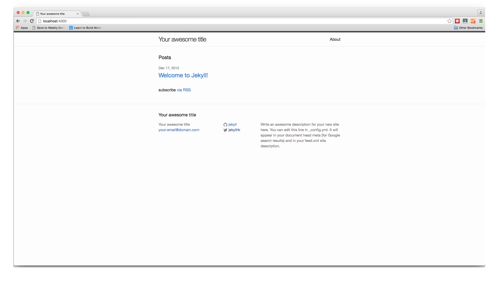

## Step 1. Make Changes to Jekyll Website (Optional)

To make changes to the settings of our entire site, use the `config.yml` file. To change or add posts open the `_posts/` directory and make your changes there. Please keep in mind that all of your posts should be in Markdown format. 

For this tutorial I have made changes only to `config.yml`, which you can see below.

~~~
# Welcome to Jekyll!
#
# This config file is meant for settings that affect your whole blog, values
# which you are expected to set up once and rarely need to edit after that.
# For technical reasons, this file is *NOT* reloaded automatically when you use
# 'jekyll serve'. If you change this file, please restart the server process.

# Site settings
title: Jekyll Deployed by Distelli
email: ping@distelli.com
description: > # this means to ignore newlines until "baseurl:"
 This is a sample Jekyll Static Blog, built and deployed by Distelli!
baseurl: "" # the subpath of your site, e.g. /blog
url: "" # the base hostname & protocol for your site
twitter_username: distelli
github_username:  distelli

# Build settings
markdown: kramdown
~~~

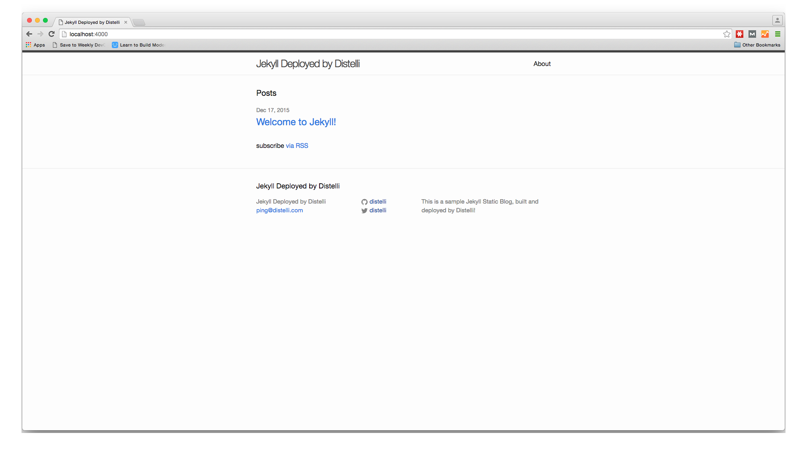

## Step 2. Create distelli-manifest.yml

The next step to complete is to create a `distelli-manifest.yml` file. You will need this file to create a fully automated build and deployment process that is triggered eveytime you commit to your source control. Below are the contents of the file

> **Note:** You will need to replace <-username-> with your Pipelines username & <-app name-> with your Pipelines Application's Name

~~~
<-username->/<-app name->:

  PkgInclude:
    - '_site/'

  PreRelease:
    - rvm install ruby-2.0.0-p598
    - gem install jekyll
    - gem install html-proofer
    - jekyll build
    - htmlproof ./_site

  PreInstall:
    - 'if [ -a /etc/nginx ]; then'
    -     echo "NGINX is already installed"
    - else
    -     sudo apt-get install nginx -y
    - fi
    - sudo rm -rf /usr/share/nginx/html/*

  Start:
    - sudo mv -v _site/* /usr/share/nginx/html/
~~~

### Breakdown

#### PkgInclude

In this section we are telling Pipelines what to include in our deployment. We want to deploy only the the generated static webstie files, so we tell Pipelines to include the `_site` directory Jekyll creates during the build process.

#### PreRelease

The PreRelease section executes during our Build phase. Here we are installing Ruby version 2.0.0 on your build server. Jekyll requires Ruby version 2.0.0 or greater. The next step is to install Jekyll and then after the installation we build our Jekyll Website.

#### PreInstall

The PreInstall section is executed during the deployment phase. This section contains an installation of NGINX. We install NGINX to serve the pages of our static website. After the installation of NGINX we make sure to clear out any old files from the directory so there are no conflicts with our new files.

#### Start

The Start section happens at the end of our deployment process. All that is happening in this section is moving our static site files from our Pipelines directory to our NGINX directory, so they can be served.

## Step 3. Push Code to Repository

The next step is to push our content into a source control repository. Create a GitHub or BitBucket repository to store your code (I am using a GitHub repository for this tutorial).
Create a repository and then push your code to that repository.

For more information on how to create a repository:

* <a href="https://help.github.com/articles/adding-an-existing-project-to-github-using-the-command-line/" target="_blank">GitHub</a>
* <a href="https://confluence.atlassian.com/bitbucket/create-a-repository-221449521.html" target="_blank">BitBucket</a>

## Step 4. Create Pipelines Application

If you do not have a Pipelines account, please [Sign Up](http://pipelines.puppet.com/signup) for one now. To create your app in Pipelines, follow these steps:

Click the new application button on your Pipelines account home screen

Name your app and then select the Repository type where you are storing your applications files. 

After we click the button to connect to our Repository, we then select the appropriate repo that contains your code.

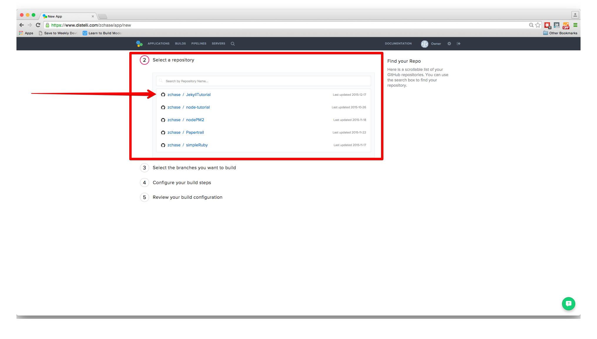

Select the appropriate branch for your deployment. I have only a master branch, but you can deploy any branch from your repo!

### Build Steps

> **Note:** Make sure you have replaced <-username-> with your Pipelines username & <-app name-> with your Pipelines Application's Name in your distelli-manifest.yml.

Next Pipelines will ask you set your build steps. You will need to the lower part of the section and check the box that says "Advanced User? Use a distelli-manifest.yml instead of editting your build steps in the app". Instead of using the Builds Steps, we will use the distelli-manifest.yml we created earlier.

The final step is select our Build Image. In this case we are going to select "Distelli Base (Docker)" for our Jekyll Website. Select the "Auto Build" checkbox and the the "Looks good. Start Build!".

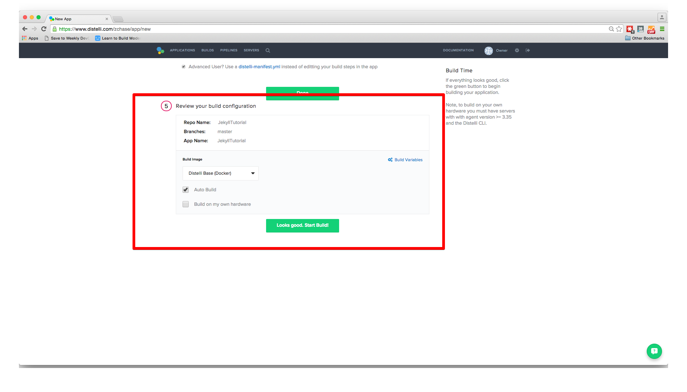

Now our build should be automatically building. You can watch its progress by navigating to the builds tab on your Pipelines account and clicking on your build.

## Step 5. Deploy Application

Now that we have successfully built our application we are ready to deploy to our server. On the builds page select the "New Deployment" button in the right hand corner.

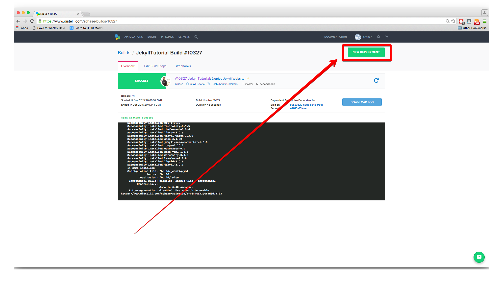

### Install Pipelines Agent on Your Server

To be able to deploy your application to your server you will need to install the Pipelines Agent. You will need remote access to your server to complete the installation. Please consult the below information on how to install the Pipelines Agent on your server.

> **Note:** This installation requires root (administrator) permissions.

<h3>Linux and macOS X</h3>

To install on Linux or macOS X you can use either curl <b>or</b> wget with one of the following syntaxes.
<h4>wget example</h4>

~~~
wget -qO- https://pipelines.puppet.com/download/client | sh
~~~

<h4>curl example</h4>

~~~
curl -sSL https://pipelines.puppet.com/download/client | sh
~~~

<h3>Windows</h3>

To install on Windows copy and paste the following powershell command into a command (cmd) window.

~~~
powershell -NoProfile -ExecutionPolicy Bypass -Command "iex ((new-object net.webclient).DownloadString('https://pipelines.puppet.com/download/client.ps1'))" & SET PATH=%PATH%;%ProgramFiles%/Distelli
~~~

<h3>Complete the Install</h3>

To complete the install of the agent, you must issue the `/usr/local/bin/distelli agent install` command.

~~~
/usr/local/bin/distelli agent install
~~~

~~~
ServerA:~$ <b>wget -qO- https://pipelines.puppet.com/download/client | sh</b>
This script requires superuser privileges to install packages
Please enter your password at the sudo prompt

[sudo] password for bmcgehee: 
    Installing Distelli CLI 3.51 for architecture 'Linux-x86_64'...
    Downloading https://s3.amazonaws.com/download.distelli.com/distelli.Linux-x86_64/distelli.Linux-x86_64-3.51.gz
To install the agent, run:
    sudo /usr/local/bin/distelli agent install
ServerA:~$ <b>sudo /usr/local/bin/distelli agent install</b>
Distelli Email: jdoe@distelli.com
      Password: 
    1: User: jdoe
    2: Team: janedoe/TeamJane
Team [2]: <b>1</b>
Server Info: https://www.distelli.com/jdoe/servers/12345678-4765-ac42-bd7a-080027c8277c
Starting upstart daemon with name:  dtk-supervise-cc123456787ad94a8d34ac610381242f9ae28bb8
~~~

<h3>Verify the Install</h3>

To validate the agent is installed and working use the `/usr/local/bin/distelli agent status` command.

> **Note:** This installation requires root (administrator) permissions.

~~~
/usr/local/bin/distelli agent status
Distelli Agent (serverA) is Running with id 766b88c8-e925-11e4-ae8b-080027cc07f7
~~~

If you would like more information on installing the Pipelines agent, visit [Installing the Pipelines Agent](./agent.html). 

### Deploy your Website

Once you click the button, you should be directed towards Pipelines's deployment page. The first step is to select the "Deploy a Release" option.

Pipelines will now prompt you to select the application you want to deploy. Please select the application we created earlier in the tutorial. My application is named "JekyllTutorial".

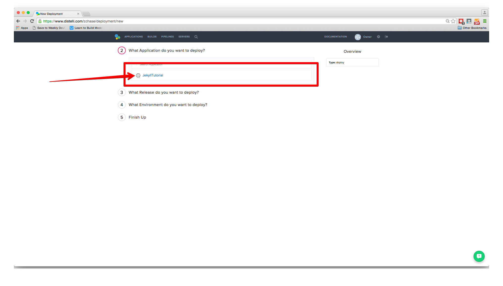

Then you will be asked to select the release you would like to deploy. For now there should be only one release for deployment.

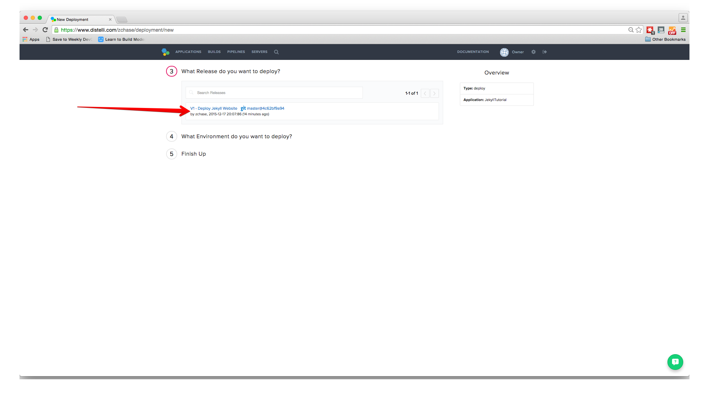

The last step in our deployment is to select the environment you wish to deploy in. First you will need to create an environment by enter a name and selecting the "Add Environment" button. Next select the Environment you just created and click "All Done".

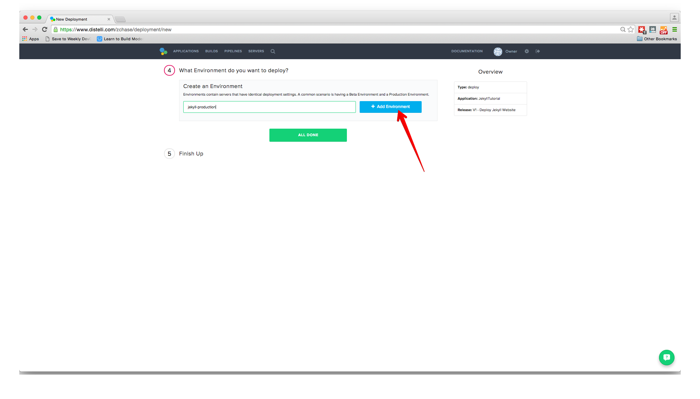

Now Pipelines will ask you to add your server. Click the "Add Servers" button to get started. Select the server you configured earlier in the tutorial and add it to your account. Once you have added your server, you can close the "Add Servers" panel and continue with your deployment. You will see a final option to set your delay between deployments on your servers and a "Start Deployment" button.

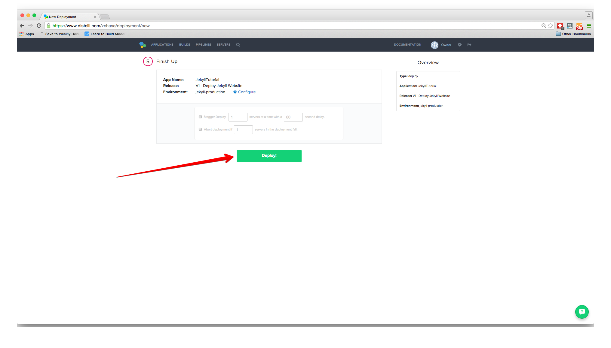

Click the "Start Deployment" button to begin your deployment. You will redirected to a page where you can view the progress of your deployment. Click the "log" button on the left side to view realtime streaming logs for the deployment.

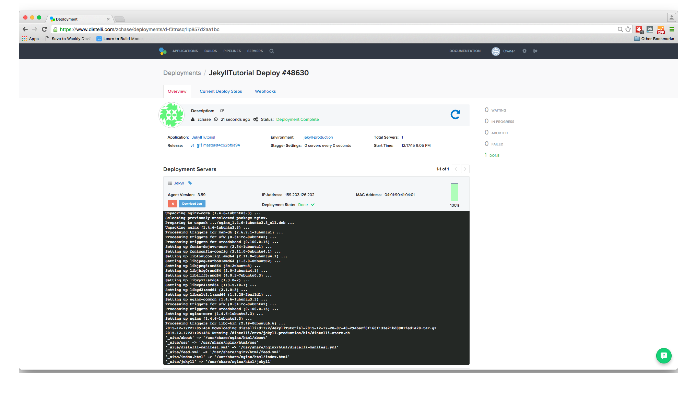

And that's it! You should now be able to point your browser to "http://<-You Server's IP Address->" and see your Jekyll Website!

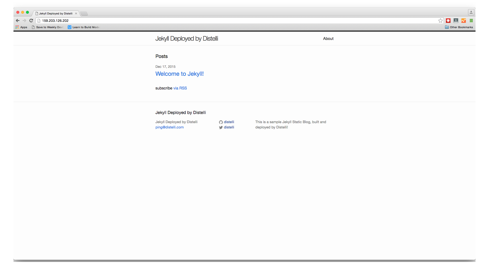

And that's it! You have now set up a Jekyll Website with Coninuous Integraion and Continuous Deployment! Thanks for following along and happy coding!
