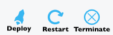

---
layout: default
title: "Managing applications"
--- 

## Navigate to an application

When you log into the Pipelines for Applications web UI, you are directed to the **Applications** page, where all your applications are listed.

Use the <b>Search for application...</b> field to search for an application by name or prefix. 

To navigate to an application, click the application's name in the list. The **Application Details** page opens. 

## Application settings

On the **Application Details** page, click **Application Settings** to view and configure important security, Docker, notification, and webhook settings. 

### General and security settings

Use the settings in this section to:

* Add a description for your application.
* Secure your application. Note that this action requires at least two key management servers. See [Secure an application](./application-secure.html) for instructions. 
* Make the output of your application's builds public. You can share links to public builds. This option is often appropriate for open-source applications, and is generally used with the option to allow pull requests from forked repositories. 
* Allow pull requests to your application from forked repositories. Take this action with caution, as pull requests from forked repositories might contain malicious code.

### Docker settings

In this section, use the settings to:

* Specify your container registry's type, name, and location.
* Map container ports to host ports. 

### Notification settings

Use the settings in this section to configure notifications about this application's builds, including:

* Choose the email address where you wish to receive notifications. 
* Choose the Slack channel where you wish to receive notifications. See [Integrate Slack](./integrate-slack.html) for instructions on connecting Pipelines for Applications to your Slack instance. 
* Specify whether you want to be notified when the application build begins, completes, or both. 

For more on Pipelines for Applications notifications, see [Notifications](./notification.html).

### Webhook settings

In this section, use the settings to:

* Enable webhooks for application builds
* Add a webhook for a build's initiation or completion. 

For more on setting up webhooks for Pipelines for Applications builds, see [Webhooks](./webhooks). 

## Connect a repository to an application 

You can add a source control repository to an existing application. This provides enhanced functionality for your application, including auto-build on repository check-in and auto-deploy on successful build. 

> **Note:** Repositories can also be added when creating the application. Ssee [Creating an application from a repository](./application-create.html) for instructions.

### Add a repository to an existing application

<ol>
<li>In the Pipelines web UI click <b>Applications</b>.</li>
<li>Navigate to the application you want to attach to your repository.</li>
<li>In the <b>App Pipeline</b> tab, click <b>Connect a repository to your pipeline</b>.</li>
<li>You are next prompted to <b>Select Source Control</b>. You may be asked to authenticate your access to the source control system selected.</li>
<li>Choose a <b>repository</b> to integrate with this application.</li>
<li>Choose a <b>branch</b>.</li>
<li>Click <b>Connect</b>.</li>
</ol>

You have integrated your application with your repository.

## Restart an application

A restart stops the existing application process that was started with a manifest's Exec section, then starts the process again.

During a restart, the following `distelli-manifest.yml` sections are processed in this order:
<ol>
<li>PreRestart</li>
<li>PreStart</li>
<li>Start or Exec</li>
<li>PostStart</li>
<li>PostRestart</li>
</ol>

Applications are restarted on the servers in an environment. To restart an application:
<ol>
<li>Navigate to the application that is to be restarted.</li>
<li>Navigate to the environment that is to be restarted.</li>
<li>Click <b>Restart</b>.</li>

<li>Adjust the stagger settings as necessary and click <b>Restart</b>.</li>
</ol>

The application is restarted on the servers in the environment.

## Terminating an application

Terminating an application stops the existing application process that was started with a manifest Exec section, then removes the application from the server.

During a termination, the following `distelli-manifest.yml` sections are processed in this order:
<ol>
<li>PreTerminate</li>
<li>Terminate</li>
<li>PostTerminate</li>
</ol>

Applications can be terminated by environment. To terminate an application:
<ol>
<li>Navigate to the environment that the application is to be terminated in.</li>
<li>Click <b>Terminate</b>.</li>

<li>Adjust the stagger settings as necessary and click <b>Terminate</b>.</li>
</ol>

The application is terminated on the servers in the environment. This does not remove the application's files from the server.

## Deleting an application

You cannot delete an application that is currently deployed and running on servers. You must first terminate the application. 

> **Caution:** Deleting an application deletes the application, all its environments, and all historical information regarding the application, its releases, and its deployments.

<ol>
<li>Navigate to the application you want to delete.</li>
<li>Click <b>Application Settings</b>.</li>
<li>Click <b>Delete Application</b> in the <i>Danger Zone</i>.</li>

An "Are you sure you want to delete [your application's name]?" confirmation appears. To continue:
<li>Type in the name of the application you are deleting.</li>
<li>Click the <b>Delete</b> button.</li>
</ol>

You have permanently removed the application.

