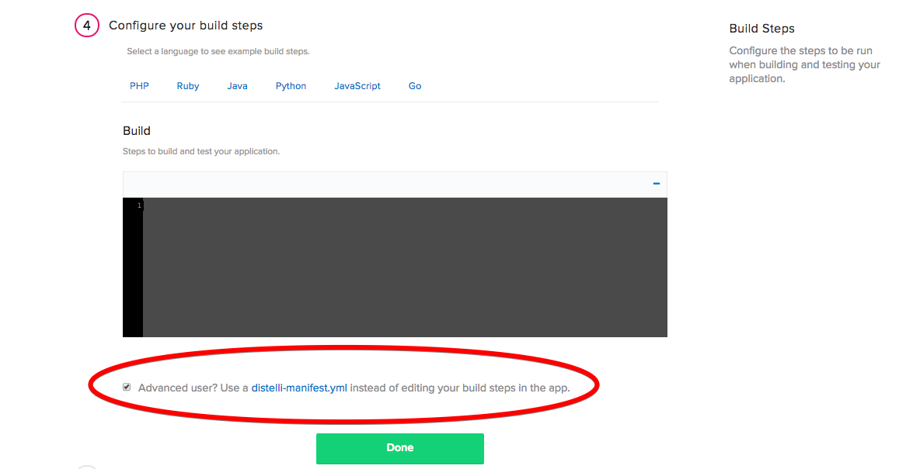

## Introduction

[Papertrail](https://papertrailapp.com) is hosted log management for your servers. It includes real-time tail, search, and alerts on application and platform logs. Using Papertrail enables realtime app visibility and troubleshooting.

## Prerequisites

To complete this tutorial you will need to have servers running that you wish to collect the logs. That is all you will need to get started!

## Step 1. Create Papertrail account

First, [sign up for a Papertrail account](https://papertrailapp.com). Once you have created your account, you will add your first system. Click the "Add System" button in the right corner of your Papertrail home page.

 

Once you click the button you will directed to the a page instructing you how to install Papertrail logging on your server. You will need to discover what logger system you are using. My servers are using `rsyslog.conf` for configuration, so this tutorial explains how to automate the install for those logging systems.

At the top of the page you will see the line: <b>Your systems will log to `logs3.papertrailapp.com:<-PAPERTRAIL PORT->`</b>. You will need your Papertrail Port later in this tutorial, so please keep note of it.

For other logging systems the process is still the same. You will need to create the specific configuration file on your local  machine with the correct changes from the Papertrail install instructions. 

## Step 2. Create remote_syslog.yml & rsyslog.conf

Our next step is create your `rsyslog.conf` file on your local machine. Remember that if you are using a different logging system, you will have to create that file on your local machine. This file will be deployed by Pipelines for Applications. The only change is at the bottom of file, where you need to insert your Papertrail Port:

~~~~
#  /etc/rsyslog.conf    Configuration file for rsyslog.
#
#                       For more information see
#                       /usr/share/doc/rsyslog-doc/html/rsyslog_conf.html
#
#  Default logging rules can be found in /etc/rsyslog.d/50-default.conf

#################
#### MODULES ####
#################

$ModLoad imuxsock # provides support for local system logging
$ModLoad imklog   # provides kernel logging support
#$ModLoad immark  # provides --MARK-- message capability

# provides UDP syslog reception
#$ModLoad imudp
#$UDPServerRun 514

# provides TCP syslog reception
#$ModLoad imtcp
#$InputTCPServerRun 514

###########################
#### GLOBAL DIRECTIVES ####
###########################

#
# Use traditional timestamp format.
# To enable high precision timestamps, comment out the following line.
#
$ActionFileDefaultTemplate RSYSLOG_TraditionalFileFormat

# Filter duplicated messages
$RepeatedMsgReduction on

#
# Set the default permissions for all log files.
#
$FileOwner syslog
$FileGroup adm
$FileCreateMode 0640
$DirCreateMode 0755
$Umask 0022
$PrivDropToUser syslog
$PrivDropToGroup syslog

#
# Where to place spool and state files
#
$WorkDirectory /var/spool/rsyslog

#
# Include all config files in /etc/rsyslog.d/
#
$IncludeConfig /etc/rsyslog.d/*.conf

*.*          @logs3.papertrailapp.com:<-YOUR PAPERTRAIL PORT->
~~~~

Once you have created that file and inserted your PORT, please save the file into a directory for this project. The second thing you need to do is create a `remote_syslog.yml` file. Below are the contents of that file:

~~~~
files:
  - <-PATH TO THE LOGS YOU WISH TO CONNECT TO PAPERTRAIL->
destination:
  host: logs3.papertrailapp.com
  port: <-YOUR PAPERTRAIL PORT->
  protocol: tls
~~~~

Please paste the above into your file and make the changes so that you are pointing towards the logs you want to capture and your Papertrail PORT is insterted. Once you are done you are ready to deploy these via Pipelines for Applications!

## Step 3. Push code into repository

For Pipelines for Applications to automate the install of Papertrail on your servers you will need to push the files you just created into a either a [GitHub](https://github.com/) or [BitBucket](https://bitbucket.org/) repository.

After you have pushed your files to your repository, you are ready to deploy them to your servers. 

## Step 4. Install the Pipelines agent on your servers

The first step to do is to install the Pipelines agent on your servers. If you don't already have a Pipelines account, navigate to pipelines.puppet.com and sign up.

Once you have signed up for Pipelines for Applications, you can install the agent on your sever. The Pipelines agent connects your destination server to Pipelines for Applications for consuming application deployments. To install the agent on your destination server run the command below that is appropriate for your server's operating system.

> **Note:** This installation requires root (administrator) permissions.

To install on Linux or macOS X you can use either curl or Wget with one of the following syntaxes:

~~~~
wget -qO- https://pipelines.puppet.com/download/client | sh
~~~~

~~~~
curl -sSL https://pipelines.puppet.com/download/client | sh
~~~~

To install on Windows, copy and paste the following PowerShell command into a command (cmd) window.

~~~~
powershell -NoProfile -ExecutionPolicy Bypass -Command "iex ((new-object net.webclient).DownloadString('https://pipelines.puppet.com/download/client.ps1'))" & SET PATH=%PATH%;%ProgramFiles%/Distelli
~~~~

### Complete the install

To complete the install of the agent, you must issue the `/usr/local/bin/distelli agent install` command.

~~~~
/usr/local/bin/distelli agent install
~~~~

~~~~
ServerA:~$ wget -qO- https://pipelines.puppet.com/download/client | sh
This script requires superuser privileges to install packages
Please enter your password at the sudo prompt

[sudo] password for bmcgehee: 
    Installing Distelli CLI 3.51 for architecture 'Linux-x86_64'...
    Downloading https://s3.amazonaws.com/download.distelli.com/distelli.Linux-x86_64/distelli.Linux-x86_64-3.51.gz
To install the agent, run:
    sudo /usr/local/bin/distelli agent install
ServerA:~$ sudo /usr/local/bin/distelli agent install
Distelli Email: jdoe@distelli.com
      Password: 
    1: User: jdoe
    2: Team: janedoe/TeamJane
Team [2]: 1
Server Info: https://www.distelli.com/jdoe/servers/12345678-4765-ac42-bd7a-080027c8277c
Starting upstart daemon with name:  dtk-supervise-cc123456787ad94a8d34ac610381242f9ae28bb8
~~~~

To validate the agent is installed and working use the `/usr/local/bin/distelli agent status` command.

> **Note:** This installation requires root (administrator) permissions.

~~~~
/usr/local/bin/distelli agent status
Pipelines agent (serverA) is Running with id 766b88c8-e925-11e4-ae8b-080027cc07f7
~~~~

If you would like more information on installing the Pipelines agent, see [Installing the Pipelines agent](./agent.html).

## Step 5. Create application

Now that you have installed the Pipelines agent on your server, you are ready to deploy your Papertrail app. In the Pipelines for Applications web UI, click **Applications**, then click <b>New App</b>.

Name your app and then select the repository type you pushed your code to during Step 3. 

After you click the button to connect to your repository, you then select the appropriate repo that contains your code. In this tutorial I stored my code in a GitHub repo name 'Papertrail'.

Then select the appropriate branch for your deployment. I have only a master branch, but you can deploy any branch from your repo!

Pipelines for Applications will now prompt you to assign your build steps. At the bottom of this section check the box to skip this section. We will be creating a `distelli-manifest.yml` file instead. 

### Pipelines manifest

You will need to create a `distelli-manifest.yml` file so you can tell Pipelines for Applications what your build and deployment steps are. Create a `distelli-manifest.yml` in your project's directory and paste the below contents into your file:

> **Note:** Replace <-username-> with your Pipelines username and <-app name-> with your application's name. 

~~~~
<-USERNAME->/<-APP NAME->:

PkgInclude:
  - remote_syslog.yml
  - rsyslog.conf

PostInstall:
  - wget https://github.com/papertrail/remote_syslog2/releases/download/v0.15/remote_syslog_linux_amd64.tar.gz
  - tar -zxvf remote_syslog_linux_amd64.tar.gz
  - rm remote_syslog_linux_amd64.tar.gz
  - sudo cp -f remote_syslog/remote_syslog /usr/local/bin/
  - sudo mv -f remote_syslog.yml /etc/
  - sudo mv -f rsyslog.conf /etc/

PreStart:
  - sudo killall remote_syslog || true

Start:
  - sudo service rsyslog restart
  - sudo remote_syslog -p 35624 -d logs3.papertrailapp.com --pid-file=/var/run/remote_syslog.pid -c /etc/remote_syslog.yml
~~~~

When you make these changes to your manifest file, you will have to make sure all of spacing and indentation lines up or you will encounter an error when building/deploying. Now that you have made the necessary changes to your manifest file you can push these updates into your repo and continue with your deployment. 

### Start build

After you have pushed your `distelli-manifest.yml` file into your application's repo, press the "Looks good. Start Build!" button.

Now your app should be automatically building. You can watch its progress in the builds tab on your Distelli account. You should see that your build has been built successfully and is now ready to deploy.

## Step 6. Deploy your application

Now that you have successfully built your application you are ready to deploy to your server. On the builds page select the "New Deployment" button in the right hand corner.

Once you click the button, you should be directed to the deployment page. The first step is to select the "Deploy a Release" option.

Pipelines for Applications will now prompt you to select the application you want to deploy. Please select the application you created earlier in the tutorial.

Then you will be asked to select the release you would like to deploy. For now there should be only one release for deployment. If you have multiple releases, please select the latest one.

The last step in your deployment is to select the environment you wish to deploy in. For this tutorial, I will be deploying to your production environment, but for your purposes you can select whichever environment you please.

Once you've set up your deployment settings, Pipelines for Applications will ask you to add servers. Click the "Add Servers" button to get started. Select the server you configured earlier in the tutorial and add it to your account. Once you have added your server, you can close the "Add Servers" panel and continue with your deployment. You will see a final option to set your delay between deployments on your servers and a "Start Deployment" button.

Click the "Start Deployment" button to begin your deployment. You will redirected to a page where you can view the progress of your deployment. Click the "log" button on the left side to view realtime streaming logs for the deployment. Once your deployment is complete, your screen should be similar to the screenshot below:

And that's it! Navigate back to your papertrail account and select the system you just created, and see the logs in real time!

Thank you for following along, and I hope that you have learned how Pipelines for Applications can make install Papertrail logging on your servers!

