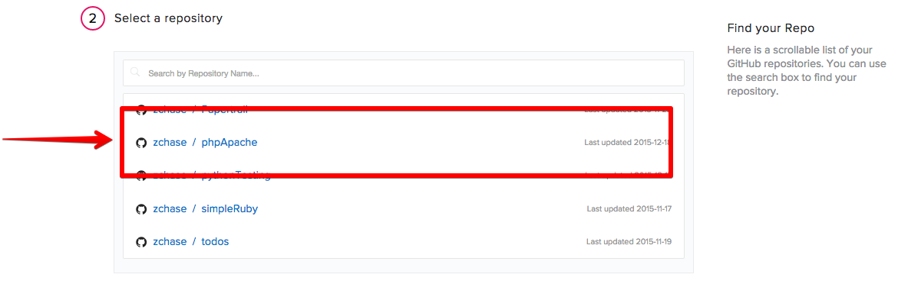
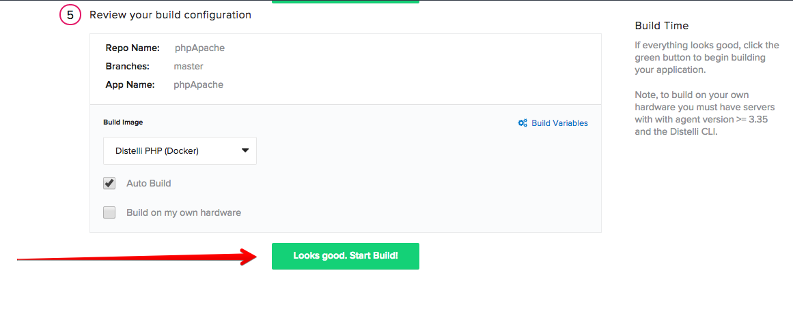
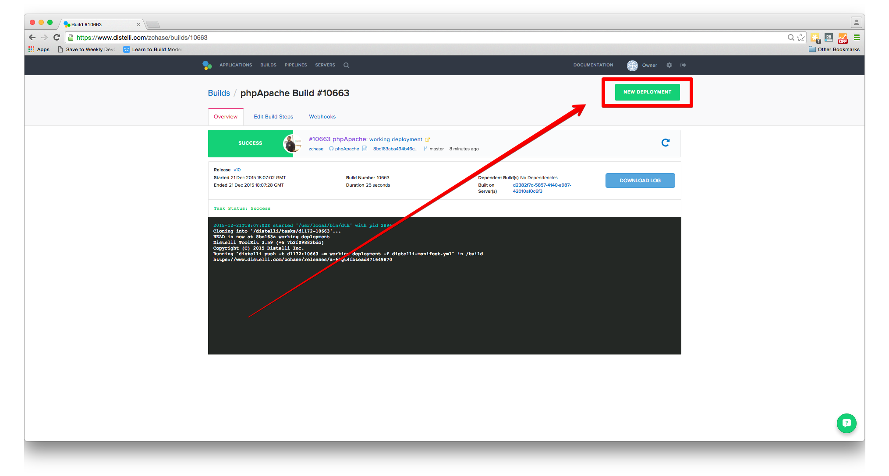
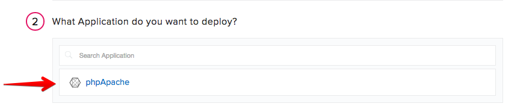
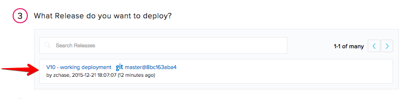
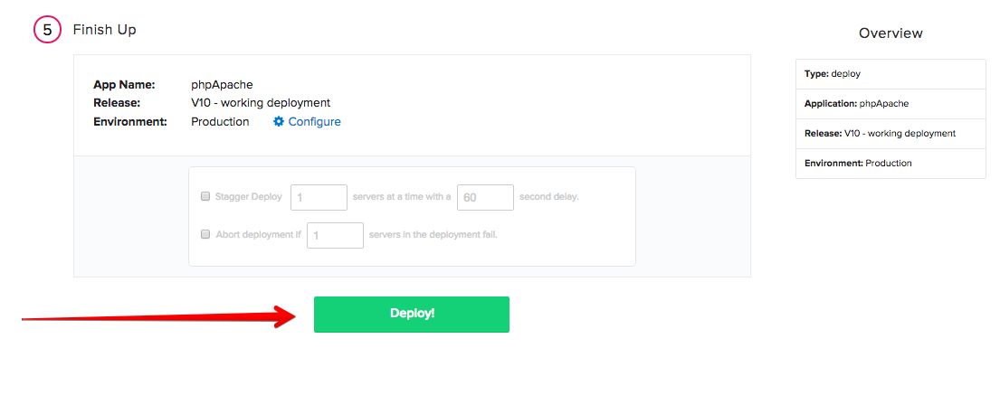
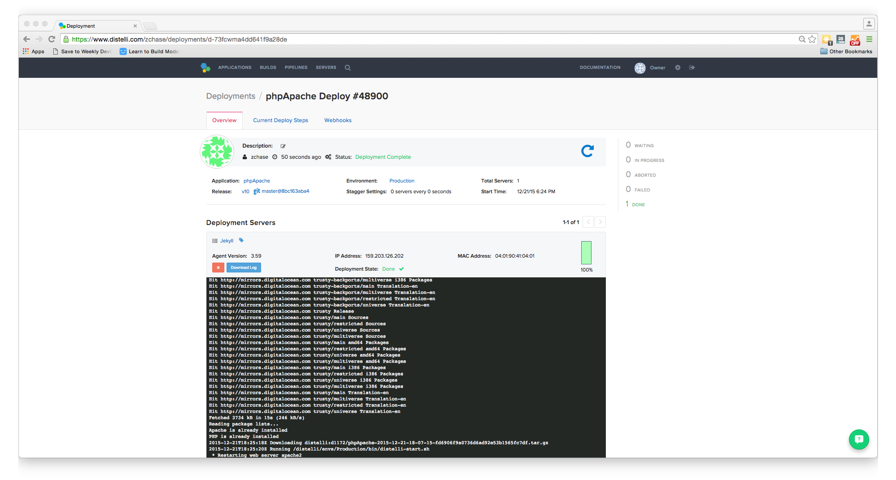
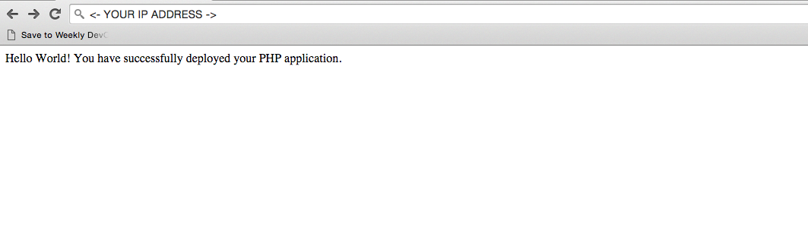

 
In this tutorial we will discuss deploying PHP web content that will be served via Apache running on an Ubuntu server.
This scenario assumes the following:  
<i>
You want to deploy a PHP application 
The PHP application will use Apache to serve content 
If the PHP application uses a database, the database already exists and is up and running
</i>

## Before You Begin

To successfully complete this tutorial you should have a basic knowledge of PHP and a server to deploy your application to. You do not need to already have an application created, as we will create a simple PHP "Hello World" application.

## Step 1. Create PHP Application

The first step is to create a PHP application to deploy. If you already have a PHP application to deploy, you can skip this step. Below is the code snippet for a simple PHP "Hello World" application.

~~~
  echo "Hello World!  You have successfully deployed your PHP application with Apache and Pipelines!" ;
~~~

The above code will display the text "Hello World!  You have successfully deployed your PHP application with Apache and Pipelines!" on your web page.

## Step 2. Create Pipelines Manifest

> **Note:** This tutorial assumes that the server is out of the box and needs to have your application dependencies installed & configured. Once your application dependencies are installed & configured you can remove those commands from your <b>Manifest</b>.

Next we will create our `distelli-manifest.yml`. Our Manifest will accomplish the following tasks: install Apache if it is not installed, install PHP if it is not installed, clear our root directory of old files, place our PHP application in the root directory, and finally restart our Apache web server. 

> **Note:** Replace <-username-> with your Pipelines username & <-app name-> with your Application's Name. 

~~~
<-username->/<-app name->:

PkgInclude:
  - index.php

PreInstall:
  - echo "Beginning PreInstall"
  - sudo apt-get update
  - 'if [ -a /usr/sbin/apache2 ]; then'
  -     echo "Apache is already installed"
  - else
  -     sudo apt-get install apache2 -y
  - fi
  - 'if [ -a /usr/bin/php ]; then'
  -     echo "PHP is already installed"
  - else
  -     sudo apt-get install php5 libapache2-mod-php5 -y
  - fi

Start:
  - sudo rm -rf /var/www/html/*
  - sudo mv index.php /var/www/html/
  - sudo service apache2 restart 
~~~

#### PkgInclude

The PkgInclude is identifying what files we want deployed to our server. If you would like every file in your repository deployed you would put:
~~~
PkgInclude:
  - '*'
~~~
Because we want only our PHP application deployed to the server, we make sure to explicity state that in our PkgInclude section.

#### PreInstall

In the PreInstall Section we complete three different tasks: 
Download package lists and get information on the newest versions
~~~
PreInstall:
  - echo "Beginning PreInstall"
  - sudo apt-get update
~~~
Install Apache if it is not already installed
~~~
- 'if [ -a /usr/sbin/apache2 ]; then'
-     echo "Apache is already installed"
- else
-     sudo apt-get install apache2 -y
- fi
~~~
Install PHP if it is not already installed
~~~
- 'if [ -a /usr/bin/php ]; then'
-     echo "PHP is already installed"
- else
-     sudo apt-get install php5 libapache2-mod-php5 -y
- fi
~~~

#### Start

In the final section of our manifest we issue our Start commands. In the seciton we are:

Removing old files from our 'html' directory
~~~
Start:
  - sudo rm -rf /var/www/html/*
~~~
Moving our new files into that directory
~~~
  - sudo mv index.php /var/www/html/
~~~
Then finally restarting our Apache server
~~~
  - sudo service apache2 restart 
~~~

## Step 3. Push to Repo

Now that we have our files ready to be deployed, we need to push these files into a GitHub/BitBucket repository. If have not already created a repository for this project, do so now. Once you have your repository set up, push your code!

## Step 4. Create application

If you do not have a Pipelines account, please [Sign Up](http://pipelines.puppet.com/signup) for one now. To create your app in Pipelines, follow these steps:

Click the new application button on your Pipelines account home screen

Name your app and then select the repository type where you are storing your applications files. 

After we click the button to connect to our repository, we then select the appropriate repo that contains your code.

Then select the appropriate branch for your deployment. I have only a master branch, but you can deploy any branch from your repo!

### Build Steps

> **Note:** Make sure you have replaced <-username-> with your Pipelines username & <-app name-> with your Pipelines Application's Name in your distelli-manifest.yml. 

Next Pipelines will ask you set your build steps. You will need to the lower part of the section and check the box that says "Advanced User? Use a distelli-manifest.yml instead of editting your build steps in the app". Instead of using the Builds Steps, we will use the distelli-manifest.yml we created earlier.

The final step is select our Build Image. In this case we are going to select "Distelli PHP (Docker)" for our PHP application. Select the "Auto Build" checkbox and the the "Looks good. Start Build!".

Now our build should be automatically building. You can watch its progress by navigating to the builds tab on your Pipelines account and clicking on your build.

## Step 5. Deploy Application

Now that we have successfully built our application we are ready to deploy to our server. On the builds page select the "New Deployment" button in the right hand corner.

### Install Pipelines Agent on Your Server

To be able to deploy your application to your server you will need to install the Pipelines Agent. You will need remote access to your server to complete the installation. Please consult the below information on how to install the Pipelines Agent on your server.

> **Note:** This installation requires root (administrator) permissions.

<h3>Linux and macOS X</h3>

To install on Linux or macOS X you can use either curl <b>or</b> wget with one of the following syntaxes.
<h4>wget example</h4>

~~~
wget -qO- https://pipelines.puppet.com/download/client | sh
~~~

<h4>curl example</h4>

~~~
curl -sSL https://pipelines.puppet.com/download/client | sh
~~~

<h3>Windows</h3>

To install on Windows copy and paste the following powershell command into a command (cmd) window.

~~~
powershell -NoProfile -ExecutionPolicy Bypass -Command "iex ((new-object net.webclient).DownloadString('https://pipelines.puppet.com/download/client.ps1'))" & SET PATH=%PATH%;%ProgramFiles%/Distelli
~~~

<h3>Complete the Install</h3>

To complete the install of the agent, you must issue the `/usr/local/bin/distelli agent install` command.

~~~
/usr/local/bin/distelli agent install
~~~

~~~
ServerA:~$ <b>wget -qO- https://pipelines.puppet.com/download/client | sh</b>
This script requires superuser privileges to install packages
Please enter your password at the sudo prompt

[sudo] password for bmcgehee: 
    Installing Distelli CLI 3.51 for architecture 'Linux-x86_64'...
    Downloading https://s3.amazonaws.com/download.distelli.com/distelli.Linux-x86_64/distelli.Linux-x86_64-3.51.gz
To install the agent, run:
    sudo /usr/local/bin/distelli agent install
ServerA:~$ <b>sudo /usr/local/bin/distelli agent install</b>
Distelli Email: jdoe@distelli.com
      Password: 
    1: User: jdoe
    2: Team: janedoe/TeamJane
Team [2]: <b>1</b>
Server Info: https://www.distelli.com/jdoe/servers/12345678-4765-ac42-bd7a-080027c8277c
Starting upstart daemon with name:  dtk-supervise-cc123456787ad94a8d34ac610381242f9ae28bb8
~~~

<h3>Verify the Install</h3>

To validate the agent is installed and working use the `/usr/local/bin/distelli agent status` command.

> **Note:** This installation requires root (administrator) permissions.

~~~
/usr/local/bin/distelli agent status
Distelli Agent (serverA) is Running with id 766b88c8-e925-11e4-ae8b-080027cc07f7
~~~

If you would like more information on installing the Pipelines agent, visit [Installing the Pipelines Agent](./agent.html). 

### Deploy your PHP Application <!--(Change screenshots)-->

Once you click the button, you should be directed to the deployment page. The first step is to select the "Deploy a Release" option.

Pipelines will now prompt you to select the application you want to deploy. Please select the application we created earlier in the tutorial.

Then you will be asked to select the release you would like to deploy. For now there should be only one release for deployment.

The last step in our deployment is to select the environment you wish to deploy in. First you will need to create an environment by enter a name and selecting the "Add Environment" button.

 Next select the Environment you just created and click "All Done".

Now Pipelines will ask you to add your server. Click the "Add Servers" button to get started. Select the server you configured earlier in the tutorial and add it to your account. Once you have added your server, you can close the "Add Servers" panel and continue with your deployment. You will see a final option to set your delay between deployments on your servers and a "Start Deployment" button.

Click the "Start Deployment" button to begin your deployment. You will redirected to a page where you can view the progress of your deployment. Click the "log" button on the left side to view realtime streaming logs for the deployment.

And that's it! You should now be able to point your browser to "http://<-You Server's IP Address->" and see your PHP application!

And that's it! You have successfully deployed your PHP application with Apache as a web server! 

