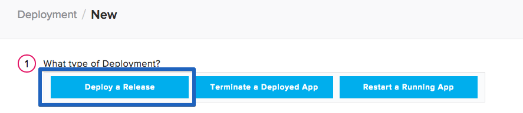

 

In this tutorial we will go through how to automate the build and deployment of a Play Framework Application. 

## Before You Begin

Before we begin, make sure to have the following:

- A server ready to be deploy to
- The Play Framework <a href="https://www.playframework.com/documentation/2.5.x/Installing" target="_blank">installed on your local machine</a>

## Step 1. Create Play Application

If you already have a Play application you can skip down to <b>Step 2</b>. This tutorial uses <a href="https://www.lightbend.com/activator/docs" target="_blank">Lightbend Activator</a> to install Play, so please ensure you have Activator installed on your machine. To get started, open your terminal and enter the following command:

~~~
$ activator ui
~~~

> **Note:** If you encounter an error, please refer to <a href="https://www.playframework.com/documentation/2.5.x/Installing" target="_blank">here</a> for troubleshooting.

You will be redirect to your browser and shown the Activator GUI Interface:

Select the sample application <b>Reactive Stocks</b> and set the path to where you want to store your application's files on your local machine:

Once your application is created, you will be redirected to the Activator GUI for editing your projecting. To ensure your application was created successfully, run your application from the GUI by selecting the <b>Run</b> tab and then clicking the <b>Run</b> button:

## Step 2. Push Files to a Repository

To build and deploy our application with Pipelines for Applications, our application needs to stored in a source control repository. Create a GitHub or BitBucket repository to store your code (I am using a GitHub repository for this tutorial).
Create a repository and then push your code to that repository.

For more information on how to create a repository:

* <a href="https://help.github.com/articles/adding-an-existing-project-to-github-using-the-command-line/" target="_blank">GitHub</a>
* <a href="https://confluence.atlassian.com/bitbucket/create-a-repository-221449521.html" target="_blank">BitBucket</a>

## Step 3. Set up your Server

If you do not have a Pipelines account, [sign up](https://pipelines.puppet.com/signup) for one now. The next step is to set up our server to serve our Play Application. For this tutorial, we need to install the Pipelines Agent and install Java 8.

> **Note:** I am using an Ubuntu 14.04 server.

### Install Pipelines Agent on Your Server

To be able to deploy your application to your server you will need to install the Pipelines Agent. You will need remote access to your server to complete the installation. Please consult the below information on how to install the Pipelines Agent on your server.

> **Note:** This installation requires root (administrator) permissions.

<h3>Linux and macOS X</h3>

To install on Linux or macOS X you can use either curl <b>or</b> wget with one of the following syntaxes.
<h4>wget example</h4>

~~~
wget -qO- https://pipelines.puppet.com/download/client | sh
~~~

<h4>curl example</h4>

~~~
curl -sSL https://pipelines.puppet.com/download/client | sh
~~~

<h3>Windows</h3>

To install on Windows copy and paste the following powershell command into a command (cmd) window.

~~~
powershell -NoProfile -ExecutionPolicy Bypass -Command "iex ((new-object net.webclient).DownloadString('https://pipelines.puppet.com/download/client.ps1'))" & SET PATH=%PATH%;%ProgramFiles%/Distelli
~~~

<h3>Complete the Install</h3>

To complete the install of the agent, you must issue the `sudo /usr/local/bin/distelli agent install` command.

~~~
sudo /usr/local/bin/distelli agent install
~~~

~~~
ServerA:~$ <b>wget -qO- https://pipelines.puppet.com/download/client | sh</b>
This script requires superuser privileges to install packages
Please enter your password at the sudo prompt

[sudo] password for bmcgehee: 
    Installing Distelli CLI 3.51 for architecture 'Linux-x86_64'...
    Downloading https://s3.amazonaws.com/download.distelli.com/distelli.Linux-x86_64/distelli.Linux-x86_64-3.51.gz
To install the agent, run:
    sudo /usr/local/bin/distelli agent install
ServerA:~$ <b>sudo /usr/local/bin/distelli agent install</b>
Distelli Email: jdoe@distelli.com
      Password: 
    1: User: jdoe
    2: Team: janedoe/TeamJane
Team [2]: <b>1</b>
Server Info: https://www.distelli.com/jdoe/servers/12345678-4765-ac42-bd7a-080027c8277c
Starting upstart daemon with name:  
~~~

If you would like more information on installing the Pipelines agent, visit [Installing the Pipelines Agent](./agent.html). 

### Java

For information on how to install Java on your server, visit <a href="https://java.com/en/download/help/index_installing.xml" target="_blank">this guide</a>.

## Step 4. Create application

Click the <b>New App</b> button on your Pipelines account home screen

Select the repository type where you are storing your applications files. 

After we click the button to connect to our repository, we select the appropriate repository that contains our files.

Select the appropriate branch for your deployment. I have only a master branch, but you can deploy any branch from your repo.

Next, we are prompted to set our build steps. Leave this section blank for now. We will set our build steps after our application has been created.

The final step is select our Build Image. In this case, we are going to select "Distelli Java/JVM" for our Play Application. We want to use this <b>Build Image</b> because it has many popular Java tools pre-installed, therefore speeding up our build time. Make sure the <b>Auto Build</b> checkbox is enabled, and click <b>Looks good. Start Build!</b>.

This will kick off a build of your application, but because we have not set our <b>Build and Deploy Steps</b> we will ignore this specific build. Once we have set our <b>Build and Deploy Steps</b> we will manually kick off a new build of our application.

### Configure the Build and Deploy Steps

Once your application has been created, navigate to your <b>Application</b> page and open your newly created application.

Click the <b>Manifest</b> tab.

Expand the <b>Build Manifest</b> section by clicking on the plus sign. This is where we are going to configure the commands to run during our Deployment.

#### PreBuild Steps

Scroll down to your PreBuild section and enter in the following:

~~~
sudo add-apt-repository ppa:webupd8team/java
wget -q http://www.scala-lang.org/files/archive/scala-2.11.6.deb
sudo dpkg -i scala-2.11.6.deb
sudo apt-get update
sudo apt-get install scala
sudo apt-get install oracle-java8-installer
wget -q http://downloads.typesafe.com/typesafe-activator/1.3.2/typesafe-activator-1.3.2-minimal.zip
unzip typesafe-activator-1.3.2-minimal.zip
mv activator-1.3.2-minimal activator
cd activator
export PATH=$PATH:activator
source ~/.bashrc
chmod a+x activator
~~~

#### Build Steps

Scroll down to your Build section and enter in the following

~~~
jdk_switcher use oraclejdk8
./activator/activator dist
~~~

#### PkgInclude

Scroll down to your PkgInclude section and enter in the following

~~~
/target/universal/*
~~~

Save your Build Manifest by clicking the <b>Save</b> button at the top of the build section. Expand the <b>Deployment Manifest</b> section by clicking the plus sign. This is where we are going to configure the commands to run during our Deployment.

### Deploy Steps

#### PreInstall Steps

Scroll down to your PreInstall section and enter in the following:

~~~
sudo apt-get -y update
sudo apt-get install unzip -y
~~~

#### PostInstall

Scroll down to your PostInstall section and enter in the following

~~~
cd $DISTELLI_INSTALLHOME/target/universal
unzip reactive-stocks-1.0-SNAPSHOT.zip
~~~

#### Exec

Scroll down to your Exec section and enter in the following

~~~
cd $DISTELLI_INSTALLHOME/target/universal
reactive-stocks-1.0-SNAPSHOT/bin/reactive-stocks -Dplay.crypto.secret=$APP_SECRET
~~~

### Re-Build the Application

Because we changed our deployment steps, we need to rebuild our application. To trigger a new build, click the wrench icon in the right hand corner. This triggers a build of your latest code, build steps, and deployment steps.

### Create Environment

The last thing we need to accomplish before deploying our Play Application, is to create a Pipelines Environment, add our server to our environment, and set our application secret as an environment variable. To start navigate to your application's page in the Pipelines web UI and click the <b>Environment</b> tab:

Click the <b>New Environment</b> button and enter in the information for your new environment. I have called my environment <b>Production</b>, but you can name your environment whatever you want. Once you have entered in a name for your environment, click the <b>Create Environment</b> button:

You will be redirect to your new environment's page in Pipelines. Here we are able to set environment variables, like our application secret. To generate an application secret for you Play Application, navigate to your project's directory on your local machine and run the following command:

~~~
$ activator playGenerateSecret
~~~

Copy the generated secret and create an environment variable, `APP_SECRET`, in Pipelines and assign its value to be the secret you just generated.

Once you have set your `APP_SECRET`, navigate back to your build page and click your latest build to see if it has completed. Once you build is complete, a green box indicates that your build was <b>Successful</b>.

## Step 5. Deploy Application

Now that we have successfully built our application, we are ready to deploy to our server. On the builds page click <b>New Deployment</b> in the right hand corner.

### Deploy your Website

Once you click the button, you are directed towards Pipelines's deployment page. The first step is to select <b>Deploy a Release</b> option.

You are prompted to select the application you want to deploy. Select the application we created earlier in the tutorial.

Then you are prompted to select the release you would like to deploy. For now there should be only one release for deployment.

The last step in our deployment is to select the environment you want to deploy to. Select the Environment you created earlier and click <b>All Done</b>.

Now you need add your server. Click <b>Add Servers</b> to get started. Select the server you configured earlier in the tutorial, and add it to your account. Once you have added your server, close the <b>Add Servers</b> panel and continue with your deployment. You are shown a final option to set your delay between deployments on your servers and a <b>Start Deployment</b> button.

Click <b>Start Deployment</b> to begin your deployment. A deployment page opens, where you can view the progress of your deployment. Click <b>log</b> on the left side to view realtime streaming logs for the deployment.

You should now be able to point your browser to <b>http://<-You Server's IP Address->:9000</b> and see your Play Application!

You have now set up a Play Application with Continuous Integration and Continuous Deployment! Thanks for following along and happy coding!

