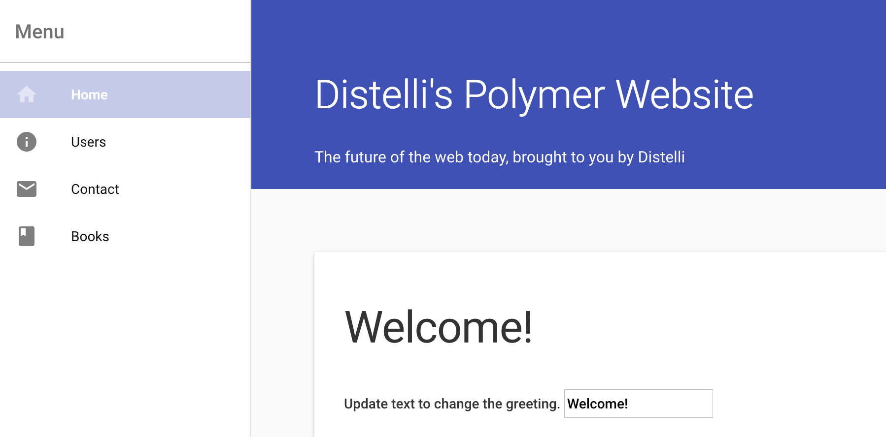

 

In this tutorial we will go through how to deploy a Polymer.js application. This tutorial is based off the <a href="https://www.polymer-project.org/1.0/docs/start/psk/set-up.html" target="_blank">Polymer Starter Kit</a> application from Polymer's Documentation.

### Before You Begin

To complete this tutorial you will need the following:

* A server to deploy your application to
* A Polymer.js Application
* GitHub/BitBucket account

If you do not have a Polymer.js application, please visit their <a href="https://www.polymer-project.org/1.0/docs/start/psk/set-up.html" target="_blank">Documentation</a> for help on getting started.

## Step 1. Push Files to a Repository

To build and deploy our application with Pipelines, we are going to need to create a repository in GitHub or BitBucket to store our application's files. Please create a repository and push your files into your repo. If you already have your application's files in a repository you can move on to step 3.

For more information on how to create a repository:

* <a href="https://help.github.com/articles/adding-an-existing-project-to-github-using-the-command-line/" target="_blank">GitHub</a>
* <a href="https://confluence.atlassian.com/bitbucket/create-a-repository-221449521.html" target="_blank">BitBucket</a>

## Step 2. Set up your Server

If you do not have a Pipelines account, [sign up](https://pipelines.puppet.com/signup) for one now.

The next step is to install the Pipelines Agent on the server we are going to deploy our Application to

> **Warning:** You will need remote access to the server you are deploying to & root (administrator) permissions.

### Install Pipelines Agent on Your Server

To be able to deploy your application to your server you will need to install the Pipelines Agent. You will need remote access to your server to complete the installation. Please consult the below information on how to install the Pipelines Agent on your server.

#### Linux and macOS X

To install on Linux or macOS X you can use either curl <b>or</b> wget with one of the following syntaxes.
##### wget example

~~~
wget -qO- https://pipelines.puppet.com/download/client | sh
~~~

##### curl example

~~~
curl -sSL https://pipelines.puppet.com/download/client | sh
~~~

#### Windows

To install on Windows copy and paste the following powershell command into a command (cmd) window.

~~~
powershell -NoProfile -ExecutionPolicy Bypass -Command "iex ((new-object net.webclient).DownloadString('https://pipelines.puppet.com/download/client.ps1'))" & SET PATH=%PATH%;%ProgramFiles%/Distelli
~~~

#### Complete the Install

To complete the install of the agent, you must issue the `/usr/local/bin/distelli agent install` command.

~~~
/usr/local/bin/distelli agent install
~~~

~~~
ServerA:~$ <b>wget -qO- https://pipelines.puppet.com/download/client | sh</b>
This script requires superuser privileges to install packages
Please enter your password at the sudo prompt

[sudo] password for bmcgehee:
    Installing Pipelines CLI 3.51 for architecture 'Linux-x86_64'...
    Downloading https://s3.amazonaws.com/download.distelli.com/distelli.Linux-x86_64/distelli.Linux-x86_64-3.51.gz
To install the agent, run:
    sudo /usr/local/bin/distelli agent install
ServerA:~$ <b>sudo /usr/local/bin/distelli agent install</b>
Distelli Email: jdoe@distelli.com
      Password:
    1: User: jdoe
    2: Team: janedoe/TeamJane
Team [2]: <b>1</b>
Server Info: https://www.distelli.com/jdoe/servers/12345678-4765-ac42-bd7a-080027c8277c
Starting upstart daemon with name:
~~~

#### Verify the Install

To validate the agent is installed and working use the `/usr/local/bin/distelli agent status` command.

> **Note:** This installation requires root (administrator) permissions.

~~~
/usr/local/bin/distelli agent status
Pipelines Agent (serverA) is Running with id
~~~

If you would like more information on installing the Pipelines agent, visit [Installing the Pipelines Agent](./agent.html). 

## Step 3. Create Pipelines Applications

To create your app, follow these steps:

Click the <b>New App</b> button on your Pipelines account home screen

Select the repository type where you are storing your applications files.

After we click the button to connect to our repository, we select the appropriate repo that contains the files.

Select the appropriate branch for your deployment. I have only a master branch, but you can deploy any branch from your repo.

Next, we are prompted to set our build steps. This where we will set our build steps. Below are the contents of our <b>Build</b> and <b>PkgInclude</b> sections.

### Build

~~~
nvm install 0.12
npm install bower
npm install
bower install
gulp
~~~

### PkgInclude

~~~
dist/
~~~

The final step is select our Build Image. In this case, we are going to select "Pipelines Javascript (Docker)" for our Polymer.js App. Make sure the <b>Auto Build</b> checkbox is enabled, and click <b>Looks good. Start Build!</b>.

### Configure Deploy Steps

> **Note:** You can remove these steps from your Manifest after your first deployment.

Once your application has been created, navigate to your <b>Application</b> page and open your newly created application.

Click the <b>Manifest</b> tab.

Expand the <b>Deployment Manifest</b> section by clicking the plus sign. This is where we are going to configure the commands to run during our Deployment.

#### PreInstall

Scroll down to your PreInstall section and enter in the following

~~~
sudo apt-get update
sudo apt-get install apache2
~~~

#### PostInstall

Scroll down to your PostInstall section and enter in the following

~~~
sudo ln -sf $DISTELLI_APPHOME/dist/* /var/www/html/
sudo service apache2 restart
~~~

### Re-Build the Application

Because we changed our deployment steps, we need to rebuild our application. To trigger a new build, navigate back to your Application's page, click the <b>Wrench</b> icon in the right hand corner. This triggers a build of your latest code, build steps, and deployment steps.

Navigate to your build page and click the active build to watch it progress. Once you build is complete, a green box indicates that your build was <b>Successful</b>.

## Step 4. Deploy Application

Now that we have successfully built our application, we are ready to deploy to our server. On the builds page click <b>New Deployment</b> in the right hand corner.

### Deploy your Website

Once you click the button, you are directed towards the deployment page. The first step is to select <b>Deploy a Release</b> option.

You are prompted to select the application you want to deploy. Select the application we created earlier in the tutorial.

Then you are prompted to select the release you would like to deploy. For now there should be only one release for deployment.

The last step in our deployment is to select the environment you want to deploy to. First you will need to create an environment by enter a name and selecting the "Add Environment" button.

Next select the Environment you just created and click <b>All Done</b>.

Now you need add your server. Click <b>Add Servers</b> to get started. Select the server you configured earlier in the tutorial, and add it to your account. Once you have added your server, close the <b>Add Servers</b> panel and continue with your deployment. You are shown a final option to set your delay between deployments on your servers and a <b>Start Deployment</b> button.

Click <b>Start Deployment</b> to begin your deployment. A deployment page opens, where you can view the progress of your deployment. Click <b>log</b> on the left side to view realtime streaming logs for the deployment.

You should now be able to point your browser to `http://<-You Server's IP Address->` and see your Polymer.js Application!

## Step 5. Update the Application

To show the real power of deployment automation with Pipelines, we will update our application and deploy that change. The first thing we will do is create our application pipeline. Navigate to your application's page, and on the right hand side you will see a section called <b>App Pipeline</b>.

Click the <b>Add Step</b> button, select your environment, and then click <b>Add</b>.

Check the <b>Auto Deploy</b> checkbox and leave the condition as <b>If the Build succeeds</b>.

Next select your <b>Manifest</b> tab and open your <b>Deployment Manifest</b>. You can clear all of your deployment steps, as we no longer need them to deploy our updates.

#### Update and Push Changes

Now update your application in any you what. I am changing the headline of my home page from "Polymer Starter Kit" to "Pipelines Polymer Website." You can make as large of a change or as small of a change as you want. Once you have finished making your changes, push your changes to your repository. Once the changes have been pushed, Pipelines will kick off a build of your application. Once that build has finished, your application will be automatically deployed to your server.

You have now set up a Polymer.js Application with Continuous Integration and Continuous Deployment! Thanks for following along and happy coding!

