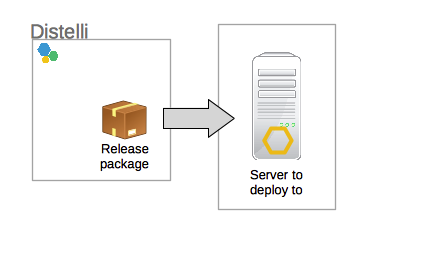
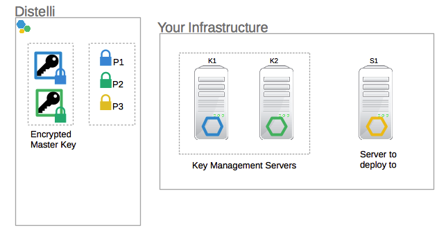
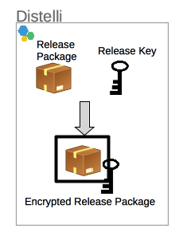
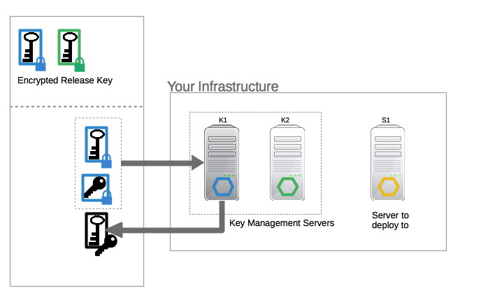
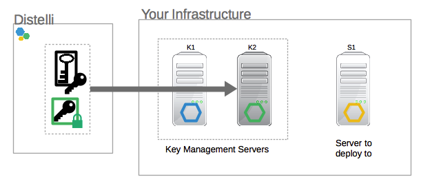
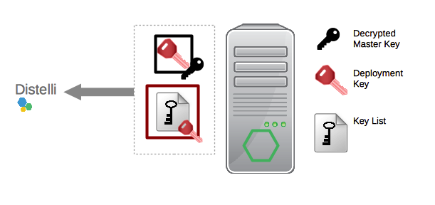
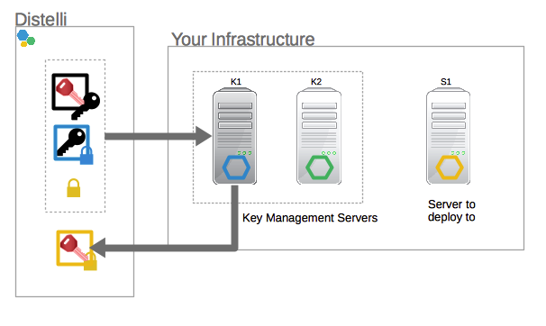
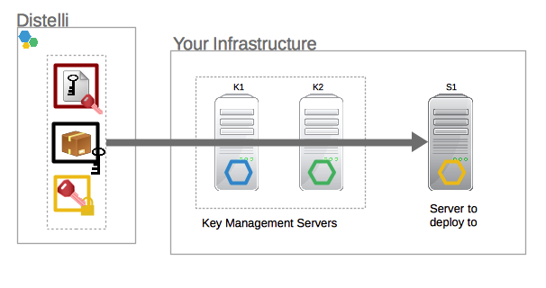

---
layout: default
title: "Securing an application"
--- 

## Secure your application 

You can encrypt your application releases in Pipelines, to secure your release artifacts before they are deployed. Your releases are secured using public key cryptography, and the keys to decrypt your data are stored on servers that you own. 

### Prerequisites

1. Set up at least two servers that can act as key management servers. 

    > **Important:** The key management servers maintain the private keys required to decrypt your data. 

    Note that:
    * To successfully build and deploy your application, at least one key management server must be running.
    * If all key manager servers are terminated, or if their hard drives are erased or corrupt, your encrypted data cannot be recovered. 
   
1. On all the key management servers, install Pipelines Agent 3.59 or later.
1. On all the servers you are deploying to, install Pipelines Agent 3.59 or later.

For steps to install Pipelines Agent, see [Pipelines Agent](./agent.html).

### To Enable Your Key Management Servers

1. Log into Pipelines for Applications. The home page opens, with a list of your applications.
2. On the top left, click **Servers**. A list of your servers opens.
3. Scroll to one of the key management servers that you set up. If applicable, use the Search box to filter the list of servers by name or IP address.
4. Click the server name. The details page for the server opens. 
5. On the top-right, enable the **Key Manager Server** check box. 
6. Repeat these steps for your remaining key management servers. 

### To Encrypt Your Application Releases

1. Log into Pipelines for Applications. The home page opens, with a list of your applications.
2. From the list of applications, click the application that you want to secure. The application page opens. 
3. Click **Settings**. The Settings page for your application opens.
4. Expand the **General and Security** section. 
5. Enable the **Make this Application a Secure Application** check box, and click **Update Settings**. Your next application build is encrypted. 

## How Pipelines secures your application

Pipelines lets you set up your application so that your release artifacts are encrypted, and are only decrypted when your application is deployed.

To secure your data, Pipelines uses a combination of symmetric key cryptography and public key cryptography:

* Your release artifacts are secured using symmetric AES256 keys, which are used to encrypt and decrypt the artifacts.
* The symmetric keys themselves are also encrypted, using public keys. The private keys to decrypt the keys are stored on servers that you own.

### Example: A Secure Application in Pipelines

To illustrate secure applications in Pipelines, consider a scenario where you have a Pipelines account that includes:

* Your application, which is connected to your code repository. When you push updates to your code, Pipelines automatically builds your application.
* A server in your infrastructure, to which your application is deployed.

You want to make sure that your releases are encrypted until they are ready to be deployed.

To encrypt your releases, you set up two servers in your infrastructure that can manage your private keys. Two servers ensure redundancy, so that your release package can be encrypted or decrypted even if one server is unreachable.

The diagram below shows the new state of your Pipelines account:

Your Pipelines account now has:

* Servers K1 and K2, that act as key management servers. Both servers are running Pipelines Agent.
* The server S1, to which you deploy your application. This server is also running Pipelines Agent.

On all your servers, Pipelines Agent creates a key pair: a public key, which is sent to Pipelines, and a private key, that is stored on the server. In this example, the public keys are:

* **P1**: the public key for the key management server K1
* **P2**: the public key for the key management server K2
* **P3**: the public key for your server S1

When you first add your key management servers to Pipelines, a master key for your account is created. Pipelines stores two encrypted versions of this master key: one for each of your key management servers, using the public key for that server.

### Building your application

When you push a change to your code, a build is started. To encrypt your build:

* The Pipelines push command creates an AES-256 symmetric release key, which is used to encrypt and decrypt your release artifacts.
* Your application is built, and the release package is encrypted using the new release key. If you configured an  Amazon S3 bucket in your Pipelines account, the encrypted package is uploaded to your bucket. By default, it is uploaded to the Pipelines S3 bucket.

To secure the release key:

* Pipelines creates two encrypted versions of the release key: one for each of your key management servers, using the public key for that server.
* Pipelines selects one of your key management servers at random (in this example, K1), and sends it the following information:
	* Your account master key, encrypted using the public key P1.
	* The release key, encrypted using the public key P1.
	Because P1 is the public key corresponding to K1, any data encrypted using P1 can be decrypted on K1.
* K1 decrypts the master key and release key, and re-encrypts the release key using the master key.
* The newly encrypted release key is sent back to Pipelines.

The diagram below shows the process of encrypting your release key:

Your release package can now only be decrypted using the release key, which in turn can only be decrypted by your account master key. The account master key can only be decrypted by one of your key management servers.

### Preparing your release for deployment

When you begin a deployment:

* Pipelines selects one of your key management servers at random (in this example, K2), and sends it the following information, as shown in the diagram:
	* The release key, which was encrypted using your account master key.
	* Your account master key, which was encrypted using P2, the server's public key.

* The key management server decrypts your account master key, and uses the decrypted master key to decrypt the release key.
* The key management server creates a key list file, which contains the decrypted release key.
* The key management server creates a new AES-256 key called the deployment key, and uses this key to encrypt the key list file.
* The deployment key is encrypted using your account master key.
* The encrypted key list file and encrypted deployment key are sent to Pipelines.

Your application is now ready to be decrypted and deployed.

### Deploying your application

When your application is ready to be deployed:

* Pipelines selects one of your key management servers at random (in this example, K1), and sends it the following information:
	* Your account master key, which was encrypted using P1, the server's public key.
	* The deployment key, which was encrypted using your account master key.
	* The public key (P3) for your server S1.

* The key management server decrypts the master key, and uses it to decrypt the deployment key.
* The key management server encrypts the deployment key using the public key P3, and returns the encrypted deployment key, which can only be decrypted by your server S1.

Pipelines sends the following to the server you deploy your app to:

* The URL for your release package, which was encrypted using the release key.
* The key list file, which was encrypted using the deployment key. The key list contains the unencrypted release key.
* The deployment key, which was encrypted using P3, the server's public key.

Your server now:

* Downloads the release package.
* Decrypts the deployment key, which was encrypted using P3, the server's public key.
* Uses the deployment key to decrypt the key list file, and retrieve the unencrypted release key.
* Uses the release key to decrypt your release package.

When your server has decrypted the release package, it deploys your application.

## Additional Best Practices for Securing Your Applications

* If you want to add additional key management servers to your Pipelines account, at least one of your original key management servers must be running.
* Ensure that only an authorized set of users can add servers and environments to your Pipelines account: configure Teams and Groups to set up access controls for your applications. For steps to configure access controls in your Pipelines account, see [Groups](./group.html).
* If you created your Pipelines account using a common email address that multiple people have access to, limit the number of people who log into this Pipelines account.
