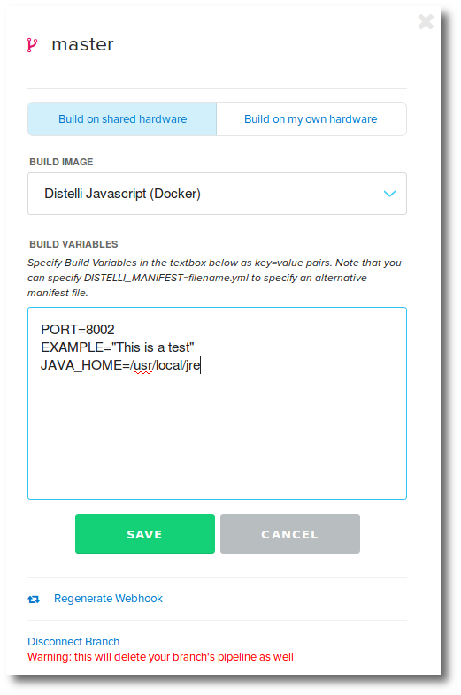
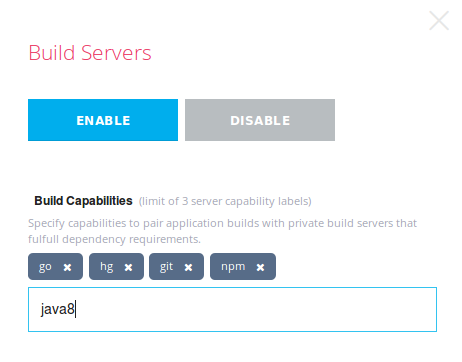
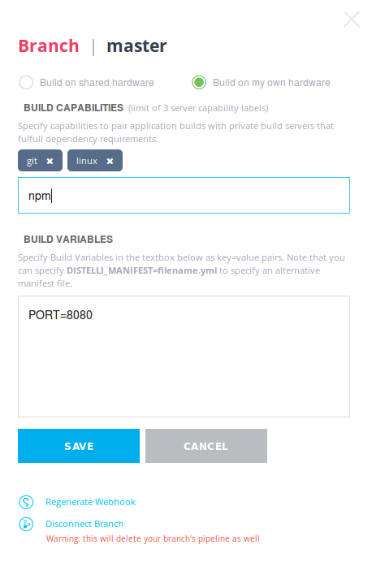
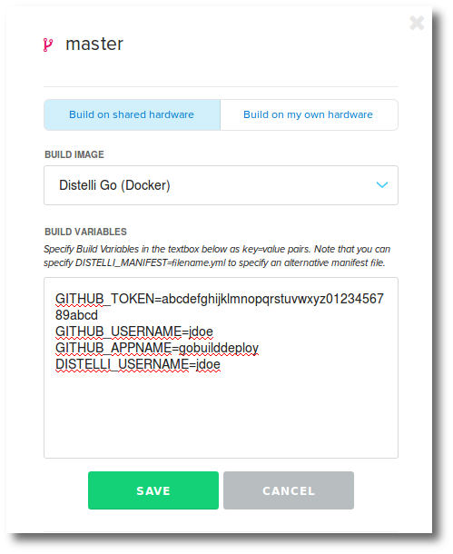

## Specifying build variables

Build environment variables can be specified in the app pipeline, or during new application creation. 

> **Note:** Your application must be integrated with a [repository](./application-manage.html) for build environment variables to be available.

For more information on build environment variables see [Environment Variables](./environment-variable.html).

### Build Variables in App Pipeline

To view, set, edit, or delete build environment variables:

<ol>
<li>Click the <b>Applications</b> link from the top of the Pipelines web UI.</li>
<li>Navigate to the application that you want to view the build environment variables.</li>
<li>Ensure you are on the <b>Overview</b> tab.</li>

If you see the <b>Connect Repository</b> button, you have not connected this application to a repository. See <a href="./application-manage.html">Connecting a Repository to an Application</a> for more information.

<li>On the right of the App Pipeline is a <b>Settings</b> gear.</li>

In the resulting dialog box you can view, set, edit, and/or delete build environment variables:

Build environment variables syntax:

<code>KEY=value</code>

<li>Click <b>Save</b> button when you are done.</li>
</ol>

Here you can view, set, edit, or delete the variables.

> **Note:** Keep in mind that build environment variables are specific to a branch.

### Build Variables in New Application Workflow

You can configure build environment variables when creating a new application during the new application workflow. For more information on creating an application with the new application workflow see [Creating an Application](./application-create.html).

During the new application workflow [step 6 - Finish Up](./application-create.html).

Click on the <b>Build Configuration</b> link and you will be presented with a build configuration window that has a build environment variables input textbox.
Here you can view, set, edit, or delete the variables.

Build environment variables syntax:

~~~
KEY=value
~~~

### Pipelines Specific Build Environment Variables

For more information on Pipelines specific build environment variables see [Environment Variables](./environment-variable.html)

## Building with distelli-manifest.yml

You can specify your build instructions in the distelli-manifest.yml file in the PreRelease section. For more information on the distelli-manifest.yml see [Pipelines Manifest](./manifest.html).

### Customizing the Build

A build is typically made up of the following steps:
<ol>
<li>Install: Install any dependencies required for the next 2 steps.</li>
<li>Build: Run the build script.</li>
<li>Test: Run tests.</li>
</ol>

Here is an example build instructions in a distelli-manifest.yml:

~~~
  PreBuild:
    - echo "---Begin PreRelease---"
    - echo "---Install dependencies---"
    - sudo apt-get -y update
    - sudo apt-get -y install nodejs
    - sudo apt-get -y install npm
  Build:
    - echo "---Build application---
    - npm install
    - echo "---Run tests---
    - npm test
  PkgInclude:
    - '*'
~~~

### Install

There are no default install steps. They are customizable. Enter the commands, specific to the operating system being built on, to install any dependencies.

For more information see [Installing Dependencies](./manifest-dependencies.html).

### Build

There are no default build steps. They are customizable. Enter the commands specific to the application being built, compiled, linked, etc.

### Test

There are no default test steps. They are customizable. Enter the commands to initialize the tests.

## Building with Travis .travis.yml

Pipelines supports building your software with build instructions specified in .travis.yml format. 

> **Warning:** You must still use a distelli-manifest.yml to instruct the Pipelines Agent to build from a .travis.yml.

### Build with .travis.yml

To use Pipelines to build with a .travis.yml, first ensure you have the .travis.yml in your repository.

Next, add the following to your distelli-manifest.yml:

~~~
username/AppName:
  BuildWith: Travis
~~~

For more info see [the Manifest BuildWith section](./manifest-build.html).

This will run the build steps indicated in the .travis.yml manifest and will run the build steps in the Pipelines manifest after.

## Building with Docker

You can build your application as a Docker repository, and upload it to your Docker Hub account. After your Docker repository is built, you can run your application as a Docker container.

For background information on Docker repositories and Docker containers, see the [Docker Documentation](https://docs.docker.com/).

### Prerequisites

You have a Docker Hub account. To create one, visit [Docker Hub](https://hub.docker.com).
You must include a Dockerfile with the instructions to build the docker image.

### To Build Your Application as a Docker Image

<ol>
<li>Log into your Pipelines account. A list of your applications is displayed.</li>
<li>Click the application that you want to build as a Docker image. The application's page opens.</li>
<li>Click the <b>Settings</b> tab. The settings for the applications are shown.</li>
<li>Expand the <b>Docker</b> section, and enable the <b>Build App with Docker</b> check box.</li>
<li>Click <b>Connect Docker Hub</b>. If this is the first application that you are building as a Docker image, you are prompted for your Docker Hub credentials and repository name. If you have already added your Docker Hub account, you are prompted for your repository name.</li>
<li>Type your Docker Hub credentials and your repository name, as applicable.</li>
<li>Click <b>Save Credentials</b> or <b>Connect Repo</b>, as applicable. Your Docker Hub repository is added to the application's settings.</li>
<li>To build your application, on the top-right, click <b>Build Latest</b>. Your application is built, and uploaded to your Docker Hub repository.</li>
</ol>

You have configured Pipelines with the appropriate values for building a docker image. You must still configure your the Docker build and deploy steps in your manifest.

### Building Docker Image with the Pipelines Manifest

You must add the following syntax to your Pipelines manifest build section. This can be accomplished in the distelli-manifest.yml or in the Pipelines web UI manifest. The docker commands must follow any build and test commands.

#### distelli-manifest.yml

~~~
  Build:
    #- Application build and test steps should occur first
    #- Enter build and test commands here
    #-
    - docker login -u "$DISTELLI_DOCKER_USERNAME" -p "$DISTELLI_DOCKER_PW" $DISTELLI_DOCKER_ENDPOINT
    - docker build --quiet=false -t "$DISTELLI_DOCKER_REPO" .
    - docker tag "$DISTELLI_DOCKER_REPO" "$DISTELLI_DOCKER_REPO:$Pipelines_BUILDNUM"
    - docker push "$Pipelines_DOCKER_REPO:$Pipelines_BUILDNUM"
~~~

#### Pipelines web UI manifest Build

~~~
# Application build and test steps should occur first
# Enter build and test commands here
#
docker login -u "$Pipelines_DOCKER_USERNAME" -p "$Pipelines_DOCKER_PW" $DISTELLI_DOCKER_ENDPOINT
docker build --quiet=false -t "$DISTELLI_DOCKER_REPO" .
docker tag "$DISTELLI_DOCKER_REPO" "$DISTELLI_DOCKER_REPO:$DISTELLI_BUILDNUM"
docker push "$DISTELLI_DOCKER_REPO:$DISTELLI_BUILDNUM"
~~~

> **Warning:** If you build on your own hardware, you must ensure you have the appropriate docker tools and services installed. Pipelines build servers are already docker enabled.

## Setting build capabilities 

Build Capabilities allows users to specify the specific build capabilities of a private build server. For information on building on your own private build server see [Using your own Build Server](./server.html).

In turn, on an application in Pipelines, you can specify what specific build capabilities an application requires. This will match the application to the correct build server based on capabilities.

### Setting Build Server Capabilities

You set build server capabilities on your private build servers. To set the capabilities:

<ol>
<li>Navigate to the server, in Pipelines.</li>
<li>Click the <b>Build Server</b> link near the top on the right.</li>

You will be presented with a new dialog from the right. Here you can enable/disable the server as a build server.

Here you set your server build capabilities.

<li>Enter the capability in the entry field and press Enter.</li>

</ol>

The build capabilities are automatically saved.

### Setting Application Build Server Capability Requirements

Setting the build server capability requirements on your application will match the application to the correct build server. To set this:

<ol>
<li>Navigate to the application you wish to set build server capability requirements.</li>
<li>Ensure you are on the <b>Overview</b> tab.</li>
<li>Click the <b>Build Options gear</b>.</li>

Note: If this application is not integrated with a repository, you will not have build options. See <a href="./application-manage.html">Connecting a Repository to an Application</a>.

You will be presented with a new dialog from the right. Here you can set your capabilities.

Note: Build capabilities are only applicable when building on your own private hardware.

<li>Enter the capability in the entry field and press Enter.</li>
<li>Click <b>Save</b> when you are done.</li>
</ol>

## SSH build keys

Some user builds require cloning one or more other repositories over ssh, editing the repository and pushing it. To accommodate read/write access to these repositories; Pipelines provides an SSH Key available during builds.

Add the Public Key to your reposities where access is needed during Pipelines builds.

### Find Your Pipelines SSH Key

<ol>
  <li>Click the <b>gear</b> at the top right of the Pipelines web UI.</li>
  <li>On the left menu, click <b>SSH Keys</b>.</li>

  
Here you can copy your <b>Public Key</b> and add it to your repository.

  <li>Add the <b>Public Key</b> to the appropriate repositires.</li>
</ol>

That is it. When you build with Pipelines now, you will have access to clone and push repositories that have the SSH key.

## Create a GitHub release on build success

GitHub provides the ability to create a release of a repository. This will typically be done when a build and tests are successful. You can automate the creation of this release on GitHub during the Pipelines build process.

For more information on GitHub releases see: [https://help.github.com/articles/creating-releases](https://help.github.com/articles/creating-releases/).

### How to Create GitHub Release

You can create a GitHub release from the command line using a tool like <code>curl</code>.

The GitHub API documentation for creating a release can be found here: [https://developer.github.com/v3/repos/releases/#create-a-release](https://developer.github.com/v3/repos/releases/#create-a-release).

An example GitHub API call, using curl, might look like this:

~~~
curl -s -k -X POST -H "Content-Type: application/json" "https://api.github.com/repos/jdoe/application_one/releases?access_token=abcdefghijklmnopqrstuvwxyz0123456789abcd" -d '{"tag_name": "1234", "target_commitish": "master", "name": "1234", "body": "Release of version 1234", "draft": false, "prerelease": false}'
~~~

### Creating a GitHub Release with Pipelines

There are 3 steps to setting Pipelines up to build and, on successful build, create a GitHub release.

1. Setup the appropriate commands in the Pipelines manifest [AfterBuildSuccess](./manifest-build.html) section.
1. Obtain a GitHub token.
1. Set up the Pipelines build environment variable.

### Pipelines Manifest

The following will create a GitHub release after a successful build. If the curl command fails the build will be considered failed.

~~~
  AfterBuildSuccess:
    - echo "Build Success"
    - echo "Creating github release"
    - API_JSON=$(printf '{"tag_name":"%s","target_commitish":"%s","name":"%s","body":"Release of version %s","draft":false,"prerelease":false}' $DISTELLI_BUILDNUM $DISTELLI_RELBRANCH $DISTELLI_BUILDNUM $DISTELLI_BUILDNUM)
    - curl -s -f -k -X POST -H "Content-Type: application/json" "https://api.github.com/repos/$GITHUB_USERNAME/$GITHUB_APPNAME/releases?access_token=$GITHUB_TOKEN" -d "$API_JSON"
~~~

The following variables are used in the above syntax:

* [DISTELLI_BUILDNUM](./environment-variable.html) - The successful build number, which is guaranteed to be unique.
* [DISTELLI_RELBRANCH](./environment-variable.html) - The branch that was built.
* GITHUB_TOKEN - a build environment variable that must be manually set.
* GITHUB_USERNAME - a build environment variable that must be manually set.
* GITHUB_APPNAME - a build environment variable that must be manually set.

The above manifest will do the following:

On build success, create a GitHub release.

### GitHub Token

For information on obtaining a GitHub token see: [https://help.github.com/articles/creating-an-access-token-for-command-line-use](https://help.github.com/articles/creating-an-access-token-for-command-line-use/).

### Set GitHub Build Environment Variables

1. In the Pipelines web UI, navigate to the application you are creating GitHub releases for.
1. Ensure you are on the **Overview** tab.
1. On the right in the App Pipeline, in the drop down, choose the **branch**.
1. On the right of the App Pipline click the **Settings** gear.
1. Set the environment variables as exemplified below.

    

1. Click **Save** after setting the variable.

### Next Steps

During the next successful build, a GitHub release will be created for the repository/branch.

## Installing Git for Windows builds

When using Pipelines to build on the Windows platform, Pipelines requires some tools that Git can supply. These include a "shell" (i.e. bash), SSH key management tools, and the Git library. This means certain options must be chosen when installing Git on Windows for compatibility with Pipelines builds.

Note, the below instructions are for Windows 2012 r2 and Git 2.14.0.

### Install Git on Windows

<ol>
  <li>Download the latest Git for Windows</li>
  <li><b>Run</b> the downloaded executable to start the install process</li>
  <li>Accept the Public License and Terms</li>
  <li>Select Destination Location = C:\Program Files\Git</li>
  <li>Select Components = At a minimum, the following:</li>
  <ul>
    <li>Git LFS (Large File Support)</li>
    <li>Associate .git* configuration files with the default text editor</li>
    <li>Associate .sh files to be run with Bash</li>
  </ul>
  <li>Select Start menu Folder = Git</li>
  <li>Adjusting your PATH environment = Use Git and optional Unix tools from the Windows Command Prompt</li>
  <li>Choosing HTTPS transport backend = Use the native Windows Secure Channel library</li>
  <li>Configuring the line ending conversions = Checkout Windows-style, commit Unix-style line endings</li>
  <li>Configuring the terminal emulator to use with Git Bash = Use Windows' default console window</li>
  <li>Configuring extra options = Select the following:</li>
  <ul>
    <li>Enable file system caching</li>
    <li>Enable symbolic links</li>
    <li><b>DO NOT</b> Enable Git Credential Manager</li>
  </ul>
  <li>Click Install</li>
</ol>

At this point, you will want to ensure the new PATH is implemented on the server. If you have already installed the Pipelines Agent, it will need to be restarted to pick up the PATH additions.

When you can run a command prompt and successfully run the <code>sh</code> command you should be ready to build git repositories with this Windows server.

## How Pipelines for Applications queues builds

Pipelines allows users to build on Pipelines shared build servers and on private build servers. This document discusses those scenarios in more technical depth and how the queuing of builds is processed.

### Building on Shared Pipelines Build Servers

> **Important:** The Pipelines build servers use [the IP addresses housed in this GitHub repostory](https://github.com/puppetlabs/pipelines-ips). 
>
> If your organization requires a whitelist of IP adresses, such as for a firewall, we strongly recommend watching this repository for changes. 
>
> If whitelisting IP addresses isn't an option, see our documentation on [setting up your own build servers](./server.html#use-your-own-build-server). 

When building on Pipelines shared build servers, builds are done in Docker containers.
Each container has differing software installed to accomodate the builds of different languages.

The following containers are available to build:
<ul>
<li>Pipelines Haskell (Docker)</li>
<li>Pipelines Javascript (Docker)</li>
<li>Pipelines Java/JVM (Docker)</li>
<li>Pipelines Python (Docker)</li>
<li>Pipelines Perl (Docker)</li>
<li>Pipelines Ruby (Docker)</li>
<li>Pipelines Go (Docker)</li>
<li>Pipelines Base (Docker)</li>
<li>Pipelines PHP (Docker)</li>
<li>Pipelines Android (Docker)</li>
<li>Pipelines Legacy (Docker)</li>
</ul>

Documentation on the containers can be found here: [Pipelines Build Environments](./build-environment.html).

When building on Pipelines shared build servers, the Docker image selected is initiated as a running container. The build then takes place inside of this running container. This provides a pristine environment for each build. When the build is done, the container is destroyed.

### Build Queuing

Builds are queued by Application/Branch.

For example, if I have an application in Pipelines, tied to my repository and am actively building from commits to the <b>Master</b> branch; 3 consequtive commits to the <b>Master</b> branch will cause 3 build tasks to be scheduled. These will be processed on a first-come first-serve basis and will not run in parallel because they are for the same branch.

If instead I am actively building from commits to multiple branches (i.e. branch; Dev1, Feature1, Feature2) and three commits occur, one to each branch, at the same time; Pipelines will build all three branches at the same time (in parallel).

### Building on Private Build Servers

When building on private servers with Pipelines, builds are executed, by the agent, on your hardware. A build instructs the Pipelines agent to clone the repository/branch and run the build (PreBuild, Build, AfterBuildSuccess, etc...) steps as indicated in the distelli-manifest.yml. This is typically not done in a Docker container.

For more information on the Pipelines manifest build steps, see [Pipelines Manifest](./manifest.html).

Each build is executed in its own unique Directory. When the build completes, the directory is removed.

The queuing of the builds on private build servers is the same schema as queuing on the shared build servers. On private build servers the builds are typically not running in docker containers which means parallel builds can affect each other.

See also our documentation for [setting up private build servers](./server.html).

