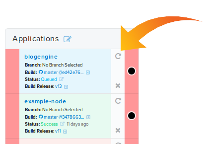
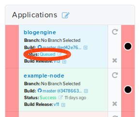
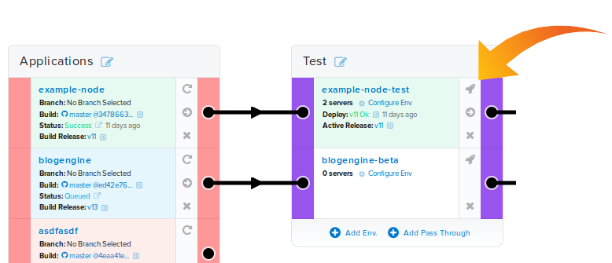
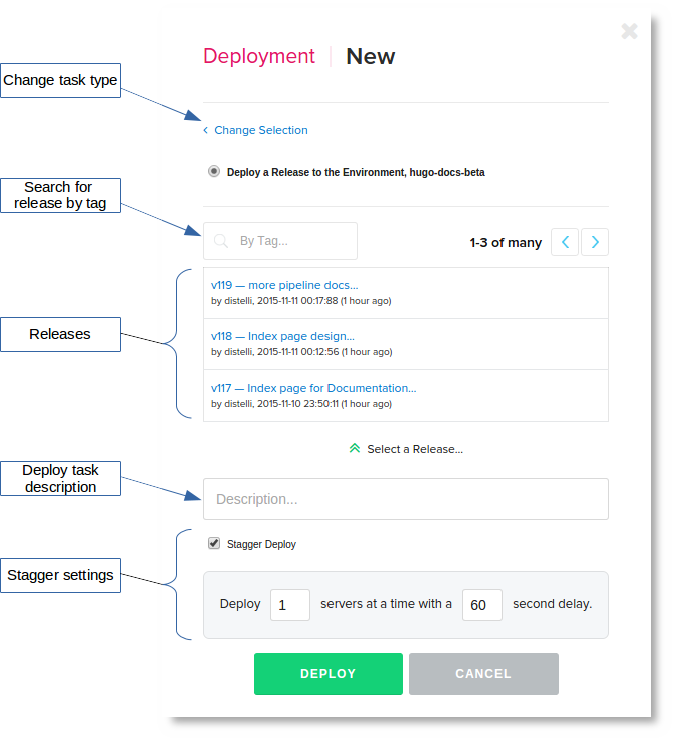
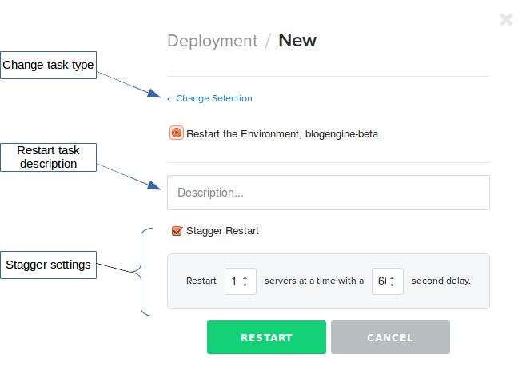
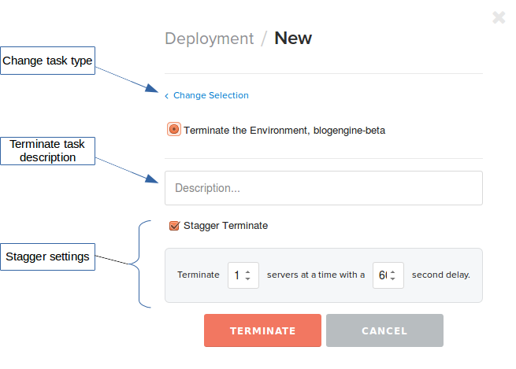
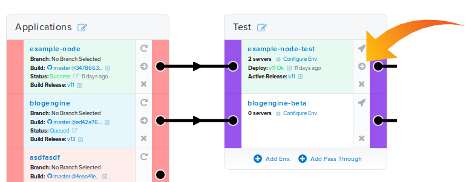

## Start a build from a dashboard

You can start a build of an application from the dashboard.

> **Note:** You can build only applications that are attached to a repository.

<ol>
<li>Find the application you wish to build and click the <b>rebuild</b> circular arrow.</li>

A confirmation dialog will appear.

<li>Click the <b>Yes</b> button to confirm building the application.</li>
</ol>

You have begun a new build of the application. Click the <b>Status</b> link in the card to navigate to the build.

## Deploy a release from a dashboard

You can deploy a release in the dashboard. This provides the ability to rollback to a previous release.

> **Note:** You must have an application release to deploy. Doing a [successful build](./build.html) or a [`distelli push`](./cli-command.html) will create a release.

<ol>
<li>Navigate to the dashboard you wish to deploy to.</li>
<li>Find the <b>environment</b> you wish to deploy to.</li>
<li>In the environment card click the <b>rocket icon</b>.</li>

A dialog will appear with the following options:

<ul>
<li>Deploy a release to the environment</li>
<li>Restart the environment</li>
<li>Terminate the environment</li>
<li>Promote the current deployed release to another environment</li>
</ul>

<li>Click the <b>Deploy a Release...</b> option.</li>

<li>Set any options you may want to set.</li>
<li>Click the <b>Deploy</b> button.</li>
</ol>

## Restart an environment from a dashboard

> **Note:** You must have an application release deployed to the environment before you can <b>restart</b> the application in that environment.

<ol>
<li>Navigate to the pipeline you wish to restart to.</li>
<li>Find the <b>environment</b> you wish to restart.</li>
<li>In the environment card click the <b>rocket icon</b>.</li>

A dialog will appear with the following options:

<ul>
<li>Deploy a release to the environment</li>
<li>Restart the environment</li>
<li>Terminate the environment</li>
<li>Promote the current deployed release to another environment</li>
</ul>

<li>Click the <b>Restart the Environment...</b> option.</li>

<li>Set any options you may want to set.</li>
<li>Click the <b>Restart</b> button.</li>
</ol>

## Terminate an environment from a dashboard

> **Note:** You must have an application release deployed to the environment before you can <b>terminate</b> the application in that environment.

<ol>
<li>Navigate to the pipeline you wish to terminate.</li>
<li>Find the <b>environment</b> you wish to terminate.</li>
<li>In the environment card click the <b>rocket icon</b>.</li>

A dialog will appear with the following options:

<ul>
<li>Deploy a release to the environment</li>
<li>Restart the environment</li>
<li>Terminate the environment</li>
<li>Promote the current deployed release to another environment</li>
</ul>

<li>Click the <b>Terminate the environment...</b> option.</li>

<li>Set any options you may want to set.</li>
<li>Click the <b>Terminate</b> button.</li>
</ol>

## Promote a release from a dashboard

You can promote a known deployed release from one environment card to the subsequent environment in the dashboard dashboard.

> **Note:** You must have an application release successfully deployed to promote.

<ol>
<li>Navigate to the dashboard you wish to promote.</li>
<li>Find the <b>environment</b> you wish to promote from.</li>
<li>In the environment card click the <b>forward arrow promote icon</b>.</li>

A dialog will appear with the following options:

<ul>
<li>Deploy a release to the environment</li>
<li>Restart the application in the environment</li>
<li>Terminate the application in the environment</li>
<li>Promote the current deployed release to another environment</li>
</ul>

<li>Click the <b>Deploy a Release...</b> option.</li>
</ul>

You have begun a new build of the application. Click the <b>Status</b> link in the card to navigate to the build.

