
## Introduction
Pipelines offers continous delivery to servers- automate build, test and deployment every time you push to GitHub or BitBucket. Our platform empowers developers and their team to spend less time building and maintaining, instead, focus on writing code that powers their business.

This tutorial will walk you through the steps of setting up auto build, and automatic deployments of your app to an EC2 instance with Pipelines.

## Prerequisites
 The tutorial assumes you have already:
 <ul>
<li>Have a running AWS EC2 instance, and installed Pipelines agent.
   (If you don't, take a look our this <a href="./integrate-amazon.html</a> to get  an EC2 instance set up for NodeJS.)</li>
<li>Have NodeJS and NPM installed</li>
<li><a href="https://pipelines.puppet.com/signup" target="_blank">Created a Pipelines account</a></li>
<li>Have a login to, at least, one of the two public repositories.</li>
<ul>
<li><a href="http://github.com" target="_blank">http://github.com</a> (We will be using GitHub for this tutorial)</li>
<li><a href="http://bitbucket.com" target="_blank">http://bitbucket.com</a></li>
</ul>
</ul>
## Step 1. Fork and Clone the Repository
<i>You can skip this step if you have your own NodeJS App ready to be deployed. If you don't have a Node.js app, you can fork our Node.js app from our GitHub Repo.</i>

Ensure you are logged into your GitHub account and visit the Pipelines public repository <a href="https://github.com/distelli/nodejsbuilddeploy" target="_blank">here</a>.

Click the **Fork** button. <i>Forking</i> copies this reposity to your collection of repositories without having to start a new repository.

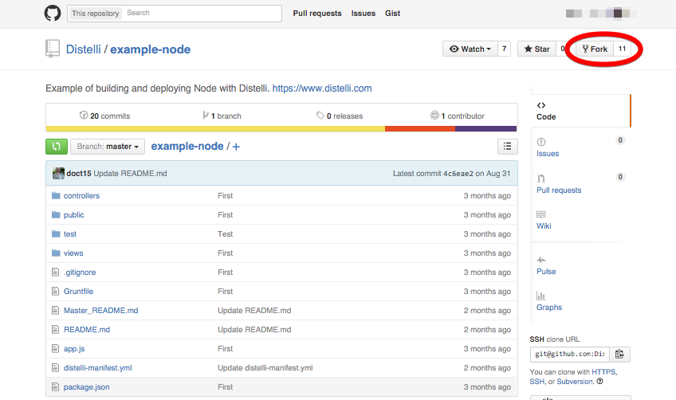

To clone the repository, enter the following command in your terminal:

~~~
git clone https://github.com/YOUR_GITHUB_USERNAME/nodejsbuilddeploy.git
~~~

Now, navigate to the newly created directory.

~~~
cd nodejsbuilddeplot
~~~

## Step 1. Create the Application with Pipelines

<a href="https://pipelines.puppet.com/login" target="_blank"> Log into your Pipelines account.</a>

Click the **Get Started** button. Follow the instructed steps to create your app with Pipelines. When you're done, return here!

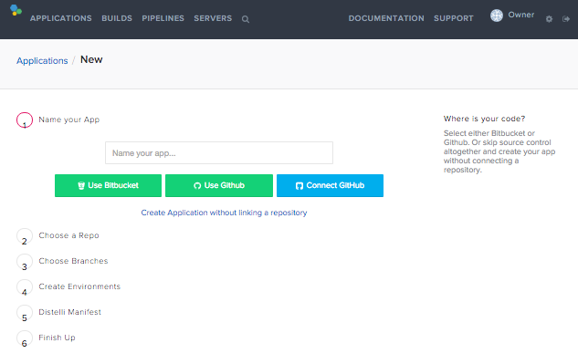

Note: During Step 4 of the App Creation Process you will be asked to add Build Steps. In our GitHub Repo we have included a `distelli_manifest.yml` instead. You can check the box at the bottom of the step to skip this part of the process. The `distelli_manifest.yml` contains the instructions for Pipelines agent on your server. You can find more information about `distelli_manifest.yml` [here](./manifest.html).

## Step 2. Enable Auto Build & Deploy

On the Pipelines web UI click **Applications** at the top.

In the application list at the bottom, click on your newly added application.

Click the **Settings** link.
    You are now in the application settings page.

Click on **Repository**, then click on the gear-icon next to a branch you would like to have activate **Auto Build**, and **Auto Deploy**.

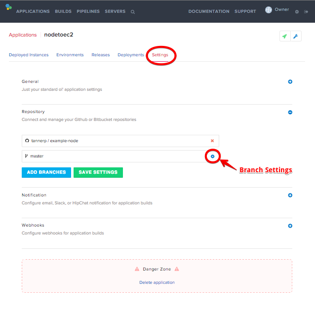

Next to **Repository**, click the plus button. Then click on the gear-icon next to a branch you would like to have activate **Auto Build**, and **Auto Deploy**.

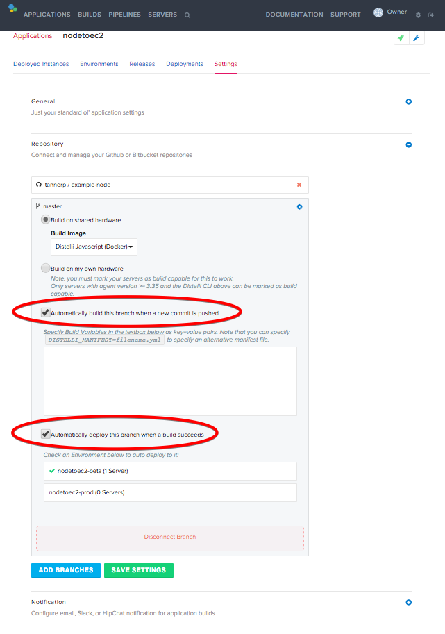

Click **Save Settings**.
## Step 3. Add Your EC2 Server
Assuming you have a running EC2 instance. Let's hook up Pipelines with the instance. If you do not have an EC2 instance, please [set one up](./integrate-amazon.html).

On the top menu bar, click **Servers**. Then click **New Server**

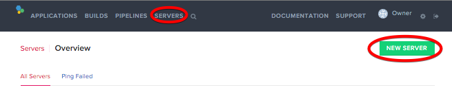

Follow the instructed steps. Return here when you are done!

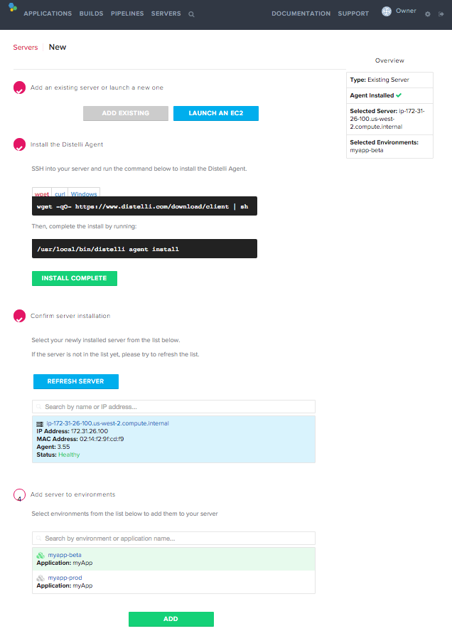

## Step 4. Deploy To An EC2 Instance
Now that you have Pipelines linked to your repository, and to your EC2 instance. We are all set to deploy your application.

In your application settings, click the **Rocket Icon** to start new deploment.

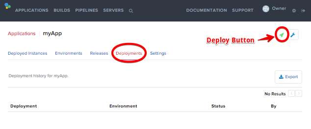

Follow the instructed steps to deploy your app. Here is an example of a deployment:

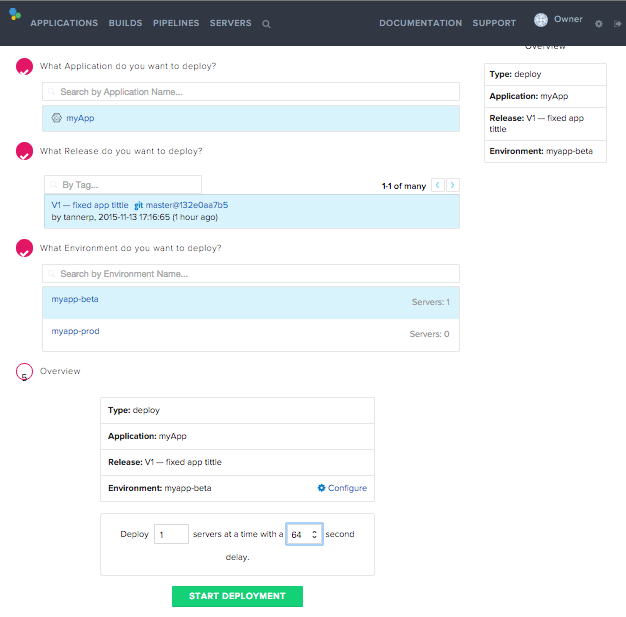

Pipelines prints your **logs** and your **stdout** on the deployment dashdoard.

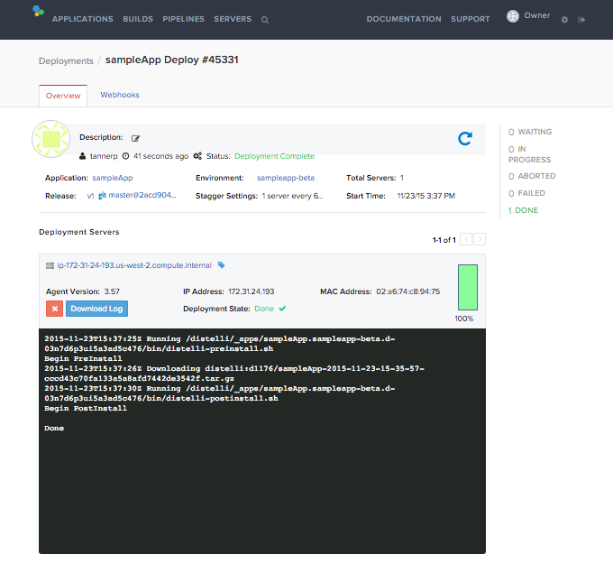

Note: you will need to start your **iptables** and reroute the external requests to your running Nodejs port. Use the following commands:

~~~
sudo service ufw start
iptables -t nat -A PREROUTING -p tcp --dport 80 -j REDIRECT --to 8080
~~~

Make sure your app have all the required packages, then run your app using the following commands:

~~~
sudo npm install
nodejs app.js
~~~

To view your app, navigate to your EC2 instance and locate the public DNS.

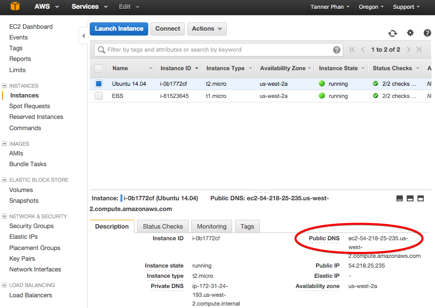

Finally, enter the DNS to your favorite web browser. Here is how the sample app looks like:

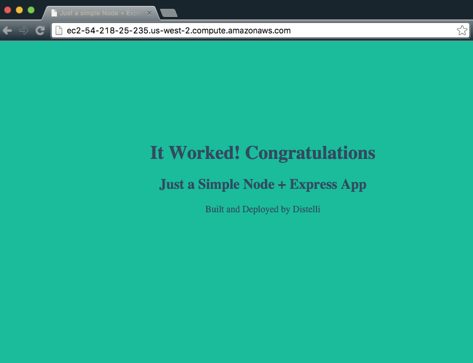
Note: Each time you commit new code change in the future, Pipelines would automatically build and deploy your app to your server after the build succeeds.

