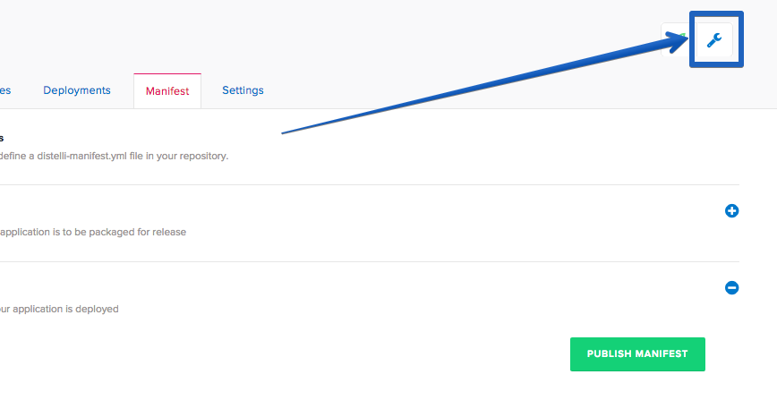

 

### Prerequisites

For this tutorial you will need a Node.js application that runs on your local machine. I am using a simple "Hello World" Node.js application for this tutorial. You will also want to review the tutorial on <a href="./application-nodejs-digitalocean.html">How to Deploy Node.js Applications to Digital Ocean</a>.

Before you begin the tutorial you must:

* Install the Pipelines CLI on the development system. [Installing the CLI](./cli.html)
* Ensure git is installed on the development system. [Download Git](http://git-scm.com/downloads)
* Have a destination server available to deploy software to. 
* Install the Pipelines agent on the destination server. [Installing the agent](./agent.html)

### Set-Up

Before we begin, you will want to make sure your Node application is connected to a GitHub/BitBucket repository. Once you have everything set up in your repo, we can set up your application in Pipelines. Again you will need to have a Node application already created and ready to be deployed.

## Step 1. Create NGINX config file

When using NGINX we need to create a config file so NGINX knows what to do. In your projects directory create a new file called `node`. Below are what the contents of the file should be

~~~
server {
    listen 80;
    server_name example.com;
    location / {
        proxy_set_header   X-Forwarded-For $remote_addr;
        proxy_set_header   Host $http_host;
        proxy_pass         http://127.0.0.1:3000;
    }
}
~~~

What is happening here is that we are telling NGINX to act as a reverse proxy. NGINX is connecting to your application on the client's behalf, sending the client's request with their IP, retrieve the response, and then finally echo it back to the originating client.

### Push Files to Repository

Once you have finished creating your NGINX config file, make sure to push your changes into your repository.

## Step 2. Create a Pipelines Application

The next step for us to complete is to create an application in Pipelines. To do so please follow these steps:

Click the new application button on your Pipelines account home screen.

Name your app and then select the Repository you would like to connect to. As a reminder, we have been using GitHub as our repository.

After we click the button to connect to our Repository, we then select the appropriate repo that contains our code. In this example I store my code in the repo named 'node-tutorial'. Make sure to select the repo we set up earlier in the tutorial.

Then select the appropriate branch for your deployment. I have only a master branch, but you can deploy any branch from your repo!

Next Pipelines will ask you set your build steps. Leave the <b>Build</b> section blank and the <b>PkgInclude</b> as is. We will set our deployment steps later in the tutorial.

The final step is select our Build Image. In this case we are going to select **Distelli Javascript (Docker)** for our Node.js App. Select the **Auto Build** checkbox and **Looks good. Start Build!**

Now our build should be automatically building. You can watch its progress in the builds tab on your Pipelines account.

## Step 4. Edit Deploy Steps

**Note:** This tutorial assumes that the server is out of the box and needs to have your application dependencies installed & configured. Once your application dependencies are installed & configured you can remove those commands from your <b>Manifest</b>.

Once your build has completed navigate back to your application page and open your application.

Select the Manifest tab

Expand the "Deployment Manifest" section by clicking on the plus sign. This is where we are going to tell Pipelines what commands to run during our Deployment.

### PreInstall

Scroll down to your PreInstall section and enter in the following

Copy/Paste
~~~
echo "Starting PreInstall"
sudo apt-get update
sudo apt-get install nodejs -y
sudo apt-get install npm -y
sudo apt-get install nginx -y
sudo rm -rf /etc/nginx/sites-enabled/default
~~~

You can comment out this section of your Manifest after your intial deployment.

### PostInstall

Scroll down to your PostInstall section and enter in the following

Copy/Paste
~~~
echo "Starting PostInstall"
npm install
~~~

### Exec

Scroll down to your Exec section and enter in the following

Copy/Paste
~~~
sudo rm -rf /etc/nginx/sites-available/node
sudo mv node /etc/nginx/sites-available/node
sudo ln -sf /etc/nginx/sites-available/node /etc/nginx/sites-enabled/node
sudo service nginx restart -y
/usr/bin/nodejs app.js
~~~

### Re-Build Application

Because we have changed our deployment steps we need to rebuild our application. First save your changes by clicking the "Publish Manifest" button and then rebuild your application. To trigger a new build just click the wrench icon in the right hand corner! That button triggers a build of your latest code, build steps, and deployment steps.

## Step 5. Deploy your Application

Now that we have successfully built our application we are ready to deploy to our server. On the builds page select the "New Deployment" button in the right hand corner.

Once you click the button, you should be directed towards the Pipelines deployment page. The first step is to select the "Deploy a Release" option.

Pipelines will now prompt you to select the application you want to deploy. Please select the application we created earlier in the tutorial.

Then you will be asked to select the release you would like to deploy. For now there should be only one release for deployment.

The last step in our deployment is to select the environment you wish to deploy in. For this tutorial, I will be deploying to our production environment, but for your purposes you can select whichever environment you please.

Once you've set up your deployment settings, Pipelines will ask you to add servers. Click the "Add Servers" button to get started. Select the server you configured earlier in the tutorial and add it to your account. Once you have added your server, you can close the "Add Servers" panel and continue with your deployment. You will see a final option to set your delay between deployments on your servers and a "Start Deployment" button.

Click the "Start Deployment" button to begin your deployment. You will redirected to a page where you can view the progress of your deployment. Click the "log" button on the left side to view realtime streaming logs for the deployment. Once your deployment is complete, your screen should be similar to the screenshot below:

And that's it! You should now be able to point your browser to "You Server's IP Address" and see the "Hello World" text displayed!

Thank you for following along, and I hope that you have learned how Pipelines can simplify the process behind deploying your Node.js applications with NGINX to your servers.

