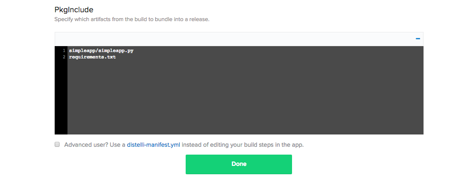
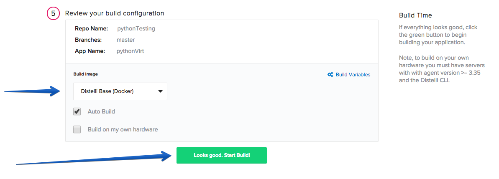
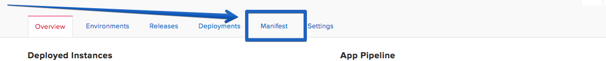
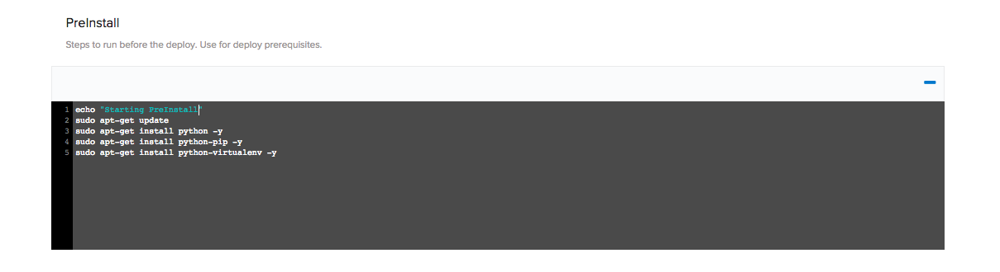
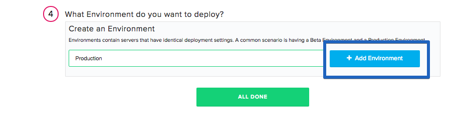

In this tutorial, we will go over how to deploy a Python application with a virtual environment. The sample application We will use a Python Flask application that displays "Hello World" on a web page.

### Before You Begin

Before you begin the tutorial you must:

* Install the Pipelines CLI on the development system. [Installing the CLI](./cli.html)
* Ensure git is installed on the development system. [Download Git](http://git-scm.com/downloads)
* Have a destination server available to deploy software to. 
* Install the Pipelines agent on the destination server. [Installing the agent](./agent.html)

This tutorial assumes you have a basic knowledge of Python applications and have Python installed on your local machine. You will also need a GitHub/BitBucket account. If you do not have a GitHub or BitBucket account, create one now:

* <a href="https://github.com/join" target="_blank">GitHub</a>
* <a href="https://bitbucket.org/account/signup/" target="_blank">BitBucket</a>

You will also need a server to deploy to. I will be using a DigitalOcean Cloud Server running Ubuntu 14.4.

## Step 1. Create The Python Application

The first task is to create a Python application if you do not already have one. This tutorial will use a simple Flask application that displays "Hello World" on a web page. Below is the code for the sample application I will be using:

**Note:** simpleapp.py

~~~
from flask import Flask
import sys
import optparse
import time

app = Flask(__name__)

start = int(round(time.time()))

@app.route("/")
def hello_world():

    return "Hello World from Distelli!"

if __name__ == '__main__':
    parser = optparse.OptionParser(usage="python simpleapp.py -p <port>")
    parser.add_option('-p', '--port', action='store', dest='port', help='The port to listen on.')
    (args, _) = parser.parse_args()
    if args.port == None:
        print "Missing required argument: -p/--port"
        sys.exit(1)
    app.run(host='0.0.0.0', port=int(args.port), debug=False)
~~~

If you are going to use the same sample application, you will also need a `requirements.txt` file to install the applications dependencies during builds and deployments.

**Note:**
requirements.txt

~~~
Flask>=0.9
~~~

Once you have created these files you can test your application locally to ensure everything is working. To run this application, you have to specify a port when you enter your run command. I will be using port 8000:

~~~
$ python simpleapp.py -p 8000
~~~

## Step 2. Push Code to Repository

Once you have your Python application successfully running on your local machine, the next step is to push your code into a GitHub or BitBucket Repository. If you have not created a repository, do so now. Once your repo has been created, push your code.

## Step 3. Create Pipelines Application

If you do not have a Pipelines account, [sign up](https://pipelines.puppet.com/signup) for one now. To create your app in Pipelines, follow these steps:

On your Pipelines account home screen click the <b>New App</b> button

Name your app and then select the Repository type where you are storing your applications files.

After we click the button to connect to our Repository, we then select the appropriate repo that contains your code.

Select the appropriate branch for your deployment. I have only a master branch, but you can deploy any branch from your repo!

Next, set your build steps. This is where we would include any tests we want to run when building our application or any other tasks you'd like to run during builds (For this particular application we will use the PkgInclude section). Below are the two lines to enter in your PkgInclude Section

Copy/Paste
~~~
simpleapp/simpleapp.py
requirements.txt
~~~

The final step is to select our <b>Build Image</b>. In this case, we select <b>Distelli Python (Docker)</b> for our Python Application. Select the <b>Auto Build</b> checkbox and click <b>Looks good. Start Build!</b>.

**Note:** The Auto-Build feature builds your application everytime you commit code to your repository

Now our application should start building. You can watch its progress by navigating to the builds tab on your Pipelines account and clicking on your build.

## Step 4. Deploy Steps

**Note:**
This tutorial assumes that the server is out of the box and needs to have your application dependencies installed & configured. Once your application dependencies are installed & configured you can remove those commands from your <b>Manifest</b>.

Once your build has completed navigate back to your application page and open your application.

Click the <b>Manifest</b> tab.

Expand the "Deployment Manifest" section by clicking on the plus sign. This is where we are going to tell Pipelines what commands to run during our Deployment.

### PreInstall

Scroll down to your PreInstall section and enter in the following:

~~~
echo "Starting PreInstall"
sudo apt-get update
sudo apt-get install python -y
sudo apt-get install python-pip -y
sudo apt-get install python-virtualenv -y
~~~

### PostInstall

Scroll down to your PostInstall section and enter in the following

~~~
echo "Starting PostInstall"
virtualenv pythonEnv
source pythonEnv/bin/activate
pip install -r requirements.txt
~~~

### Exec

Scroll down to your Exec section and enter in the following

~~~
echo "Executing"
exec python simpleapp/simpleapp.py -p 8000
~~~

### Re-Build Application

Because we have changed our deployment steps, we need to rebuild our application. To trigger a new build, click the wrench icon in the right hand corner. This triggers a build of your latest code, build steps, and deployment steps.

## Step 5. Deploy Application

### Install Pipelines Agent on Your Server

To be able to deploy your application to your server you will need to install the Pipelines Agent. You will need remote access to your server to complete the installation. Please consult the below information on how to install the Pipelines Agent on your server.

> **Note:** This installation requires root (administrator) permissions.

<h3>Linux and macOS X</h3>

To install on Linux or macOS X you can use either curl <b>or</b> wget with one of the following syntaxes.
<h4>wget example</h4>

~~~
wget -qO- https://pipelines.puppet.com/download/client | sh
~~~

<h4>curl example</h4>

~~~
curl -sSL https://pipelines.puppet.com/download/client | sh
~~~

<h3>Windows</h3>

To install on Windows copy and paste the following powershell command into a command (cmd) window.

~~~
powershell -NoProfile -ExecutionPolicy Bypass -Command "iex ((new-object net.webclient).DownloadString('https://pipelines.puppet.com/download/client.ps1'))" & SET PATH=%PATH%;%ProgramFiles%/Distelli
~~~

<h3>Complete the Install</h3>

To complete the install of the agent, you must issue the `/usr/local/bin/distelli agent install` command.

~~~
/usr/local/bin/distelli agent install
~~~

~~~
ServerA:~$ <b>wget -qO- https://pipelines.puppet.com/download/client | sh</b>
This script requires superuser privileges to install packages
Please enter your password at the sudo prompt

[sudo] password for bmcgehee:
    Installing Distelli CLI 3.51 for architecture 'Linux-x86_64'...
    Downloading https://s3.amazonaws.com/download.distelli.com/distelli.Linux-x86_64/distelli.Linux-x86_64-3.51.gz
To install the agent, run:
    sudo /usr/local/bin/distelli agent install
ServerA:~$ <b>sudo /usr/local/bin/distelli agent install</b>
Distelli Email: jdoe@distelli.com
      Password:
    1: User: jdoe
    2: Team: janedoe/TeamJane
Team [2]: <b>1</b>
Server Info: https://www.distelli.com/jdoe/servers/12345678-4765-ac42-bd7a-080027c8277c
Starting upstart daemon with name:  dtk-supervise-cc123456787ad94a8d34ac610381242f9ae28bb8
~~~

<h3>Verify the Install</h3>

To validate the agent is installed and working use the `/usr/local/bin/distelli agent status` command.

> **Note:** This installation requires root (administrator) permissions.

~~~
/usr/local/bin/distelli agent status
Distelli Agent (serverA) is Running with id 766b88c8-e925-11e4-ae8b-080027cc07f7
~~~

If you would like more information on installing the Pipelines agent, visit [Installing the Pipelines Agent](./agent.html). 

### Deploy your Python Application

Now that we have successfully built our application and installed the agent, we are ready to deploy to our server. On the builds page select the "New Deployment" button in the right hand corner.

Once you click the button, you should be directed towards the Pipelines deployment page. The first step is to select the "Deploy a Release" option.

Select the application you want to deploy. Please select the application we created earlier in the tutorial. Our application is named "pythonVirt".

Then select the release you want to deploy. For now, there should be only one release for deployment.

The last step in our deployment is to select the environment you want to deploy in. First create an environment by entering a name and clicking <b>Add Environment</b>.

Next, select the Environment you just created and click <b>All Done</b>.

Now Pipelines will ask you to add your server. Click <b>Add Servers</b> button to get started. Select the server you configured earlier in the tutorial and add it to your account. Once you have added your server, you can close the "Add Servers" panel and continue with your deployment. You will see a final option to set your delay between deployments on your servers and a <b>Deploy!</b> button.

Click the "Deploy!" button to begin your deployment. You will redirected to a page where you can view the progress of your deployment. Clicking the "log" button on the left side enables you to view streaming logs for the deployment.

### View Your Application

And that's it! You should now be able to point your browser to "http://<-You Server's IP Address->:8000" and see your Python Application!

## Step 6. Enable Auto deploy

If you want your application to be automatically deployed after each sucessful Build, you can do so by enabling the Auto-Deploy feature in your Application's settings. Start by navigating to your application's page in Pipelines, and clicking the settings tab.

In the Repository section of your Settings page click the Plus icon

On the Repository Branch you are using to Build/Deploy your application click the Gear icon

Check the boxes to enable Auto-Build and Auto-Deploy:

### Testing Auto-Deploy

Once you have set up Automatic Deployment after a successful build of your application, please make a change to your Python application. For example, we will change what our app outputs onto the page. Once you have made your changes, push your code into your repository and watch Pipelines automatically start building your application and then deploying your application. Once the deployment has completed you can see the updated application by visiting "http://<-You Server's IP Address->:8000"

And that's it! You have now set up a Python Application with Coninuous Integraion and Continuous Deployment! Thanks for following along and happy coding!

