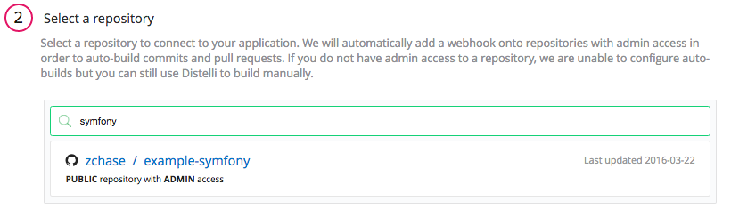
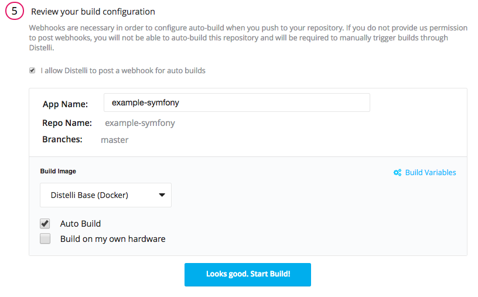
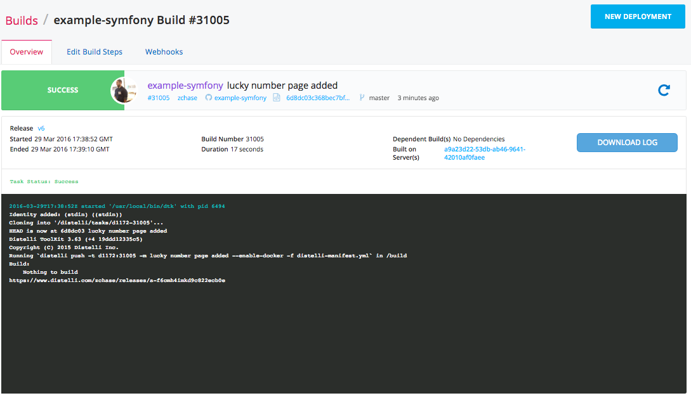
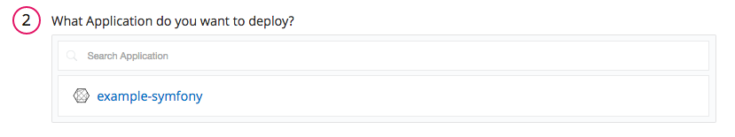
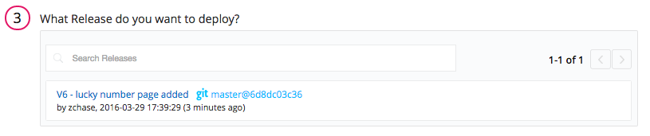
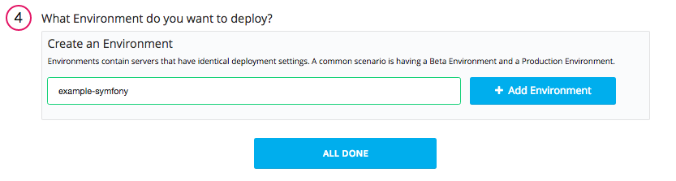
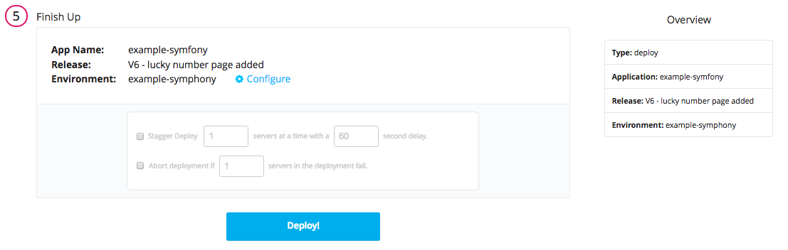
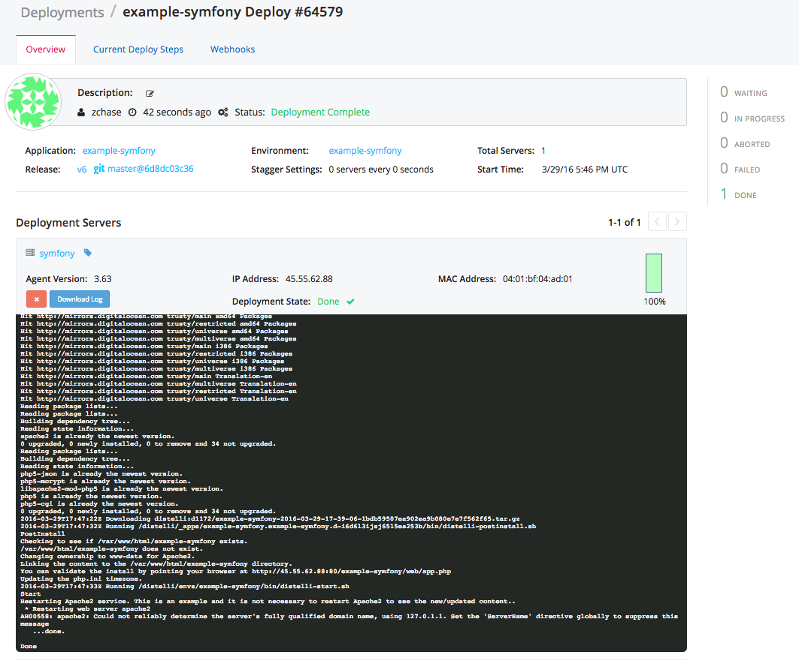
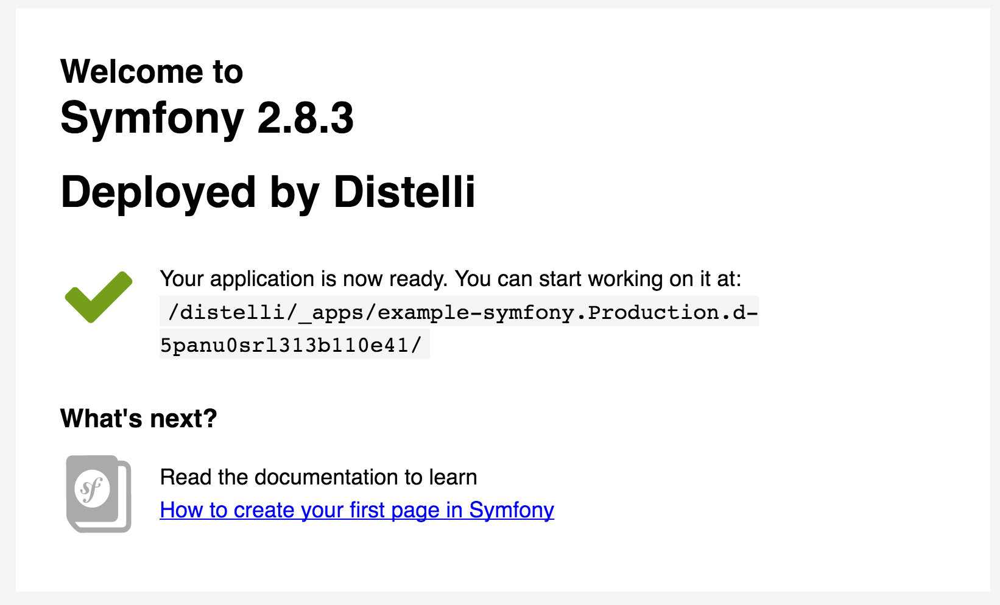

In this tutorial we will go through how to automate the build and deployments of your Symfony2 Application.

## Setting Up

To successfully complete this tutorial you will need:

* <a href="http://symfony.com/doc/current/book/installation.html" target="_blank">Symfony Installed on your Local Machine</a>
* A server to deploy to (I am using a DigitalOcean Ubuntu 14.04 server)
* Access to your server, remote or otherwise
* A basic knowledge of Bash commands

Before you begin the tutorial you must:

* Install the Pipelines CLI on the development system. [Installing the CLI](./cli.html)
* Ensure git is installed on the development system. [Download Git](http://git-scm.com/downloads)
* Have a destination server available to deploy software to. 
* Install the Pipelines agent on the destination server. [Installing the agent](./agent.html)

## Step 1. Configure Server

The first task we must complete is installing the Pipelines Agent on our server. If you do not already have a Pipelines account, <a href="https://pipelines.puppet.com/signup" target="_blank">Sign Up</a> for one now.

> **Note:** This installation requires root (administrator) permissions.

### Install Pipelines Agent on Your Server

To be able to deploy your application to your server you will need to install the Pipelines Agent. You will need remote access to your server to complete the installation. Please consult the below information on how to install the Pipelines Agent on your server.

#### Linux and macOS X

To install on Linux or macOS X you can use either curl <b>or</b> wget with one of the following syntaxes.
##### wget example

~~~
wget -qO- https://pipelines.puppet.com/download/client | sh
~~~

##### curl example

~~~
curl -sSL https://pipelines.puppet.com/download/client | sh
~~~

#### Windows

To install on Windows copy and paste the following powershell command into a command (cmd) window.

~~~
powershell -NoProfile -ExecutionPolicy Bypass -Command "iex ((new-object net.webclient).DownloadString('https://pipelines.puppet.com/download/client.ps1'))" & SET PATH=%PATH%;%ProgramFiles%/Distelli
~~~

#### Complete the Install

To complete the install of the agent, you must issue the `/usr/local/bin/distelli agent install` command.

~~~
/usr/local/bin/distelli agent install
~~~

~~~
ServerA:~$ <b>wget -qO- https://pipelines.puppet.com/download/client | sh</b>
This script requires superuser privileges to install packages
Please enter your password at the sudo prompt

[sudo] password for bmcgehee:
    Installing Distelli CLI 3.51 for architecture 'Linux-x86_64'...
    Downloading https://s3.amazonaws.com/download.distelli.com/distelli.Linux-x86_64/distelli.Linux-x86_64-3.51.gz
To install the agent, run:
    sudo /usr/local/bin/distelli agent install
ServerA:~$ <b>sudo /usr/local/bin/distelli agent install</b>
Distelli Email: jdoe@distelli.com
      Password:
    1: User: jdoe
    2: Team: janedoe/TeamJane
Team [2]: <b>1</b>
Server Info: https://www.distelli.com/jdoe/servers/12345678-4765-ac42-bd7a-080027c8277c
Starting upstart daemon with name:
~~~

#### Verify the Install

To validate the agent is installed and working use the `/usr/local/bin/distelli agent status` command.

> **Note:** This installation requires root (administrator) permissions.

~~~
/usr/local/bin/distelli agent status
Distelli Agent (serverA) is Running with id
~~~

If you would like more information on installing the Pipelines agent, visit [Installing the Pipelines Agent](./agent.html). 

## Step 2. Create Symfony Project (or use an existing project)

If you have an existing Symfony project, you can skip down to the <b>Create Pipelines Manifest</b> section. Otherwise the steps below will outline how to create a basic Symfony2 Project.

**Note:** Symfony must be installed on your local machine to create a new project

To create a new Symfony project, navigate to the directory where you would like to store your files and enter the following command:

~~~
$ symfony new myproject
~~~

Once your project has been created, `cd` into your new directory. This is where you will find all the files for your symfony project. For this tutorial we will not edit these files, instead we will focus on deploying this sample application to our server. If you would like to edit the file we will be displaying, the file is located at `/app/Resources/view/default/index.html.twig`

### Create `distelli-manifest.yml`

The Pipelines Manifest tells Pipelines what commands to run during build and deployment steps. Below is the manifest we are going to be using for this application. Keep in mind that `<-app name ->` must be the same name as the repository where you are going to store your files. Create `distelli-manifest.yml` and enter in the contents below:

> **Note:** Replace <-username-> with your Pipelines username & <-app name-> with your Pipelines Application's Name.

~~~
<-username->/<-app name->:
  Env:
    - WEBDIR: "/var/www/html"
    - WEBOWNER: "www-data"
    - APPDIR: "example-symfony"
    - APPCONTENT: "web/app.php"
    - PORT: "80"
  Build:
    - echo "Nothing to build"
  PkgInclude:
    - '*'
  PreInstall:
    - echo "PreInstall"
    - sudo apt-get -y update
    - sudo apt-get -y install apache2
    - sudo apt-get -y install php5 libapache2-mod-php5 php5-mcrypt php5-cgi php5-json
  PostInstall:
    - echo "PostInstall"
    - echo "Checking to see if $WEBDIR/$APPDIR exists."
    - if [ -d $WEBDIR/$APPDIR ]; then
    -   echo "$WEBDIR/$APPDIR exists, removing symbolic link."
    -   sudo rm -rf $WEBDIR/$APPDIR
    - else
    -   echo "$WEBDIR/$APPDIR does not exist."
    - fi
    - echo "Changing ownership to $WEBOWNER for Apache2."
    - sudo chown -R $WEBOWNER:$WEBOWNER *
    - echo "Linking the content to the $WEBDIR/$APPDIR directory."
    - sudo ln -sf $DISTELLI_APPHOME $WEBDIR/
    - publicip=$(curl -s ident.me)
    - 'echo "You can validate the install by pointing your browser at http://$publicip:${PORT}/$APPDIR/$APPCONTENT"'
    - echo "Updating the php.ini timezone."
    - sudo sed -i "s|;date.timezone =|date.timezone = US/Pacific|g" /etc/php5/cli/php.ini
  Start:
    - echo "Start"
    - echo "Restarting Apache2 service. This is an example and it is not necessary to restart Apache2 to see the new/updated content.."
    - sudo service apache2 restart
  PreRestart:
    - echo "PreRestart"
    - echo "Restarting Apache2 service. This is performed during Distelli Restart task."
    - sudo service apache2 restart
  Terminate:
    - echo "Terminate"
    - echo "Checking to see if $WEBDIR/$APPDIR exists."
    - if [ -d $WEBDIR/$APPDIR ]; then
    -   echo "$WEBDIR/$APPDIR exists, removing symbolic link."
    -   sudo rm -rf $WEBDIR/$APPDIR
    - else
    -   echo "$WEBDIR/$APPDIR does not exist."
    - fi
    - echo "Restarting Apache2 service. This is an example and it is not necessary to restart Apache2 to see the removed content."
    - sudo service apache2 restart
~~~

## Step 3. Push Code to Repository

The next step is to push our content into a source control repository. Create a GitHub or BitBucket repository to store your code (I am using a GitHub repository for this tutorial).
Create a repository and then push your code to that repository. I have named my repository `example-symfony`. Keep in mind that the name of your repository should match the `<-app name->` in your `distelli-manifest.yml`.

For more information on how to create a repository:

* <a href="https://help.github.com/articles/adding-an-existing-project-to-github-using-the-command-line/" target="_blank">GitHub</a>
* <a href="https://confluence.atlassian.com/bitbucket/create-a-repository-221449521.html" target="_blank">BitBucket</a>

## Step 4. Create Pipelines Application

If you do not have a Pipelines account, please [Sign Up](http://pipelines.puppet.com/signup) for one now. To create your app in Pipelines, follow these steps:

Click the new application button on your Pipelines account home screen

Name your app and then select the Repository type where you are storing your applications files.

After we click the button to connect to our Repository, we then select the appropriate repo that contains your code.

Select the appropriate branch for your deployment. I have only a master branch, but you can deploy any branch from your repo!

### Build Steps

**Note:** Make sure you have replaced <-username-> with your Pipelines username & <-app name-> with your Pipelines Application's Name in your `distelli-manifest.yml`

Next Pipelines will ask you set your build steps. You will need to the lower part of the section and check the box that says <b>Advanced User? Use a `distelli-manifest.yml` instead of editing your build steps in the app</b>. Instead of using the Builds Steps, we will use the `distelli-manifest.yml` we created earlier.

The final step is select our Build Image. In this case we are going to select **Distelli Base (Docker)** for our Symfony Application. Select the <b>Auto Build</b> checkbox and the the <b>Looks good. Start Build!</b>.

Now our build should be automatically building. You can watch its progress by navigating to the builds tab on your Pipelines account and clicking on your build.

## Step 5. Deploy Application

Now that we have successfully built our application we are ready to deploy to our server. On the builds page select the <b>New Deployment</b> button in the right hand corner.

### Deploy your Website

Once you click the button, you should be directed towards the Pipelines deployment page. The first step is to select the <b>Deploy a Release</b> option.

Pipelines will now prompt you to select the application you want to deploy. Please select the application we created earlier in the tutorial. My application is named "example-symfony".

Then you will be asked to select the release you would like to deploy. For now there should be only one release for deployment.

The last step in our deployment is to select the environment you wish to deploy in. First you will need to create an environment by enter a name and selecting the <b>Add Environment</b> button. Next select the Environment you just created and click <b>All Done</b>.

Now Pipelines will ask you to add your server. Click the <b>Add Servers</b> button to get started. Select the server you configured earlier in the tutorial and add it to your account. Once you have added your server, you can close the <b>Add Servers</b> panel and continue with your deployment. You will see a final option to set your delay between deployments on your servers and a "Start Deployment" button.

Click the <b>Start Deployment</b> button to begin your deployment. You will redirected to a page where you can view the progress of your deployment. Click the <b>log</b> button on the left side to view realtime streaming logs for the deployment.

And that's it! You should now be able to point your browser to <b>http://<-You Server's IP Address->/example-symfony/web/app.php</b> and see your Symfony Application!

And that's it! You have now set up a Symfony Application with Continuous Integration and Continuous Deployment! Thanks for following along and happy coding!

