
 

Docker Compose is a tool for defining and running multi-container Docker applications. This tutorial will walk you through how to deploy a Ruby on Rails application with a Postgres Database. 

## Before You Begin

To successfully complete this tutorial you will need:

* [A free Pipelines account](https://pipelines.puppet.com/signup)
* A [GitHub](https://www.github.com) or [BitBucket](https://bitbucket.org/) Account
* A server with <a href="https://docs.docker.com/engine/quickstart/" target="_blank">Docker</a> and <a href="https://docs.docker.com/compose/install/" target="_blank">Docker Compose</a> Installed

## Step 1. Create Docker Compose Application

The first task we must accomplish is creating our Ruby on Rails and Postgres application, and our configuration files for Docker Compose and Pipelines. To start create a directory to store you files, I am calling mine `ruby-rails-compose`.

In your directory create a `Dockerfile` with the contents below:

#### Dockerfile

~~~
FROM ruby:2.2.0
RUN apt-get update -qq && apt-get install -y build-essential libpq-dev
RUN mkdir /myapp
WORKDIR /myapp
ADD Gemfile /myapp/Gemfile
ADD Gemfile.lock /myapp/Gemfile.lock
RUN bundle install
ADD . /myapp
~~~

Next we need to create `docker-compose.yml` with the following contents:

#### docker-compose.yml

~~~
version: '2'
services:
  db:
    image: postgres
  web:
    build: .
    command: bundle exec rails s -p 3000 -b '0.0.0.0'
    volumes:
      - .:/myapp
    ports:
      - "80:3000"
    depends_on:
      - db
~~~

Create a file called `Gemfile` with the contents below:

~~~
source 'https://rubygems.org'
gem 'rails', '4.2.0'
~~~

Next create a `Gemfile.lock` file with no contents:

~~~
$ touch Gemfile.lock
~~~

Our next step is to initialize our Rails project. Run the following command in the root of your project's directory:

~~~
rails new . --force --database=postgresql --skip-bundle
~~~

Open your `Gemfile` and uncomment the following line:

~~~
gem 'therubyracer', platforms: :ruby
~~~

Replace the contents of `config/database.yml` with the below:

~~~
development: &default
  adapter: postgresql
  encoding: unicode
  database: postgres
  pool: 5
  username: postgres
  password:
  host: db

test:
  <<: *default
  database: myapp_test
~~~

Finally, we will create the `distelli-manifest.yml`. The manifest is a set of instructions for building and serving our application.

#### distelli-manifest.yml

> **Note:** Replace <-username-> with your Pipelines username & <-app name-> with your Pipelines Application's Name. 

~~~
<-username->/<-app name->:
	PkgInclude:
    - '*'
  PreInstall:
    - echo "Starting PreInstall"
    # Uncomment this section after the first deployment
    #- cd /distelli/envs/$DISTELLI_ENV
    #- sudo /usr/local/bin/docker-compose -p app down
  Start:
    - cd $DISTELLI_INSTALLHOME
    - echo "Start Application"
    - sudo /usr/local/bin/docker-compose build
    - sudo /usr/local/bin/docker-compose -p app up -d
~~~

That's it! We are ready to deploy our application. To be sure, you can double check the your project structure with the structure below. 

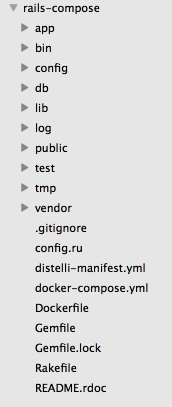

## Step 2. Push your Code to GitHub/BitBucket

The next step to complete is to put your code into a source control repository. If you are unfamiliar with source control the steps below will guide through the process. For this tutorial I am using GitHub as my repository, but you can use BitBucket as well without any issue.

First you will need to create a repo in GitHub and push your code to that repository. Once created, open your terminal and make sure you are in the directory that your app's code is in.

Initialize the local directory as a Git Repo
~~~
$ git init
~~~

Add the files in your new local repo
~~~
$ git add .
~~~

Commit the files you have just staged
~~~
$ git commit -m "First Commit"
~~~

Navigate to your GitHub or BitBucket Repo and find your remote repository URL. Once you have your remote repository URL use the following commands to finish setting up your repo.

~~~
$ git remote add origin "Your Remote Repository URL"
# Sets the new URL
$ git remote -v
# Verify the URL
~~~

Now push the changes to your repo
~~~
$ git push origin master
~~~

## Step 3. Create Pipelines Application

If you do not have a Pipelines account, please [Sign Up](http://pipelines.puppet.com/signup) for one now. 

To create your app in Pipelines, follow these steps:

Click the new application button on your Pipelines account home screen

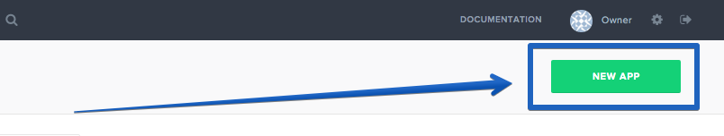

Select the Repository type where you are storing your applications files. 

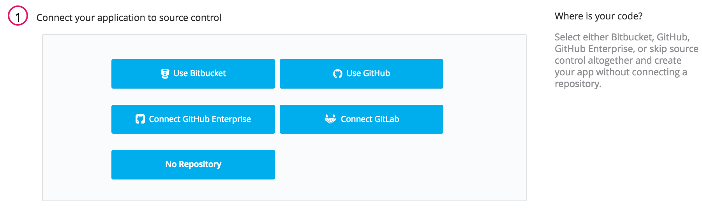

After we click the button to connect to our Repository, we then select the appropriate repo that contains your code.

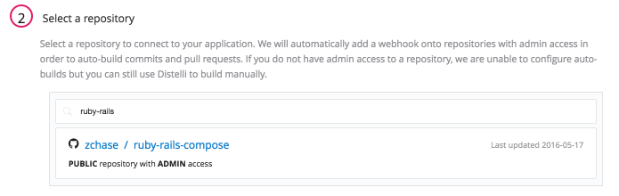

Select the appropriate branch for your deployment. I have only a master branch, but you can deploy any branch from your repo!

Next Pipelines will ask you set your build steps. We have created a `distelli-manifest.yml`, so we will check the checkbox to use this file:

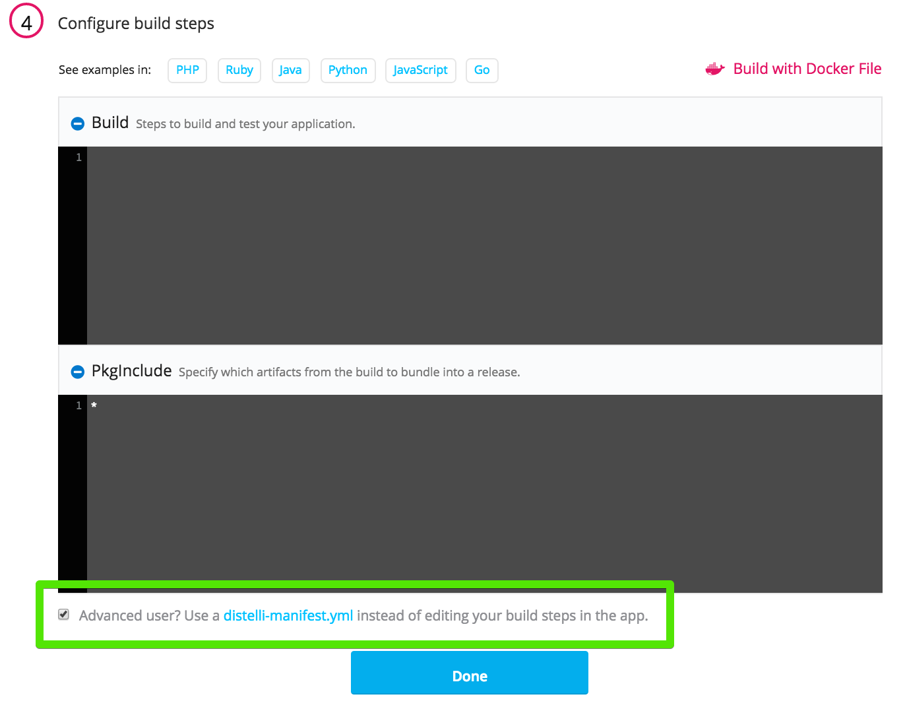

The final step is select our Build Image. In this case we are going to select "Distelli Base" for our Application. Select the <b>Auto Build</b> checkbox and the the <b>Looks good. Start Build!</b>.

> **Note:** The Auto-Build feature builds your application every time you commit code to your repository.

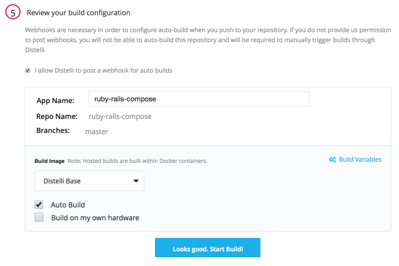

Visit the <b>Builds</b> to view the progress of your application's build.

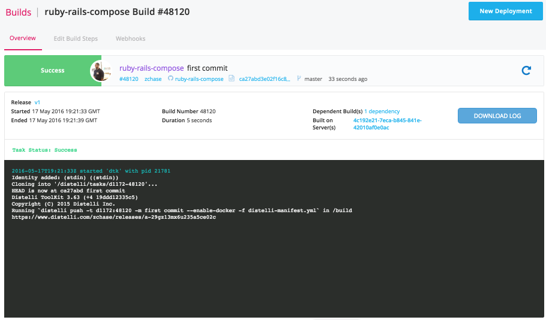

## Step 4. Install Pipelines Agent and Add Server

The next step in deploying our app is to make sure you have a server to run your application on. You can use any type of server - public cloud, private cloud or physical. Pipelines will let you deploy your code to  Vagrant VMs or servers in a VPC. You can even deploy to the server under your desk. For this tutorial I am going to be deploying to a server hosted by DigitalOcean. 

> **Note:** You will need remote access to the server you are deploying to & root (administrator) permissions.

### Install Pipelines Agent on Your Server

To be able to deploy your application to your server you will need to install the Pipelines Agent. You will need remote access to your server to complete the installation. Please consult the below information on how to install the Pipelines Agent on your server.

#### Linux and macOS X

To install on Linux or macOS X you can use either curl <b>or</b> wget with one of the following syntaxes.
##### wget example

~~~
wget -qO- https://pipelines.puppet.com/download/client | sh
~~~

##### curl example

~~~
curl -sSL https://pipelines.puppet.com/download/client | sh
~~~

#### Complete the Install

To complete the install of the agent, you must issue the `/usr/local/bin/distelli agent install` command.

~~~
/usr/local/bin/distelli agent install
~~~

~~~
ServerA:~$ <b>wget -qO- https://pipelines.puppet.com/download/client | sh</b>
This script requires superuser privileges to install packages
Please enter your password at the sudo prompt

[sudo] password for bmcgehee: 
    Installing Distelli CLI 3.51 for architecture 'Linux-x86_64'...
    Downloading https://s3.amazonaws.com/download.distelli.com/distelli.Linux-x86_64/distelli.Linux-x86_64-3.51.gz
To install the agent, run:
    sudo /usr/local/bin/distelli agent install
ServerA:~$ <b>sudo /usr/local/bin/distelli agent install</b>
Distelli Email: jdoe@distelli.com
      Password: 
    1: User: jdoe
    2: Team: janedoe/TeamJane
Team [2]: <b>1</b>
Server Info: https://www.distelli.com/jdoe/servers/12345678-4765-ac42-bd7a-080027c8277c
Starting upstart daemon with name:  
~~~

#### Verify the Install

To validate the agent is installed and working use the `/usr/local/bin/distelli agent status` command.

> **Note:** This installation requires root (administrator) permissions.

~~~
/usr/local/bin/distelli agent status
Distelli Agent (serverA) is Running with id 
~~~

If you would like more information on installing the Pipelines agent, visit [Installing the Pipelines Agent](./agent.html). 

### Create New Environment

Now that we have installed the Pipelines Agent we need to create an environment and add our server to that environment. To start navigate to your application's page in Pipelines and click on the <b>Environments</b> tab.

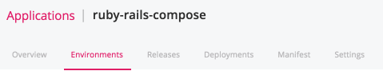

On the Environments page click the <b>New Environment</b> button. Enter in a name for your new environment and then click the <b>Create Environment</b> button.

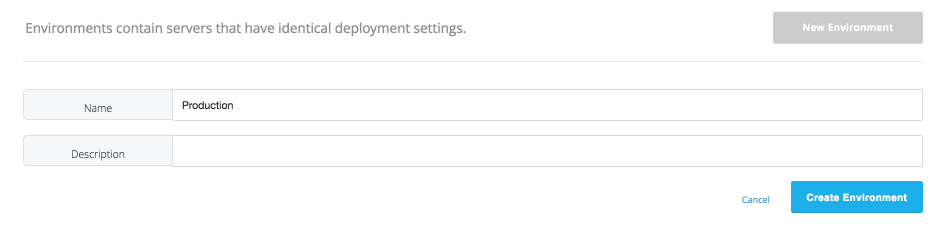

Once you created your <b>Environment</b> we are ready to deploy our application. Navigate back to the <b>Builds</b> page to start deploying your application.

## Step 5. Deploy Application

Now that we have successfully built our application we are ready to deploy to our server. On the builds page select the <b>New Deployment</b> button in the right hand corner.

### Deploy your Application

Once you click the button, you should be directed to the deployment page. The first step is to select the <b>Deploy a Release</b> option.

Pipelines will now prompt you to select the application you want to deploy. Please select the application we created earlier in the tutorial.

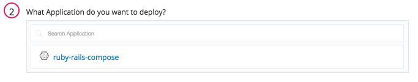

Then you will be asked to select the release you would like to deploy. Make sure to select your latest release, which is located at the top of the list.

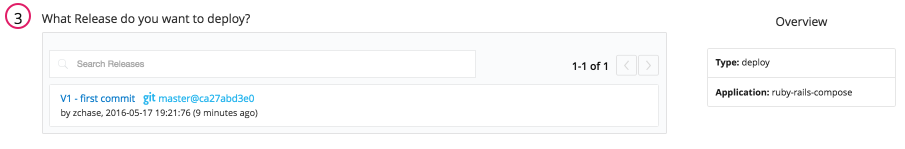

Next select the Environment you created and click <b>All Done</b>.

Now Pipelines will ask you to add your server. Click the <b>Add Servers</b> button to get started. Select the server you configured earlier in the tutorial and add it to your account. Once you have added your server, you can close the <b>Add Servers</b> panel and continue with your deployment. You will see a final option to set your delay between deployments on your servers and a <b>Deploy!</b> button.

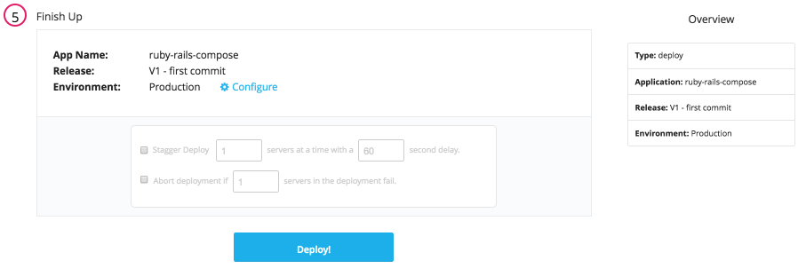

Click the <b>Deploy!</b> button to begin your deployment. You will redirected to a page where you can view the progress of your deployment. Click the <b>log</b> button on the left side to view real time streaming logs for the deployment.

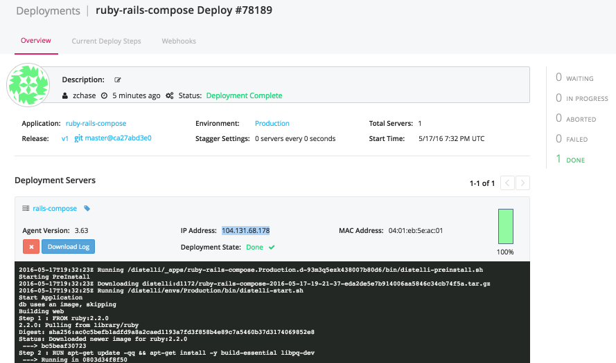

### View Your Application

And that's it! Your Ruby on Rails application has been deployed. Point your browser towards <b>http://<-Your Server’s IP Address-></b> and see the default page for Ruby on Rails projects. To continue creating a basic Rails application use the guide <a href="http://guides.rubyonrails.org/getting_started.html" target="_blank">here</a>.

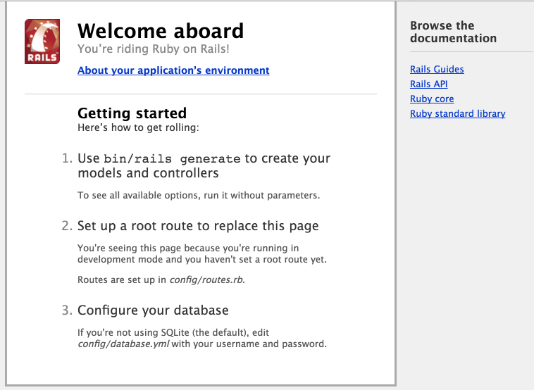

