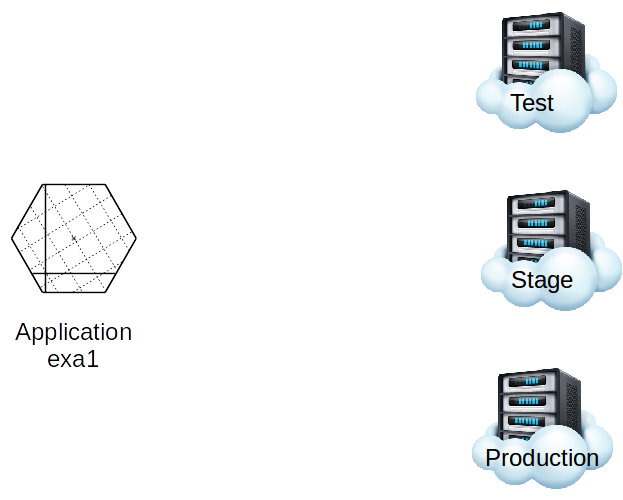
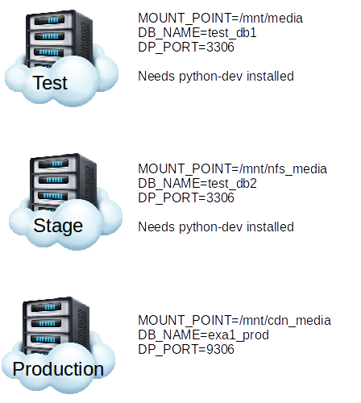
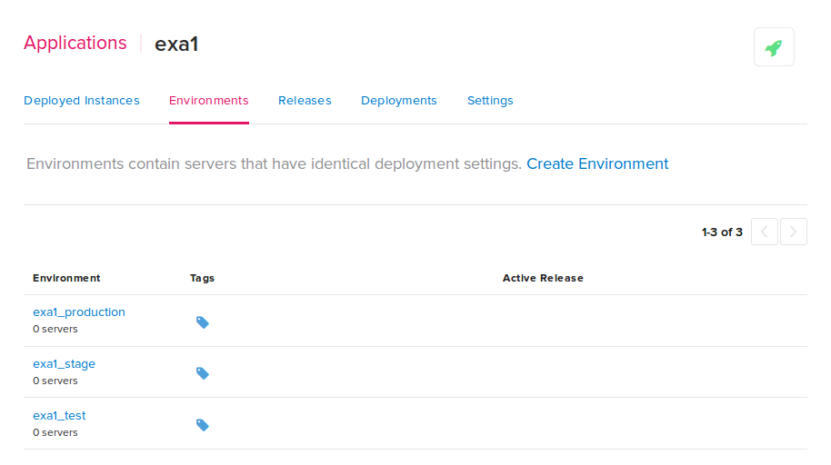
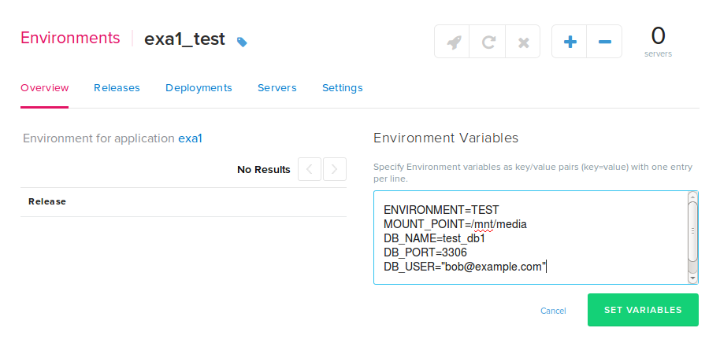

This document describes using an application in Pipelines and best practice for supplying differing deployment instructions based on the environment being deployed to.

### The Example Scenario

To exemplify this we will take a simple application called <b>exa1</b> with the goal of deploying it to differing groups of servers.

These servers have been grouped by functionality into environments. Each environment has different directory structure, mount points, database access, and dependencies/requirements.

To accommodate this scenario we must specify deployment instructions in such a way that the instructions can conditionally deploy appropriate setup and code to the appropriate environment.
The instructions must be able to:

<ul>
<li>Mount the correct mount point.</li>
<li>Connect to the correct Database and DB Port .</li>
<li>Install special requirements as necessary (i.e. python-dev).</li>
</ul>

### Deploy Instructions

With Pipelines, deployment instructions are defined in the distelli-manifest.yml file. This file will reside with your application. For more information on the Pipelines manifest, see the [Pipelines Manifest](./manifest.html) reference guide.
The first line of the distelli-manifest.yml file must be a Pipelines username and the application name, like so:

~~~
jdoe/exa1:
~~~

Next we will configure the environment variables and define their defaults.

~~~
  Env:
    - MOUNT_POINT: /mnt/media
    - DB_NAME: unknown
    - DB_PORT: 3306
    - DB_USER: unknown
    - DB_PASSWORD: unknown
    - ENVIRONMENT: unknown
~~~

Let's check to see if the $ENVIRONMENT variable has been set appropriately.

> **Note:** We will look at setting this at the environment level in the Pipelines web UI. This is described later in this doc.

~~~
  PreInstall:
    - if [[ "$ENVIRONMENT" == 'unknown' ]]; then
    -   echo "This environment deploy is not configured correctly."
    -   echo "The environment in Pipelines should have an environment"
    -   echo " variable $ENVIRONMENT set to one of the following:"
    -   echo "  * TEST"
    -   echo "  * STAGE"
    -   echo "  * PRODUCTION"
    -   echo ""
    -   echo "Exiting..."
    -   exit 1
    - fi
~~~

Next we will check and link the $MOUNT_POINT, if it exists.

~~~
    - sudo mkdir -p /var/www
    - if [ ! -d "$MOUNT_POINT" ]; then
    -   echo "The mount point specified, $MOUNT_POINT, does not exist."
    -   echo "Exiting..."
    -   exit 1
    - else
    -   mkdir -p /var/www
    -   sudo ln -s $MOUNT_POINT /var/www/media_mount
    - fi
~~~

Specifying database name, credentials, and port in my.cnf. This assumes there is already a my.cnf file that contains at least the following

~~~
# my.cnf
[client]
port=
user=
password=
database=
~~~

The deploy instructions to populate the correct data into the my.cnf file.

~~~
    - sed -i 's/user=.*/user='$DB_USER'/' my.cnf
    - sed -i 's/port=.*/port='$DB_PORT'/' my.cnf
    - sed -i 's/password=.*/password='$DB_PASSWORD'/' my.cnf
    - sed -i 's/database=.*/database='$DB_NAME'/' my.cnf
~~~

And finally the instructions to install dependencies/prerequisites.

~~~
    - if [[ "$ENVIRONMENT" == 'PRODUCTION' ]]; then
    -   echo "Deployed to Production"
    - elif [[ $ENVIRONMENT" == 'STAGE' ]]; then
    -   echo "Deployed to Staging"
    -   sudo apt-get install -y python-dev
    - elif [[ $ENVIRONMENT" == 'TEST' ]]; then
    -   echo "Deployed to Test"
    -   sudo apt-get install -y python-dev
    - fi    
~~~

Note, this could also be accomplished with using the Pipelines provided environment variable DISTELLI_ENV.

### Setting Environment Variables

The following steps will be completed in the Pipelines web UI.
<h4>1. Create the Application in Pipelines</h4>

We must ensure that we have packaged the distelli-manifest.yml file with the application, then create and push the application to Pipelines. There are several ways to create an application in Pipelines. See:

* [Creating an Application](./application-create.html)
* [Creating an Application from a Repository](./application-create.html)

<h4>2. Create 3 Application Environments </h4>

In this step we will create the application environments to support the example scenario. To create an environment in the Pipelines web UI see [Creating an Environment](./environment.html).
We will create three environments. These are:

<ul>
<li>Test</li>
<li>Stage</li>
<li>Production</li>
</ul>

You can see in the above image the three environments:

<ul>
<li>exa1_production</li>
<li>exa1_stage</li>
<li>exa1_test</li>
</ul>

<h4>3. Set the Application Environment Environment Variables</h4>

The application environment environment variables override the environment variables in the distelli-manifest.yml file. For more information on environment variables in Pipelines see [Environment Variables](./environment-variable.html) reference guide.
In this step we will set the environment variables specific to each environment. You can do this from the application environment overview page.
The below screenshot exemplifies setting the environment variables for the <b>exa1_test</b> environment.

We will do the same thing for the other two environments.
You should note that we are using the same environment variables in the distelli-manifest.yml and in the application environment environment variables. When you do this, the application environment environment variables will override the distelli-manifest.yml environment variables.
In other words, when you deploy to the <b>exa1_test</b> environment, the environment variable ENVIRONMENT will be populated with "TEST" and override the definition in the distelli-manifest.yml where ENVIRONMENT is set to "unknown".

### The Full Pipelines Manifest

Here is the full set of deployment instructions.

~~~
jdoe/exa1:
  Env:
    - MOUNT_POINT: /mnt/media
    - DB_NAME: unknown
    - DB_PORT: 3306
    - DB_USER: unknown
    - DB_PASSWORD: unknown
    - ENVIRONMENT: unknown
  PreInstall:
    - if [[ "$ENVIRONMENT" == 'unknown' ]]; then
    -   echo "This environment deploy is not configured correctly."
    -   echo "The application environment in Pipelines should have an"
    -   echo "environment variable $ENVIRONMENT set to one of the following:"
    -   echo "  * TEST"
    -   echo "  * STAGE"
    -   echo "  * PRODUCTION"
    -   echo ""
    -   echo "Exiting..."
    -   exit 1
    - fi
    - sudo mkdir -p /var/www
    - if [ ! -d "$MOUNT_POINT" ]; then
    -   echo "The mount point specified, $MOUNT_POINT, does not exist."
    -   echo "Exiting..."
    -   exit 1
    - else
    -   mkdir -p /var/www
    -   sudo ln -s $MOUNT_POINT /var/www/media_mount
    - fi
    - sed -i 's/user=.*/user='$DB_USER'/' my.cnf
    - sed -i 's/port=.*/port='$DB_PORT'/' my.cnf
    - sed -i 's/password=.*/password='$DB_PASSWORD'/' my.cnf
    - sed -i 's/database=.*/database='$DB_NAME'/' my.cnf
    - if [[ "$ENVIRONMENT" == 'PRODUCTION' ]]; then
    -   echo "Deployed to Production"
    - elif [[ $ENVIRONMENT" == 'STAGE' ]]; then
    -   echo "Deployed to Staging"
    -   sudo apt-get install -y python-dev
    - elif [[ $ENVIRONMENT" == 'TEST' ]]; then
    -   echo "Deployed to Test"
    -   sudo apt-get install -y python-dev
    - fi    
~~~

If instead of using $ENVIRONMENT we could use $DISTELLI_ENV. If so, then the last section would look like this.

~~~
    - if [[ "$DISTELLI_ENV" == 'exa1_production' ]]; then
    -   echo "Deployed to Production"
    - elif [[ $DISTELLI_ENV" == 'exa1_stage' ]]; then
    -   echo "Deployed to Staging"
    -   sudo apt-get install -y python-dev
    - elif [[ $DISTELLI_ENV" == 'exa1_test' ]]; then
    -   echo "Deployed to Test"
    -   sudo apt-get install -y python-dev
    - fi   
~~~

