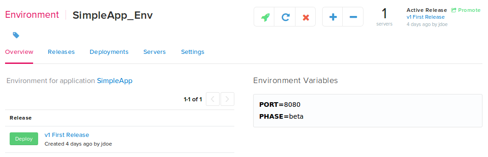

When deploying an application using Pipelines, there are several places that Environment Variables are available. 

## Pipelines Specific Environment Variables

These are informative variables supplied by Pipelines. These are available during all stages of the deployment, restart, and terminate tasks. For more information on the stages of deployment see:

* [Pipelines Manifest Reference Guide](./manifest.html)
* [Build and Deployment Steps Reference Guide](./manifest.html)

### DISTELLI_APPHOME:

The home directory of the deployed application. This is a symlink to the DISTELLI_INSTALLHOME application package.

### DISTELLI_APPNAME:

The name of the application being deployed. This is specified in the distelli_manifest.yml file and during the `distelli create` command.

### DISTELLI_BUILDNUM:

The DISTELLI_BUILDNUM, carries the Pipelines build number. This variable is also available during deployment if this release was created from a successful build in Pipelines (even on your build server).

### DISTELLI_ENV:

The Pipelines application environment name that is currently being deployed to.

### DISTELLI_INSTALLHOME:

The directory where the application package is deployed. 

### DISTELLI_RELBRANCH:

This variable will document what <b>repository branch</b> that is built or deployed (such as master).

### DISTELLI_RELEASE:

A URL link to the release page in the Pipelines web UI.

### DISTELLI_RELREPOTYPE:

This environment variable will document the <b>repository type</b> (such as Git or Mercurial) is used.

For more information on using applications with repo's see:

* [Integrating with a Repository](./integrate-repo.html)
* [Creating an Application from a repository](./application-create.html)

### DISTELLI_RELREVISION:

This variable will display the <b>repository commit SHA</b> associated with the built application release.

### DISTELLI_RELVERSION:

The deployed application release version in Pipelines. This will be in the format of:

~~~
v#
~~~

Where # is the incremented application release version. For more information on releases see [Releases](./release.html).

## Pipelines Docker Environment Variables.

These variables are supplied by Pipelines and are available during Build, Deploy, Restart, and Terminate tasks. These variables are populated with your Docker credentials entered in the Pipelines web UI. For more information see: [Enabling Docker for Existing Application](./docker.html).

### DISTELLI_DOCKER_USERNAME

This is the user name you specified when integrating with your docker registry.

### DISTELLI_DOCKER_PW

This is the password you specified when integrating with your docker registry.

### DISTELLI_DOCKER_EMAIL

This is the user email you specified when integrating with your docker registry.

### DISTELLI_DOCKER_ENDPOINT

This is the URL of the registry. This is specific to Amazon ECR.

### DISTELLI_DOCKER_REPO

This is the registry repository you specified when integrating your application with your docker registry.

### DISTELLI_DOCKER_PATH

This is the path to the Dockerfile in your application.

## Pipelines Specific Build Variables

Build variables are user specified in the application repository settings. See [Specifying Build Variable](./build-configure.html).

### DISTELLI_MANIFEST

The DISTELLI_MANIFEST environment variable can be set in the build variables. This allows specification of an alternate Pipelines manifest file during the build process. After completing a successful build, Pipelines will do a [distelli push](./cli.html) and will consult the manifest specified for instructions on what files to package for the release.

The DISTELLI_MANIFEST environment variable can contain multiple distelli-manifest.yml files listed in a comma-separated format. Use this when dealing with a repository that has multiple applications.

## Pipelines Specific Deploy Variables

These deploy variables provide features and functionality when deploying using Pipelines.

### DISTELLI_INSTALLVIEW

The DISTELLI_INSTALLVIEW deploy variable allows you to specify hash file(s) of values used when injecting data into templates using the Pipelines templating feature. For more information, see: [Working with Templates on Deploy](./manifest-template.html).

## User Supplied Manifest Environment Variables

Manifest Environment Variables are user specified in the distelli_manifest.yml file [Env:](./manifest-deploy.html) section. These variables are specific to an application.

Many of the Pipelines Deployment Tutorials exemplify the usage of supplying manifest environment variables. Here is an example distell_manifest.yml that includes usage of Env: environment variables:

~~~
YourUserName/SimpleJavaApp:
  Env:
    - CLASSPATH: "$(find lib/ -name '*.jar' | xargs echo | tr ' ' ':')"
    - PORT: "8080"
    - JAVA_HOME: "/$DISTELLI_INSTALLHOME/jre1.8.0_45"
    - JVM_ARGS: '"-Duser.timezone=UTC -Xmx128M -Xms128M"'
    - ARGS: "$PORT"
  PreInstall:
    - 'wget -c -O jre-8u45-linux-x64.tar.gz --no-check-certificate --no-cookies --header "Cookie: oraclelicense=accept-securebackup-cookie" "http://download.oracle.com/otn-pub/java/jdk/8u45-b14/jre-8u45-linux-x64.tar.gz"'
    - 'tar -zxvf jre-8u45-linux-x64.tar.gz'
  Exec:
    - "exec $JAVA_HOME/bin/java -cp $CLASSPATH $JVM_ARGS com.example.app.SimpleJavaApp $ARGS"
  PkgInclude:
    - ["target/*.jar", "lib/"]
    - ["lib/*.jar", "lib/"]
~~~

These variables are available at any stage of the deployment, restart, and terminate tasks.

> **Warning:** User supplied application environment variables (below) will supersede user supplied manifest environment variables (above).

## User Supplied Application Environment Variables

These environment variables are specific to an application environment. These are configured in the Pipelines web UI. To set these for an application environment follow these steps.

<ol>
<li>Ensure you are signed in to the Pipelines web UI.</li>
<li>Navigate to the application that you want to set environment variables.</li>
<li>Navigate to the application environment that you want to set environment variables.</li>

<li>Click in the text input box under the header <b>Environment Variables</b>.</li>
</ol>

In the resulting dialog you can set VARIABLE=Value. These variables will be available to applications deployed to this application environment.

These Variables override the [User Supplied Manifest Environment Variables](./environment-variable.html).
