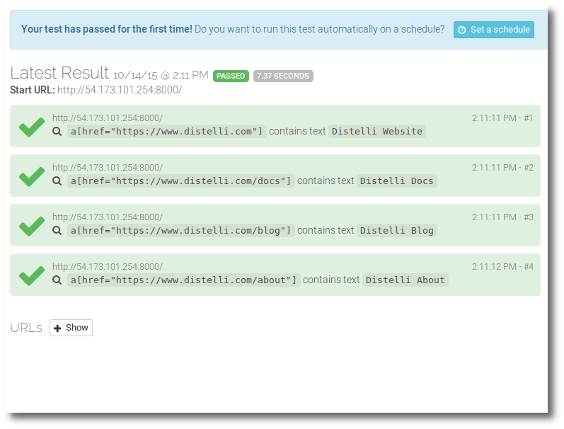

 
Testing software is important. In a perfect world, all tests would be quick and automated. Having first hand experience as a software tester, I’m naturally passionate about testing.

Working with Pipelines' Continuous Deployment platform has made me think more about testing and at what phases what testing should occur. Typically, a suite of tests are run after the build phase. This may be unit tests, build verification tests, or possibly "deeper" tests. But I've been thinking about automated testing after deployment.

With that in mind, I’ve been looking at Ghost Inspector for automated testing of web based applications. Ghost Inspector lets you record and manage tests that check specific functionality in your website or application.

This blog will document the steps necessary to integrate Ghost Inspector tests into your Pipelines deployments. This assumes you are familiar with using Pipelines and have done software deployments with Pipelines.

You can clone my example application from GitHub:
<a href="https://github.com/Distelli/example-integration-ghost" target="_blank">github.com/Distelli/example-integration-ghost</a>.

<h3>Step 1. Get Setup on Ghost Inspector</h3>

Go to the <a href="https://ghostinspector.com/" target="_blank">Ghost Inspector</a> website and sign up for a free account.

<h3>Step 2. Create your Test</h3>

To create a test suite with Ghost Inspector, install the Chrome recorder and record the tests on your website.

I built a simple php web application for this exercise.

My Ghost Inspector tests did some simple assertions to ensure the content was accurate and my links worked as expected.

Make sure you run (test) your tests to ensure they are working as expected.

<h3>Step 3. Grab the Test API Execute</h3>

In Ghost Inspector navigate to the test or test suite you wish to execute when deploying your application with Pipelines.

In the bottom right of the page you will find a section titled <b>API Access</b>.

Expand the <b>Execute Suite</b> section and copy the full URL. It will look something like this.

~~~
https://api.ghostinspector.com/v1/suites/5603199999b0d3deb3143689/execute/?apiKey=abcdefghijklmnopqrstuvwxyz0123456789z
~~~

<h3>Step 4. Modify the Pipelines Manifest</h3>

I need to run the tests after a successful deploy so I will add the appropriate script to the <b>PostStart</b> section of the Pipelines manifest.

This script uses <b>jq</b> to parse the JSON response. You can find more information on jq at <a href="https://stedolan.github.io/jq/" target="_blank">stedolan.github.io/jq/</a>

Below is my full distelli-manifest.yml file. I will break down the details.

~~~
&lt;username&gt;/SimpleApp6:
  Env:
    - PORT: 8000
  PkgInclude:
    - simpleapp.php
  PreInstall:
    - echo "PreInstall"
    - sudo apt-get -y -qq update
    - sudo apt-get -y install jq curl
    - sudo apt-get -y install php5-cli
  PostStart:
    - echo "PostStart"
    - publicip=$(curl -s ident.me)

    - echo "Starting Ghost Inspector tests"
    #- results=$(curl -s "https://api.ghostinspector.com/v1/suites/5603199999b0d3deb3143689/execute/?apiKey=abcdefghijklmnopqrstuvwxyz0123456789z")
    - results=$(curl -s "https://api.ghostinspector.com/v1/suites/5603199999b0d3deb3143689/execute/?apiKey=abcdefghijklmnopqrstuvwxyz0123456789z&startUrl=http://$publicip:$PORT/")

    - if [[ $(jq '.code' <<< $results) != "\"SUCCESS\"" ]]; then
    -   echo "Tests failed to run!"
    -   echo ""
    -   echo "$results"
    -   exit 1
    - fi
    - IFS=$'\n'
    - lines=$(jq '.' <<< $results)
    - passing=1
    - counter=0
    - for line in $lines; do
    -   printf "$counter "
    -   'if [[ "$line" =~ "\"passing\": false," || "$line" =~ "\"passing\": null," ]]; then'
    -     passing=0
    -     printf "***> "
    -   fi
    -   echo "$line"
    -   let counter=counter+1
    - done
    - if [ "$passing" -gt 0 ]; then
    -   echo "Ghost Inspector Integration tests PASSED SUCCESSFULLY!"
    - else
    -   echo "Ghost Inspector Integration tests FAILED!!!"
    -   exit 1
    - fi
  Exec:
    - 'php -S 0.0.0.0:$PORT simpleapp.php'
~~~

<h4>Breakdown of the Manifest</h4>

<h5>Env:</h5>

In the <b>environments</b> section I am specifying my php web server tcp port number. I like using environment variables like this, with Pipelines, because I can override them before deploys using the application environment environment variables UI. For more information on doing this, see [Environment Variables](./environment-variable.html).

~~~
  Env:
    - PORT: 8000
~~~

<h5>PkgInclude:</h5>

The <b>package include</b> and <b>package exclude</b> sections define what files, if any, to bundle into the Pipelines release when pushing an application to Pipelines. These are the files that will be deployed when doing a Pipelines deploy of a release. For more information see [Pipelines Manifest Reference Guide section PkgInclude](./manifest-build.html).

For my example application all I needed was my php simple web server application simpleapp.php.

~~~
  PkgInclude:
    - simpleapp.php
~~~

<h5>PreInstall:</h5>

In the <b>pre-install</b> section I am first updating the apt-get index and then installing my prerequisites which includes:

<ul>
<li>curl - A command line tool for getting or sending files using URL syntax. This will be used to send the Ghost Inspector API test request.</li>
<li>jq - A JSON parsing tool, for reading the results of the Ghost Inspector test.</li>
<li>php - To run my simple web server application.</li>
</ul>

~~~
  PreInstall:
    - echo "PreInstall"
    - sudo apt-get -y -qq update
    - sudo apt-get -y install jq curl
    - sudo apt-get -y install php5-cli
~~~

<h5>PostStart:</h5>

It is in the <b>post-start</b> section that I will execute the Ghost Inspector tests. Post start is run after the deployment so my simple web server application will be up and running at this point.

Before I can run the tests I need to determine the public IP address of my server. To do this I am bouncing an outbound request to a service that will respond with my public IP. I can then use this address in my Ghost Inspector API call.

~~~
  PostStart:
    - echo "PostStart"
    - publicip=$(curl -s ident.me)
    - echo "Public IP $publicip"
~~~

Next I will make the API call to Ghost Inspector to begin running my test suite.

I have included 2 examples. The first is remarked out. The second example includes the <b>&startUrl=</b> option. This is how you can specify a different base URL to use for the Ghost Inspector test suite. Because I deploy my application to multiple servers I need to specify a different base URL and possibly a different tcp port for the test suite on each server.

Please note, my suite ID and API Key have been purposefully obfuscated. Remember to replace the URL with the one you retrieved from Step 3 above.

~~~
    - echo "Starting Ghost Inspector tests"
    - results=$(curl -s "https://api.ghostinspector.com/v1/suites/5603199999b0d3deb3143689/execute/?apiKey=abcdefghijklmnopqrstuvwxyz0123456789z&startUrl=http://$publicip:$PORT/")
~~~

Next I want to ensure the tests ran. I can look for the <b>SUCCESS</b> result in the JSON <b>.code</b> element.

~~~
    - if [[ $(jq '.code' <<< $results) != "\"SUCCESS\"" ]]; then
    -   echo "Tests failed to run!"
    -   echo ""
    -   echo "$results"
    -   exit 1
    - fi
~~~

And finally I parse the results looking for failed tests. If a single test fails or returns null, the test suite is assumed to be failed and the deploy fails.

~~~ 
    - IFS=$'\n'
    - lines=$(jq '.' <<< $results)
    - passing=1
    - counter=0
    - for line in $lines; do
    -   printf "$counter "
    -   'if [[ "$line" =~ "\"passing\": false," || "$line" =~ "\"passing\": null," ]]; then'
    -     passing=0
    -     printf "***> "
    -   fi
    -   echo "$line"
    -   let counter=counter+1
    - done
    - if [ "$passing" -gt 0 ]; then
    -   echo "Ghost Inspector Integration tests PASSED SUCCESSFULLY!"
    - else
    -   echo "Ghost Inspector Integration tests FAILED!!!"
    -   exit 1
    - fi
~~~

The above section of script will format the JSON response, look through each line of response for <b>"passing": false</b> or <b>"passing": null</b>, and if either is found, cause the deploy to fail.

The nice thing is the parsing is logged to the Pipelines live deployment monitor and clearly identifies the test(s) that failed. Below is an example failed response log. The lines where tests failed are indicated by a preceding <b>***></b>. You can see the failures on line 50 and line 119.

~~~
Starting Ghost Inspector tests
0 {
1   "data": {
2     "viewportSize": {
3       "width": 1024,
4       "height": 768
5     },
6     "steps": [
7       {
8         "sequence": 0,
9         "private": false,
10         "optional": false,
11         "variableName": "",
12         "target": "a[href=\"https://www.distelli.com\"]",
13         "command": "assertTextPresent",
14         "value": "Distelli Website",
15         "url": "http://54.173.101.254:8000/",
16         "dateExecuted": "2015-10-14T21:54:13.203Z",
17         "_id": "561ecf15b5d994c0517412c2",
18         "passing": true
19       },
20       {
21         "sequence": 1,
22         "private": false,
23         "optional": false,
24         "variableName": "",
25         "target": "a[href=\"https://www.distelli.com/docs\"]",
26         "command": "assertTextPresent",
27         "value": "Distelli Docs",
28         "url": "http://54.173.101.254:8000/",
29         "dateExecuted": "2015-10-14T21:54:13.733Z",
30         "_id": "561ecf15b5d994c0517412c3",
31         "passing": true
32       },
33       {
34         "sequence": 2,
35         "private": false,
36         "optional": false,
37         "variableName": "",
38         "target": "a[href=\"https://www.distelli.com/blog\"]",
39         "command": "assertTextPresent",
40         "value": "Distelli Blog",
41         "url": "http://54.173.101.254:8000/",
42         "dateExecuted": "2015-10-14T21:54:14.272Z",
43         "_id": "561ecf15b5d994c0517412c4",
44         "passing": true
45       },
46       {
47         "sequence": 3,
48         "private": false,
49         "optional": false,
50 ***>         "passing": false,
51         "variableName": "",
52         "target": "a[href=\"https://www.distelli.com/about\"]",
53         "command": "assertTextPresent",
54         "value": "Distelli About",
55         "url": "http://54.173.101.254:8000/",
56         "error": "Element not found",
57         "dateExecuted": "2015-10-14T21:54:29.327Z",
58         "_id": "561ecf15b5d994c0517412c5"
59       }
60     ],
61     "urls": [
62       "http://54.173.101.254:8000/"
63     ],
64     "startUrl": "http://54.173.101.254:8000/",
65     "browser": "phantomjs-2",
66     "dateExecutionStarted": "2015-10-14T21:54:11.908Z",
67     "executionHost": "prod071.runscope.in",
68     "endUrl": "http://54.173.101.254:8000/",
69     "dateExecutionFinished": "2015-10-14T21:54:29.810Z",
70     "executionTime": 17902,
71     "_id": "561ecf03b5d994c0517412bf",
72     "test": {
73       "organization": "560319a419ba3dde3b143687",
74       "suite": "560319c919ba3dde3b143689",
75       "name": "8000",
76       "_id": "561ec4bc7d9e5b2c0dfa2a91"
77     },
78     "__v": 0,
79     "screenshot": {
80       "original": {
81         "dims": {
82           "h": 768,
83           "w": 1024
84         },
85         "depth": 8,
86         "format": "PNG",
87         "oname": "561ecf03b5d994c0517412bf.png",
88         "mtime": "2015-10-14T21:54:29.000Z",
89         "ctime": "2015-10-14T21:54:29.000Z",
90         "size": 16497,
91         "path": "/screenshots/561ecf03b5d994c0517412bf-original.png",
92         "defaultUrl": "https://ghost-inspector-prod.s3.amazonaws.com/screenshots/561ecf03b5d994c0517412bf-original.png"
93       },
94       "small": {
95         "dims": {
96           "h": 240,
97           "w": 320
98         },
99         "depth": 8,
100         "format": "PNG",
101         "oname": "561ecf03b5d994c0517412bf.png",
102         "mtime": "2015-10-14T21:54:31.000Z",
103         "ctime": "2015-10-14T21:54:31.000Z",
104         "size": 5768,
105         "path": "/screenshots/561ecf03b5d994c0517412bf-small.png",
106         "defaultUrl": "https://ghost-inspector-prod.s3.amazonaws.com/screenshots/561ecf03b5d994c0517412bf-small.png"
107       }
108     },
109     "video": {
110       "dims": {
111         "h": 768,
112         "w": 1024
113       },
114       "url": "https://ghost-inspector-prod.s3.amazonaws.com/videos/561ecf03b5d994c0517412bf.mp4",
115       "path": "/videos/561ecf03b5d994c0517412bf.mp4"
116     },
117     "screenshotCompareDifference": 0.0151371,
118     "screenshotComparePassing": true,
119 ***>     "passing": false,
120     "console": []
121   },
122   "code": "SUCCESS"
123 }
Ghost Inspector Integration tests FAILED!!!
FAILED: exit 1
2015-10-14T21:54:33Z ERROR 3303 Thread[Deployment[d-8p00kh5faa0cdccca8f]][dtk.action.Base]: /distelli/envs/simpleenv6/bin/distelli-poststart.sh exited with 1 exit code (signal=0) during Deploy:PostStarting
~~~

<h3>Conclusion</h3>

You now have a great new tool in your deployment arsenal! Integrating Ghost Inspector test suites into your Pipelines deployments will provide you deployment test validation.

Remember, we’re always here to help - your feedback and questions are encouraged. Contact us at <a href="https://www.distelli.com/support">Support</a>.

