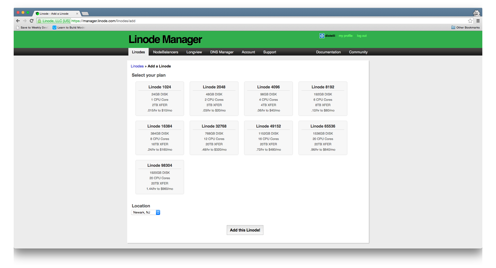
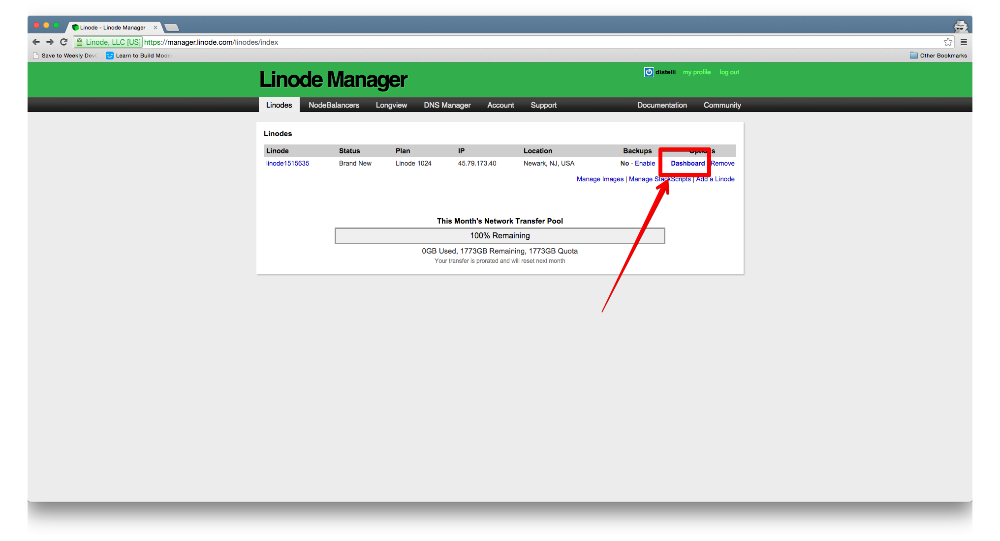
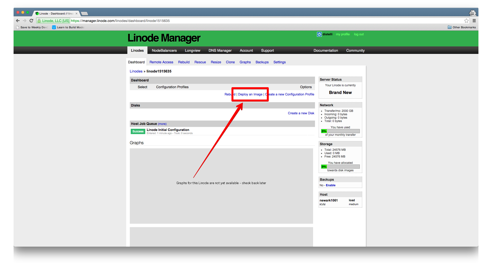
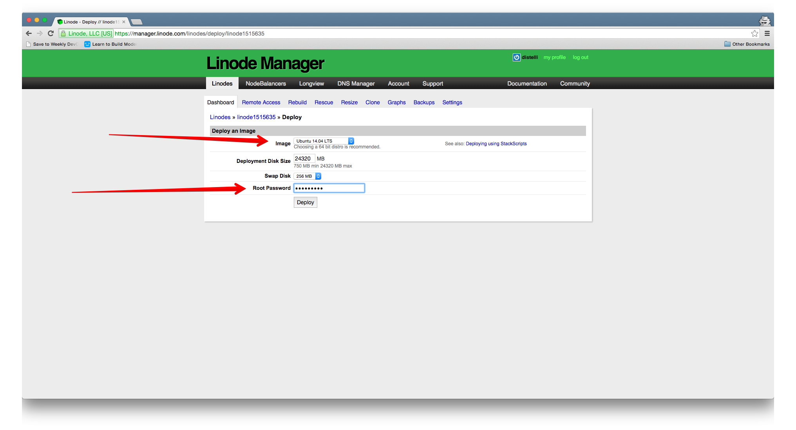
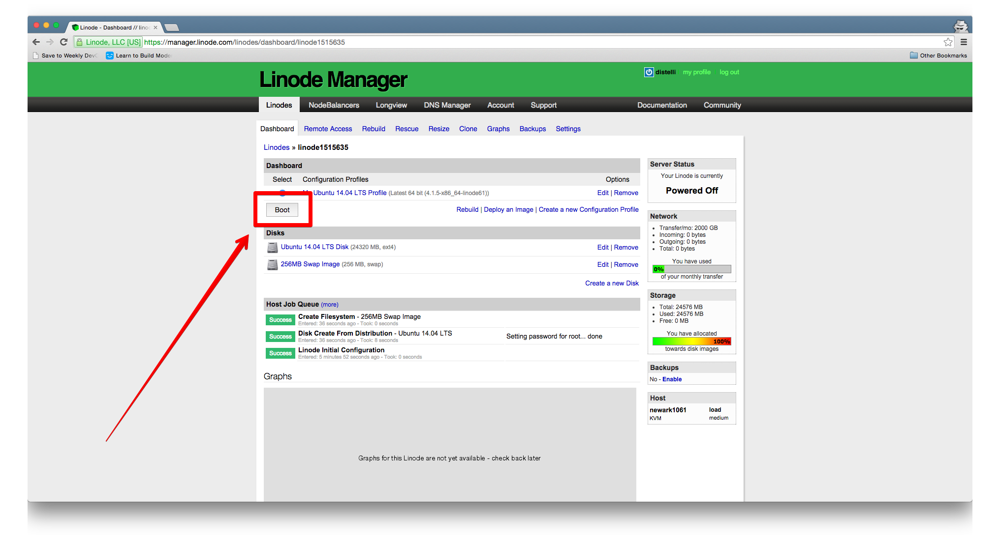
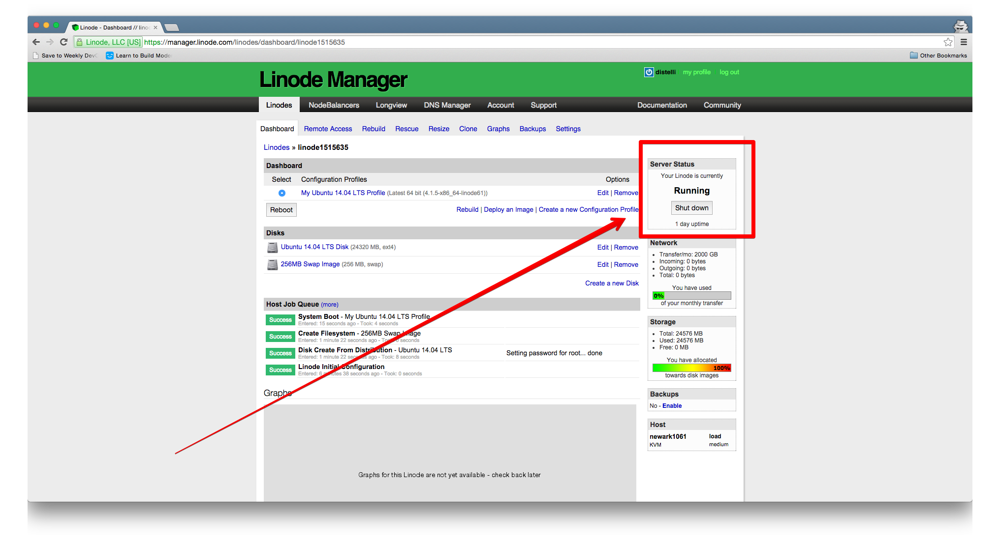

Linode offers high performance SSD Linux servers. Follow the steps below to create a Linode server with continuous integration and deployment (CI/CD).

## Prerequisites

If you do not have a Linode account, you can create one by visiting, <a href="https://manager.linode.com/session/signup" target="_blank">here</a>. 

## Step 1. Set up Linode Instance

The first step to complete is to choose your Linode Plan. Please select the plan that will best fits your needs. For this tutorial I will be using the Linode 1024 plan.

When you have selected your plan, navigate to your dashboard to continuing setting up your Linode Server.

Next select the "Deploy An Image" link on your dashboard

You will then be prompted to select an "Image Type" and to set your root password. Please select the appropriate operating system for your needs. I have chosen Ubuntu 14.04 for this tutorial. Next set your root password. You will need to use this password later in the tutorial, so please mark it down.

The last thing to do is to Boot your Server. Click the "Boot" button on the left hand side of the screen to start the boot process

Once your server has been successfully booted the server status is shown as "Running" on the right side of the screen.

## Step 2. Remote Access to Your Server

To integrate your Linode Server with Pipelines you will need remote access. Luckily Linode offers a few different options.

### SSH

The first option is to SSH into your server from your terminal/command line. Follow the three steps below to gain access to your server and install the Pipelines Agent.

1. Navigate to the "Remote Access" tab on your dashboard and find the "SSH Access" section at top of the page. Look for a line that says: `ssh root@<-IP ADDRESS->`
2. Copy the command, open your terminal, and enter the command. 

   ~~~
   $ ssh root@<-IP ADDRESS->
   ~~~

3. You will be prompted for a password. It is the Root Password that you set earlier during the "Deploying your Image" step.
4. [Install the Pipelines agent](./agent.html)

### Ajaxterm

Linode offers a few other ways of accessing your server remotely. The first option is to use Ajaxterm located at the bottom of the "Remote Access" page. Follow the steps below to install the Pipelines Agent via Ajaxterm.

1. Click the Ajaxterm link near the bottom of the page to open the Ajaxterm window
2. A window will open and you will be prompted to login. Please enter "root" and then the Root Password you set earlier.

   ~~~
   localhost login: root
   Password:
   ~~~

3. [Install the Pipelines agent](./agent.html)

### Lish via SSH

Another way Linode offers remote access is to use Lish via SSH. This is similar to using SSH. Click the "Lish via SSH" link from the bottom of the "Remote Access" page and follow the steps below to install the Pipelines Agent.

1. Click link at bottom
2. Enter the password for your Linode Account
3. Select the linode you created by entering its name
4. Please enter "root" and then the Root Password you set earlier.

   ~~~
   localhost login: root
   Password:
   ~~~

5. [Install the Pipelines agent](./agent.html)

## Step 4. Deploy Your Application

Now that our Linode Server is launched and the Pipelines Agent is installed on our server, we are now ready to Deploy our Application. See the **Deployment tutorials** section for information on deployments.