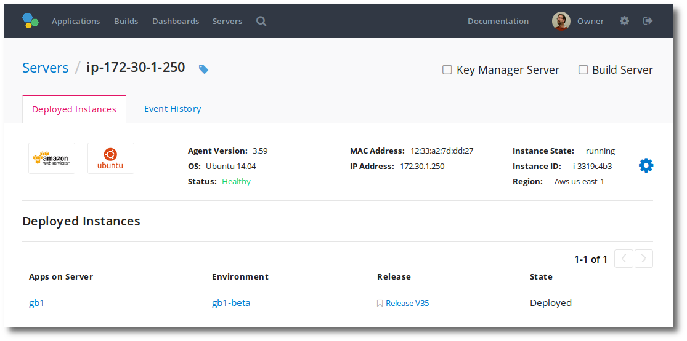
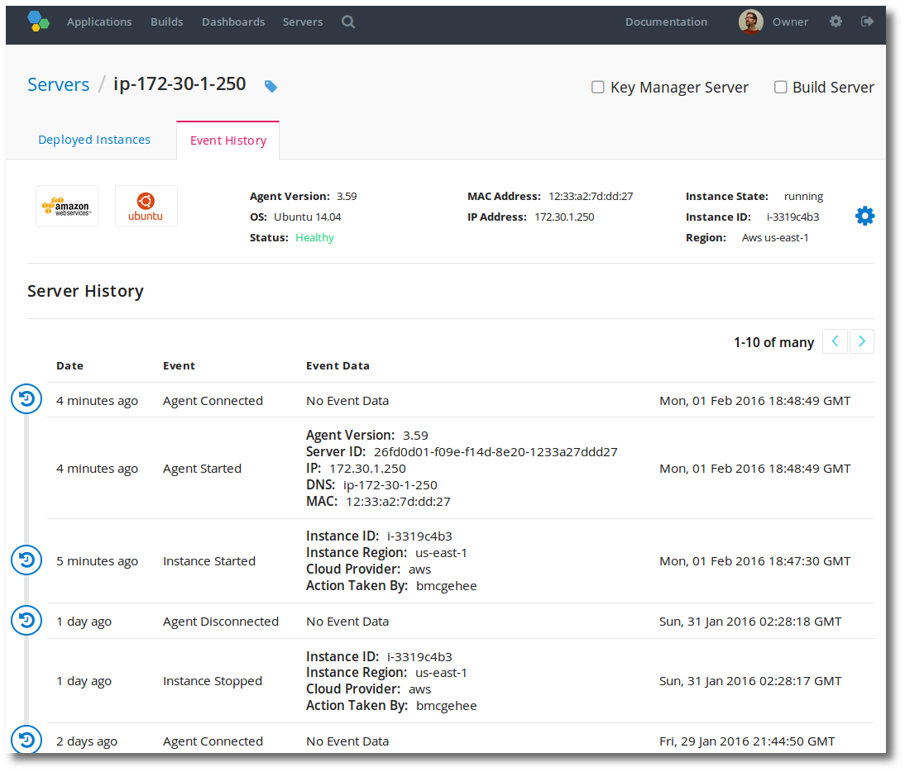
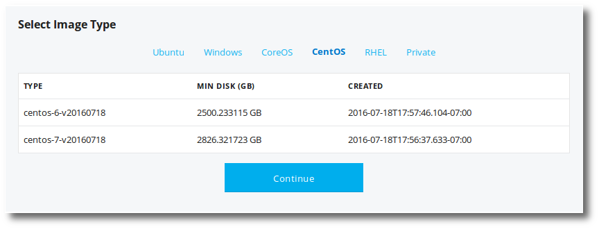

---
layout: default
title: "Working with servers"
--- 

Servers, in Pipelines, are used for deployments and builds. A server is either a physical or a virtual machine instance running a single copy of an operating system, which we identify via a unique host name. These servers may, for example, be on your desktop, in a co-location facility or somewhere in the cloud.

## Adding a new server

Adding servers to Pipelines, can be accomplished via several methods.
<ul>
<li>Installing the Pipelines Agent on the server.</li>

<li>Using the distelli.yml to automate the Pipelines Agent install.</li>

<li>Using the new server workflow.</li>

<li>Using Pipelines to provision EC2 servers.</li>

</ul>
This document documents using the <b>new server workflow</b> for adding servers to Pipelines. For more information on other methods see:

* Pipelines agent is required on the server to communicate with Pipelines.
* `distelli.yml` file for automating the agent install, credentials, and environment deployments.
* [Provisioning EC2 Servers](./server-type.html) for use with Pipelines.

<h3>New Server Workflow</h3>

To begin the new server workflow:
<ol>
<li>Click the <b>Servers</b> link at the top of the Pipelines web UI.</li>
<li>Click the <b>Add Server</b> button at the top right.</li>
</ol>

This will allow you to add your existing hardware, or launch a new AWS EC2 instances.

<h3>1. Add an existing server or launch a new one</h3>

<ol>
<li>Click the <b>Add Existing Server</b> button.</li>
</ol>

<h3>2. Install the Pipelines Agent</h3>

> **Note:** You must login to your server and install the agent.

<ol>
<li>Login to the server and use the <a href="./agent.html">Pipelines Agent</a> install command for your Operating System.</li>

MAC and Linux use the wget or curl. Windows, copy and paste the powershell snippet in a command (cmd) prompt.

<li>After installing the agent, in the Pipelines web UI click the <b>Install Complete</b> button.</li>
</ol>

<h3>3. Confirm server installation</h3>

<ol>
<li>Click the <b>Refresh Server List</b> button to refresh the list.</li>
<li>When you see the server that you installed the Pipelines agent on, click the server.</li>
</ol>

You can now add the server to application environments.

<h3>4. Add server to environment</h3>

<ol>
<li>Select the environment(s) you wish the server to join.</li>
<li>Click <b>Add Environments</b>.</li>
</ol>

## Viewing a server

There are several places you can view your server.

<ul>
<li>View servers in the Pipelines web UI.</li>
<li>View server information with the Pipelines CLI.</li>
<li>View server information with the Pipelines agent.</li>
</ul>

<h3>View Servers in the Pipelines web UI</h3>

You can view your list of servers by simply clicking the <b>Servers</b> link at the top of the Pipelines web UI.

<h3>View a Server in the Pipelines web UI</h3>

To view a single server, click on the server name in the list of servers.
Below is an example server page.

<h3>View Server Information with the Pipelines agent</h3>

The following Pipelines agent commands will show server information.

~~~
distelli agent status
~~~

Show the status of the server and agent.

~~~
distelli agent dump
~~~

Show the Pipelines deployed applications currently on the server.

## View a server's ID

You may need to find a Server ID for use with the Pipelines API or the Pipelines CLI.

This value is not readily exposed in the Pipelines web UI.

<h3>Find Your Server ID</h3>

To find your server ID in Pipelines:

<ol>
<li>At the top of the Pipelines web UI click the <b>Servers</b> link.</li>
<li>Find <b>the server</b> that you wish to see the server ID for and click it.</li>
<li>Look at the Web Browser URL.</li>
</ol>

~~~
https://www.distelli.com/jdoe/servers/26fd0c15-c001-f14d-8e20-1233a27ddd27
~~~

In the above URL, the server ID is:

~~~
26fd0c15-c001-f14d-8e20-1233a27ddd27
~~~

<h3>Using the API to Find Your Server ID.</h3>

Using the Pipelines API you can find server IDs with the following API Commands.

* With the Pipelines API [ListServers](./api-servers.html) command.
* With the Pipelines API [ListEnvServers](./api-servers.html) command.

## Deleting a server

You can completely remove a server from Pipelines via 2 methods.
<ul>
<li>Delete a Server with the agent(#delete-a-server-with-the-agent).</li>

<li>Delete a Server from the Pipelines web UI(#delete-a-server-from-the-web UI).</li>

</ul>

<h3>Delete a Server with the Agent</h3>

Executing a `dagent uninstall` will:
<ul>
<li>All Pipelines deployed applications will be removed from the server.</li>

<li>The server will be removed from all environments.</li>

<li>The server will be removed from its Pipelines account.</li>

<li>The agent supervise process will no longer start at boot.</li>

</ul>

> **Note:** This requires root or administrator access.

<h4>Syntax</h4>

~~~
dagent uninstall

~~~

<h4>Options</h4>

~~~
--yes

~~~

The --yes option facilitates a quiet deletion and auto answers <i>yes</i> to the <i>Continue? (yes/no)</i> prompt.

<h4>Examples</h4>

~~~
# dagent uninstall
Are you sure you want to uninstall the Pipelines Agent? (to avoid this prompt, pass --yes flag)
  * All applications will be removed from this server
  * The server will be removed from all environments
  * The server will be removed from the web interface
  * The supervise process will be removed from 'upstart'
Continue? (yes/no)
yes
#
~~~

<h3>Delete a Server from the web UI</h3>

A server can be deleted from Pipelines in the web UI only if the server is unavailable/down.
<ol>
<li>Click the <b>Servers</b> link from the top of the Pipelines web UI.</li>

<li>Find the server you want to delete, and click the red trash-can icon on the right.</li>

You are be prompted to confirm that you want to delete the server.
<li>Click <b>Yes</b>.</li>

</ol>
You have removed the server from Pipelines.

## Provisioning GCE servers

Using Pipelines you can provision GCE instances (servers) and have them immediately available for deploys and builds.

> **Note:** Provisioning and launching GCE instances may incur charges on your Google Cloud Account.

For more information on getting started with GCE, see [the Google Cloud documentation](https://cloud.google.com/compute/docs/quickstarts).

<h3>Provision a GCE Instance</h3>

<ol>
<li>Click the <b>Servers</b> link at the top of the Pipelines web UI.</li>

<li>Click the <b>Add Server</b> button at the top right.</li>

This will begin the new server workflow.

<li>Click the <b>New Google Compute Instance</b> button.</li>

<li>Enter your <b>Google credentials</b>, if necessary.</li>

<b>Note:</b>
Ensure that your connected account has enabled the <a href="https://console.cloud.google.com/apis/api/iam.googleapis.com/overview">IAM</a>, <a href="https://console.cloud.google.com/apis/api/cloudresourcemanager.googleapis.com/overview">Cloud Resource Manager</a>, and <a href="https://console.cloud.google.com/apis/api/compute_component/overview">Compute Engine APIs</a> before proceeding.

<li>If you just added your EC2 credentials, click <b>Update Credentials</b>.</li>

<li>Select which <b>Project</b> you wish to create the instance in, then click <b>Continue</b>.</li>

<li><b>Name your Instances</b>, then click <b>Continue</b>.</li>

Names must start with a lowercase letter followed by up to 29 lowercase letters (max length is 30), numbers, or hyphens, and cannot end with a hyphen.

<li><b>Select Zone</b>, then click <b>Continue</b>.</li>

<li><b>Select Machine Type</b>, then click <b>Continue</b>.</li>

<li><b>Select Image Type</b>. Note that you can select an operating system type from the top list, then select the image. When you are ready click <b>Continue</b>.</li>

<li><b>Configure Boot Disk</b>. Here you select the disk type and the disk size, in GB. Then click <b>Continue</b>.</li>

<li><b>Configure Firewall</b>. Select which protocols you wish to have opened up to this GCE Instance, then click <b>Continue</b>.</li>

<li><b>Configure SSH Keys</b>.</li>

Here you can enter one or more SSH keys to provide login (ssh) access to the instance. An SSH key is not required, but realize, you can't login to the instance without one.

<li><b>Configure Tags and Startup Script</b>, then click <b>Continue</b>.</li>

<li>Click <b>Continue</b> when you are ready.</li>

<li><b>Add Environments</b>. At this step, you can add Pipelines environments to your server. Realize that if the enviornment is configured to, which it is by default, it will automatically deploy the <a href="./environment.html">active release</a> to the server when it comes up. For more information see <a href="./environment.html">Environment Settings</a>. You do not need to select an environment.</li>

<li>Click <b>Continue</b> when you are ready.</li>

<li><b>Select Service Account</b> for making Googla Cloud API calls. You may also be prompted to select any Access Scopes. When you are ready click <b>Continue</b>.</li>

<li>Finally select the number of instances you wish to launch, and click <b>Launch</b>.</li>

Your instance(s) are being provisioned.

<li> Click <b>Go to Servers</b> button.</li>

</ol>

> **Note:** GCE instances take a bit of time to completely provision (come up) and communicate on the Internet. Be patient. 

> **Note:** If you run into trouble, you can inspect and terminate the instances from the GCE cloud console. <a href="https://console.cloud.google.com/" target="_blank">console.cloud.google.com/ec2</a>

## Use your own build server

When building your application with Pipelines you can specify Pipelines to use your own build servers wherever they may exist.

<h3>Step 1. Install the Pipelines Agent</h3>

To correctly function as a build server in Pipelines you must first install the Pipelines agent on the build server.

Instructions for installing the Pipelines agent can be found here [Installing the Agent](./agent.html).

> **Caution:** For build server functionality, the server must be running Pipelines agent version 3.50 or greater. To see your Pipelines agent version see [Pipelines the `agent version` command](./agent-command.html).

For more information on the Pipelines agent see [Pipelines Agent](./agent.html) reference guide.

<h3>Step 2. Install Repository Client</h3>

For your build server to be able to retrieve software code from a repository, the appropriate client software must be installed.

> **Note:** Ensure you install the command line version. With Windows ensure you install the windows command prompt version.

Use [**git**](https://git-scm.com/downloads) for BitBucket, GitHub, and GitHub Enterprise.

For more information on installing Git for Windows, please see [Installing Git for Windows Build](./build-configure.html).

Use [mercurial](https://www.mercurial-scm.org/downloads) for BitBucket.

<h3>Step 3. Mark Server as Build Server</h3>

From the Pipelines web UI you mark the server as a build server.

> **Note:** A server marked as a build server can still consume deployments from Pipelines.

<ol>
<li>In the Pipelines web UI click the <b>Servers</b> link from the top.</li>
<li>In the server list find the server you wish to make a build server and click the server name.</li>
<li>On the server page click the <b>Build Server</b> link in the top right.</li>
<li>In the resulting dialog box, click the <b>Enable</b> button.</li>
</ol>

You have enabled this server to build your applications. For more information see [Setting Build Server Capabilities](./build-configure.html).

<h3>Step 4(VM). Enable Application to use Build Server</h3>

> **Note:** This section is specific to using the build server with Pipelines for Applications. Please skip to the next section for using the build server with Pipelines for Containers.

For an application to use a build server it must be integrated with a repository. To integrate your application with a repository see:

* [Connecting a Repository to an Application](./application-manage.html).
* [Creating an Application from a Repository](./application-create.html).

> **Note:** If your application is not integrated with a repository, this option will not be available.

To enable an application to use a build server:

1. [Navigate to the Application](./application-manage.html)
1. Ensure you are on the **Overview** tab.
1. On the right click the **Build Options gear**.

    A dialog box will appear on the right.

1. Click the **Build on my own hardware** option at the top right.
1. Click the **Save** button.

You have enabled this application to build on your build servers. For more information see [Setting Build Server Capabilities](./build-configure.html).

