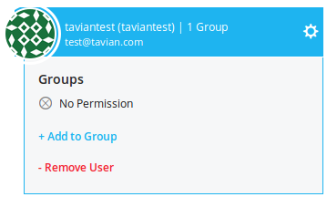
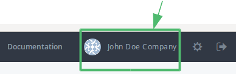
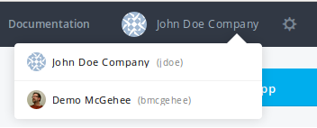
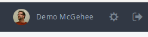
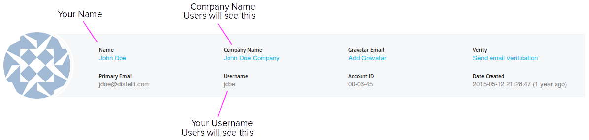

---
layout: default
title: "Managing users"
--- 

You can add other Pipelines users to your account. This allows you to share your account resources with others. This includes your applications, servers, and workflows. To add a user to your account, the user must have a Puppet Pipelines account.

## Add a User to your Account

<ol>
<li>In the Pipelines web UI, click the <b>gear</b> at the top right.</li>
<li>In the menu on the left, click <b>Users</b>. Here you will find any existing users on your team.</li>
<li>Click <b>Add a New User</b>.</li>
<li>In the dialog box, enter the user's <b>email address</b>.</li>
<li>Click the <b>check box</b> for the user you want to add.</li>
<li>Click <b>Add Users</b>.</li>
</ol>

You have added a user to your account.

## Remove a user from your account

You can remove users from your account.

<ol>

<li>While signed in to the Pipelines web UI click the <b>gear icon</b> on the top right to open the Settings page.</li>
<li>Click the <b>Users</b> link on the left.</li>
<li>Find the user you want to remove from your account, and click the <b>blue gear</b> to the right of the user's name.</li>

<li>Click <b>Remove User</b>. A dialog will prompt you "Are you sure you want to delete this user?"</li>
<li>Click <b>Delete</b>.</li>
</ol>

The user is now removed from your account.

## Switching Accounts

You can change your current context to use a different account that you have been made a user of.

<ol>
<li>On the top right, hover your mouse over the Account Company Name</li>

This will cause a dropdown Account selection dialog to appear.

<li>Click the <b>Company Name</b> for the account you wish to work with.</li>

You are now using the account you chose. You can confirm this as the Account Company Name has changed to reflect this.

</ol>

You now have access to the chosen accounts applications, environments, servers, and workflows. This access is dependent on permissions that have been assigned to you. 

## View your account membership

You can see the accounts you have access to.

<ol>

<li>Ensure you are viewing your account</a>.</li>
<li>Click your account <b>company name</b> on the top right.</li>

This will take you to your profile page. Here you will see <b>Accounts I have access to</b>.

</ol>

## Change your account profile

You can set your accounts profile information. This helps users who are members of your account to better differentiate between accounts.

1. Ensure you are viewing your account.
1. Click your account <b>company name</b> on the top right. This will take you to your profile page. 

Here you can set or inspect the following values:

<table>
<tr><th>Value</th><th>Editable</th><th>Description</th></tr>
<tr><td>Name:</td><td>yes</td>          <td>Your Name.</td></tr>
<tr><td>Company Name:</td><td>yes</td>  <td>A Company Name. Users of your account use this when choosing your account.</td></tr>
<tr><td>Gravatar Email:</td><td>yes</td><td>The Gravatar email associated with your Gravatar avatar.</td></tr>
<tr><td>Verify:</td><td>no</td>        <td>Click this to get a validation email from Pipelines.</td></tr>
<tr><td>Primary Email:</td><td>no</td> <td>The email you use to login to Pipelines.</td></tr>
<tr><td>Username:</td><td>no</td>      <td>The username you use in your manifest for this accounts applications.</td></tr>
<tr><td>Account ID:</td><td>no</td>    <td>The account ID</td></tr>
<tr><td>Date Created:</td><td>no</td>  <td>The date the account was created.</td></tr>
</table>

When users choose your account from the account chooser dropdown, they will see your Company Name and your Username, like below.

