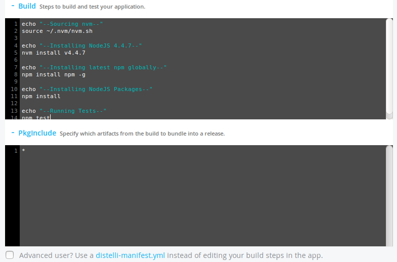

---
layout: default
title: "Creating and building an application"
--- 

In Puppet Pipelines for Applications, an application is code/software that you want to build and deploy. Your application may have one or more of the following:

* Builds
* Deployments
* Environments
* Releases
* Settings

## Create a new application

After you have created an application in Pipelines for Applications, you can build and deploy it.

You can also build your application as a Docker image, and upload it to your Docker Hub account. Once your application is built, you can run your application as a Docker container. 

1. In the Pipelines for Applications web UI, click **Applications**, then click **New App.**
1. On the **New Application** page, select the source control you wish to use. If you have not connected a source control, select one to connect now.

   Puppet Pipelines supports:

   * GitHub
   * GitHub Enterprise
   * Bitbucket
   * Bitbucket Server
   * GitLab
   * Azure DevOps
   
   If you are connecting your source control for the first time, you may be redirected to your provider's website, and prompted to allow Puppet Pipelines to access your repositories. Once you have granted access, you are returned to the New Application page. 
  
   > **Important:** If your code isn't stored in a repository, click **No Repository** and follow the instructions for [Creating an application without a repository](./application-create.html#creating-an-application-without-a-repository).

1. Select the repository that contains your code. 
1. Select the branches you wish to add to the application by doing one of the following: 
    * If you want to add specific branch(es); choose <b>Specific Branches</b> and select the branch(es) you wish to select.
    * If you want to dynamically add branches that match a regular expression pattern, click <b>Matching Regular Expression</b>, and enter the regular expression. For example, 
       <code>release/.*</code> will add all branches with the prefix <b>release/</b>.
1. When you have finished selecting branches, click <b>Next Step</b>. 

Next, you are prompted to configure your build steps. To continue, follow the instructions for your desired build type:

* [Build with Docker](./application-create.html#build-with-docker) - If building with Docker, Pipelines for Applications will build a Docker image and push it to a Docker registry. 
> **Note:**  Building with Docker can also create a Pipelines release.

* [Build Pipelines release](./application-create.html#build-pipelines-release) - If building a Pipelines for Applications release, Pipelines will build a release from your build artifacts, and store the release for deployments. 

### Build with Docker

If you want to build your application as a Docker file, you must have:

* An account with a build image registry, such as Docker Hub, Docker Private Registry, or Google Container Registry.

* A Dockerfile that contains the commands to build your Docker image. Add the Dockerfile to your code repository. For more information on building a Dockerfile, see the documentation on the Docker Dockerfile.

1. In the <b>Configure build steps</b> section, click **Build with Docker** and select your build image registry.

1. Enter the build steps that must be performed before building your Docker image. For example:

   ~~~
   echo "--Sourcing nvm--"
   source ~/.nvm/nvm.sh

   echo "--Installing NodeJS 4.4.7--"
   nvm install v4.4.7

   echo "--Installing latest npm globally--"
   npm install npm -g

   echo "--Installing NodeJS Packages--"
   npm install

   echo "--Running Tests--"
   npm test
   ~~~

   Providing debug statements, like <i>echo</i>, can be helpful to troubleshoot failed builds.

   You do not need to add your Docker build commands. Pipelines will add these when you specify your Docker registry.

1. Enter your application build steps in the provided <b>Build - Steps to build and test your application</b> field any build steps are required. Otherwise, it is safe to leave blank.

1. Click <b>Next Step</b> and continue to the **Review your build configuration** section. 

   Carefully review the contents of the **App Name** field. If you're using a `distelli-manifest.yml` file, the **App Name** field must exactly match the application name set in the `distelli-manifest.yml` file. If there is a mismatch, the application will fail to build.

1. Select which image registry you wish to use. If you are connecting your image registry for the first time, you will be required to enter the following information:

   * **Docker Hub** & **Docker Private Registry**
	   * **Email** - The email used with this Docker registry.
	   * **Username** - The username used with this Docker registry.
	   * **Password** - The password associated with the username for this Docker registry.
	   * **Endpoint** - The Docker registry endpoint.

   * **AWS ECR Container Registry**
	   * **Key Name** - The AWS IAM name with permissions to ECR.
	   * **Access Key** - The AWS Access key associated with the IAM role above.
	   * **Secret Key** - The AWS Secret associated with the Access key above.

   * **Google Container Registry**
	   * You will be required to authenticate your Google account with access to Google Cloud Container Registry.

1. Click **Connect Repo**.

   Different Docker registries represent repositories differently.
   * **Docker Hub** and **Docker Private Registry**: `REGISTRY_USERNAME/REPOSITORY_NAME`
   * **AWS ECR Container Registry**: Select from a list of available registries.
   * **Google Container Registry**: `gcr.io/PROJECT_NAME/DOCKER_IMAGE`

   After the repository is connected, your build steps should include the Docker build instructions.

1. Select a build image and configure auto-build permissions. When you are ready, click <b>Looks good, Start Build!</b>.

### Build Pipelines release

1. In the <b>Configure build steps</b> section, click **Build Pipelines Release**. 

1. In the **build** area, enter your application build steps (if applicable). For example:

   ~~~
   echo "--Sourcing nvm--"
   source ~/.nvm/nvm.sh

   echo "--Installing NodeJS 4.4.7--"
   nvm install v4.4.7

   echo "--Installing latest npm globally--"
   npm install npm -g

   echo "--Installing NodeJS Packages--"
   npm install

   echo "--Running Tests--"
   npm test
   ~~~

   Providing debug statements, like <i>echo</i>, can be helpful to troubleshoot failed builds.

1. In the **PkgInclude** section, enter an `*` (asterisk). An asterisk tells Pipelines to package up all files after the build. If you'd like to specify specific files, see the [PkgInclude documentation](./manifest-build.html#pkginclude).

   

1. Click <b>Next Step</b> and continue to the **Review your build configuration** section. 

   Carefully review the contents of the **App Name** field. If you're using a `distelli-manifest.yml` file, the **App Name** field must exactly match the application name set in the `distelli-manifest.yml` file. If there is a mismatch, the application will fail to build.

1. Select a build image and configure auto-build permissions. When you are ready, click <b>Looks good, Start Build!</b>.

## Creating an application without a repository

If your code isn't in a repository, use the following steps to create and build your application using Pipelines.

> **Before you begin:** [Install the Pipelines agent](./agent.html).

1. Log into your Pipelines account and click **Applications**.
1. Click **New App**. 
1. In the **Connect your application to source control** area, click **No Repository**.   
1. Configure your build steps in the Pipelines build manifest. 
   Build steps determine how your application is built and tested. For example, if you are building a NodeJS application, and need to install NodeJS, one of your build steps can be the command `npm install`.
  1. To see example build steps for your programming language, click the applicable language.
  2. Download the appropriate sample build manifest (`distelli-manifest.yml`) to your application's root directory.
  3. On your machine, edit the build manifest to include the build steps for your application.
  
     > **Tip:** For a full description of the build steps and the order in which they are executed, see [Build and Deployment Steps](./manifest.html).
    
1. When you have finished editing the build manifest, click **I've pushed my Repo**. A summary of your build configuration is shown.
1. Give your new application a name. 
1. To create your application, click **Looks good. Create App!**. 
1. To build your application:
    1. Open a terminal window.
    2. Navigate to your application's root directory, and type `distelli push -m "comment"`, where "comment" is the comment you want to use for the build. For example, "Initial Push".

## Push an application release 

You must push an application to Pipelines to create a release for deployment.

When [integrating with a repository](./application-manage.html) a push is initiated by the build server. A release is created after successful builds and tests.

### Details of a push

When you run a `distelli push`, the following occurs:

1. The Pipelines CLI reads the distelli-manifest.yml file.
1. Any steps specified in the manifest's PreRelease section are executed.
1. The manifest PkgInclude and PkgExclude sections define which, if any, files to bundle into the release.
1. The release files are tar'd and gzip'd into a bundle.
1. The bundle is securely uploaded to the Pipelines account or the configured AWS S3 bucket.
1. The application release number is incremented.
1. A new release is created.
1. The creator of the release and the time the release was created are noted. 

### Create an application manifest

> **Before you begin:** Create the application using the instructions on this page. 

Pushing an application requires a correctly configured `distelli-manifest.yml` file. For more information, see [Application manifest](./manifest.html).

The first line of the distelli-manifest.yml must be `<USERNAME>/<APPLICATION_NAME>:`.

An example distelli-manifest.yml file:

~~~
jdoe/SimpleApp:
Env:
- EXAMPLE: '\This is an example manifest environment variable.\'
PkgInclude:
- application.sh
Exec:
- './application.sh'

~~~

This manifest will push the application <b>SimpleApp</b> to the Pipelines account with user name <b>jdoe</b>. If pushing to a team account, the user name should be the team's user name. The application name must match the application name in Pipelines.

### Push a release

To push a release of an application you must use the [Pipelines CLI](./cli.html). First make sure you are logged into the CLI by using the `distelli login` command.

~~~
$ distelli login

Email: jdoe@distelli.com
Password:
~~~

> **Important:** If you enter your account password incorrectly too many times, a `Failed to login to your Distelli Account, Please check your credentials` message will appear, and your account will be locked as a security precaution. The lock expires in two hours. 

Now you can execute the `distelli push` command. This should be done from the directory where the `distelli-manifest.yml` file is.

~~~
jdoe@HostA:~/SimpleApp$ distelli push
Packaged 1 files in 1 directories
Pushing App: SimpleApp
Uploading Bundle: [==========] 100%

Creating Release... DONE
~~~

You can see the release's details in the Pipelines web UI by clicking the application's name on the **Applications** page and selecting the release in the **App History** pane. You can also use the Pipelines CLI `list` command to show the release.

