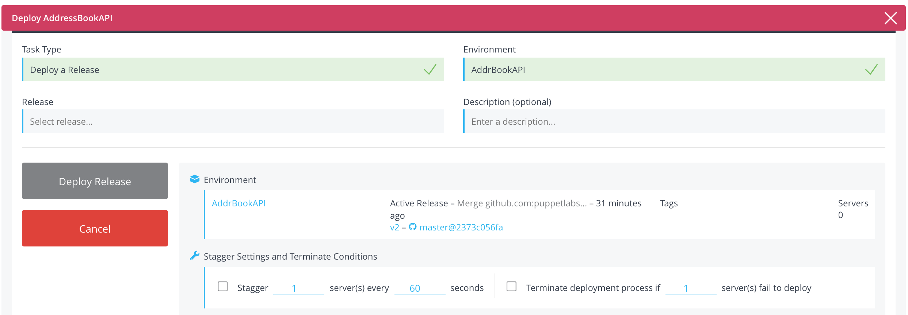
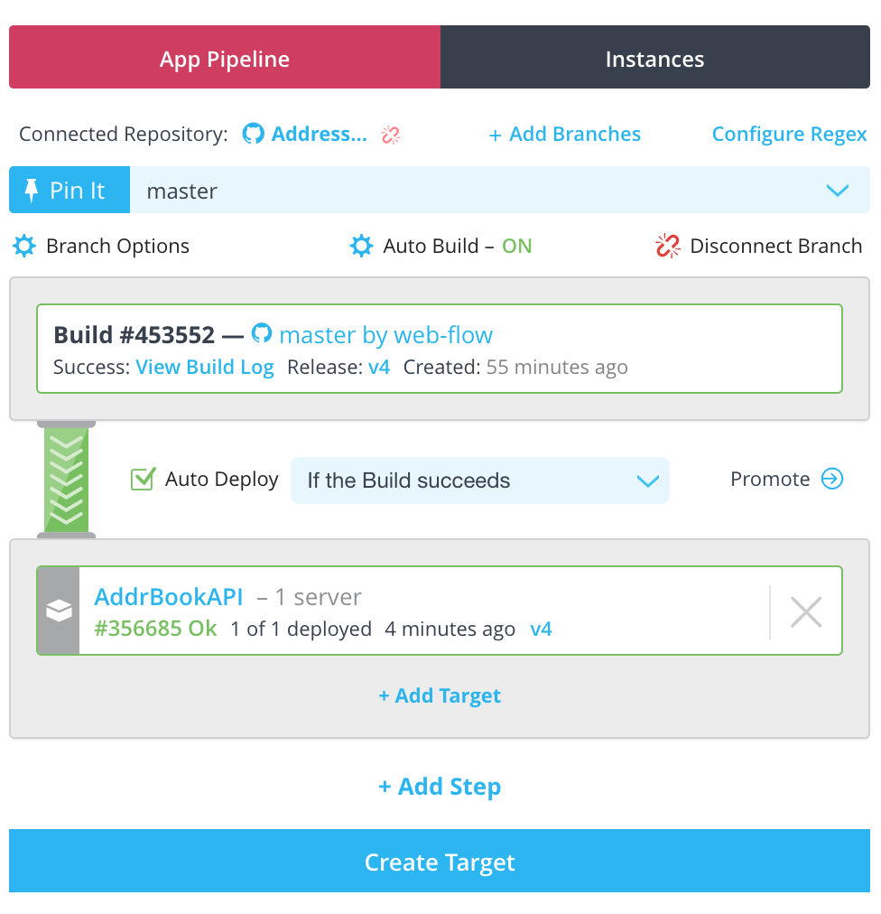

---
layout: default
title: "Deploying applications"
--- 

Deploying applications is a cornerstone of Puppet Pipelines for Applications. Once you have created a release of an application in your Pipelines account, use Pipelines for Applications to deploy the application to servers in an environment.

## Deploy an application

You can deploy applications from the CLI or the web UI.

### Deploying with the CLI

To deploy with the CLI, you must first:
<ol>
<li>Create the application in your Pipelines account.</li>
<li>Push a release version of the application.</li>
<li>Create an environment for the application.</li>
<li>Add one or more servers to the environment.</li>
</ol>

When deploying, ensure you are in the application directory and have a configured `distelli-manifest.yml` file.

* Deploy to an Environment: `distelli deploy --env PRODUCTION`
* Deploy a Specific Release: `distelli deploy --env BETATEST --release v50
* Deploy with Stagger Settings: `distelli deploy --env TEST --stagger-delay 10 --stagger-size 2`

For more information on the Pipelines CLI deploy see [Pipelines CLI](./cli-command.html).

### Deploying with the web UI

To deploy with the web UI, you must:

<ol>
<li>Create the application in your Pipelines account.</li>
<li>Push a release version of the application.</li>
<li>Create an environment for the application.</li>
<li>Add one or more servers to the environment.</li>
<li>Ensure you are signed into the Pipelines web UI.</li>
<li>Navigate to the application you wish to deploy.</li>
<li>Navigate to the environment you wish to deploy to.</li>
</ol>

After you have completed the above steps, you are ready to click the <b>Deploy</b> button for the release you wish to deploy to this environment. You will be presented a dialog box.

You can set the stagger options for the deploy in this dialog. Click the **Deploy Release** button to deploy your application.

## Automatic deployment

Auto-deploy is a feature that provides continuous delivery and continuous deployment. The auto-deploy process can be initiated by a successful build. Auto-deploy functionality is specific to an application.

For more information on auto build see [Enabling auto build](./build.html).

### Prepare for auto-deploy

> **Note:** To configure automatic deployment, your application must have an environment to deploy to. See [Creating an environment](./environment.html). For auto deploy to work, the environment must have one or more servers.

<ol>
<li>In the Pipelines web UI, click <b>Applications</b>.</li>
<li>Navigate to the application you wish to enable auto deploy on.</li>
<li>Ensure you are on the <b>Overview</b> tab.</li>

To the right you will find the <b>App Pipeline</b> selection.

<li>If you have not connected a repository, click <b>Connect a repository to your pipeline</b>.</li>

<li>When your application is connected to a repository click the <b>Add Pipeline for <i>XXXXXXX</i> branch</b> button.</li>

You are ready to configure and enable auto deployments.

</ol>

### Enable auto-deploy

To enable auto deploy you must add <b>steps</b> to your App Pipeline. <b>Steps</b> consist of application environments that will be deployed to.

If you have not added an environment to your application, you can from the App Pipeline. See [Creating an environment from a pipeline](./pipeline.html).

<ol>
<li>In the **App Pipeline** area of the web UI, click <b>Add Step</b>.</li>
<li>Select a new or existing environment to automate deploys to.</li>
<li>Click <b>Add Target</b>.</li>

You now have a step in your App Pipeline. In the example below, the environment <b>AddrBookAPI</b> was added. Also of note, in the depicted examples here, the application already has been built, and the environment has already had successful deploys. You may not see the extra data if your application has not been built or deployed.

<li>Check the <b>Auto Deploy</b> box.</li>

The first step in auto-deploy is to deploy on successful build. This is the only option.

<li>Click <b>Add Step</b>.</li>
<li>From the drop down select another <b>environment</b> to further automate deploys.</li>
<li>Check the <b>Auto Deploy</b> box.</li>
<li>Click the drop down next to Auto Deploy, and select the conditions under which automatic deployment should take place.</li>

For any auto deploy condition to be "stepped through," the build must be successful.

<table>
<tr><td><b>Auto Deploy condition</b></td><td><b>Explanation</b></td></tr>
<tr><td>If all Deployments complete</td><td>If all above deployments complete, deploy to the next step in the app pipeline. A completed deployment can be successful or failed.</td></tr>
<tr><td>If all Deployments succeed</td><td>If all of the above deployments succeed, deploy to the next step in the app pipeline.</td></tr>
<tr><td>If any Deployments completes</td><td>If ANY above deployment completes, deploy to the next step in the app pipeline. A completed deployment can be successful or failed.</td></tr>
<tr><td>If any Deployments succeeds</td><td>If ANY above deployment succeeds, deploy to the next step in the app pipeline.</td></tr>
</table>
 

</ol>

You can continue adding steps (environments) for auto-deploy. Think of the App Pipeline as the automation setup for builds and deploys.

It is strongly recommended that after setting up an App Pipeline for an application a Dashboard should be setup to visualize and provide other functionality inluding:

<ul>
<li>Continuous Delivery.</li>
<li>Promotion of a release from one environment to the next.</li>
<li>Ability to rollback an environment to a previous release.</li>
<li>Insights into your current builds and deployments.</li>
</ul>

### Disable automatic deployment

<ol>
<li>In the Pipelines web UI, click <b>Applications</b>.</li>
<li>Navigate to the application you wish to disable auto deploy.</li>
<li>Ensure you are on the <b>Overview</b> tab.</li>
<li>Ensure you select the <b>Branch</b> you wish to disable auto deploy.</li>
<li>For the auto deploy step you wish to remove, uncheck the <b>Auto Deploy</b> box.</li>
</ol>

## Viewing a deployment

Application deployments can be viewed while in progress or after completion.
Application deployments can be viewed in the Pipelines web UI or listed with the Pipelines CLI.

### View a deployment with the web UI

Viewing an application deployment in the Pipelines web UI will give you access to logs, including live logs for deployments currently in progress.

To view your deployment:
<ol>
<li>Navigate to the application you wish to see a deployment.</li>
<li><b>Optional.</b> In the <b>Overview</b> tab, click <b>type</b> in the filter bar, and select <b>DEPLOY</b>.</li>
<li>Find the deployment you wish to view in the App History list and click the deploy icon or deploy number.</li>
</ol>

### View a deployment with the CLI

You can list deployments for a specific application with the Pipelines CLI. The syntax is:

~~~
distelli list deployments -n APPLICATION_NAME

~~~

Here is an example session:

~~~
$ distelli list deployments -n BashSimpleApp
+---------------+------------------------+------------------------+------------------------------------------+-------------+
| App Name | Deployment Id | Release Id | Deployed | Description |
+---------------+------------------------+------------------------+------------------------------------------+-------------+
| BashSimpleApp | d-338ifi5owr769793a9f1 | a-o3tyk6v71pd096f5e609 | 2015-05-08 20:57:43 UTC (3 months ago) | Test1 |
| BashSimpleApp | d-y6d5z3wswq9b52c636f4 | a-q6qadg0zta455f189d0d | 2015-05-11 16:53:46 UTC (3 months ago) | Test2 |
| BashSimpleApp | d-ba1k0e1ahldb648a548d | a-038hp3d0fvf90e86b823 | 2015-05-11 17:03:55 UTC (3 months ago) | Test3 |
| BashSimpleApp | d-z9gyxktri772d5ba60f6 | a-e6qao45n5me8cfe5ae27 | 2015-05-29 23:07:22 UTC (2 months ago) | Test4 |
| BashSimpleApp | d-k6qwo6lphmde9f364e5d | a-e6qao45n5me8cfe5ae27 | 2015-08-17 15:58:49 UTC (40 minutes ago) | |
+---------------+------------------------+------------------------+------------------------------------------+-------------+
bmcgehee@distelli-BM:~/Applications/BashSimpleApp$
~~~

## How Pipelines for Applications deploys your application

This document will technically define how Pipelines does a deployment of your application.

This will be outlined by Pipelines manifest phases. For more information on manifest phases, please see [manifest](./manifest.html).

### Begin

When a deployment begins, the Pipelines agent is contacted on a host and sent the Pipelines manifest.

The Pipelines agent will create a unique directory. The name of this directory is:

~~~
/DISTELLI_ROOT/_apps/APPLICATION_NAME.ENVIRONMENT_NAME.DEPLOYMENT_ID/
~~~

<ul>
  <li><b>DISTELLI_ROOT</b> - The directory the agent was installed with using the <code>--data-dir</code> option. If not specified, this will default to <code>/distelli</code>.</li>
  <li><b>APPLICATION_NAME</b> - The name, in Pipelines, of the application being deployed.</li>
  <li><b>ENVIRONMENT_NAME</b> - The name, in Pipelines, of the application environment being deploy to.</li>
  <li><b>DEPLOYMENT_ID</b> - The ID, in Pipelines, of the deployment. Typically in the format of <code>d-abcdefghijklmnopqrst</code>.</li>
</ul>

The directory is available as an environment variable <code>DISTELLI_INSTALLHOME</code>

The agent creates shell scripts (or batch files for Windows deployments) for each section of the manifest. They are put in the bin/ directory under DISTELLI_INSTALLHOME.

### Env

The <b>Env</b> section of the manifest allows a user to create environment variables that are available during every phase of the deployment. It is important to note that environment variables in the Pipelines web UI will override the same environment variable in the Pipelines manifest.

### PreInstall

During this phase, the Pipelines agent will run the [`bin/distelli-preinstall.sh`](./manifest-deploy.html) file. If there is no `bin/distelli-preinstall.sh` file, nothing will happen.

### Install

During this phase, one of two things will happen. If the user has included steps in the Pipelines manifest for the install phase, they will be executed as [`bin/distelli-install.sh`](./manifest-deploy.html).

If there are no steps in the Pipelines manifest install phase, then Pipelines will deliver the Pipelines release to the server. Realize the Pipelines release is a tarball of the release artifacts from the build process that Pipelines packaged up into a release.

After the directory is created, the Pipelines agent will next retrieve the release tarball. It is important to note that the agent gunzips and untars the 
release inline while the stream is being delivered to the host. This can be CPU intensive.

If the application is a [secure, encrypted application](./application-secure.html) the Pipelines agent will decrypt the release during download.

The delivered release will be in the same directory structure, captured after the build, based on the [PkgInclude](./manifest-build.html) and [PkgExclude](./manifest-build.html) sections of the Pipelines manifest.

### PostInstall

During this phase, the Pipelines agent will run the [`bin/distelli-postinstall.sh`](./manifest-deploy.html) file. If there is no `bin/distelli-postinstall.sh` file, nothing will happen.

### Stop

During this phase, the Pipelines agent will stop any previously started process in the Pipelines manifest [Exec](./manifest-deploy.html) section for this application environment.

There is no Pipelines manifest section for this phase.

### Flip

During this phase, the Pipelines agent will symbolically link the created deployment directory DISTELLI_INSTALLHOME to the application working directory DISTELLI_APPHOME which is in the format of: 

~~~
/DISTELLI_ROOT/envs/ENVIRONMENT_NAME/
~~~

This symbolic link replaces the previous deploys symbolic link.

There is no Pipelines manifest section for this phase.

### PreStart

During this phase, the Pipelines agent will run the [`bin/distelli-prestart.sh`](./manifest-deploy.html) file. If there is no `bin/distelli-prestart.sh` file, nothing will happen.

### Start

During this phase, the Pipelines agent will run the [`bin/distelli-start.sh`](./manifest-deploy.html) file. If there is no `bin/distelli-start.sh` file, nothing will happen.

### Exec

During this phase, the Pipelines agent will run the [`bin/distelli-exec.sh`](./manifest-deploy.html) file. If there is no `bin/distelli-exec.sh` file, nothing will happen.

You must not use the Exec and Start sections of the manifest at the same time. Exec takes precedence if both are used. For more information see [Understanding Manifest Exec vs Start](./manifest.html).

The Exec section should be used for starting long-lived foreground processes. Any process started in this section will be monitored by the Pipelines Agent. If the process terminates, the Pipelines Agent will attempt to restart it by rerunning the `bin/distelli-exec.sh` script.

### PostStart

During this phase, the Pipelines agent will run the [`bin/distelli-poststart.sh`](./manifest-deploy.html) file. If there is no `bin/distelli-poststart.sh` file, nothing will happen.

### Done

Any previous deployment DISTELLI_INSTALLHOME directory is removed.
