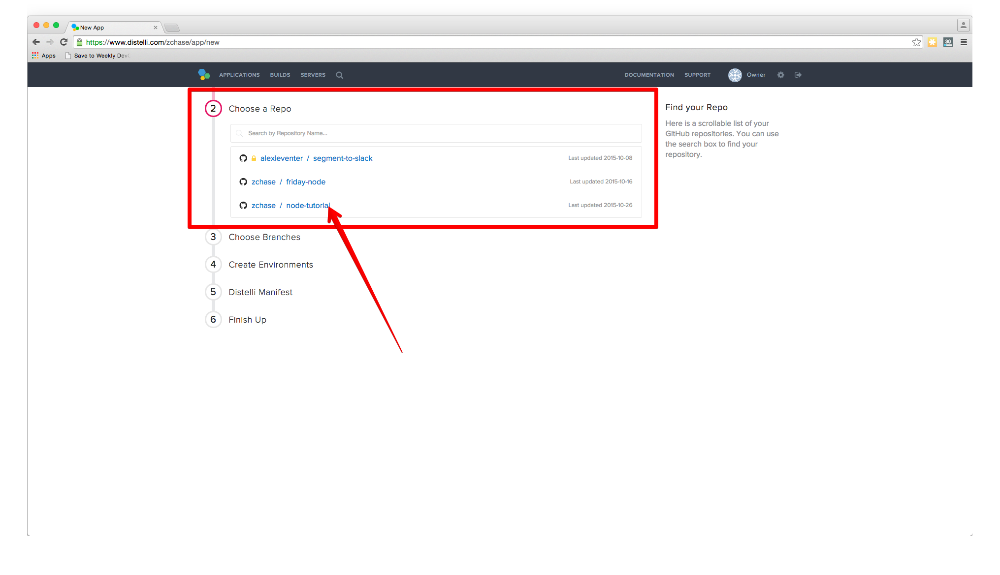

[Grunt](http://gruntjs.com) is a tool for automating repetitive tasks like minification, compilation, unit testing, and linting. You can use Pipelines for Applications to take things one step further and automate your Grunt tasks during your builds and deployments. 

When using Pipelines for Applications with Grunt you can completely automate tasks such as: 

* Checking your Javascript syntax during builds
* Minify your HTML, CSS, & JS files before deployments
* Compile Jade Templates
* [And much more](http://gruntjs.com/plugins)

The following steps will help you get set up with Grunt and run a few tasks against a sample Node.js Application.

## Prerequisites

To complete this tutorial you will need to:

* [Create a free Pipelines account](https://pipelines.puppet.com/signup)
* Have a working knowledge of Javascript 
* Have a repository set up in GitHub/BitBucket

After you have completed those three tasks you will be ready to get your application set up with Pipelines for Applications and Grunt. 

## Step 1. Set up project

The first step we need to take is to get our project structured correctly on our local machine. I am running a simple Node.js "Hello World" application so my project directory is relatively flat. Here are the steps to take to set up your project to exactly like mine

* Open your terminal/command line
* Navigate to the directory you want to store your application
* Create the application folder `mkdir <YOUR APP NAME>` then navigate to the folder `cd <YOUR APP NAME>`
* Create the following files 
	* `app.js`
	* `Gruntfile.js`
* Enter the command `npm init` following the prompts
* Run these commands after finishing the `npm init` prompts:

~~~~
$ npm install express --save-dev
$ npm install grunt --save-dev
~~~~

* Create a GitHub/BitBucket repository for your project

Now that we have our project set up on our local machine, we are ready to make a few changes to our files. The first thing we are going to do is create our Node.js app. Open your `app.js` file in your favorite text editor and paste in the code below:

~~~~

var express = require('express');
var app = express();

app.get('/', function(req, res){
  res.send('Hello World');
});

var server = app.listen(3000, function(){
  console.log('Magic is happening on port 3000');
});

~~~~

Return to your terminal, make sure you are still in your projects directory, and enter the command `node app.js`. Point your browser towards `localhost:3000` and you should see "Hello World" displayed on the page

Now that we have our Node.js app all set up, we will create our Grunt file! Open `Gruntfile.js` in your favorite text editor and paste in the below code

~~~~
// Gruntfile.js

// our wrapper function (required by grunt and its plugins)
// all configuration goes inside this function
module.exports = function(grunt) {

  // ===========================================================================
  // CONFIGURE GRUNT ===========================================================
  // ===========================================================================
  grunt.initConfig({

    // get the configuration info from package.json ----------------------------
    // this way we can use things like name and version (pkg.name)
    pkg: grunt.file.readJSON('package.json'),

    // all of our configuration will go here
    // configure jshint to validate js files -----------------------------------
     jshint: {
       options: {
         reporter: require('jshint-stylish') // use jshint-stylish to make our errors look and read good
       },

       // when this task is run, lint the Gruntfile and all js files in src
       build: ['Grunfile.js', 'app.js']
     }

    });

  // ===========================================================================
  // LOAD GRUNT PLUGINS ========================================================
  // ===========================================================================
  // we can load these only if they are in our package.json
  // make sure you have run npm install so our app can find these
  grunt.loadNpmTasks('grunt-contrib-jshint');

};
~~~~

The file above is your `Gruntfile.js`. This file is what configures Grunt tasks, and also assigns the Grunt tasks to specific commands. In the file we are getting the configuration info from our `package.json`, then we are adding in our configuration to the jshint plugin, and finally we are loading the task at the bottom. For more detailed information on Grunt files and how to structure them, visit the [GruntJS website](http://gruntjs.com/sample-gruntfile). 

Save this file, return to your terminal, and enter the following commands

~~~~
$ npm install grunt-contrib-jshint --save-dev
$ npm install jshint-stylish --save-dev
~~~~

The above commands are installing the the JSHint Grunt plugin for your project. JSHint is a tool that helps to detect errors and potential problems in your JavaScript code. Grunt allows you to run an assortment of tasks on your Javascript code, but for this tutorial I will be showing you how set up JSHint to detect errors. Return to your terminal and enter the following command:

~~~~
$ grunt jshint
~~~~

You should see an output similar if not identical to this:

~~~~
Running "jshint:build" (jshint) task

✔ No problems

Done, without errors.
~~~~

Open your `app.js` file and remove the semicolons from the last block of code:

~~~~
var server = app.listen(3000, function(){
  console.log('Magic is happening on port 3000')
})
~~~~

Now run the `grunt jshint` command and you should see a failure similar to the below output

~~~~
Running "jshint:build" (jshint) task

app.js
  line 9   col 49  Missing semicolon.
  line 10  col 3   Missing semicolon.

  ⚠  2 warnings

Warning: Task "jshint:build" failed. Use --force to continue.

Aborted due to warnings.
~~~~

As you can see, the JSHint build failed because of the missing semicolons. Add the semicolons back in so the test will no longer fail, and push your code into your GitHub/BitBucket repository. Now that everything is all set up on our local machine, we can now set up our build steps in Pipelines for Applications.

## Step 2. Create Pipelines application

To create your application, follow these steps:

In the Pipelines for Applications web UI, click **Applications**, then click <b>New App</b>.

Name your app and then select the Repository you would like to connect to. As a reminder, we have been using GitHub as our repository.

After we click the button to connect to our Repository, we then select the appropriate repo that contains our code. In this example I store my code in the repo name 'node-tutorial'. Make sure to select the repo we set up earlier in the tutorial.

Then select the appropriate branch for your deployment. I have only a master branch, but you can deploy any branch from your repo!

### Create distelli-manifest.yml

You will need to create a `distelli-manifest.yml` file so you can tell Pipelines for Applications what your build and deployment steps are. Create a `distelli-manifest.yml` in your project's directory and paste the below contents into your file:

> **Note:** Replace <-username-> with your Pipelines username & <-app name-> with your application's name.

~~~~
<-username->/<-app name->:

PkgInclude:
  - '*'

PkgExclude:
  - node_modules/

PreRelease:
  - npm install
  - grunt jshint

PreInstall:
  - sudo apt-get update
  - sudo apt-get install nodejs -y
  - sudo apt-get install npm -y

PostInstall:
  - npm install

Exec:
  - /usr/bin/nodejs app.js
~~~~

You can see that in the `PreRelease` section we added our command to run the JSHint task. During the build phase of our application we want to run our task to make sure the syntax of our Javascript is error-free.

When you make these changes to your manifest file, you will have to make sure all of spacing and indentation lines up or you will encounter an error when building/deploying. Now that we have made the necessary changes to our manifest file we can push these updates into our repo and continue with our deployment. After you have pushed your changes, select the **I’ve pushed my Repo** button.

### Push files into BitBucket/GitHub

Now that all of our files have been created you will need to push them into your repository. Once you have pushed all of your files into a repository you are ready to run your automated tasks!

### Build steps

Next Pipelines for Applications will ask you set your build steps. You will need to the lower part of the section and check the box that says "Advanced User? Use a distelli-manifest.yml instead of editting your build steps in the app". Instead of using the Builds Steps, we will use the `distelli-manifest.yml` file we just created.

The final step is to select our Build Image. In this case we are going to select "Distelli Javascript (Docker)" for our Node.js App. Select the "Auto Build" checkbox and the the "Looks good. Start Build!".

Now our build should be automatically building. You can watch its progress in the **Builds** page. You should see that your build has been built successfully.

Congrats! Now let's remove the semicolons from our `app.js`, and push those changes into our repository. Now return to your Builds page and see what happens.

See how the build failed because of the missing semicolons? Because the syntax of your `app.js` file had errors, the JSHint task was aborted, and in turn failed the build of your code.

## Step 3. Deploy Your Application

* [Digital Ocean](./application-nodejs-digitalocean.html)
* [AWS](./deployment-nodejs-ec2.html)

