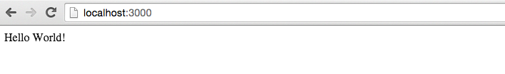
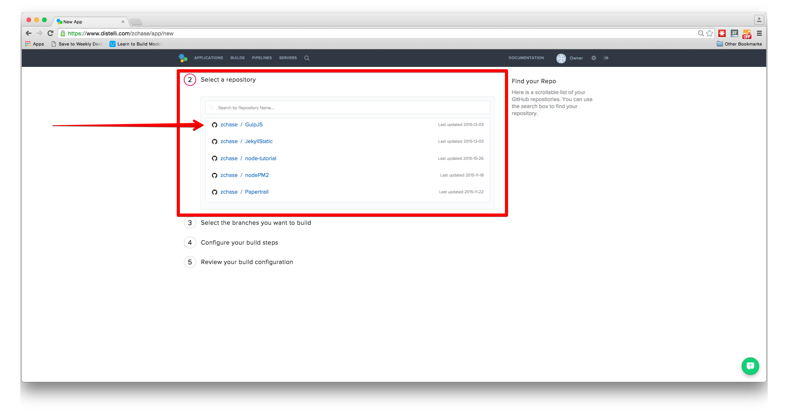
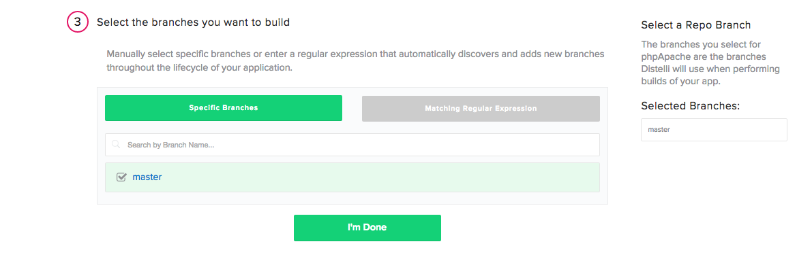
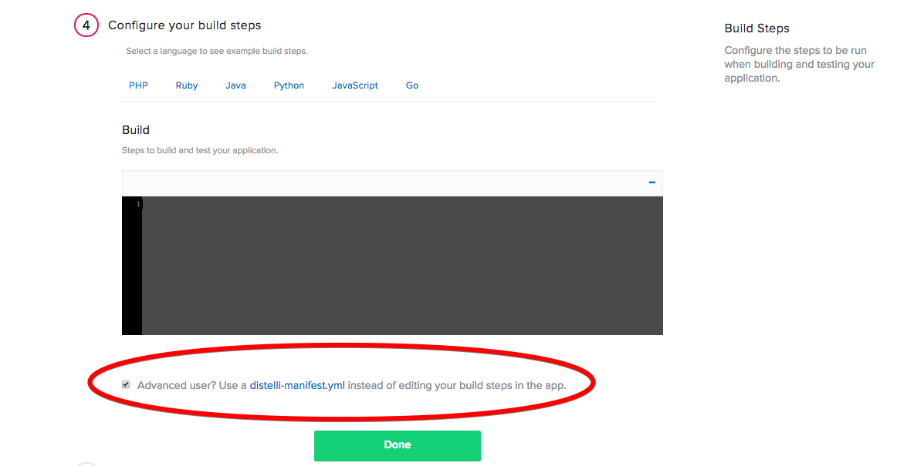
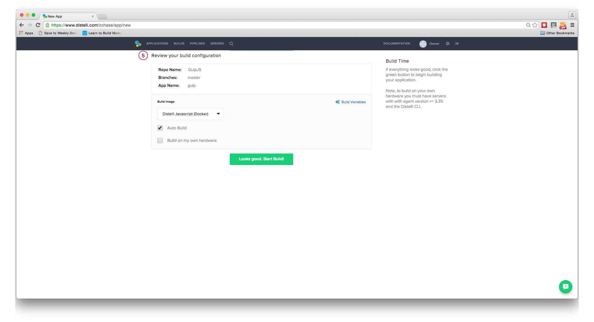
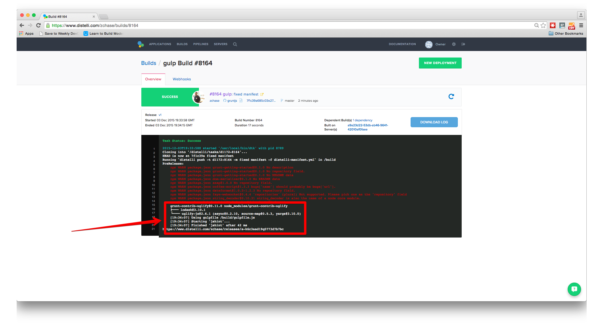
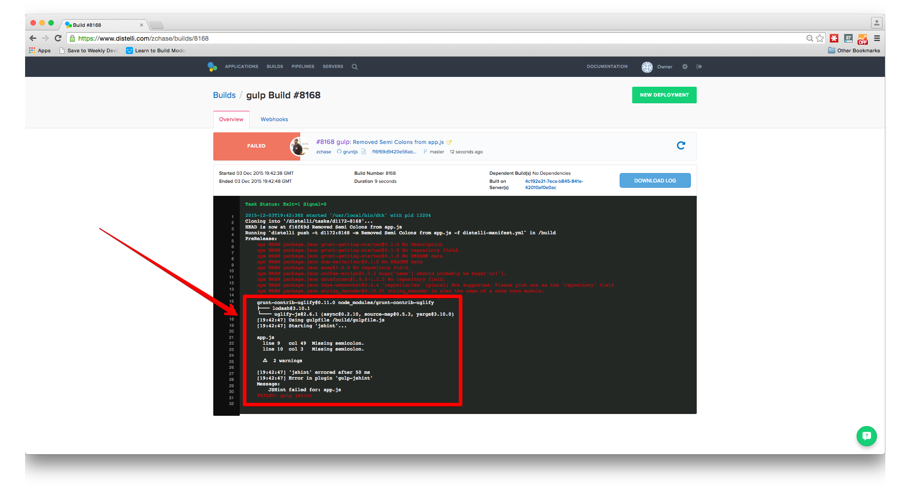

## Prerequisites

To complete this tutorial you will need to:

* Have a working knowledge of Javascript 
* Have a GitHub/BitBucket account

Once you have completed those three tasks you will be ready to get your application set up with Pipelines for Applications and Gulp.js. 

## Step 1. Set up the project

The first step we need to take is to get our project structured correctly on our local machine. I am running a simple Node.js "Hello World" application so my project directory is relatively flat. Here are the steps to take to set up your project to exactly like mine:

* Create a [GitHub](https://github.com/) or [BitBucket](https://bitbucket.org/) repository for your project
* Open your terminal/command line
* Navigate to the directory you want to store your application
* Create the application folder `mkdir <YOUR APP NAME>` then navigate to the folder `cd <YOUR APP NAME>`
* Create the following files 
	* `app.js`
	* `gulpfile.js`
* Enter the command `npm init` and follow the prompts
* Next run these commands after finishing the `npm init` prompts

~~~~
$ npm install express --save-dev
$ npm install gulp --save-dev
~~~~

### Create Node.js Application

Now that we have our project set up on our local machine, we are ready to make a few changes to our files. The first thing we are going to do is create our Node.js app. Open your `app.js` file in your favorite text editor and paste in the code below:

~~~~
var express = require('express');
var app = express();

app.get('/', function(req, res){
  res.send('Hello World');
});

var server = app.listen(3000, function(){
  console.log('Magic is happening on port 3000');
});
~~~~

Return to your terminal, make sure you are still in your projects directory, and enter the command `node app.js`. Point your browser towards `localhost:3000` and you should see "Hello World" displayed on the page

### Create gulpfile.js

Now that we have our Node.js app all set up, we will create our Gulp.js file! Open `gulpfile.js` in your favorite text editor and paste in the below code

~~~~
var gulp = require('gulp'),
  gutil = require('gulp-util'),
  jshint = require('gulp-jshint');

// define the default task and add the watch task to it
gulp.task('default', ['watch']);

// configure the jshint task
gulp.task('jshint', function() {
  return gulp.src('app.js')
    .pipe(jshint())
    .pipe(jshint.reporter('jshint-stylish'))
    .pipe(jshint.reporter("fail"));
});

// configure which files to watch and what tasks to use on file changes
gulp.task('watch', function() {
  gulp.watch('source/javascript/**/*.js', ['jshint']);
});
~~~~

The file above is your `gulpfile.js`. This file is what configures Gulp.js tasks, and also assigns the Gulp.js tasks to specific commands. If you want to learn more about Gulp.js tasks and the structure of `gulpfile.js`, visit the[Gulp.js documentation](https://github.com/gulpjs/gulp/blob/master/docs/API.md).

Once you have created your `gulpfile.js` save it, return to your terminal, and enter the following commands:

~~~~
$ npm install gulp --save-dev
$ npm install gulp-util gulp-jshint --save-dev
~~~~

### Run local Gulp tasks

The above commands are installing Gulp and the JSHint linting plugin in your project. After installing gulp, the plugin, and have created a `gulpfile.js` you can run the below command to run your Gulp task

~~~~
$ gulp jshint
~~~~

You should see an output similar if not identical to this:

~~~~
[14:01:12] Using gulpfile ~/ws/src/grunt/gulpfile.js
[14:01:12] Starting 'jshint'...
[14:01:12] Finished 'jshint' after 47 ms
~~~~

Open your `app.js` file and remove the semicolons from the last block of code:

~~~~
var server = app.listen(3000, function(){
  console.log('Magic is happening on port 3000')
})
~~~~

Now run the `gulp jshint` command and you should see a failure similar to the below output:

~~~~
[14:07:11] Using gulpfile ~/ws/src/grunt/gulpfile.js
[14:07:11] Starting 'jshint'...

app.js
  line 9   col 49  Missing semicolon.
  line 10  col 3   Missing semicolon.

  ⚠  2 warnings

[14:07:11] 'jshint' errored after 52 ms
[14:07:11] Error in plugin 'gulp-jshint'
Message:
    JSHint failed for: app.js
~~~~

As you can see, the JSHint build failed because of the missing semicolons. Add the semicolons back in so the test will no longer fail, and push your code into your GitHub/BitBucket repository. Now that everything is all set up on our local machine, we can now set up our Build steps in Pipelines for Applications.

## Step 3. Create Pipelines application

If you do not have a Pipelines account, please [sign up](http://pipelines.puppet.com/signup) for one now. To create your app, follow these steps:

In the Pipelines for Applications web UI, click **Applications**, then click <b>New App</b>.

Name your app and then select the repository type where you are storing your applications files. 

After we click the button to connect to our repository, we then select the appropriate repo that contains our code.

Then select the appropriate branch for your deployment. I have only a master branch, but you can deploy any branch from your repo!

### Create distelli-manifest.yml

You will need to create a `distelli-manifest.yml` file so you can tell Pipelines for Applications what your build and deployment steps are. Create a `distelli-manifest.yml` in your project's directory and paste the below contents into your file:

> **Note:** Replace <-username-> with your Pipelines username & <-app name-> with your application's name.

~~~~
<-username->/<-app name->:

PkgInclude:
  - '*'

PkgExclude:
  - node_modules/

PreRelease:
  - npm install
  - gulp jshint

PreInstall:
  - sudo apt-get update
  - sudo apt-get install nodejs -y
  - sudo apt-get install npm -y

PostInstall:
  - npm install

Exec:
  - /usr/bin/nodejs app.js
~~~~

You can see that in the `PreRelease` section we added our command to run the JSHint task. During the build phase of our application we want to run our task to make sure the syntax of our Javascript is error-free.

When you make these changes to your manifest file, you will have to make sure all of spacing and indentation lines up or you will encounter an error when building/deploying. Now that we have made the necessary changes to our manifest file we can push these updates into our repo and create our application.

### Push files into BitBucket/GitHub

Now that all of our files have been created, you will need to push them into your repository. Once you have pushed all of your files into a repository you are ready to run your automated tasks with Pipelines for Applications!

### Build steps

Next Pipelines will ask you set your build steps. You will need to the lower part of the section and check the box that says "Advanced User? Use a distelli-manifest.yml instead of editting your build steps in the app". Instead of using the Builds Steps, we will use the `distelli-manifest.yml` file we just created.

The final step is select our Build Image. In this case we are going to select "Distelli Javascript (Docker)" for our Node.js App. Select the "Auto Build" checkbox and the the "Looks good. Start Build!".

Now our build should be automatically building. You can watch its progress in the builds tab on your Pipelines account. You should see that your build has been built successfully.

Congrats! Now let's remove the semicolons from our `app.js`, and push those changes into our repository. Now return to your **Builds** page and see what happens.

See how the build failed because of the missing semicolons? Because the syntax of your `app.js` file had errors, the JSHint task was aborted, and in turn failed the build of your code. 

You can run every Gulp.js task with Pipelines for Applications. Please visit the [Gulp.js Plugin Library](http://gulpjs.com/plugins) to learn about all of the different tasks you can automate with Gulp and Pipelines for Applications.

