 

In this tutorial we will go through how to automate the build and deployments of a Hugo website. We will take a sample Hugo blog and I will show you how to automate the build and the deployment process.

### Before You Begin

Before we begin, make sure to have the following:

- A server to deploy to
- Hugo installed on your local machine. For steps to install install Hugo, visit this <a href="https://gohugo.io/overview/installing/" target="_blank">link</a>.

### Setting Up

To set up our project, we create a project directory and initialize our Hugo site. In your terminal, navigate to where you want to store your files.

Create your project folder by entering the following commands. `mkdir HugoSite` creates a folder from the terminal, and then you enter `cd HugoSite` to navigate to that folder.
~~~
~ $ mkdir HugoSite
~ $ cd HugoSite
~~~

Initialize Hugo project by using the command below. This command creates all the necessary files and structure your project automatically.
~~~
$ hugo new site .
~~~

## Step 1. Create a Hugo Content

For this tutorial, we will create a sample page for our Hugo site. If you already have a Hugo site, you can skip this step. Navigate to your project's directory, and enter the following command to create a sample page:

~~~
$ hugo new about.md
~~~

This command creates an `about.md` file in the content directory. Open `about.md` in your favorite text editor. Here are the following changes I made, but feel free to make your own.

> **Note:** Remember: Hugo content is written in markdown format.

~~~
---
layout: default
title: 
"2016-01-18T11:23:15-08:00"
draft = true
title = "about"
+++
 

## Welcome to Hugo!

This site has been built and deployed by Distelli!
~~~

Next, we need to add themes for our Hugo site. The following command installs the latest version of all available Hugo themes:

~~~
$ git clone --depth 1 --recursive https://github.com/spf13/hugoThemes.git themes
~~~

Once the themes have finished installing, you can test your Hugo site by enter the following command:

~~~
$ hugo server --theme=hyde --buildDrafts
~~~

You should see an output similar to this:

~~~
0 draft content
0 future content 
0 pages created
0 paginator pages created
0 tags created
0 categories created
in 11 ms
Serving pages from /Users/zack/ws/src/hugo/public
Web Server is available at http://127.0.0.1:1313/
Press Ctrl+C to stop
~~~

Navigate to <b>localhost:1313/about</b> to see the sample Hugo page.

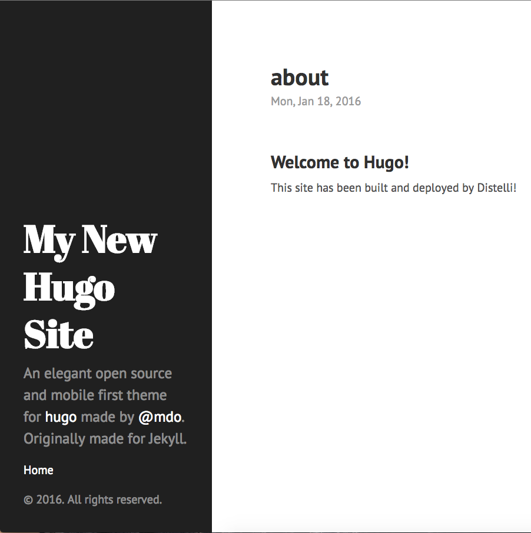

### config.toml

In your project there is a `config.toml` file. This file is used to configure your Hugo site. Make the necessary changes to your file. If you do not have a domain name, leave the base url section blank for now.

~~~
baseurl = ""
languageCode = "en-us"
title = "My New Hugo Site"
~~~

## Step 2. Push Files to a Repository

### Create a Git Ignore File

We will be building our static site using Pipelines for Applications. To make sure we are always building our latest content, we need to define a Git ignore file so that we store only raw content in our repository. Create a `.gitignore` file in the root of your project's directory and paste the following:

~~~
public/
.DS_Store
~~~

The next step is to push our content into a source control repository. Create a GitHub or BitBucket repository to store your code (I am using a GitHub repository for this tutorial).
Create a repository and then push your code to that repository.

For more information on how to create a repository:

* <a href="https://help.github.com/articles/adding-an-existing-project-to-github-using-the-command-line/" target="_blank">GitHub</a>
* <a href="https://confluence.atlassian.com/bitbucket/create-a-repository-221449521.html" target="_blank">BitBucket</a>

## Step 3. Set up your Server

> **Note:** You will need remote access to the server you are deploying to.

The next step is to set up our server to serve our Hugo static website. There are two steps to complete before your server is ready to be deployed to: 

1. Install and configure Apache. 
2. Install the Pipelines Agent

> **Note:** I am using an Ubuntu 14.04 server

### Install and Configure Apache

The following commands will install Apache on your server

~~~
$ sudo apt-get update
$ sudo apt-get install apache2 -y
~~~

Once everything has installed successfully navigate to your server's IP address, and view the Apache2 default page.

The page you are viewing is an `index.html` page that was generated by Apache. The file is located in the `/var/www/html/` directory. This is where we are going to store the generated Hugo files.

### Install Pipelines Agent on Your Server

To be able to deploy your application to your server you will need to install the Pipelines Agent. You will need remote access to your server to complete the installation. Please consult the below information on how to install the Pipelines Agent on your server.

> **Note:** This installation requires root (administrator) permissions.

<h3>Linux and macOS X</h3>

To install on Linux or macOS X you can use either curl <b>or</b> wget with one of the following syntaxes.
<h4>wget example</h4>

~~~
wget -qO- https://pipelines.puppet.com/download/client | sh
~~~

<h4>curl example</h4>

~~~
curl -sSL https://pipelines.puppet.com/download/client | sh
~~~

<h3>Windows</h3>

To install on Windows copy and paste the following powershell command into a command (cmd) window.

~~~
powershell -NoProfile -ExecutionPolicy Bypass -Command "iex ((new-object net.webclient).DownloadString('https://pipelines.puppet.com/download/client.ps1'))" & SET PATH=%PATH%;%ProgramFiles%/Distelli
~~~

<h3>Complete the Install</h3>

To complete the install of the agent, you must issue the `sudo /usr/local/bin/distelli agent install` command.

~~~
sudo /usr/local/bin/distelli agent install
~~~

~~~
ServerA:~$ <b>wget -qO- https://pipelines.puppet.com/download/client | sh</b>
This script requires superuser privileges to install packages
Please enter your password at the sudo prompt

[sudo] password for bmcgehee: 
    Installing Distelli CLI 3.51 for architecture 'Linux-x86_64'...
    Downloading https://s3.amazonaws.com/download.distelli.com/distelli.Linux-x86_64/distelli.Linux-x86_64-3.51.gz
To install the agent, run:
    sudo /usr/local/bin/distelli agent install
ServerA:~$ <b>sudo /usr/local/bin/distelli agent install</b>
Distelli Email: jdoe@distelli.com
      Password: 
    1: User: jdoe
    2: Team: janedoe/TeamJane
Team [2]: <b>1</b>
Server Info: https://www.distelli.com/jdoe/servers/12345678-4765-ac42-bd7a-080027c8277c
Starting upstart daemon with name:  
~~~

If you would like more information on installing the Pipelines agent, visit [Installing the Pipelines Agent](./agent.html). 

## Step 4. Create Pipelines Application

If you do not have a Pipelines account, [sign up](https://pipelines.puppet.com/signup) for one now. To create your app in Pipelines, follow these steps:

Click the <b>New App</b> button on your Pipelines account home screen

Select the repository type where you are storing your applications files. 

After we click the button to connect to our repository, we select the appropriate repo that contains the files.

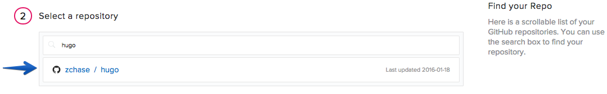

Select the appropriate branch for your deployment. I have only a master branch, but you can deploy any branch from your repo.

Next, we are prompted to set our build steps. Leave this section blank for now. We will set our build steps after our application has been created.

The final step is select our Build Image. In this case, we are going to select "Distelli Base (Docker)" for our Hugo Website. Make sure the <b>Auto Build</b> checkbox is disabled, and click <b>Looks good. Start Build!</b>.

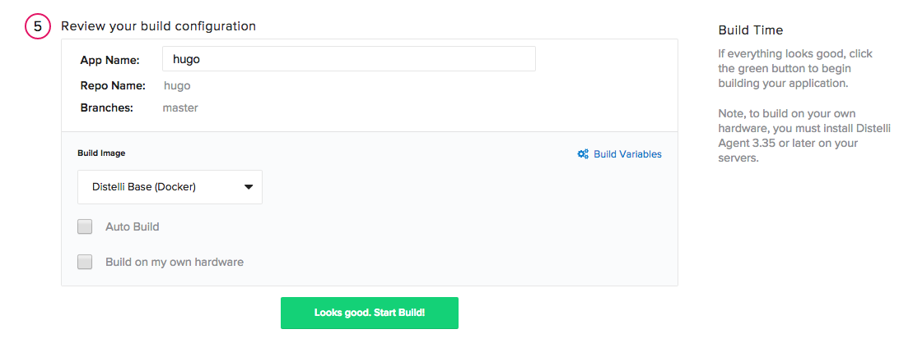

### Configure the Build and Deploy Steps

Once your application has been created, navigate to your <b>Application</b> page and open your newly created application.

Click the <b>Manifest</b> tab.

Expand the <b>Build Manifest</b> section by clicking on the plus sign. This is where we are going to configure the commands to run during our Deployment.

#### PreBuild Steps

Scroll down to your PreInstall section and enter in the following:

~~~
wget -q https://github.com/spf13/hugo/releases/download/v0.14/hugo_0.14_linux_amd64.tar.gz -O hugo_0.14_linux_amd64.tar.gz
tar -zxf hugo_0.14_linux_amd64.tar.gz
ln -sf ./hugo_0.14_linux_amd64/hugo_0.14_linux_amd64 hugo
git clone --depth 1 --recursive https://github.com/spf13/hugoThemes.git themes
~~~

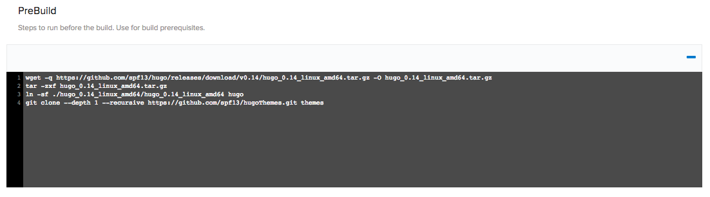

#### Build Steps

Scroll down to your Build section and enter in the following

~~~
mkdir -p static
export PATH=.:$PATH
hugo --theme=hyde --buildDrafts
~~~

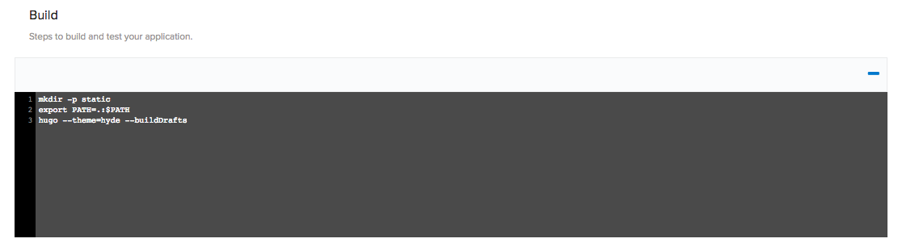

#### PkgInclude

Scroll down to your PkgInclude section and enter in the following

~~~
public/
~~~

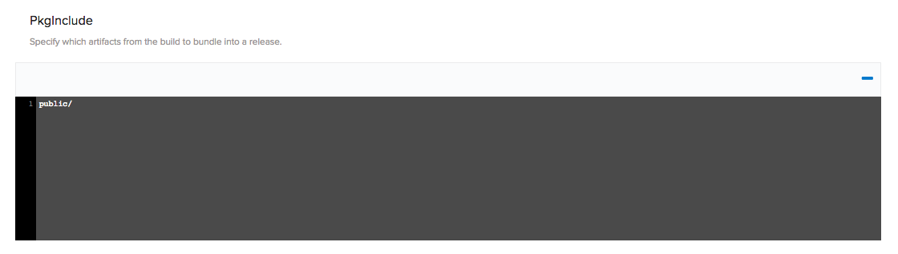

Expand the <b>Deployment Manifest</b> section by clicking the plus sign. This is where we are going to configure the commands to run during our Deployment.

### Start

Scroll down to your Start section and enter in the following

~~~
sudo rm -rf /var/www/html/*
sudo mv -f public/* /var/www/html/
~~~

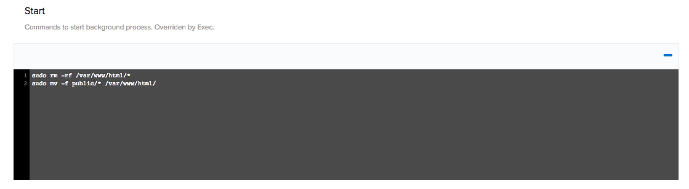

### Re-Build the Application

Because we changed our deployment steps, we need to rebuild our application. To trigger a new build, click the wrench icon in the right hand corner. This triggers a build of your latest code, build steps, and deployment steps.

Navigate to your build page and click the active build to watch it progress. Once your build is complete, a green box indicates that your build was <b>Successful</b>.

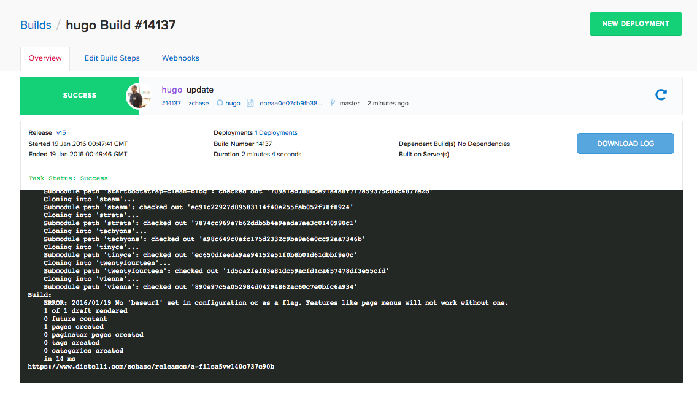

## Step 5. Deploy Application

Now that we have successfully built our application, we are ready to deploy to our server. On the builds page click <b>New Deployment</b> in the right hand corner.

### Deploy your Website

Once you click the button, you are directed towards Pipelines's deployment page. The first step is to select <b>Deploy a Release</b> option.

You are prompted to select the application you want to deploy. Select the application we created earlier in the tutorial. Our application is named "hugo".

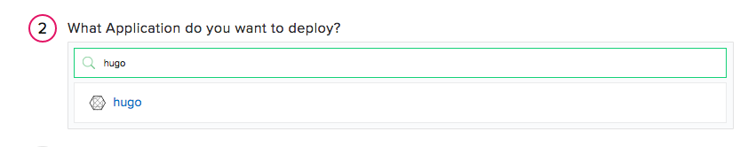

Then you are prompted to select the release you would like to deploy. For now there should be only one release for deployment.

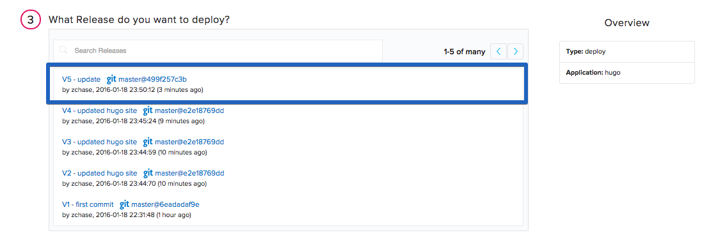

The last step in our deployment is to select the environment you want to deploy to. First you will need to create an environment by enter a name and selecting the "Add Environment" button. 

Next select the Environment you just created and click <b>All Done</b>.

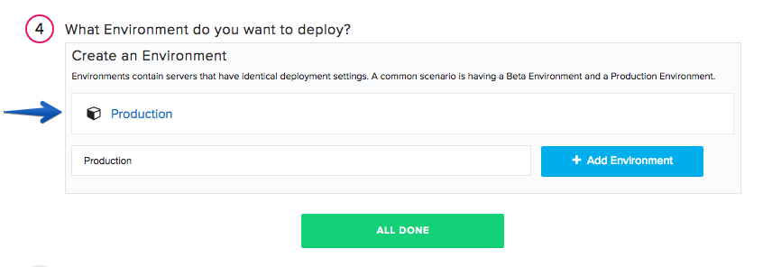

Now you need add your server. Click <b>Add Servers</b> to get started. Select the server you configured earlier in the tutorial, and add it to your account. Once you have added your server, close the <b>Add Servers</b> panel and continue with your deployment. You are shown a final option to set your delay between deployments on your servers and a <b>Start Deployment</b> button.

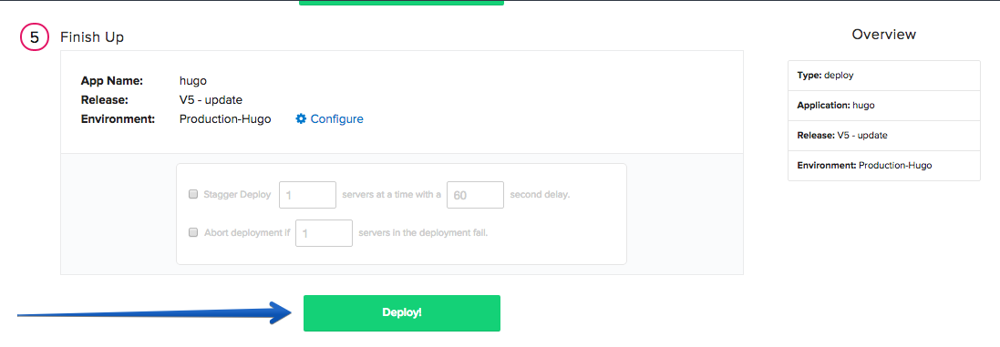

Click <b>Start Deployment</b> to begin your deployment. A deployment page opens, where you can view the progress of your deployment. Click <b>log</b> on the left side to view realtime streaming logs for the deployment.

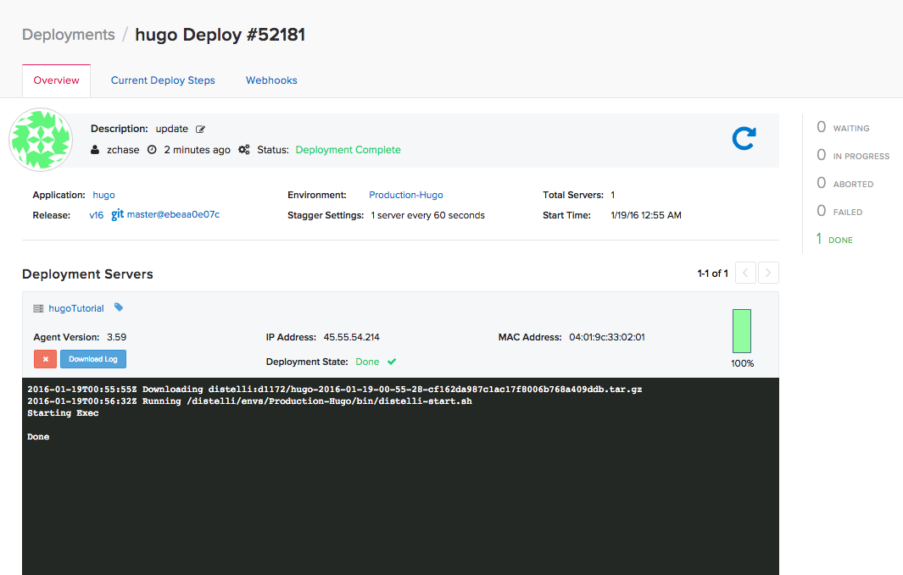

You should now be able to point your browser to `http://<-You Server's IP Address->` and see your Hugo Website!

You have now set up a Hugo Website with Continuous Integration and Continuous Deployment! Thanks for following along and happy coding!

