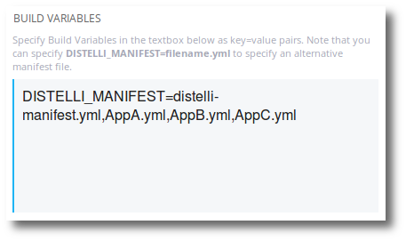

Typically, a monolithic application is a reference to a single repository that contains many applications, services, or micro-services. The repository may be designed this way because the application build requires a full build of all applications due to inter-dependencies.

Consider the following scenario:

A single monolithic repository contains a monolithic build script. When a commit occurs to a branch of the repository, a build script, or several build scripts, build the applications interdependently. Every application in the repository is rebuilt on every commit.

Each application in the repository is deployed differently. Each application has its own set of deployment instructions that varies from other applications in the repository.

the following nomenclature will be used:
<ul>
  <li><b>mono_repo</b> - This is the name of monolithic repository.</li>
  <li><b>mono_app</b> - This is the name of the application that is attached to the mono_repo.</li>
  <li><b>AppA</b> - This is the name of Application A in mono_repo.</li>
  <li><b>AppB</b> - This is the name of Application B in mono_repo.</li>
  <li><b>AppC</b> - This is the name of Application C in mono_repo.</li>
</ul>

## Create applications 

First, the applications should be created. In this example there will be four applications. They are as follows:

<table>
  <tr><th>App Name</th><th>Repository</th><th>Branch</th></tr>
  <tr><td>mono_app</td><td>mono_repo</td><td>master/default</td></tr>
  <tr><td>AppA</td><td>None</td><td></td></tr>
  <tr><td>AppB</td><td>None</td><td></td></tr>
  <tr><td>AppC</td><td>None</td><td></td></tr>
</table>

You can find instructions for creating applications here:

* [Creating an Application from a Repository](./application-create.html)
* [Creating an Application without a Repository](./application-create.html)

## Specify manifests for the applications

In this scenario, each application will need its own [Pipelines manifest](./manifest.html). These manifests will reside in the mono_repo. For this scenario you cannot use the Pipelines web UI in-app manifest, you must use in-repo manifests.

<table>
  <tr><th>Manifest Name</th><th>App</th><th>Purpose</th></tr>
  <tr><td>distelli-manifest.yml</td><td>mono_app</td><td>This is the master manifest for the monolithic build. This manifest will either execute all the build steps, or call a script, makefile, or other method to build all the applications.</td></tr>
  <tr><td>AppA.yml</td><td>AppA</td><td>This is the manifest for AppA and will contain the PkgInclude defining what artifacts from the build to keep. And the AppA deployment instructions.</td></tr>
  <tr><td>AppB.yml</td><td>AppB</td><td>This is the manifest for AppB and will contain the PkgInclude defining what artifacts from the build to keep. And the AppB deployment instructions.</td></tr>
  <tr><td>AppC.yml</td><td>AppC</td><td>This is the manifest for AppC and will contain the PkgInclude defining what artifacts from the build to keep. And the AppC deployment instructions.</td></tr>
</table>

Below are example "build" manifests for each application. The below manifests assume the username is <b>jdoe</b>.

<b>Application:</b> mono_app 
<b>Manifest:</b> distelli-manifest.yml

~~~
jdoe/mono_app:
  Build:
    # This section will include the build steps to build the application.
    # An example
    - make all
    - make test
~~~

<b>Application:</b> AppA 
<b>Manifest:</b> AppA.yml

~~~
jdoe/AppA:
  Build:
    # If you need some AppA specific build commands executed, you 
    #  could add them here.
    - echo "Nothing to build"
  PkgInclude:
    # This section defines what artifacts to keep from the build
    #  for this application.
    # The following syntax will keep all folders and files from
    #  the subdir AppA/
    - 'AppA/'
~~~

<b>Application:</b> AppB 
<b>Manifest:</b> AppB.yml

~~~
jdoe/AppB:
  Build:
    # If you need some AppB specific build commands executed, you 
    #  could add them here.
    - echo "Nothing to build"
  PkgInclude:
    # This section defines what artifacts to keep from the build
    #  for this application.
    # The following syntax will keep all folders and files from
    #  the subdir AppB/
    - 'AppB/'
~~~

<b>Application:</b> AppC 
<b>Manifest:</b> AppC.yml

~~~
jdoe/AppC:
  Build:
    # If you need some AppC specific build commands executed, you 
    #  could add them here.
    - echo "Nothing to build"
  PkgInclude:
    # This section defines what artifacts to keep from the build
    #  for this application.
    # The following syntax will keep all folders and files from
    #  the subdir AppC/
    - 'AppC/'
~~~

Each app-specific manifest describes what artifacts to store in the application release.

The app-specific manifest would also include the deployment instructions for that application. An example might look like this:

~~~
jdoe/AppC:
  Build:
    # If you need some AppC specific build commands executed, you 
    #  could add them here.
    - echo "Nothing to build"
  PkgInclude:
    # This section defines what artifacts to keep from the build
    #  for this application.
    # The following syntax will keep all folders and files from
    #  the subdir AppC/
    - 'AppC/'

  # The following constitutes deployment steps
  Env:
    # Specify deployment env variables here
    - PORT: "3000"
  PreInstall:
    # Steps to take before the release is deployed to the server
    - sudo apt-get update
    - sudo apt-get -y install nodejs
    - sudo apt-get -y install npm
  PostInstall:
    # Steps to take after the release is deployed to the server
    - cp creds/dev.json /etc/credentials.json
  Exec:
    # Starting the application
    - nodejs app.js -p $PORT
~~~

## Build the application

Whenever a commit occurs to the monolothic repository `mono_repo`, the application `mono_app` will be rebuilt.

To set up builds correctly so that each separate application can be independently deployed, the <b>DISTELLI_MANIFEST</b> build environment variable must be specified.

~~~
DISTELLI_MANIFEST=distelli-manifest.yml,AppA.yml,AppB.yml,AppC.yml
~~~

This is specified in the <b>mono_app</b>. See [Specifying Build Env Variables](./build-configure.html).

These are processed in order so <b>distelli-manifest.yml</b> must be first. Here is an example screenshot.

## Next steps

At this point, the applications are all set up to be built as one, and deployed as separate applications. Next steps may be to create automated deploys of the individual application pieces.