 
Node.js is a powerful runtime environment for developing  web applications. It's widely used throughout the software development world to create I/O intensive web applications, such as video streaming or single page sites. Deploying these apps can take time, and this is where Pipelines comes in. Pipelines automates the entire Build/Deploy process enabling developers to spend their time doing what they do best, creating cool apps. Today, we'll focus on getting your Pipelines account set up and deploying your first Node.js application.

### Prerequisites

For this tutorial you should have a working knowledge of Javascript, Basic Shell Commands, and a basic understanding of Node.js. You will also need to have a GitHub/BitBucket account. Please make sure you have your Source Control account set up before we begin the tutorial. I will be using GitHub for this specific example.

### Set-Up

For this tutorial we will be using a basic "Hello World" Node.js app, but you can use your own custom application if you like. To start you are going to need to open your terminal and navigate to the folder where you would like to store your files. For myself, I am going to navigate to my WorkSpace (ws) and further more to my Source (src) directory. Then I am going to make a directory called nodeTutorial to store my Node.js app and create the actual app file.

~~~
$ cd ws/src
$ mkdir nodeTutorial
$ cd nodeTutorial
$ touch app.js
~~~

Now that we have everything all set up we can start by creating a basic Node.js "Hello World" app. Open app.js in the  text editor of your choice and paste in the below code:

~~~
var express = require('express');
var app = express();

app.get('/', function(req, res){
  res.send('Hello World');
});

var server = app.listen(3000, function(){
  console.log('Magic is happening on port 3000')
});
~~~

You will notice that I have included "express" as a Node Module. Make sure you have express installed by going to your terminal, making sure you are still in the directory where you are storing your files, and type `npm install express`. Once you have done that save app.js and run it in your terminal. As a reminder, you run a Node.js app by using the command `node app.js`. Open your browser and point it towards 'localhost:300'. This is what you should see:

Now that we have a working Node application all we have to do is deploy it to our server. Instead of having to write custom scripts to deploy your application, Pipelines will do it all for you. With a couple clicks your deployment will be live and ready for your customers! Below are the steps you need to follow to get your application from being hosted locally to being hosted on your production server.

Before we move on, make sure you have set up a repository in GitHub or BitBucket.

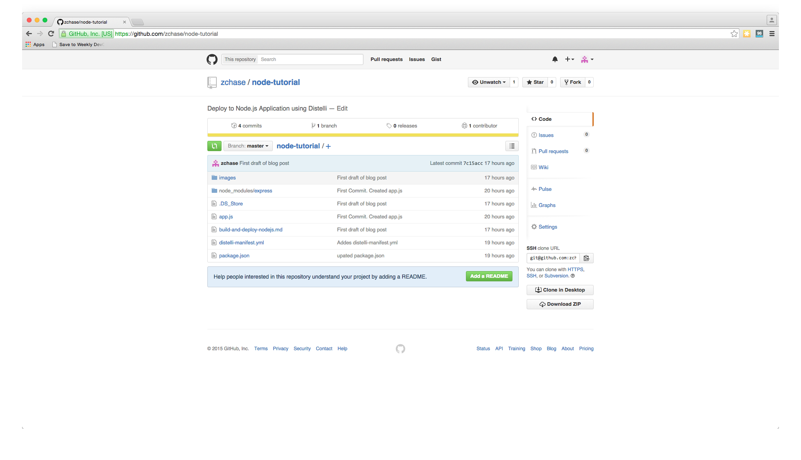

## Step 1. Push your Code to GitHub

For this tutorial I am using GitHub as my repository, but you can use BitBucket as well without any issue. First you will need to create a repo in GitHub and push your code to that repository. Once created, open your terminal and make sure you are in the directory that your app code is in.

Initialize the local directory as a Git Repo
~~~
$ git init
~~~

Add the files in your new local repo
~~~
$ git add .
~~~

Commit the files you have just staged
~~~
$ git commit -m "First Commit. Created app.js"
~~~

Navigate to your GitHub or BitBucket Repo and find your remote repository URL. Once you have your remote repository URL use the following commands to finish setting up your repo.

~~~
$ git remote add origin "Your Remote Repository URL"
# Sets the new URL
$ git remote -v
# Verifies the URL
~~~

Now push the changes to your repo
~~~
$git push origin master
~~~

Now we have our GitHub/BitBucket repo all set up. Yet there is still one more thing we have to do before we set up our app on Pipelines and get it deployed into production. Go back to your terminal and enter the command `npm init`. Follow the prompts and afterwards you should now have a package.json file in your directory. Once that file is created, push the update into your GitHub Rep.

~~~
$ git add .
$ git commit -m "Added package.json"
$ git push origin master
~~~

## Step 2. Add your Application to Pipelines

Now that we have installed the Pipelines Agent on your server, we are ready to deploy our app. Navigate to `distelli.com` and make sure you are logged in. Once you are logged in, go the Applications Page and click the 'New App' button.

Name your app and then select the Repository you would like to connect to. As a reminder, we have been using GitHub as our repository

After we click the button to connect to our Repository, we then select the appropriate repo that contains our code. In this example I store my code in the repo name 'node-tutorial'. Make sure to select the repo we set up earlier in the tutorial.

Then select the appropriate branch for your deployment. I have only a master branch, but you can deploy any branch from your repo!

Next Pipelines will ask you set your build steps. For this particular application we will use the PkgInclude section. The Build section is where you would want to include any tests or tasks you would like to run while your application is building. Please make sure your PkgInclude section looks identical to the one below.

The final step is select our Build Image. In this case we are going to select **Distelli Javascript (Docker)** for our Node.js Application. Select the **Auto Build** checkbox and **Looks good. Start Build!**

**Note:** The Auto-Build feature builds your application everytime you commit code to your repository

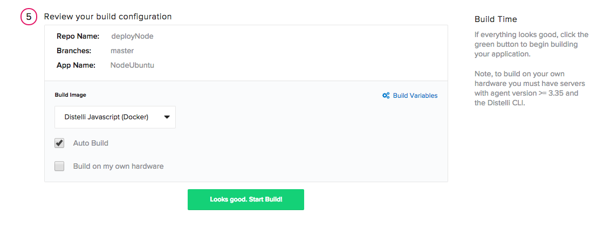

Now our application should be automatically building. You can watch its progress by navigating to the builds tab on your Pipelines account and clicking on your build.

## Step 3. Deploy Steps

**Note:** This tutorial assumes that the server is out of the box and needs to have your application dependencies installed & configured. Once your application dependencies are installed & configured you can remove those commands from your <b>Manifest</b>.

Once your build has completed navigate back to your application page and open your application.

Select the Manifest tab

Expand the "Deployment Manifest" section by clicking on the plus sign. This is where we are going to tell Pipelines what commands to run during our Deployment.

### PreInstall

Scroll down to your PreInstall section and enter in the following

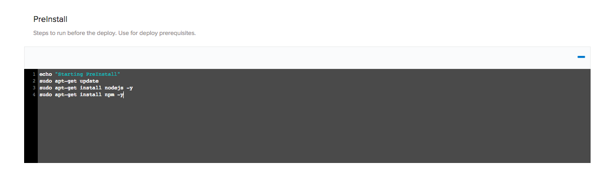

Copy/Paste
~~~
echo "Starting PreInstall"
sudo apt-get update
sudo apt-get install nodejs -y
sudo apt-get install npm -y
~~~

### PostInstall

Scroll down to your PostInstall section and enter in the following

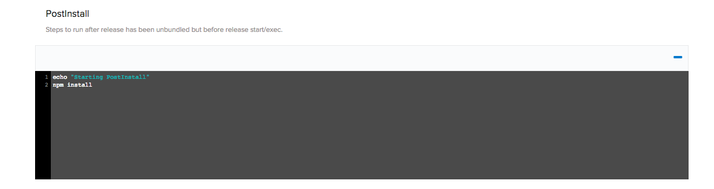

Copy/Paste
~~~
echo "Starting PostInstall"
npm install
~~~

### Exec

Scroll down to your Exec section and enter in the following

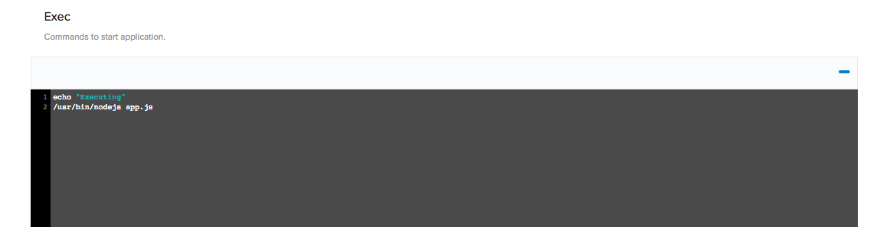

Copy/Paste
~~~
echo "Executing"
/usr/bin/nodejs app.js
~~~

### Re-Build Application

Because we have changed our deployment steps we need to rebuild our application. First save your changes by clicking the "Publish Manifest" button and then rebuild your application. To trigger a new build, click the wrench icon in the right hand corner! That button triggers a build of your latest code, build steps, and deployment steps.

## Step 4. Set Up Your Server

The next step in deploying our app is to make sure you have a server to run your application on. You can use any type of server - public cloud, private cloud or physical. Pipelines will let you deploy your code to  Vagrant VMs or servers in a VPC. You can even deploy to the server under your desk. For this tutorial I am going to be deploying to a server hosted by Digital Ocean. If you already have your server set up you can skip to the next step.

To get your server set up on Digital Ocean, you will need to navigate to <a href="https://www.digitalocean.com/" target="_blank">digitalocean.com</a> to get set up. If you already have an account please Log In, if not Sign Up for an account now. Once you have created an account, or logged in, you will need to "Create Droplet".

Please select the settings for your droplet that best fit your needs. I am using an Ubuntu image set up in New York. You can choose any options that you please as Pipelines is able to deploy to any server, anywhere!

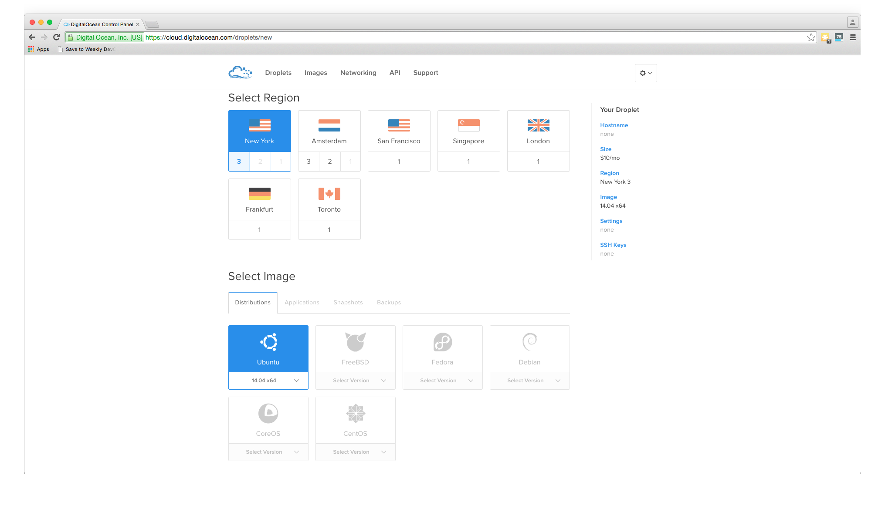

Select your <b>Image</b>, <b>Size</b>, and <b>Region</b>. In the <b>Additional Options</b> section check the box next to <b>User Data</b>

This will open a text area for you to enter in your <b>User Data</b>. To automate the install of the Pipelines Agent, use the script below:

~~~
#!/bin/bash

export DISTELLI_ACCESS_TOKEN='<b>YOUR DISTELLI ACCESS TOKEN</b>'
export DISTELLI_SECRET_KEY='<b>YOUR DISTELLI SECRET KEY</b>'

echo "DistelliAccessToken: $DISTELLI_ACCESS_TOKEN" > /etc/distelli.yml
echo "DistelliSecretKey: $DISTELLI_SECRET_KEY" >> /etc/distelli.yml
echo "Environments:" >> /etc/distelli.yml
echo "  - <b>YOUR DISTELLI ENVIRONMENT</b>" >> /etc/distelli.yml
apt-get -y install wget
wget -qO- https://pipelines.puppet.com/download/client | sh
/usr/local/bin/distelli agent install -readyml /etc/distelli.yml
/usr/local/bin/distelli login -conf /etc/distelli.yml
~~~

You will need to insert your own Pipelines <b>Access Token</b> and <b>Secret Key</b>. These fields are tied to a Pipelines account. 
<h4>Retrieving Credentials</h4>

<ol>
<li>Click the <b>gear</b> icon from the top right.</li>
<li>Click the <b>Agent</b> link on the left.</li>
<li>Under <i>Agent Credentials</i> click the <b>Show</b> button.</li>
</ol>

You will see your <b>Access Token</b> and <b>Secret Key</b> here. Please insert them into your <b>User Data</b> script, and insert the Pipelines environment you want to add your server to.

## Step 5. Deploy Application

Now that we have successfully built our application we are ready to deploy to our server. On the builds page select the "New Deployment" button in the right hand corner.

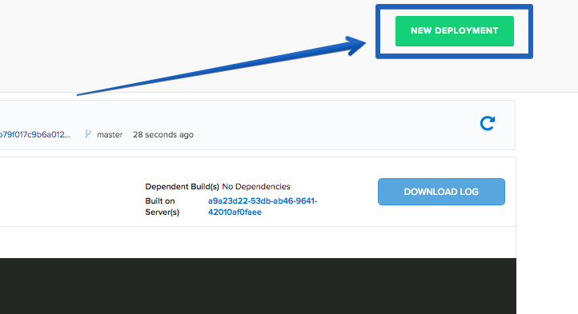

### Deploy your Node.js Application

Once you click the button, you should be directed towards the Pipelines deployment page. The first step is to select the "Deploy a Release" option.

Pipelines will now prompt you to select the application you want to deploy. Please select the application we created earlier in the tutorial.

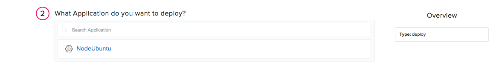

Then you will be asked to select the release you would like to deploy. For now there should be only one release for deployment.

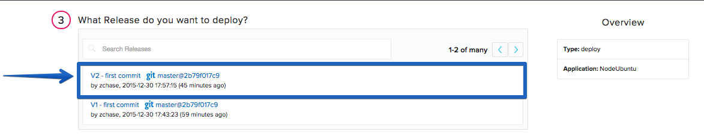

The last step in our deployment is to select the environment you wish to deploy in. First you will need to create an environment by enter a name and selecting the "Add Environment" button.

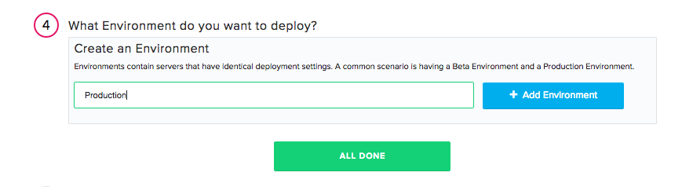

 Next select the Environment you just created and click "All Done".

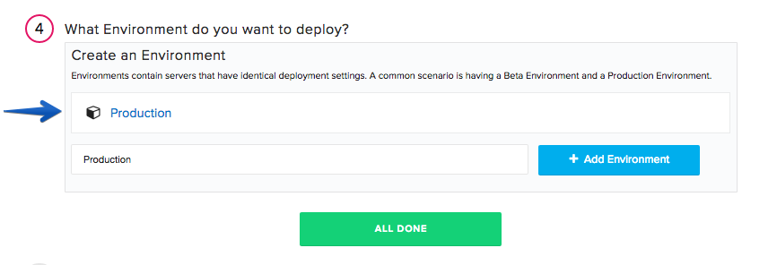

Now Pipelines will ask you to add your server. Click the "Add Servers" button to get started. Select the server you configured earlier in the tutorial and add it to your account. Once you have added your server, you can close the "Add Servers" panel and continue with your deployment. You will see a final option to set your delay between deployments on your servers and a "Deploy!" button.

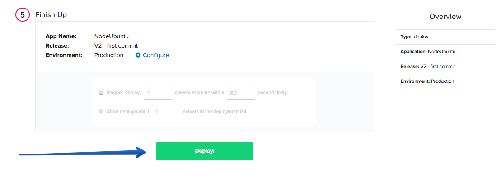

Click the "Deploy!" button to begin your deployment. You will redirected to a page where you can view the progress of your deployment. Click the "log" button on the left side to view realtime streaming logs for the deployment.

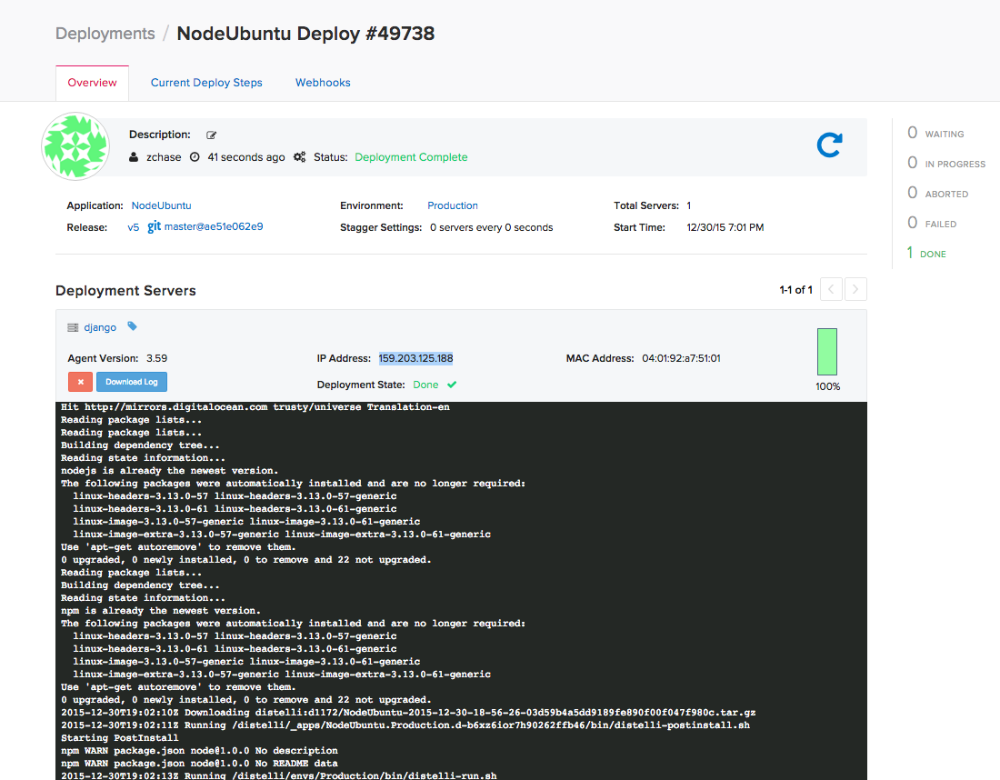

### View Your Application

And that's it! You should now be able to point your browser to "http://<-You Server's IP Address->:3000" and see your Node.js Application!

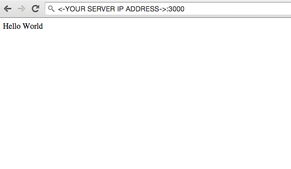

## Step 6. Enable Auto deploy & Change Application

If you would like your application to be automatically deployed after each sucessful Build, you can do so by enabling the Auto-Deploy feature in your Application's settings. Start by navigating to your applications page in Pipelines and you should see an App Pipeline section on the right hand side of the screen

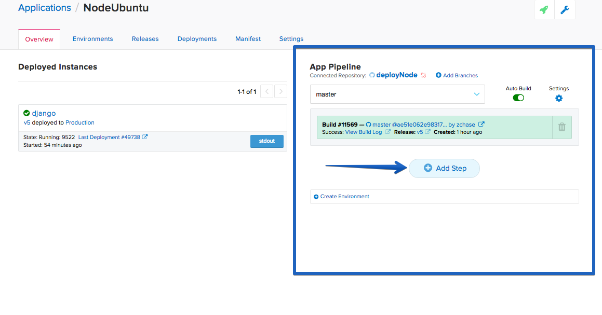

Click the "Add Step" button and select your environment

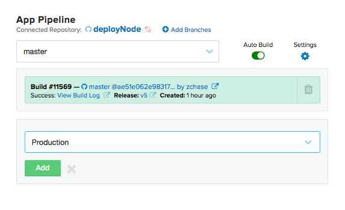

Press Add and then check the Auto Deploy checkbox with the condition of "If the Build succeeds"

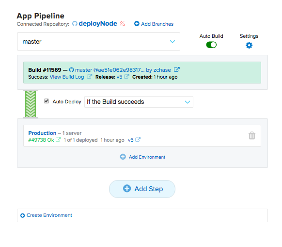

### Change Application

Once you have set up Automatic Deployment after a successful build of your application, please make a change to your Node.js application. I will be changing what my app outputs onto the page. Once you have made your changes, push your code into your repository and watch Pipelines automatically start Building your application and then Deploying your application. Once the Deployment has completed your can see the updated application by visiting "http://<-You Server's IP Address->:3000"

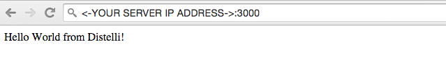

And that's it! You have now set up a Node.js Application with Coninuous Integraion and Continuous Deployment! Thanks for following along and happy coding!
Thank you for following along, and I hope that you have learned how Pipelines can simplify the process behind deploying your Node.js applications to your servers. If you liked this tutorial, like our <a href="https://www.digitalocean.com/community/projects/distelli" target="_blank">project on DigitalOcean</a>.

