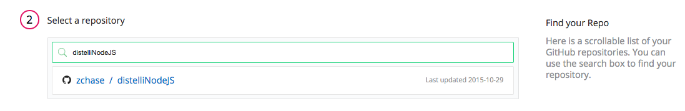
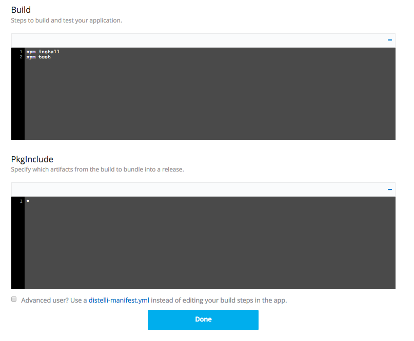
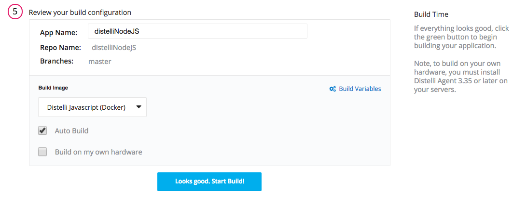
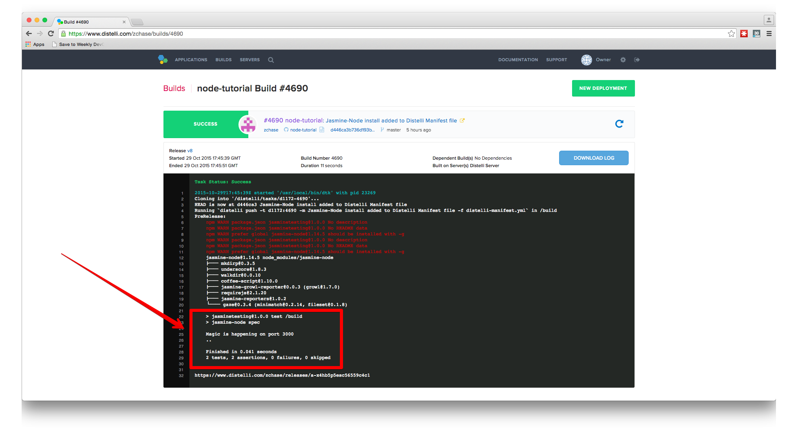
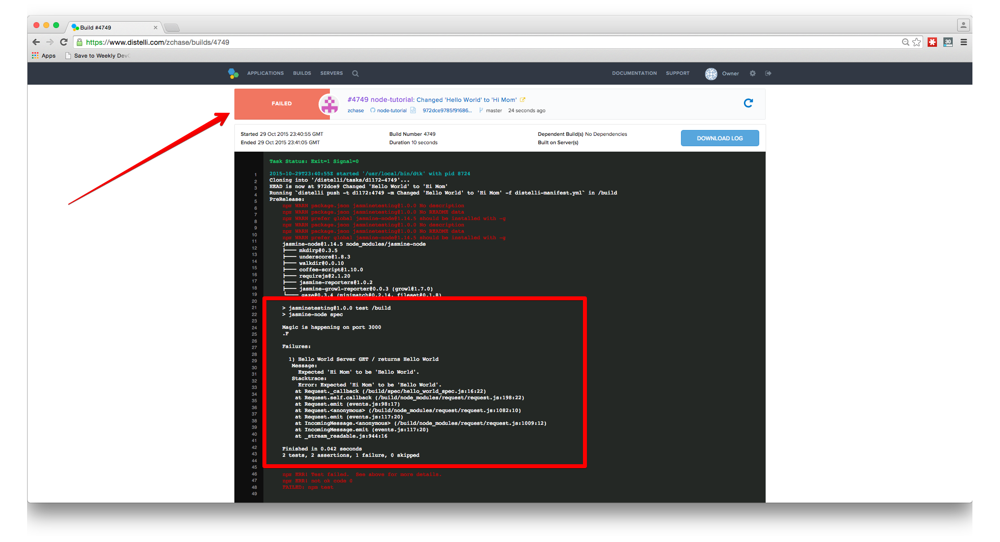

 

Jasmine is a powerful Javascript test framework used by developers worldwide to test their applications. In this tutorial, I'll review how to automate the testing of Node.js applications using Jasmine and Pipelines.

## Prerequisites

Prior to beginning this tutorial, you should have a Node.js application created. You might also find it helpful to read up on Jasmine and the different types of testing you can do. This tutorial will cover some basic tests on a "Hello World" Node.js application. You can <a href="http://jasmine.github.io/2.0/introduction.html" target="_blank">learn more about Jasmine here</a>. Below is the code for my Node application:

~~~
var express = require('express');
var app = express();
var exports = module.exports = {};

app.get('/', function(req, res){
  res.send('Hello World');
});

var server = app.listen(3000, function(){
  console.log('Magic is happening on port 3000');
});
~~~

## Step 1. Install the Jasmine-Node Module

The first step in setting up your testing environment is to install the Jasmine-Node Node module. To install the module:

1. Open your terminal
2. Navigate to your project's directory
3. Enter the follow command to install the Jasmine Node module:
~~~
npm install jasmine-node --save-dev
~~~
4. Enter this following command to install the Request Node module:
~~~
npm install request --save
~~~
5. Enter the following command to create a spec directory:
~~~
mkdir spec
~~~
6. Create a spec file:
~~~
touch spec/hello_world_spec.js
~~~

And that's it, you're are ready to start using Jasmine!

## Step 2. Configure your Jasmine Tests

Now that we have Jasmine Node module installed, we need to create a `hello_world_spec.js` file to specify our tests. In this tutorial, we'll be setting up some tests to make sure our server is returning HTTP status of OK(status code 200) and that the body of the response contains "Hello World".

To start, open the 'hello_world_spec.js' file in your text editor. To start off we will write a `describe` block.

~~~
describe("Hello World Test", function(){

});
~~~

The first argument in the `describe` function is a short description of what you are testing (in this case we are testing Hello World app). The second argument is the function that is going to execute the test.

We now want to add the two tests we are going to run. The first test ensures our server is returning a HTTP status of 200, or OK. For this we will need to write another `describe` function.

~~~
describe("Hello World Server", function() {

  describe("GET /", function() {

  });

});
~~~

In the first argument, we use "GET /" as the description because if you remember, in our Node app we use `app.get('/', function { ... });` to kick off our code.

The next step is to write an `it` function. The `it` function is similar to the `describe` function, but instead of describing the test, you are inputting the contents you expect to be returned.

~~~
describe("Hello World Server", function() {
  describe("GET /", function() {

    it("returns status code 200", function() {

    });

  });
});
~~~

The code above shows how to write your `it` function into your current `describe` function. Next we will use Node's `request` module to send a request to our server. When we set up Jasmine in our environment, we also installed Node's `request` module during step 4 of that process.

~~~
var request = require("request");

var base_url = "http://localhost:3000/"

describe("Hello World Server", function() {
  describe("GET /", function() {
    it("returns status code 200", function() {

      request.get(base_url, function(error, response, body) {

      });

    });
  });
});
~~~

Inside of our `it` function we add the request to our URL. At the top of the file we define the variables `request` and `base_url`. Now our `request` function makes a call to our localhost at port 3000. Please make sure this matches the URL where your Node app is running on. Next we are going to put the actual test into our code.

~~~
describe("Hello World Server", function() {
  describe("GET /", function() {
    it("returns status code 200", function(done) {
      request.get(base_url, function(error, response, body) {

        expect(response.statusCode).toBe(200);

      });
    });
  });
});
~~~

In the `request` function, we put our `expect` function. This function looks at our `response.statusCode` and checks to make sure it is '200'. The final part of the test we have to add is a `done` callback. Node.js is asynchronous, so the `it` function will finish before our `expect` function does.

~~~
describe("Hello World Server", function() {
  describe("GET /", function() {
    it("returns status code 200", function(done) {
      request.get(base_url, function(error, response, body) {
        expect(response.statusCode).toBe(200);
        done();
      });
    });
  });
});
~~~

There we have it! This will test to make sure the our server responds with a status code of 200. Now, let's add another `it` function to test to make sure the body is equal to 'Hello World'.

~~~
var request = require("request");

var base_url = "http://localhost:3000/"

describe("Hello World Server", function() {
  describe("GET /", function() {
    it("returns status code 200", function(done) {
      request.get(base_url, function(error, response, body) {
        expect(response.statusCode).toBe(200);
        done();
      });
    });

    it("returns Hello World", function(done) {
      request.get(base_url, function(error, response, body) {
        expect(body).toBe("Hello World");
        done();
      });
    });
  });
});
~~~

We use the same pattern as we did for the status code test but instead of looking at the response we are looking at the body. We expect the body to be equal to 'Hello World' and then we run `done();` to make sure our `expect` function runs before our `it` function finishes. Now that we have set up our Jasmine tests, let's

## Step 3. Integrate Your Node App with Jasmine

Now that we have our testing set up in our spec file, we have to integrate that testing with our Node app. To do this we add a `require` at the top of the file that points to our Node application. In this case, I have it point towards the `app.js` file we created in a previous tutorial.

~~~
var request = require("request");
var helloWorld = require("../app.js")
var base_url = "http://localhost:3000/"

describe("Hello World Server", function() {
  describe("GET /", function() {
    it("returns status code 200", function(done) {
      request.get(base_url, function(error, response, body) {
        expect(response.statusCode).toBe(200);
        done();
      });
    });

    it("returns Hello World", function(done) {
      request.get(base_url, function(error, response, body) {
        expect(body).toBe("Hello World");
        done();
      });
    });
  });
});
~~~

This file will work to run tests on, but we need to make sure we close the server we open on our local host. If we skip this step you will run into issues down the line trying to run tests multiple times. To close the server we need to edit our `app.js` file to export a `server.close();` function. Below is the update app.js code I am using to run our Jasmine tests.

~~~
var express = require('express');
var app = express();
var exports = module.exports = {};

app.get('/', function(req, res){
  res.send('Hello World');
});

var server = app.listen(3000, function(){
  console.log('Magic is happening on port 3000');
});

exports.closeServer = function(){
  server.close();
};
~~~

Essentially what we are doing here is creating our exports object and adding a close server function that shuts down the server we open when our code is run. It is important that we do not close the server in this file because it will cause issues running this file when we deploy to production. Once we have written this function to export we have to add it to our spec file.

~~~
var request = require("request");
var helloWorld = require("../app.js")
var base_url = "http://localhost:3000/"

describe("Hello World Server", function() {
  describe("GET /", function() {
    it("returns status code 200", function(done) {
      request.get(base_url, function(error, response, body) {
        expect(response.statusCode).toBe(200);
        done();
      });
    });

    it("returns Hello World", function(done) {
      request.get(base_url, function(error, response, body) {
        expect(body).toBe("Hello World");
        helloWorld.closeServer();
        done();
      });
    });
  });
});
~~~

As you can see I have added the `helloWorld.closeServer();` function right below our `expect` function in our second `it` function. Putting the close server function in that spot will ensure that our tests have been ran and then the server will close.

## Step 4. Run your Tests

Before we can run our tests locally, there is one more step to complete. Open the `package.json` file in your projects directory. Once the file is open you will need to put the command `jasmine-node spec` into the test section. Your file should look like this now:

~~~
{
  "name": "node-tutorial",
  "version": "1.0.0",
  "main": "app.js",
  "dependencies": {
    "express": "^4.13.3",
    "request": "^2.65.0"
  },
  "devDependencies": {
    "jasmine-node": "^1.14.5"
  },
  "scripts": {
    "test": "jasmine-node spec"
  },
  "author": "",
  "license": "ISC"
}
~~~

We made this change to our `package.json` file because want to be able to run our tests from the command `npm test`. Run that command in your project's directory now and you should see an output similar to this:

~~~
Distellis-MBP:node-tutorial zack$ npm test

> jasminetesting@1.0.0 test /Users/zack/ws/src/node-tutorial
> jasmine-node spec

Magic is happening on port 3000
..

Finished in 0.06 seconds
2 tests, 2 assertions, 0 failures, 0 skipped
~~~

As you can see our test file ran our sample application, made sure the status code was equal to 200, and then tested that the body was equal to "Hello World". Now open your `app.js` file and change "Hello World" to "Hi Mom" and run the test again.

You should see an output similar to this:

~~~
Distellis-MBP:node-tutorial zack$ npm test

> jasminetesting@1.0.0 test /Users/zack/ws/src/node-tutorial
> jasmine-node spec

Magic is happening on port 3000
.F

Failures:

  1) Hello World Server GET / returns Hello World
   Message:
     Expected 'Hi Mom' to be 'Hello World'.
   Stacktrace:
     Error: Expected 'Hi Mom' to be 'Hello World'.
    at Request._callback (/Users/zack/ws/src/node-tutorial/spec/hello_world_spec.js:16:22)
    at Request.self.callback (/Users/zack/ws/src/node-tutorial/node_modules/request/request.js:198:22)
    at emitTwo (events.js:87:13)
    at Request.emit (events.js:172:7)
    at Request.<anonymous> (/Users/zack/ws/src/node-tutorial/node_modules/request/request.js:1082:10)
    at emitOne (events.js:82:20)
    at Request.emit (events.js:169:7)
    at IncomingMessage.<anonymous> (/Users/zack/ws/src/node-tutorial/node_modules/request/request.js:1009:12)

Finished in 0.052 seconds
2 tests, 2 assertions, 1 failure, 0 skipped
~~~

Because we changed the Value of the body of the response to "Hi Mom" this caused our Jasmine test to fail. This is important because we want to make sure that when we make change to our code that the output is still what we expect it to be. You can now go back and change "Hi Mom" back to "Hello World" in our `app.js` file.

## Step 5. Create Test Environment in Pipelines

If you do not have a Pipelines account, [sign up](https://pipelines.puppet.com/signup) for one now. To create your app in Pipelines, follow these steps:

Click the new application button on your Pipelines account home screen

Name your app and select the repository where you are storing your application's files.

After connecting to our repository, select the appropriate repository that contains your code.

Select the appropriate branch for your deployment. I have only a master branch, but you can deploy any branch from your repo!

### Build Steps

Next Pipelines will ask you set your build steps. This is where we will add the steps for Pipelines to build and test our application. You can see the steps in the below screen shot. We are updating our server, installing python and a virtual environment, installing our application dependencies, and then finally running our test.

#### Build
~~~
npm install
npm test
~~~

#### PkgInclude
~~~
*
~~~

### Build

The final step is select our Build Image. In this case we are going to select **Distelli Javascript (Docker)** for our Javascript Application. Select the **Auto Build** checkbox and the the **Looks good. Start Build!**

**Note:** The Auto-Build feature builds your application everytime you commit code to your repository

Now our application should be automatically building. You can watch its progress by navigating to the builds tab on your Pipelines account and clicking on your build.

## Step 6. Build & Deploy

Once you're on your Builds page, you should see the code you just pushed to your repository is already building in Pipelines! Isn't that convenient? While your building, let's take a look at the log. You should see something similar to the tests we ran locally:

Now let's see what happens when we change "Hello World" to "Hi Mom":

Because the Jasmine test failed, the build fails within Pipelines. This help ensures that only code that outputs what we are expecting is successfully built and ready to deploy.

