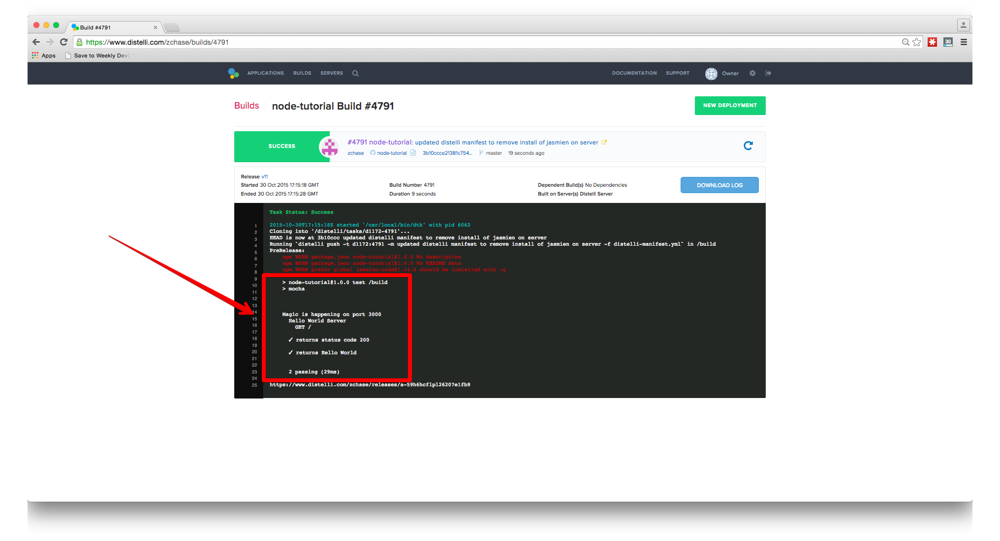
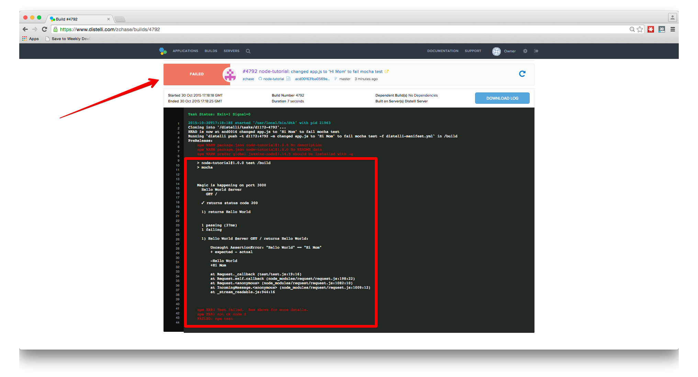

 
In this week's tutorial, I'll review how to test your Node.js application using the MochaJS test framework. Mocha makes Node.js async testing insanely easily. This tutorial will cover only some basic tests on a "Hello World" application. For additional information on the MochaJS framework, [check out their site here](https://mochajs.org).

## Step 1. Install the Mocha Module

The first step in setting up your testing environment is to install Mocha-Node Node module in your project's directory. To do this, follow the steps below:

1. Open your terminal
2. Navigate to your project directory
3. Enter this command: `npm install -g mocha`
4. Enter this command: `npm install request --save`
5. Create your test directory with `mkdir test`
6. Create your test file with `touch test/test.js`

And that's it, you are ready to start using Mocha!

## Step 2. Configure Your Mocha Tests

Now that we have Mocha installed, we can set up our `test.js` file to run our tests. We will be running tests to make sure our server is returning HTTP status of OK (status code 200) and that the body of the response contains "Hello World".

To begin, open the 'test.js' file in your text editor. To start off, write a `describe` block:

~~~
describe("Hello World Test", function(){

});
~~~

The first argument is a short description of what you are testing, and in this scenario, we are testing the Hello World app. The second argument is the function that is going to execute the test.

We now want to add the two tests we are going to run. The first test is to make sure our server is returning an HTTP status of 200, or OK. For this, we will need to write another `describe` function:

~~~
describe("Hello World Server", function() {

  describe("GET /", function() {

  });

});
~~~

In the first argument, we use "GET /" as the description (remember that in our Node app, we used `app.get('/', function { ... });`).

Our next step is to write an `it` function. The `it` function is similar to the `describe` function, but instead of describing the test, you input what you expect the function to return.

~~~
describe("Hello World Server", function() {
  describe("GET /", function() {

    it("returns status code 200", function() {

    });

  });
});
~~~

The code above shows you how to write your `it` function into your current `describe` function. Next, we will use Node's `request` package to send a request to our server (when we set up Mocha in our environment, we also installed Node's `request` module during step 4 of that process):

~~~
var request = require("request");

var base_url = "http://localhost:3000/"

describe("Hello World Server", function() {
  describe("GET /", function() {
    it("returns status code 200", function() {

      request.get(base_url, function(error, response, body) {

      });

    });
  });
});
~~~

We add the request to our URL inside of our `it` function. At the top of the file we define the variables `request` and `base_url`. Now our `request` function makes a call to our localhost at port 3000. Please make sure this matches the URL where your Node app is running.

Next, we put the actual test into our code:

~~~
describe("Hello World Server", function() {
  describe("GET /", function() {
    it("returns status code 200", function(done) {
      request.get(base_url, function(error, response, body) {

        assert.equal(200, response.statusCode);

      });
    });
  });
});
~~~

We put our `assert` function in the `request` function. This function looks at our `response.statusCode` and checks to make sure it is '200'.

For the final part of the test, we have to add a `done` callback. Node.js is an asynchronous environment, so the `it` function will finish before our `expect` function does.

~~~
describe("Hello World Server", function() {
  describe("GET /", function() {
    it("returns status code 200", function(done) {
      request.get(base_url, function(error, response, body) {
        assert.equal(200, response.statusCode);
        done();
      });
    });
  });
});
~~~

There we have it! This will test to make sure the server responds with a status code of 200.

Now we want to add another `it` function to test that the body is equal to 'Hello World':

~~~
var request = require("request"),
    assert = require('assert'),
    base_url = "http://localhost:3000/";

describe("Hello World Server", function() {
  describe("GET /", function() {
    it("returns status code 200", function(done) {
      request.get(base_url, function(error, response, body) {
        //expect(response.statusCode).toBe(200);
        assert.equal(200, response.statusCode);
        done();
      });
    });

    it("returns Hello World", function(done) {
      request.get(base_url, function(error, response, body) {
        //expect(body).toBe("Hello World");
        assert.equal("Hello World", body);
        helloWorld.closeServer();
        done();
      });
    });
  });
});
~~~

We use the same pattern as we did for the status code test but instead of looking at the response, we look at the body. We expect the body to be equal to 'Hello World' and then we run `done();` to make sure our `expect` function runs before our `it` function finishes. Now that we have set up our Mocha tests, we can integrate it with our Node app.

## Step 3. Integrate Your Node.js Applicaiton with Mocha

Now that we have our testing set up in our test file, we have to integrate the tests with our existing Node.js application. To do this, we add a `require` at the top of the file that points towards the actual Node app. In this case, I have it point towards the `app.js` file we created in a previous tutorial.

~~~
var request = require("request"),
    assert = require('assert'),
    base_url = "http://localhost:3000/";

describe("Hello World Server", function() {
  describe("GET /", function() {
    it("returns status code 200", function(done) {
      request.get(base_url, function(error, response, body) {
        //expect(response.statusCode).toBe(200);
        assert.equal(200, response.statusCode);
        done();
      });
    });

    it("returns Hello World", function(done) {
      request.get(base_url, function(error, response, body) {
        //expect(body).toBe("Hello World");
        assert.equal("Hello World", body);
        helloWorld.closeServer();
        done();
      });
    });
  });
});
~~~

This file works for running the tests, but we need to make sure we close the server we opened on our local host. If we skip this step, we run into issues down the line trying to run tests multiple times. To close the server, we need to edit our `app.js` file to export a `server.close();` function. Below is the update app.js code I am using to run our Mocha tests:

~~~
var express = require('express');
var app = express();
var exports = module.exports = {};

app.get('/', function(req, res){
  res.send('Hello World');
});

var server = app.listen(3000, function(){
  console.log('Magic is happening on port 3000');
});

exports.closeServer = function(){
  server.close();
};
~~~

Essentially, what we are doing here is creating our exports object and adding a close server function that shuts down the server we opened when we ran the code. It is important that we do not close the server in this file, as that will cause issues when we deploy the file to production. Once we have written this export function, we have to add it to our test file.

~~~
var request = require("request"),
    assert = require('assert'),
    helloWorld = require("../app.js"),
    base_url = "http://localhost:3000/";

describe("Hello World Server", function() {
  describe("GET /", function() {
    it("returns status code 200", function(done) {
      request.get(base_url, function(error, response, body) {
        //expect(response.statusCode).toBe(200);
        assert.equal(200, response.statusCode);
        done();
      });
    });

    it("returns Hello World", function(done) {
      request.get(base_url, function(error, response, body) {
        //expect(body).toBe("Hello World");
        assert.equal("Hello World", body);
        helloWorld.closeServer();
        done();
      });
    });
  });
});
~~~

As you can see, I have added the `helloWorld.closeServer();` function right below our `expect` function in our second `it` function. Putting the close server function in that spot will ensure that our tests have been run and that the server will close.

## Step 4. Run Your Tests

There is one more step to complete before we can run our tests locally. Open the `package.json` file in your project directory. Once the file is open, put the command `mocha` into the test section. This is what will trigger your test when we build our app, so it is important to make this change. Your file should look like this now:

~~~
{
  "name": "node-tutorial",
  "version": "1.0.0",
  "main": "app.js",
  "dependencies": {
    "express": "^4.13.3",
    "request": "^2.65.0"
  },
  "devDependencies": {},
  "scripts": {
    "test": "mocha"
  },
  "author": "",
  "license": "ISC",
  "repository": {
    "type": "git",
    "url": "*YOUR GITHUB URL*"
  },
  "bugs": {
    "url": "*YOUR GITHUB URL*/issues"
  },
  "homepage": "*YOUR GITHUB URL*#readme",
  "description": ""
}
~~~

We made this change to our `package.json` file because want to be able to run our tests from the command `npm test`. Run that command in your project directory now and you should see an output similar to this:

~~~
Distellis-MBP:node-tutorial zack$ npm test

> Mochatesting@1.0.0 test /Users/zack/ws/src/node-tutorial
> Mocha-node test

Magic is happening on port 3000
..

Finished in 0.06 seconds
2 tests, 2 assertions, 0 failures, 0 skipped
~~~

As you can see, our test file opened on our server, made sure the status code was equal to 200, and then tested that the body was equal to "Hello World". Now open your `app.js` file, change "Hello World" to "Hi Mom", and run the test again.

You should see an output similar to this:

~~~
Distellis-MBP:node-tutorial zack$ npm test

> Mochatesting@1.0.0 test /Users/zack/ws/src/node-tutorial
> Mocha-node test

Magic is happening on port 3000
.F

Failures:

  1) Hello World Server GET / returns Hello World
   Message:
     Expected 'Hi Mom' to be 'Hello World'.
   Stacktrace:
     Error: Expected 'Hi Mom' to be 'Hello World'.
    at Request._callback (/Users/zack/ws/src/node-tutorial/test/test.js:16:22)
    at Request.self.callback (/Users/zack/ws/src/node-tutorial/node_modules/request/request.js:198:22)
    at emitTwo (events.js:87:13)
    at Request.emit (events.js:172:7)
    at Request.<anonymous> (/Users/zack/ws/src/node-tutorial/node_modules/request/request.js:1082:10)
    at emitOne (events.js:82:20)
    at Request.emit (events.js:169:7)
    at IncomingMessage.<anonymous> (/Users/zack/ws/src/node-tutorial/node_modules/request/request.js:1009:12)

Finished in 0.052 seconds
2 tests, 2 assertions, 1 failure, 0 skipped
~~~

Changing the value of the body of the response to "Hi Mom" caused our Mocha test to fail. This is important because we want to ensure that when we change our code, the output is still what we want it to be. You can now change "Hi Mom" back to "Hello World" in our `app.js` file.

## Step 5. Update Your Pipelines Manifest File

The final step in setting up our automated build environment is to change our Pipelines Manifest file to run the `npm test` command when performing a build. Please change your Pipelines Manifest to look like the one below:

~~~
PkgInclude:
  - '*'

PreRelease:
  - npm install
  - npm test

PreInstall:
  - sudo apt-get update
  - sudo apt-get install nodejs -y
  - sudo apt-get install npm -y

Exec:
  - /usr/bin/nodejs app.js
~~~

What we are doing is installing Mocha-node and then running our test on our file. Now you can push these files into the GitHub Repo associated with your app in Pipelines. If you need a reminder on how to do this, see the commands below:

~~~
$ git add .
$ git commit -m "Added Mocha Testing Routine"
$ git push origin master
~~~

Once you have pushed your changes to your GitHub Repo, navigate to your Builds tab on your Pipelines Account page.

## Step 6. Build and Deploy

Once you are on your Builds page, you should see that the code you just pushed to your repository is already building in Pipelines! Isn't that convenient? While it is building, look at the log and you should see something similar to the tests we ran locally:

Now let's see what happens when we change "Hello World" to "Hi Mom":

Because the Mocha test failed, the build will fail within Pipelines This ensures that only code that outputs what we are expecting is successfully built and ready to deploy.

