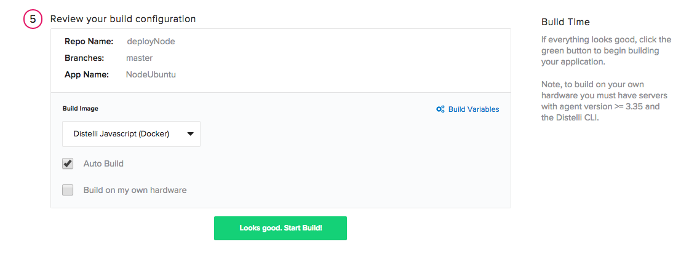

 
This tutorial will get you setup, building, testing, and deploying an application with Pipelines in minutes.
The tutorial assumes you have already:

* [Created a Pipelines account](https://pipelines.puppet.com/signup)
* Have a login to, at least, one of the two public repositories.
 - <a href="https://github.com/" target="_blank">https://github.com/</a>
 - <a href="https://bitbucket.org/" target="_blank">https://bitbucket.org/</a>

The scenario also expects that you have a <b>Destination</b> server available to do deployments of the example application.

**Note:** These build and deploy instructions are specific to the Ubuntu 14 operating system.

<h2>Step 1. Prepare Server for Deployment</h2>

To enable auto deployment of an application you must have a destination server to deploy to.

If you don't have a server you can use a virtual server. 

You must install the Pipelines agent on the server to facilitate deployments. Instructions on installing the Pipelines agent can be found here <a href="./agent.html" target="_blank">Pipelines agent reference guide.</a>

Install the agent and return to this document.

<h2>Step 2. Fork and Clone the Repository</h2>

<h3>Fork GitHub Repository</h3>

<ol>
<li>Ensure you are logged into your GitHub account. <a href="https://github.com/" target="_blank">https://github.com/</a></li>
<li>Go to this public Pipelines repository: <a href="https://github.com/Distelli/example-node" target="_blank">https://github.com/distelli/nodejsbuilddeploy</a>.</li>
<li>Click the <b>Fork</b> button (top right).</li>
</ol>

You have forked the repository to your GitHub account. Good job!
You can view the forked repository in your GitHub account at:

~~~
https://github.com/YOUR_GITHUB_USERNAME/nodejsbuilddeploy
~~~

<h4>Clone GitHub Repository</h4>

You will need to clone a copy of the repository to your local machine. This assume you already have <b>git</b> installed on your local computer. If not you can install git from here: <a href="http://git-scm.com/" target="_blank">http://git-scm.com/</a>
Use the following syntax to clone the repository:

~~~
git clone https://github.com/YOUR_GITHUB_USERNAME/nodejsbuilddeploy.git
~~~

Now change to the newly created directory.

~~~
cd nodejsbuilddeploy
~~~

**Note:** If your GitHub account is using <b>Two-factor authentication</b> you will not be able to use the above command to clone and work with the repository. You must:

   <ul>
   <li>Use an SSH key with GitHub <a  href="https://help.github.com/articles/generating-ssh-keys/" target="_blank">help.github.com/articles/generating-ssh-keys/</a></li>
   <li>Use a different git clone syntax, for example `git clone git@github.com:YOUR_GITHUB_USERNAME/nodejsbuilddeploy.git`</li></ul>

To continue, proceed to **Step 3. Edit the Pipelines Manifest**.

<h2>Fork Bitbucket Repository</h2>

<ol>
<li>Ensure you are logged into your Bitbucket account. <a href="https://bitbucket.org/" target="_blank">https://bitbucket.org/</a></li>
<li>Go to this public Pipelines repository: <a href="https://bitbucket.org/distelli/example-node" target="_blank">https://bitbucket.org/distelli/example-node</a>.</li>
<li>Click the 3 dots <i>actions</i> icon on the left.</li>
<li>Click the <b>Fork</b> option from the drop-own.</li>
</ol>

You have forked the repository to your Bitbucket account. Good job!
You can view the forked repository in your Bitbucket account at:

~~~
https://bitbucket.org/YOUR_BITBUCKET_USERNAME/nodejsbuilddeploy
~~~

<h3>Clone Bitbucket Repository</h3>

You will need to clone a copy of the repository to your local machine. This assumes you already have <b>mercurial</b> installed on your local computer. If not you can install mercurial from here: <a href="https://www.mercurial-scm.org/" target="_blank">https://www.mercurial-scm.org/</a>
Use the following syntax to clone the repository:

~~~
hg clone https://YOUR_BITBUCKET_USERNAME@bitbucket.org/YOUR_BITBUCKET_REPO/nodejsbuilddeploy
~~~

Now change to the newly created directory.

~~~
cd nodejsbuilddeploy
~~~

<h2>Step 3. Edit the Pipelines Manifest</h2>

The Pipelines Manifest file provides the Pipelines Platform with the needed information to successfully build and deploy your application. This file must exist before building your application with Pipelines.
The sample application you cloned will already have an existing `distelli-manifest.yml` file in the application root directory. You will need to make a small change to this file before you can build and deploy the application with Pipelines.
Edit the `distelli-manifest.yml` file.
On the first line you will see a &lt;username&gt; placeholder, and then the name of the sample application.

Replace the &lt;username&gt; placeholder with your Pipelines username. To find your Pipelines username see [Finding Your Pipelines Username](./account.html).
For example if your username is 'YourUserName' your `distelli-manifest.yml` should look like this:

~~~
YourUserName/Example-Node:
  # Pipelines Manifest example
  # this example assumes the build and deploy servers are:
  # Ubuntu 14.04

  PreRelease:
    - echo "---Beginning PreRelease---"
    - echo "--Installing build dependencies--"
    - echo "-Updating apt-get-"
    - sudo apt-get -y update
    - echo "-Installing nodejs-"
    - sudo apt-get -y install nodejs
    - echo "-Installing npm-"
    - sudo apt-get -y install npm
    - echo "--Building--"
    - npm install
    - echo "--Testing--"
    - npm test

  PkgInclude:
    - '*'

  PkgExclude:
    - node_modules/

  PreInstall:
    - echo "---Begining PreInstall---"
    - echo "--Installing deploy dependencies--"
    - echo "-Updating apt-get-"
    - sudo apt-get -y update
    - echo "-Installing nodejs-"
    - sudo apt-get -y install nodejs
    - echo "-Installing npm-"
    - sudo apt-get -y install npm

  PostInstall:
    - echo "Begin PostInstall"
    - npm install

  Env:
    - PORT: 3000

  Exec:
    - /usr/bin/nodejs app.js
~~~

<b>Save your change.</b>

<h2>Step 4. Create the Application</h2>

In this step you will use the Pipelines <i>new application workflow</i> to create an application that is integrated with the repository you forked above.
To create your app in Pipelines, follow these steps:

Click the new application button on your Pipelines account home screen

Select the Repository type where you are storing your applications files.

After we click the button to connect to our Repository, we then select the appropriate repo that contains your code.

Select the appropriate branch for your deployment. I have only a master branch, but you can deploy any branch from your repo!

Next Pipelines will ask you set your build steps. For this application we are using the `distelli-manifest.yml` in the repository. To let Pipelines know we want to build from our Manifest, we have to check the box at the bottom of the section as seen below:

The final step is select our Build Image. In this case we are going to select **Distelli Javascript (Docker)** for our Node.js Application. Select the **Auto Build** checkbox and  **Looks good. Start Build!**

**Note:** The Auto-Build feature builds your application everytime you commit code to your repository

**Tip:**If you are interested in building on your own build server see [Using your own Build Server](./server.html).

Now our application should be automatically building. You can watch its progress by navigating to the builds tab on your Pipelines account and clicking on your build.

<h2>Step 6. Add Server to Environment</h2>

In the last step you created an application, and now we need an environment to deploy the application to.

<ol>
<li>In the Pipelines web UI click the <b>Applications</b> link at the top.</li>
<li>In the application list click <b>nodejsbuilddeploy</b> name to navigate to the application page.</li>
<li>Click the <b>Environments</b> link.</li>
<li>Click the <b>New Environment</b> button.</li>
<li>Fill in the <b>Name</b> and <b>Description</b> for you Environment. Then click the <b>Create Environment</b> button.</li>
</ol>

Next you will add the server, from step 1, to the environment you just created.

<ol>
<li>In the Pipelines web UI click the <b>Applications</b> link at the top.</li>
<li>In the application list click <b>nodejsbuilddeploy</b> name to navigate to the application page.</li>
<li>Click the <b>Environments</b> link.</li>
<li>Click the environment you just created.</li>

You are now at the environment page.

<li>Click the <b>Servers</b> link in the environment section.</li>
<li>Click <b>Add Servers</b>.</li>

You should see the server from step 1 in the server list.

<li>Check the <b>Add Server</b> box for the server from step 1.</li>
<li>Click the <b>Add Selected Servers</b> link near the top left</li>
</ol>

You have added a server to the environment.

<h2>Step 7. Enable Auto Deploy</h2>

If you would like your application to be automatically deployed after each successful Build, you can do so by enabling the Auto-Deploy feature in your Application's settings. Start by navigating to your applications page in Pipelines and you should see an App Pipeline section on the right hand side of the screen

Click the "Add Step" button and select your environment

Press Add and then check the Auto Deploy checkbox with the condition of "If the Build succeeds"

You have enabled auto deploy.

<h2>Step 8. Trigger a Build</h2>

In a previous step you edited and saved the `distelli-manifest.yml` file in the nodejsbuilddeploy application directory. This constitutes a code change. You will now commit and push that code change up to your repository.
When the repository changes it will notify Pipelines that a change occurred. This will trigger a build by Pipelines.
Pipelines will grab a copy of the repository; build it, test it, and if it is successful will create a release.
When a release is created this will trigger an auto deploy of the application to the -beta environment with the server from step 1.

<h2>Push with GitHub</h2>

Enter the following commands in the `nodejsbuilddeploy` directory:

~~~
git add .
git commit -m "Set username in manifest"
git push -u origin master
~~~

This will push your code change up to the repository.

Continue on to **Step 9. Watch the Build and Deploy Process**.

<h2>Push with Bitbucket</h2>

Enter the following commands in the `nodejsbuilddeploy` directory:

~~~
hg commit -m \Set username in manifest\
hg push
~~~

This will push your code change up to the repository.

<h2>Step 9. Watch the Build and Deploy Process</h2>

1. Click the <b>Builds</b> link at the top of the Pipelines web UI.
In the builds list page you will see your build queued or in progress
<li>Click on the build to navigate to the build page.</li>

From the build page you can watch the build log. If the build fails see the Troubleshooting section below.

<h2>Step 10. Validation</h2>

To verify the application deployed correctly point your web browser to your destination server IP on port 3000.

~~~
http://YOUR_SERVER_IP:3000
~~~

<h2>Understanding the Pipelines Manifest</h2>

The `distelli-manifest.yml` provides the instructions for building, testing, and deploying the application.

For more information on the Pipelines manifest see [Pipelines Manifest](./manifest.html).

<h2>Troubleshooting</h2>

<h2>Incorrect Manifest</h2>

If you see the following build failure:

~~~
Task Status: Exit=1 Signal=0

Cloning into '/distelli/tasks/d461-762'...
HEAD is now at 7db094e Update distelli-manifest.yml
Expected manifest(s) to contain app 'YourUserName/nodejsbuilddeploy'. Instead the manifest(s) specified:
\t'&lt;username&gt;/nodejsbuilddeploy'
~~~

Ensure that you:
<ul>
<li>Correctly edited the distelli-manifest.yml [Step 3].</li>
<li>Committed and pushed the repository [Step 8].</li>
</ul>

