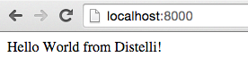
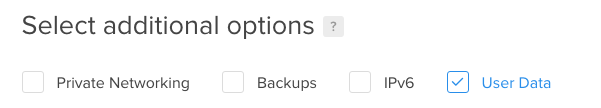
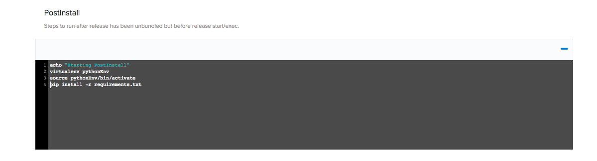
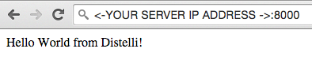

 

In this tutorial, we will go over how to deploy a Python application with a virtual environment. The sample application We will use a Python Flask application that displays "Hello World" on a web page.

### Before You Begin

This tutorial assumes you have a basic knowledge of Python applications and have Python installed on your local machine. You will also need a GitHub/BitBucket account. If you do not have a GitHub or BitBucket account, create one now:

* <a href="https://github.com/join" target="_blank">GitHub</a>
* <a href="https://bitbucket.org/account/signup/" target="_blank">BitBucket</a>

You will also need a server to deploy to. I will be using a DigitalOcean Cloud Server running Ubuntu 14.4.

## Step 1. Create The Python Application

The first task is to create a Python application if you do not already have one. This tutorial will use a simple Flask application that displays "Hello World" on a web page. Below is the code for the sample application I will be using, in a file called `simpleapp.py`:

~~~
from flask import Flask
import sys
import optparse
import time

app = Flask(__name__)

start = int(round(time.time()))

@app.route("/")
def hello_world():

    return "Hello World from Pipelines!"

if __name__ == '__main__':
    parser = optparse.OptionParser(usage="python simpleapp.py -p <port>")
    parser.add_option('-p', '--port', action='store', dest='port', help='The port to listen on.')
    (args, _) = parser.parse_args()
    if args.port == None:
        print "Missing required argument: -p/--port"
        sys.exit(1)
    app.run(host='0.0.0.0', port=int(args.port), debug=False)
~~~

If you are going to use the same sample application, you will also need a `requirements.txt` file to install the applications dependencies during builds and deployments. It will contain:

~~~
Flask>=0.9
~~~

Once you have created these files you can test your application locally to ensure everything is working. To run this application, you have to specify a port when you enter your run command. I will be using port 8000:

~~~
$ python simpleapp.py -p 8000
~~~

### Create unittest (optional)

To test our application we will create a unittest to test what is being output on our webpage. We want to make sure that "Hello World from Pipelines!" is being displayed on our page.

To create a test suite, we use a `test.py` file to define what we are testing. Below is the full `test.py` we will be using for this tutorial:

~~~
import unittest
from simpleapp import hello_world

class HelloWorldTestCase(unittest.TestCase):
    """Tests for `simpleapp.py`."""

    def test_is_output_hw(self):
        """Is the output of your Python Application what you expect?"""
        self.assertTrue(hello_world() == "Hello World from Pipelines!")

if __name__ == '__main__':
    unittest.main()
~~~

### Push Code to Repository

Once you have your Python application successfully running on your local machine, the next step is to push your code into a GitHub or BitBucket Repository. If you have not created a repository, do so now. Once your repo has been created, push your code.

## Step 2. Set Up Your Server

The next step in deploying our app is to make sure you have a server to run your application on. You can use any type of server - public cloud, private cloud or physical. Pipelines will let you deploy your code to  Vagrant VMs or servers in a VPC. You can even deploy to the server under your desk. For this tutorial we are going to be deploying to a server hosted by Digital Ocean.

To get your server set up on Digital Ocean, you will need to navigate to <a href="https://www.digitalocean.com/" target="_blank">digitalocean.com</a> to get set up. If you already have an account please Log In, if not Sign Up for an account now. Once you have created an account, or logged in, you will need to "Create Droplet".

Please select the settings for your droplet that best fit your needs. I am using an Ubuntu image set up in New York. You can choose any options that you please as Pipelines is able to deploy to any server, anywhere!

Select your <b>Image</b>, <b>Size</b>, and <b>Region</b>. In the <b>Additional Options</b> section check the box next to <b>User Data</b>

This will open a text area for you to enter in your <b>User Data</b>. To automate the install of the Pipelines Agent, use the script below:

~~~
#!/bin/bash

export DISTELLI_ACCESS_TOKEN='<b>YOUR DISTELLI ACCESS TOKEN</b>'
export DISTELLI_SECRET_KEY='<b>YOUR DISTELLI SECRET KEY</b>'

echo "DistelliAccessToken: $DISTELLI_ACCESS_TOKEN" > /etc/distelli.yml
echo "DistelliSecretKey: $DISTELLI_SECRET_KEY" >> /etc/distelli.yml
apt-get -y install wget
wget -qO- https://pipelines.puppet.com/download/client | sh
/usr/local/bin/distelli agent install -readyml /etc/distelli.yml
/usr/local/bin/distelli login -conf /etc/distelli.yml
~~~

You will need to insert your own Pipelines **Access Token** and **Secret Key**. These fields are tied to a Pipelines account. To retrieve your credentails, login to your Pipelines Account:

<ol>
<li>Click the <b>gear</b> icon from the top right.</li>
<li>Click the <b>Agent</b> link on the left.</li>
<li>Under <i>Agent Credentials</i> click the <b>Show</b> button.</li>
</ol>

You will see your <b>Access Token</b> and <b>Secret Key</b> here. Please insert them into your <b>User Data</b> script, and insert the Pipelines environment you want to add your server to.

## Step 3. Create Pipelines Application

To create your app, follow these steps:

On your Pipelines account home screen click the <b>New App</b> button

Name your app and then select the Repository type where you are storing your applications files.

After we click the button to connect to our Repository, we then select the appropriate repo that contains your code.

Select the appropriate branch for your deployment. I have only a master branch, but you can deploy any branch from your repo!

Next, set your build steps. This is where we would include any tests we want to run when building our application or any other tasks you'd like to run during builds. If you have include the unittest with your application, enter the following into your Build section:

#### Build
~~~
sudo apt-get update
sudo apt-get install python -y
sudo apt-get install python-pip -y
sudo apt-get install python-virtualenv -y
virtualenv pythonEnv
source pythonEnv/bin/activate
pip install -r requirements.txt
python test.py
~~~

Below are the two lines to enter in your PkgInclude Section:

Copy/Paste
~~~
simpleapp/simpleapp.py
requirements.txt
~~~

The final step is to select our <b>Build Image</b>. In this case, we select <b>Pipelines Python (Docker)</b> for our Python Application. Select the <b>Auto Build</b> checkbox and click <b>Looks good. Start Build!</b>.

> **Note:** The Auto-Build feature builds your application everytime you commit code to your repository

Now our application should start building. You can watch its progress by navigating to the builds tab on your Pipelines account and clicking on your build.

## Step 4. Deploy Steps

> **Note:** This tutorial assumes that the server is out of the box and needs to have your application dependencies installed & configured. Once your application dependencies are installed & configured you can remove those commands from your <b>Manifest</b>.

Once your build has completed navigate back to your application page and open your application.

Click the <b>Manifest</b> tab.

Expand the "Deployment Manifest" section by clicking on the plus sign. This is where we are going to tell Pipelines what commands to run during our Deployment.

### PreInstall

> **Note:** After your first deployment you can remove the PreInstall Section from your Manifest. Once you have the correct versions of Python, Pip, & VirtualEnv there is no need to reinstall them everytime.

Scroll down to your PreInstall section and enter in the following:

~~~
echo "Starting PreInstall"
sudo apt-get update
sudo apt-get install python -y
sudo apt-get install python-pip -y
sudo apt-get install python-virtualenv -y
~~~

### PostInstall

Scroll down to your PostInstall section and enter in the following

~~~
echo "Starting PostInstall"
virtualenv pythonEnv
source pythonEnv/bin/activate
pip install -r requirements.txt
~~~

### Exec

Scroll down to your Exec section and enter in the following

~~~
echo "Executing"
exec python simpleapp/simpleapp.py -p 8000
~~~

### Re-Build Application

Because we have changed our deployment steps, we need to rebuild our application. To trigger a new build, click the wrench icon in the right hand corner. This triggers a build of your latest code, build steps, and deployment steps.

## Step 5. Deploy Application

### Install Pipelines Agent on Your Server

To be able to deploy your application to your server you will need to install the Pipelines Agent. You will need remote access to your server to complete the installation. Please consult the below information on how to install the Pipelines Agent on your server.

> **Note:** This installation requires root (administrator) permissions.

<h3>Linux and macOS X</h3>

To install on Linux or macOS X you can use either curl <b>or</b> wget with one of the following syntaxes.
<h4>wget example</h4>

~~~
wget -qO- https://pipelines.puppet.com/download/client | sh
~~~

<h4>curl example</h4>

~~~
curl -sSL https://pipelines.puppet.com/download/client | sh
~~~

<h3>Windows</h3>

To install on Windows copy and paste the following powershell command into a command (cmd) window.

~~~
powershell -NoProfile -ExecutionPolicy Bypass -Command "iex ((new-object net.webclient).DownloadString('https://pipelines.puppet.com/download/client.ps1'))" & SET PATH=%PATH%;%ProgramFiles%/Distelli
~~~

<h3>Complete the Install</h3>

To complete the install of the agent, you must issue the `/usr/local/bin/distelli agent install` command.

~~~
/usr/local/bin/distelli agent install
~~~

~~~
ServerA:~$ <b>wget -qO- https://pipelines.puppet.com/download/client | sh</b>
This script requires superuser privileges to install packages
Please enter your password at the sudo prompt

[sudo] password for bmcgehee:
    Installing Pipelines CLI 3.51 for architecture 'Linux-x86_64'...
    Downloading https://s3.amazonaws.com/download.distelli.com/distelli.Linux-x86_64/distelli.Linux-x86_64-3.51.gz
To install the agent, run:
    sudo /usr/local/bin/distelli agent install
ServerA:~$ <b>sudo /usr/local/bin/distelli agent install</b>
Distelli Email: jdoe@distelli.com
      Password:
    1: User: jdoe
    2: Team: janedoe/TeamJane
Team [2]: <b>1</b>
Server Info: https://www.distelli.com/jdoe/servers/12345678-4765-ac42-bd7a-080027c8277c
Starting upstart daemon with name:  dtk-supervise-cc123456787ad94a8d34ac610381242f9ae28bb8
~~~

<h3>Verify the Install</h3>

To validate the agent is installed and working use the `/usr/local/bin/distelli agent status` command.

> **Note:** This installation requires root (administrator) permissions.

~~~
/usr/local/bin/distelli agent status
Pipelines Agent (serverA) is Running with id 766b88c8-e925-11e4-ae8b-080027cc07f7
~~~

If you would like more information on installing the Pipelines agent, visit [Installing the Pipelines Agent](./agent.html). 

### Deploy your Python Application

Now that we have successfully built our application and installed the agent, we are ready to deploy to our server. On the builds page select the "New Deployment" button in the right hand corner.

Once you click the button, you should be directed to the deployment page. The first step is to select the "Deploy a Release" option.

Select the application you want to deploy. Please select the application we created earlier in the tutorial. Our application is named "pythonVirt".

Then select the release you want to deploy. For now, there should be only one release for deployment.

The last step in our deployment is to select the environment you want to deploy in. First create an environment by entering a name and clicking <b>Add Environment</b>.

Next, select the Environment you just created and click <b>All Done</b>.

Now Pipelines will ask you to add your server. Click <b>Add Servers</b> button to get started. Select the server you configured earlier in the tutorial and add it to your account. Once you have added your server, you can close the "Add Servers" panel and continue with your deployment. You will see a final option to set your delay between deployments on your servers and a <b>Deploy!</b> button.

Click the "Deploy!" button to begin your deployment. You will redirected to a page where you can view the progress of your deployment. Clicking the "log" button on the left side enables you to view streaming logs for the deployment.

### View Your Application

And that's it! You should now be able to point your browser to "http://<-You Server's IP Address->:8000" and see your Python Application!

