In this tutorial we will go through how to deploy a Sails.js and Angular application.

## Before you begin

Before we begin, make sure to have the following:

- A server to deploy to
- A Sails.js application that is ready to be deployed. If you don't have an application you can follow [this tutorial](https://scotch.io/tutorials/build-a-todo-app-using-sailsjs-and-angularjs) to create one.

## Step 1. Prepare application for deployment

> **Note:** If you have your own Sails.js application, you can skip this step.

If you are using the Sails.js application from the Scotch.io tutorial, there is one small change to make. Make sure your `bower.json` file looks identical to one the below:

~~~~
{
  "name": "assets",
  "dependencies": {
    "angular-bootstrap": "~0.11.0",
    "angular-moment": "~0.7.1",
    "angular-route": "~1.2.17",
    "angular": "~1.2.19",
    "angular-mocks": "~1.2.21",
    "jquery": "~2.1.3",
    "bootstrap": "~3.3.5"
  }
}
~~~~

Once you have made sure your `bower.json` is identical to the one above, we can push our files to a repository. You can also make sure your application works by running it locally with the `sails lift` command:

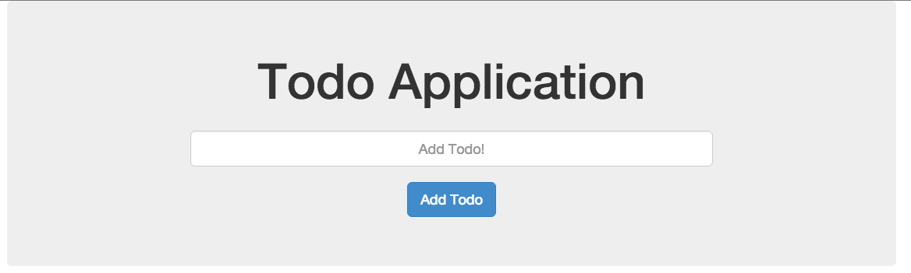

## Step 2. Push files to a repository

For more information on how to create a repository:

* [GitHub](https://help.github.com/articles/adding-an-existing-project-to-github-using-the-command-line/)
* [BitBucket](https://confluence.atlassian.com/bitbucket/create-a-repository-221449521.html)

## Step 3. Set up your server

If you do not have a Pipelines account, [sign up](https://pipelines.puppet.com/signup) for one now. 

> **Note:** You will need remote access to the server you are deploying to.

The next step is to install the Pipelines agent on the server we are going to deploy our Application to. For demonstration purposes, I am using an Ubuntu 14.04 server hosted by DigitalOcean.

### Install Pipelines agent on your server

To be able to deploy your application to your server you will need to install the Pipelines agent. You will need remote access to your server to complete the installation. Please consult the below information on how to install the Pipelines agent on your server.

> **Note:** This installation requires root (administrator) permissions.

To install on Linux or macOS X you can use either curl or Wget with one of the following syntaxes:

~~~~
wget -qO- https://pipelines.puppet.com/download/client | sh
~~~~

~~~~
curl -sSL https://pipelines.puppet.com/download/client | sh
~~~~

To install on Windows, copy and paste the following PowerShell command into a command (cmd) window.

~~~~
powershell -NoProfile -ExecutionPolicy Bypass -Command "iex ((new-object net.webclient).DownloadString('https://pipelines.puppet.com/download/client.ps1'))" & SET PATH=%PATH%;%ProgramFiles%/Distelli
~~~~

### Complete the install

To complete the install of the agent, you must issue the `sudo /usr/local/bin/distelli agent install` command.

~~~~
sudo /usr/local/bin/distelli agent install
~~~~

~~~~
ServerA:~$ <b>wget -qO- https://pipelines.puppet.com/download/client | sh</b>
This script requires superuser privileges to install packages
Please enter your password at the sudo prompt

[sudo] password for bmcgehee: 
    Installing Distelli CLI 3.51 for architecture 'Linux-x86_64'...
    Downloading https://s3.amazonaws.com/download.distelli.com/distelli.Linux-x86_64/distelli.Linux-x86_64-3.51.gz
To install the agent, run:
    sudo /usr/local/bin/distelli agent install
ServerA:~$ <b>sudo /usr/local/bin/distelli agent install</b>
Distelli Email: jdoe@distelli.com
      Password: 
    1: User: jdoe
    2: Team: janedoe/TeamJane
Team [2]: <b>1</b>
Server Info: https://www.distelli.com/jdoe/servers/12345678-4765-ac42-bd7a-080027c8277c
Starting upstart daemon with name:  
~~~~

For more information on installing the agent see [Installing the Pipelines agent](./agent.html).

## Step 4. Create Pipelines Applications

In the Pipelines for Applications web UI, click **Applications**, then click <b>New App</b>.

Select the repository type where you are storing your applications files. 

After we click the button to connect to our repository, we select the appropriate repo that contains the files.

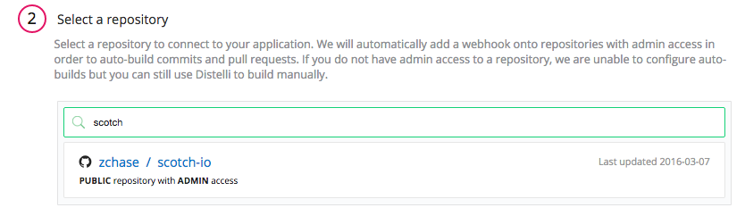

Select the appropriate branch for your deployment. I have only a master branch, but you can deploy any branch from your repo.

Next, we are prompted to set our build steps. Leave this section as is. For this particular application we will not setting any <b>Build Steps</b>.

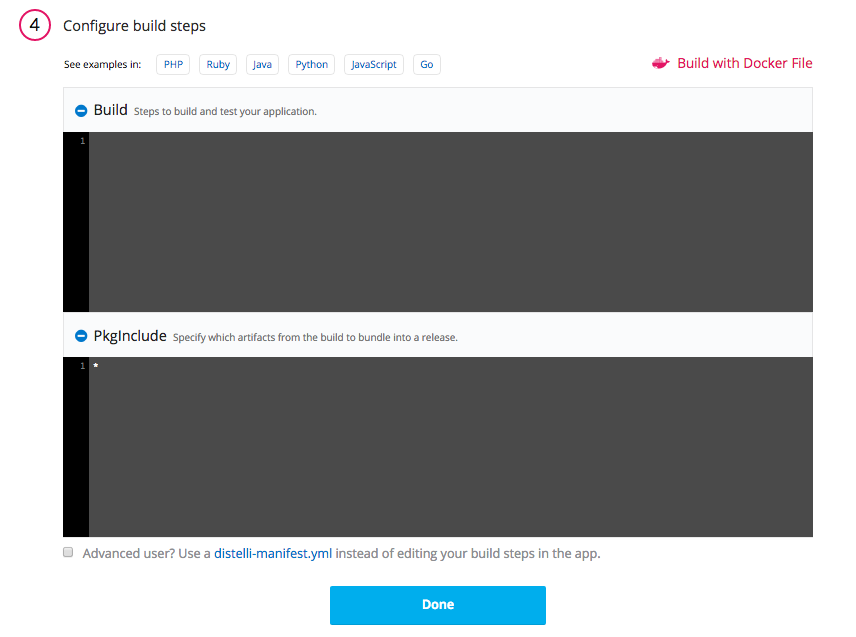

The final step is select our Build Image. In this case, we are going to select "Distelli Javascript (Docker)" for our Sails App. Make sure the <b>Auto Build</b> checkbox is enabled, and click <b>Looks good. Start Build!</b>.

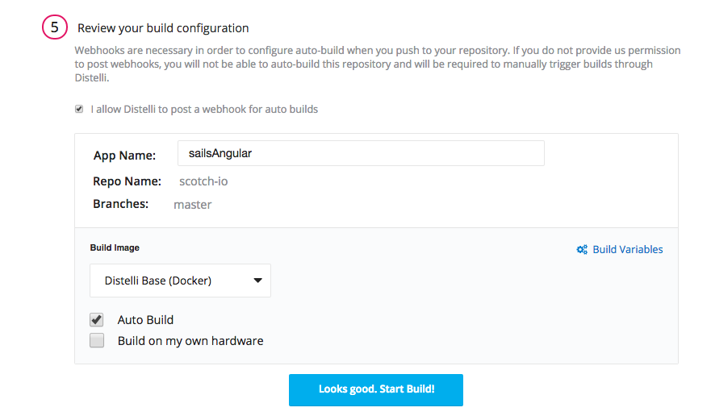

### Configure Deploy Steps

Once your application has been created, navigate to your <b>Application</b> page and open your newly created application.

Click <b>Manifest</b>.

Expand the <b>Deployment Manifest</b> section by clicking the plus sign. This is where we are going to configure the commands to run during our deployment.

Scroll down to your **PreInstall** section and enter the following:

> **Note:** You can remove this section from your manifest after your initial deployment.

~~~~
sudo apt-add-repository ppa:chris-lea/node.js
sudo apt-get update
sudo apt-get install python-software-properties git -y
sudo apt-get install nodejs -y
sudo npm install bower sails -g
~~~~

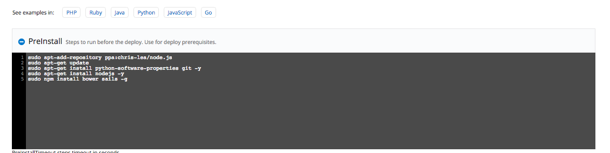

Scroll down to your **PostInstall** section and enter the following:

~~~~
sudo npm install
/usr/bin/bower install
~~~~

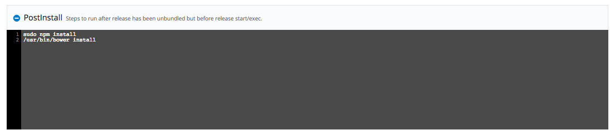

Scroll down to your **Exec** section and enter the following:

~~~~
echo "Start Sails Application"
/usr/bin/sails lift
~~~~

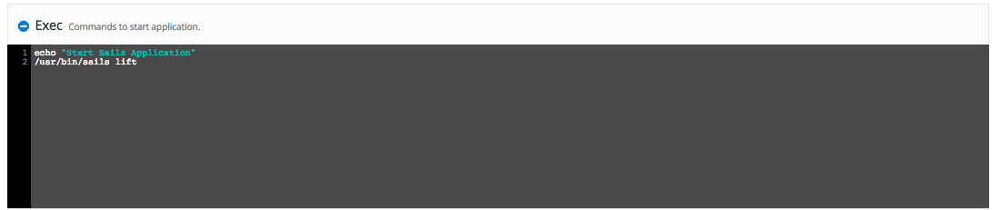

### Create environment

To deploy our application in production mode, we need to create a environment. Click the <b>Environments</b> tab and the <b>New Environment</b> button. Enter in the information for you newly created environment, and then navigate to the environment's page. Once on your environment's page, add the following <b>Environmental Variable</b>:

~~~~
export NODE_ENV=production
~~~~

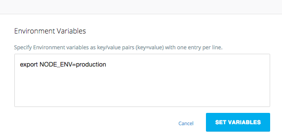

### Rebuild the application

Because we changed our deployment steps, we need to rebuild our application. To trigger a new build, click the hammer (**Build Application**) icon in the upper right corner. This triggers a build of your latest code, build steps, and deployment steps.

Navigate to your **Builds** page and click the active build to watch it progress. Once your build is complete, a green box indicates that your build was successful.

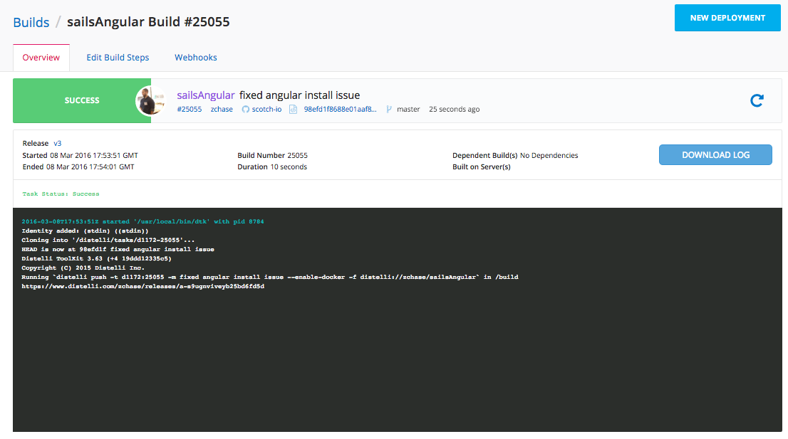

## Step 5. Deploy application

Now that we have successfully built our application, we are ready to deploy to our server. On the **Builds** page click <b>New Deployment</b>.

Once you click the button, you should be directed to the deployment page. The first step is to select the <b>Deploy a Release</b> option.

You are prompted to select the application you want to deploy. Select the application we created earlier in the tutorial.

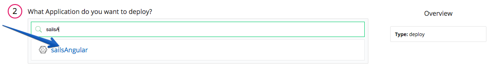

Then you are prompted to select the release you would like to deploy. For now there should be only one release for deployment.

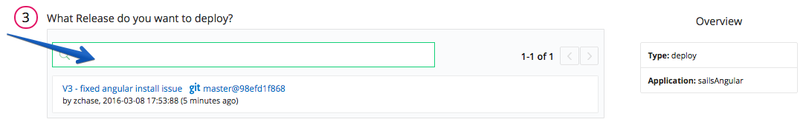

The last step in our deployment is to select the environment you want to deploy to. First you will need to create an environment by enter a name and selecting the **Add Environment** button. 

Next select the Environment you just created and click <b>All Done</b>.

Now you need add your server. Click <b>Add Servers</b> to get started. Select the server you configured earlier in the tutorial, and add it to your account. Once you have added your server, close the <b>Add Servers</b> panel and continue with your deployment. You are shown a final option to set your delay between deployments on your servers and a <b>Start Deployment</b> button.

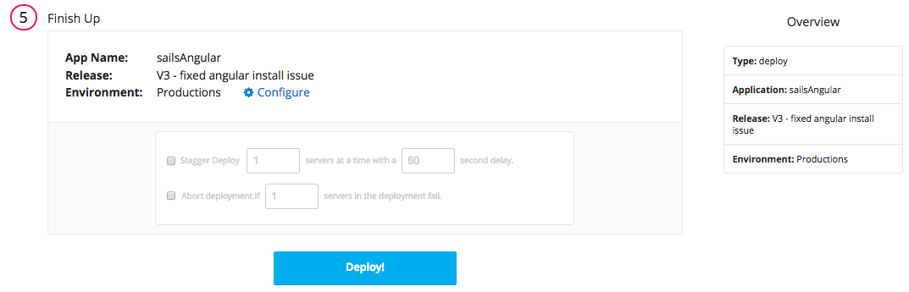

Click <b>Start Deployment</b> to begin your deployment. A deployment page opens, where you can view the progress of your deployment. Click <b>log</b> on the left side to view realtime streaming logs for the deployment.

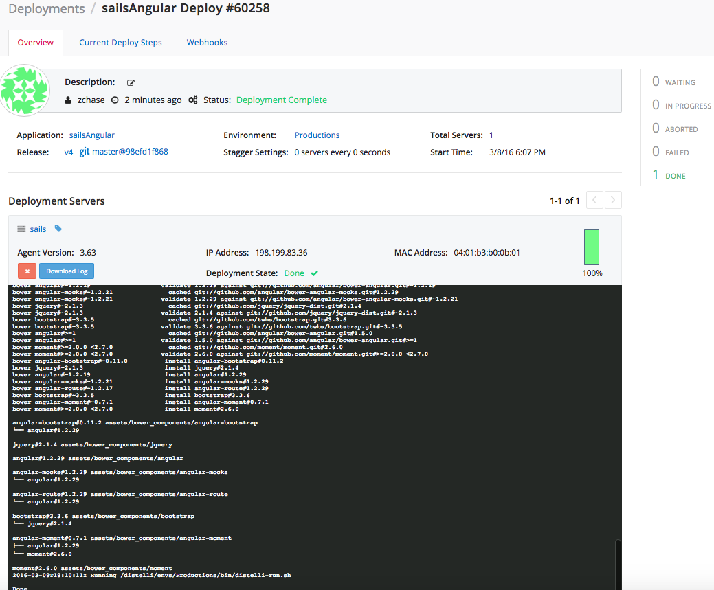

You should now be able to point your browser to `http://<-You Server's IP Address->:1337` and see your Sails + Angular Application!

You have now set up a Sails + Angular Application with continuous integration and continuous deployment! Thanks for following along and happy coding!
