Builds are enqueued when an application, in Pipelines, is integrated with a software repository and there is a commit change to that repository.

Builds can also be triggered by Pull Requests and Tags.

## Start a build

To start a build, commit a change to the repository that is integrated with an application in Pipelines.
For more information see:

* [Enabling auto build](./build.html)
* [Connecting a repository to an application](./application-manage.html)
* [Creating an application from a repository](./application-create.html)

## Manually build the latest commit

You can manually initialize a new build of the latest commit to any branch of your application. 

<ol>
<li>Click the <b>Applications</b> link at the top of the Pipelines web UI.</li>
<li>Navigate to the application you wish to build.</li>
<li>Click <b>Build Application</b> (the hammer icon).</li>
<li>In the <b>Build Latest Commit</b> window, select the branch that contains your commit.</li>
<li>Click <b>Build</b>.</li>
</ol>

You are now building your application.

## Enable auto build 

Auto build is a feature that provides continuous integration and is the first part of continuous delivery and continuous deployment. Auto build functionality is specific to an application.

For integrating a repository with Pipelines, see [Integrating with a repository](./integrate-repo.html).

The auto build options can be found in an applications overview in the [app pipeline](./pipeline.html).

> **Note:** To enable auto build your application must be integrated with a repository. If you have not connected your application to a repository see [Connecting a repository to an application](./application-manage.html).

<ol>
<li>In the Pipelines web UI click <b>Applications</b> at the top</li>
<li>Navigate to the application you wish to enable auto build.</li>
<li>Ensure you are on the <b>Overview</b> tab.</li>
<li>If you have not connected a repository. Click <b>Connect Repository</b> and see <a href="./application-manage.html">Connecting a Repository to an Application</a>.</li>

<!--<li>Once your application is connected to a repository click the <b>Add Pipeline for <i>XXXXXXX</i> branch</b> button.</li>

-->

<li>You should find the App Pipeline below. Click the <b>Auto Build settings</b> dropdown.</li>

<li>Select the auto build options for the selected repository branch.</li>

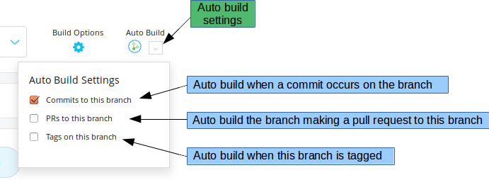

<li>Click the <b>Auto Build settings</b> dropdown to close it.</li>

</ol>

You have enabled auto build.

For continuous deployments see [Enabling Auto Deploy](./application-deploy.html).

## Disable Auto Build

<ol>
<li>In the Pipelines web UI click <b>Applications</b> at the top</li>
<li>Navigate to the application you wish to disable auto build.</li>
<li>Ensure you are on the <b>Overview</b> tab.</li>
<li>Select the branch you wish to disable auto build.</li>
<li>Click the <b>Auto Build settings</b> dropdown.</li>
<li>Uncheck the settings as necessary.</li>

</ol>

You have disabled auto build.

## Rebuild a Build

Another way to start a build is to rebuild from an existing build in the build list page. 

To enqueue a new build from an existing build:
<ol>
<li>Click the <b>Builds</b> link at the top of the Pipelines web UI.</li>
<li>Navigate through the list to the build you wish to rebuild.</li>
<li>Click the rebuild symbol on the right in the build panel.</li>

</ol>

You are now rebuilding your application.

## Cancel a build

You can cancel / abort a build from the build list page. To do so:
<ol>
<li>Click the <b>Builds</b> link at the top of the Pipelines web UI.</li>

<li>Navigate through the list to the build you wish to cancel.</li>

<li>Click the <b>X</b> on the right in the build panel.</li>
</ol>

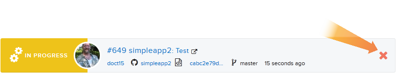

## View a build

You can view your builds from the builds list page. To navigate there click the <b>Builds</b> link at the top of the Pipelines web UI.

The builds list page provides a list of builds. This includes builds that are:
<ul>
<li>Queued</li>

<li>In progress</li>

<li>Successful</li>

<li>Failed</li>

</ul>
The builds list page also provides navigation to many important links.

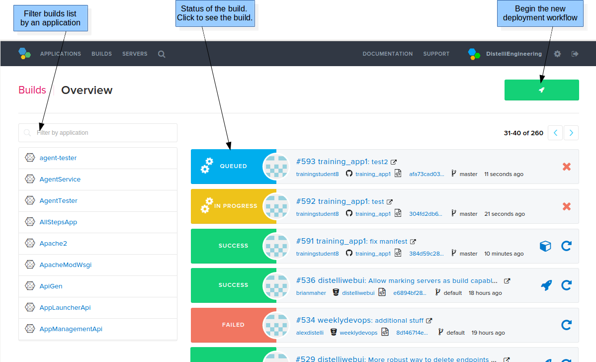

Each build panel contains links and information.

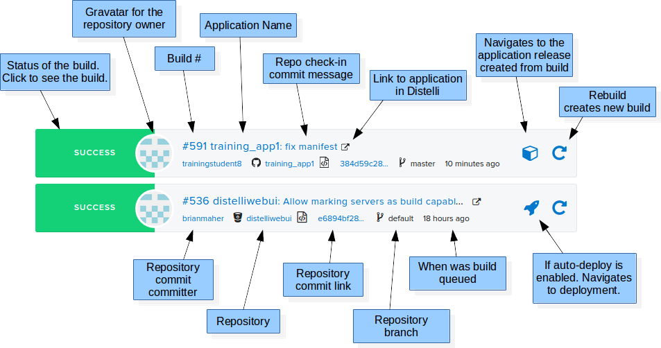

### Build page

Clicking on a build from the builds list page will take you to the build page. The build page has many similar links as the build panel in the build list page. Importantly on the build page is the build log which is helpful in troubleshooting failed builds.

### Build log

The build log contains useful information related to your build. It is also invaluable in troubleshooting.
The build log can be found on the build page. To navigate to a build page:
<ol>
<li>Click <b>Builds</b> at the top of the Pipelines web UI.</li>

<li>Click on a build to see the associated log.</li>

</ol>

To download the build log, click the <b>Download Log</b> button on the build page.

## Logging build results

There are several ways to capture information from activities during Pipelines builds.

But first, realize that builds in Pipelines have a complete log of what occurred. If you would like more information, output the text during the build, it will be captured in the build log, which you can watch live, or download when the build is complete.

Often customers want to store test results in a database or webpage, or provide enhanced information or feedback from their builds to their users. Depending on the scope of information and how you wish to present it, many options are available.

Our engineering team is always on the ready to help you build and customize your solutions in Pipelines. Feel free to reach out to us at support@puppet.com. 

This document covers two methods of pushing information from builds to users.

One method that Pipelines supplies right out of the box is the Pipelines manifest [ReleaseNotesCmd](./manifest-build.html) section.

## ReleaseNotesCmd Logging

This section of the Pipelines manifest will take the output of any command and include that in the Pipelines release notes, which can be found on the release details page.

To use this section, include it in your distelli-manifest.yml. Here is an example:

~~~
jdoe/example-app:
  ReleaseNotesCmd:
    - DISTELLI_USERNAME="jdoe"
    - BUILD_URL="https://www.distelli.com/$DISTELLI_USERNAME/builds/$DISTELLI_BUILDNUM"
    - LOG_DATE=$(date +"%Y/%m/%d %H:%M:%S")
    - LOG_STATUS="Custom Build ID $AHP_JOB_ID"
    - LOG_STRING="$LOG_DATE $LOG_STATUS Build# $DISTELLI_BUILDNUM $BUILD_URL"
    - echo -e "$LOG_STRING\n"
~~~

When navigating to the release notes created from this snippet, they may look like this:

~~~
2016/09/13 18:56:03 Custom Build ID "Rev1001.38-beta-x-ha3f" Build# 97155 https://www.distelli.com/jdoe/builds/97155
~~~

Note, above is an example. Another example might be including test results:

~~~
  ReleaseNotesCmd:
    - cat test_results.output
~~~

Or inspect the files (artifacts) built during the build process:

~~~
  ReleaseNotesCmd:
    - ls -la target/
~~~

Whatever output you have in the ReleaseNotesCmd section of the Pipelines manifest, will be included in your release in Pipelines.

Of note, ReleaseNotesCmd is run only on build success. Failed builds do not create a release, so do not have any release notes.

## Logging to AWS S3 Website

This section describes a solution logging to an external log source. This can be accomplished with any external source, not just AWS S3. No matter what external logging you use, the concepts are similar.

This solution includes capturing logging on both AfterBuildSuccess and AfterBuildFailure.

The next few steps will cover how to create a static website on Amazon AWS S3 and dynamically update the content with build information from Pipelines. This will allow you to publish build status, and enhance build information and logging.

#### Create the S3 Website

The first step is to create the AWS S3 static website. In the AWS Console, navigate to [S3](https://console.aws.amazon.com/s3).

Next, create a bucket, or navigate to an existing bucket.

In the bucket <b>Properties</b>, under <b>Static Website Hosting</b>; <b>Enable website hosting</b> as exemplified below:

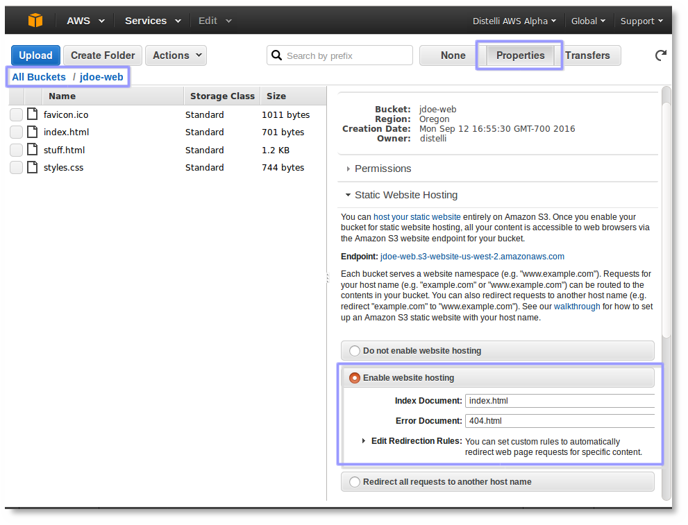

#### Add the Website Content Files

For this exercise, I created a simple website. The website looks like this:

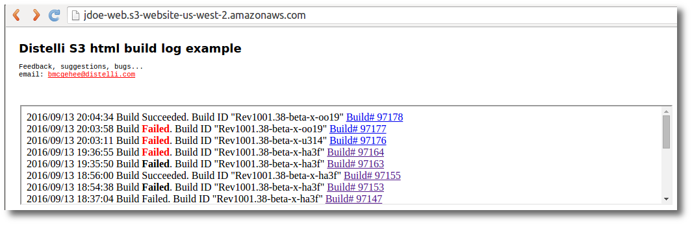

There is an embedded (iframe) of log information that is kept in a different file than index.html. This is called <b>stuff.html</b> (your naming may vary).

The code for all the files I used is below.

<code>index.html</code> 

~~~
<html>
<head>
  <title>Pipelines S3 html build log example</title>
  <link rel="stylesheet" type="text/css" href="styles.css">
  <meta name="Generator" content="Brian McGehee">
  <meta http-equiv="Content-Type" content="text/html">
  <meta name="description" content="Pipelines S3 html build log example">
  <meta name="robots" content="noindex,nofollow">
</head>
<body>

<h1>Pipelines S3 html build log example</h1>

 
Feedback, suggestions, bugs... 
email: <a href="mailto:bmcgehee@distelli.com">bmcgehee@distelli.com</a>
 

<iframe src='stuff.html' seamless scrolling='yes' frameborder='1' class="divOptions"></iframe>

</body>
</html>
~~~

<code>styles.css</code>

~~~
html {
  margin: 0px;
  padding: 0px;
}
body { 
  background-repeat: repeat
  text-color: #000000;
  margin: 0px; 
  padding: 0px;
}
p { 
  font: 10pt courier; 
  margin-top: 0px; 
  text-align: left;
}
.divOptions {
  position: absolute;
  top: 120px;
  left: 22px;
  width: 1000px;
}
.logo {
  position: absolute;
  top: 22px;
  left: 20px;
  font: 10pt courier;
  margin-top: 0px;
  text-align: left;
}
.version {
  font: 8pt courier; 
  margin-top: 0px; 
  text-align: left;
}
h1 {
  COLOR: #000000;
  FONT-FAMILY: sans;
  FONT-WEIGHT: bold;  
  FONT-SIZE: 18px;
  margin: 0px;
}
a:link { 
  text-decoration: underline; 
  color: #FF0000;
}
a:visited { 
  text-decoration: underline; 
  color: #FF2222;
}
a:hover, a:active { 
  text-decoration: none; 
  color: #444444;
}
~~~

<code>favicon.ico</code>

This is your website default icon file. Not necessary.

<code>stuff.html</code>

This file should be initially created with at least 1 line of text to seed the file.

~~~
This is the last (bottom) line of the stuff.html logfile. 
~~~

Now upload all those files to the S3 bucket created earlier.

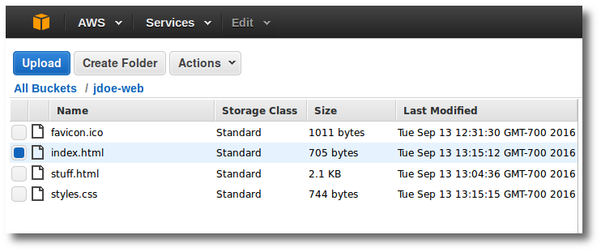

If you try and access the site now, you may see this message:

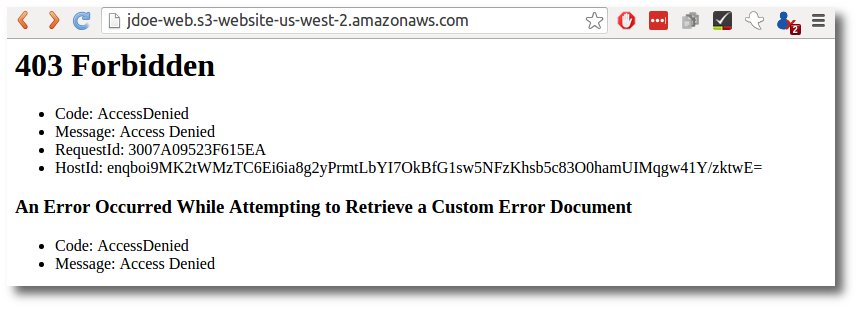

This is a permissions issue.

#### S3 Website File Permissions

The files must be readable to be served as web content. To do this, grant <b>Everyone</b> <b>Open/Download</b> permission.

Select each file, in succession, in the AWS S3 console, click <b>Properties</b> and expand the <b>Permissions</b> section.

Grant the appropriate permissions.

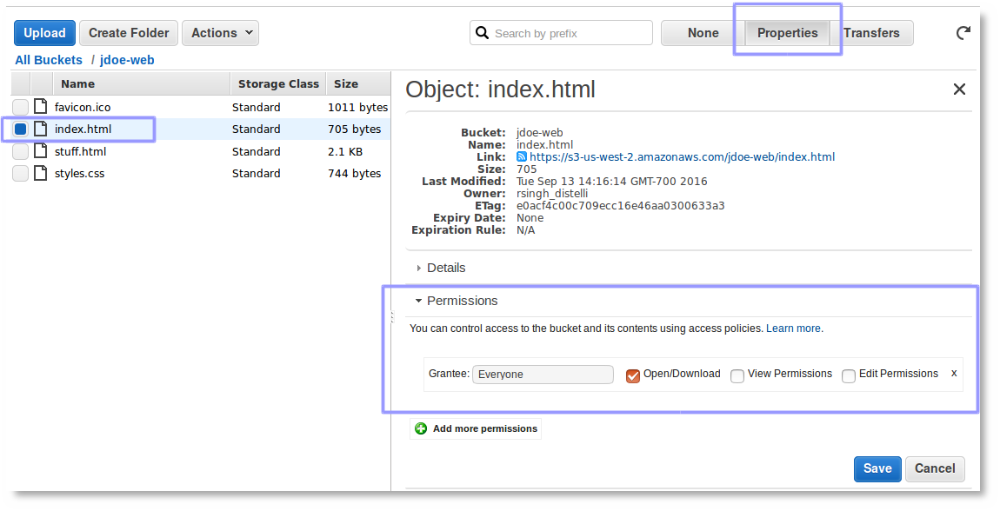

And <b>Save</b> your changes.

With your web browser navigate to the S3 website again.

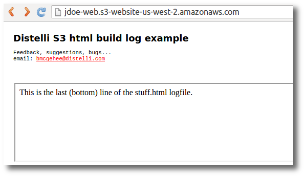

## Logging to the Website from Pipelines

To complete the following steps, AWS credentials will be required to perform AWS CLI commands. In particular, <code> aws s3 cp</code>. These credentials must have access to provide read/write/grant-permissions to the S3 website bucket file <b>stuff.html</b>.

### Adding AWS Credentials to Application in Pipelines

This assumes there exists an application in Pipelines that you wish to log build information to the S3 website. If not, see [Creating an Application](./application-create.html).

Navigate to the application in Pipelines and click the <b>Branch Build Options</b> link. In the resulting window, enter Pipelines build variables for:
<ul>
  <li><b>AWS_ACCESS_KEY</b> - The AWS Access key.</li>
  <li><b>AWS_SECRET_ACCESS_KEY</b> - The AWS Secret key</li>
</ul>

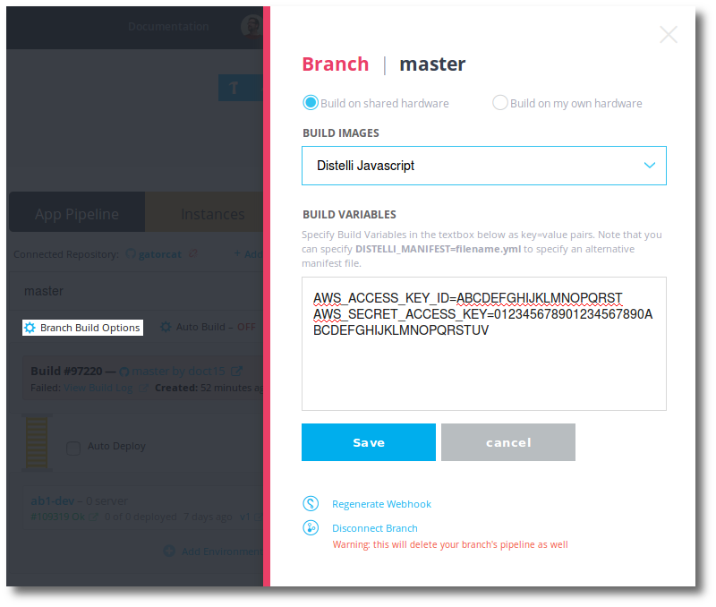

Click <b>Save</b> to save your edits.

### Updating the Pipelines Manifest

The Pipelines manifest has your build and deploy instructions. Add the following to your manifest as appropriate.

In the [PreBuild](./manifest-build.html) section, check to see if AWS CLI is installed, and if not, install it.

~~~
  PreBuild:
    # Check to see if aws cli is installed
    - if which aws >/dev/null; then
    -   echo "--AWS CLI exists--"
    - else
    -   echo "--Installing AWS CLI--"
    # Check to see if unzip is installed
    -   if which unzip >/dev/null; then
    -     echo "--Unzip exists--"
    -   else
    -     echo "--Installing unzip--"
    -     sudo apt-get -y install unzip
    -   fi
    -   curl "https://s3.amazonaws.com/aws-cli/awscli-bundle.zip" -o "awscli-bundle.zip"
    -   unzip awscli-bundle.zip
    -   sudo ./awscli-bundle/install -i /usr/local/aws -b /usr/local/bin/aws
    - fi
~~~

In the [AfterBuildSuccess](./manifest-build.html) and [AfterBuildFailure](./manifest-build.html) sections, code will be added to provide logging information on the S3 webserver in the file stuff.html.

~~~
  AfterBuildSuccess:
    - DISTELLI_USERNAME="jdoe"
    - BUILD_URL="https://www.distelli.com/$DISTELLI_USERNAME/builds/$DISTELLI_BUILDNUM"
    - LOG_DATE="$(date +"%Y/%m/%d %H:%M:%S")"
    - LOG_STATUS="Build Succeeded. Build ID $AHP_JOB_ID"
    - LOG_STRING="$LOG_DATE $LOG_STATUS <a href=\"$BUILD_URL\" target=\"_blank\">Build# $DISTELLI_BUILDNUM</a> \n"
    - echo "$LOG_STRING"
    - aws s3 cp s3://jdoe-web/stuff.html stuff.html
    - sed -i "1s|^|$LOG_STRING|" stuff.html
    - aws s3 cp stuff.html s3://jdoe-web/stuff.html --grants read=uri=http://acs.amazonaws.com/groups/global/AllUsers
~~~

~~~
  AfterBuildFailure:
    - DISTELLI_USERNAME="jdoe"
    - BUILD_URL="https://www.distelli.com/$DISTELLI_USERNAME/builds/$DISTELLI_BUILDNUM"
    - LOG_DATE="$(date +"%Y/%m/%d %H:%M:%S")"
    - LOG_STATUS="Build <b>Failed</b>. Build ID $AHP_JOB_ID"
    - LOG_STRING="$LOG_DATE $LOG_STATUS <a href=\"$BUILD_URL\" target=\"_blank\">Build# $DISTELLI_BUILDNUM</a> \n"
    - echo "$LOG_STRING"
    - aws s3 cp s3://jdoe-web/stuff.html stuff.html
    - sed -i "1s|^|$LOG_STRING|" stuff.html
    - aws s3 cp stuff.html s3://jdoe-web/stuff.html --grants read=uri=http://acs.amazonaws.com/groups/global/AllUsers  
~~~

As you can see, whether the build succeeds or fails, we update the S3 website with the appropriate information. To break down what happens in both AfterBuildSuccess and AfterBuildFailure.

<ol>
  <li>First, we gather all the data and build our message. This includes:</li>
  <ul>
    <li><b>DISTELLI_USERNAME</b> - Your Pipelines username.</li>
    <li><b>BUILD_URL</b> - The URL back to the Pipelines build log specific to this build.</li>      
    <li><b>LOG_DATE</b> - The current date and time stamp.</li>
    <li><b>LOG_STATUS</b> - The Build status [Success || Failed (in red)].</li>
    <li><b>LOG_STRING</b> - A concatenation of the above data.</li>
  </ul>
  <li>Download the current S3 stuff.html file.</li>
  <li>Creates the top most recent entry in the stuff.html with the LOG_STRING.</li>
  <li>Upload the S3 stuff.html file.</li>
</ol>

After running several builds with failure and success, your S3 website page may look similar to this:

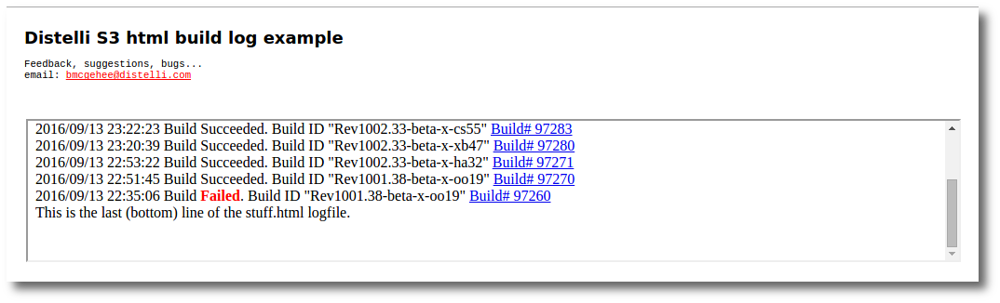

## Conclusions

Though this is specifically targeted, it can be expanded to many use cases.

<b>Scenario:</b> Each build should create its own S3 webpage with a ton of test logging and output.

<b>Solution:</b> In the AfterBuildSuccess and AfterBuildFailure sections:

<ol>
  <li>As part of the data gathered (noted above) also include:</li>
  <ul>
    <li><b>UNIQUE_FILENAME</b> - a unique webpage filename that includes $DISTELLI_BUILDNUM for uniqueness.</li>
  </ul>
  <li>Create a new file named UNIQUE_FILENAME.</li>
  <li>Write the mass amounts of test data to this file in a text readable format.</li>
  <li>Upload the UNIQUE_FILENAME to S3 with the correct read permissions.</li>
  <li>Download S3 stuff.html file.</li>
  <li>Add an entry into stuff.html with a URL link to UNIQUE_FILENAME on S3.</li>
  <li>Upload stuff.html back to S3.</li>
</ol>

Here is an example AfterBuildFailure manifest snippet. The only difference in AfterBuildSucces is the LOG_STATUS.

~~~
  AfterBuildFailure:
    - DISTELLI_USERNAME="jdoe"
    - BUILD_URL="https://www.distelli.com/$DISTELLI_USERNAME/builds/$DISTELLI_BUILDNUM"
    - S3_BUCKET="s3://jdoe-web"
    - S3_URL="http://jdoe-web.s3-website-us-west-2.amazonaws.com"
    - UNIQUE_FILENAME="distelli-build$DISTELLI_BUILDNUM.txt"
    - UNIQUE_BUCKET="$S3_BUCKET/$UNIQUE_FILENAME"
    - UNIQUE_URL="$S3_URL/$UNIQUE_FILENAME"
    - LOG_DATE="$(date +"%Y/%m/%d %H:%M:%S")"
    - LOG_STATUS="Build <b>Failed</b>."
    - LOG_STRING="$LOG_DATE $LOG_STATUS <a href=\"$BUILD_URL\" target=\"_blank\">Build# $DISTELLI_BUILDNUM</a> <a href=\"$UNIQUE_URL\" target=\"_blank\">Test Results</a> "
    - echo "$LOG_STRING" > "$UNIQUE_FILENAME"
    - cat test_results.exa >> "$UNIQUE_FILENAME"
    - NEW_LINK="http://jdoe-web.s3-website-us-west-2.amazonaws.com/$UNIQUE_FILENAME"
    - aws s3 cp "$UNIQUE_FILENAME" "$UNIQUE_BUCKET" --grants read=uri=http://acs.amazonaws.com/groups/global/AllUsers
    - aws s3 cp "$S3_BUCKET/stuff.html" stuff.html
    - sed -i "1s|^|$LOG_STRING|" stuff.html
    - aws s3 cp stuff.html "$S3_BUCKET/stuff.html" --grants read=uri=http://acs.amazonaws.com/groups/global/AllUsers
~~~

Ultimately this solution gives you a list of links to test results for each build.

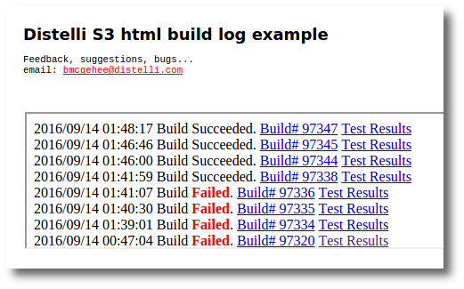

