Dashboards allow you to graphically visualize your entire software release workflow.

With dashboards you graphically lay out your deployment strategy. Dashboards give you insight into what is currently deployed and what is available for deployment.

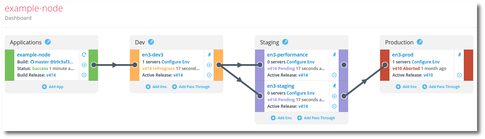

Dashboards can represent a single application with multiple environments, as above. And a dashboard can visualize multiple applications all at the same time, as below.

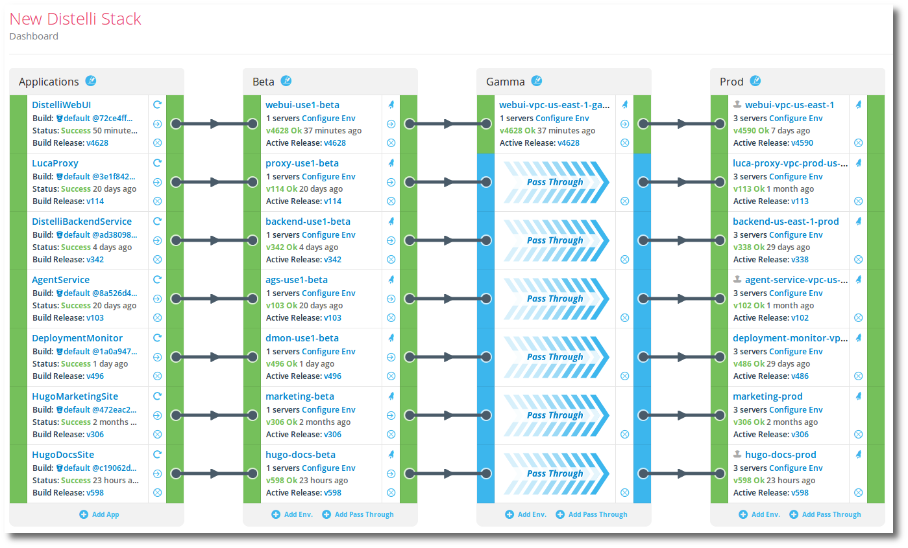

## Create a dashboard

To create a dashboard in the Pipelines web UI:

<ol>
<li>Click <b>Dashboards</b> at the top of the web UI.</li>
<li>Click the <b>New Dashboard</b> button.</li>
<li>Give your dashboard a <b>Dashboard Name</b> and <b>Dashboard Description</b>.</li>
<li>Click the <b>Create Dashboard</b> button.</li>

You have created a dashboard.

By default an initial Application column will be created on the left. This will need a <b>name</b> before you can continue.

<li>Click on the column header. There is a dialog box "Add an Application" pointing at the column header.</li>

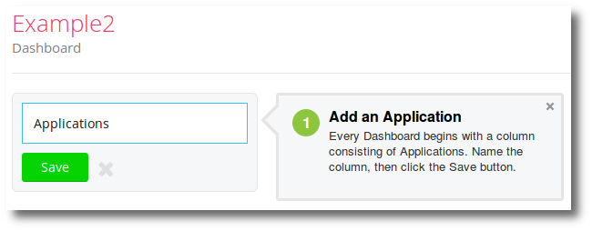

<li>Enter a name for the column. Note that "Applications" is the default recommended name.</li>
<li>Click the <b>Save</b> button.</li>
</ol>

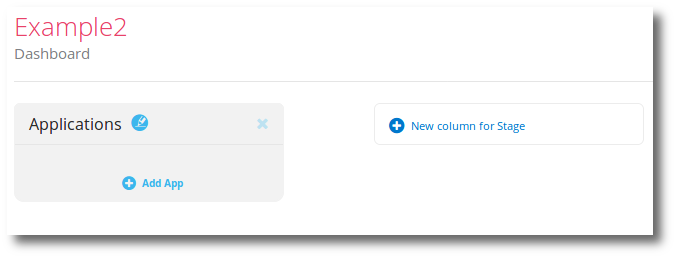

## Working with the application column

The leftmost column in a dashboard is the application column. 

### Rename the application column

The application column is created by default but needs to be named on creation

<ol>
<li>Navigate to the dashboard whose application column name you wish to change.</li>
<li>Click the edit icon.</li>

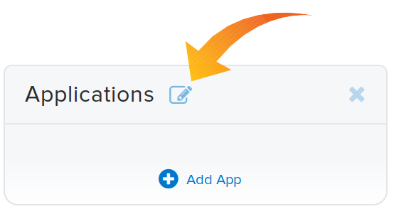

<li>Edit the column name.</li>
<li>Press <b>Enter</b> to save your changes.</li>
</ol>

### Add an application card

You add applications in the form of cards to the application column.

<ol>
<li>Navigate to the dashboard where you wish to add an application card.</li>
<li>At the bottom of the application column click the <b>Add App</b> link.</li>

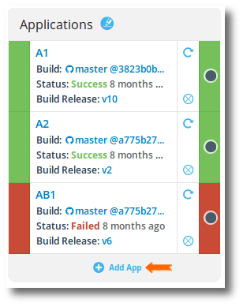

<li>Select the application you wish to add to your dashboard.</li>
<li>If this application has a connected repository, you will be prompted to choose a branch. Choose a branch.</li>
<li>Click the <b>Add</b> button to add the application card.</li>
</ol>

## Working with environment stage columns

All columns in a dashboard besides the leftmost application column are environment <b>stage</b> columns. 

### Add an environment stage column

You can create as many stages as necessary.

<ol>
<li>Navigate to the dashboard where you wish to add an environment column.</li>
<li>Find the rightmost empty column and click <b>New column for Stage</b>.</li>

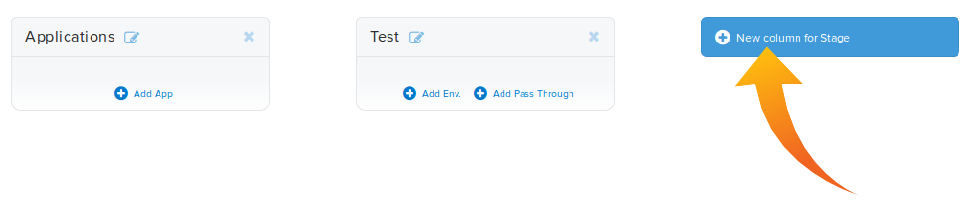

<li>Give the stage column a name.</li>
<li>Click the <b>Save</b> button to save your changes.</li>
</ol>

### Rename the environment column

<ol>
<li>Navigate to the dashboard whose environment stage column name you wish to change.</li>
<li>Click the edit icon on that column header.</li>

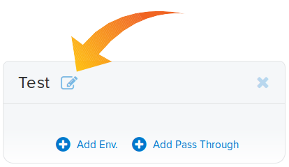

<li>Edit the column name.</li>
<li>Press <b>Enter</b> to save your changes.</li>
</ol>

### Add an environment card

All columns besides the Application column on the far left of the dashboard are Environment <b>stage</b> columns.

<ol>
<li>Navigate to the dashboard where you wish to add an environment card.</li>
<li>At the bottom of the environment stage column, click the <b>Add Env</b> link.</li>

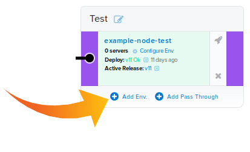

<li>In the dialog select the application that contains the environment you wish to add.</li>
<li>Select the environment that you wish to add.</li>
<li>Click the <b>Add</b> button to add the environment card.</li>
</ol>

## Connect cards in a dashboard

Connecting application cards to environment cards and environment cards to the subsequent environment provides a visual workflow your your release deployment strategy.

<ol>
<li>Navigate to the dashboard where you wish connect cards.</li>
<li>Find the card on the left that you wish to connect to a card on the right and with your mouse grab the black dot connector and drag it right.</li>

Note, when you have a valid connection, the receiving connector will hightlight in green.

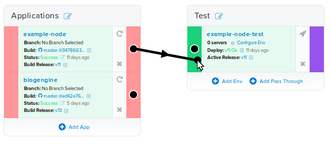

<li>Drop the pipe connector on top of the receiving end black dot connector to complete the connection.</li>
</ol>

## Add a column pass-through card

Connecting application cards to environment cards and environment cards to the subsequent environment provides a visual workflow your your release deployment strategy.

To skip a stage column you must use a pass-through card.

When making dashboard connections you cannot drag across a stage.

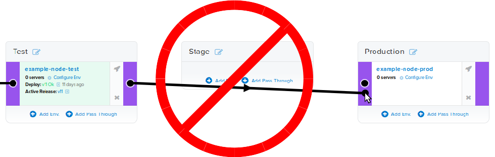

You must instead add a pass through card to pass through the stage.

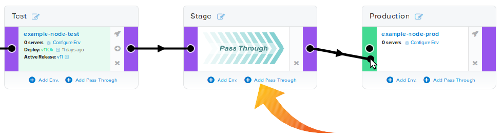

<ol>
<li>Navigate to the dashboard where you wish connect cards.</li>
<li>Find the stage you wish to traverse through and click the <b>Add Pass Through</b> link.</li>
</ol>

## Move a card

When working with dashboard cards you can drag application cards up and down in the application column. You can drag environment cards up and down, and between stage columns. This includes dragging pass-through cards too.

<ol>
<li>Navigate to the dashboard where you wish to move cards.</li>
<li>Find the card you wish to move and "click and hold" your mouse on the card as you drag it to its destination.</li>
<li>Let the mouse button go to drop the card.</li>
</ol>

## Delete a card

Deleting application and environment cards in a dashboard will not delete the application or environment. You delete application, environment, and pass-through cards the same way.

<ol>
<li>To delete a card in a dashboard click the <b>X</b> on the bottom right of the card.</li>

You will be prompted for confirmation.

<li>Click <b>Yes</b> in the confirmation dialog.</li>
</ol>

