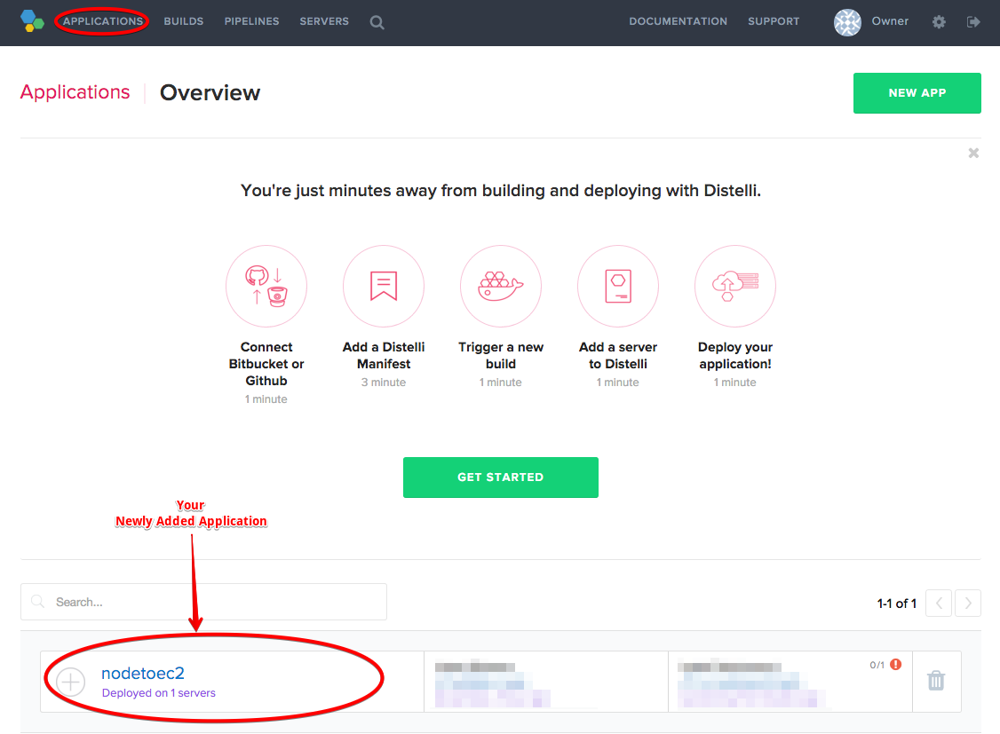

In tutorial, we will walk through the steps to automatically build and deploy a Django application with Pipelines.

Django is a Python framework that lets you create web applications easily. For information on Django, visit the [Django project website](https://www.djangoproject.com).

## Before You Begin

Ensure you have the following:

* Git installed on your development machine.
* A Pipelines account. Register for a [Pipelines account](https://pipelines.puppet.com/signup).
* A GitHub account. Register for a [GitHub account](http://github.com/join).
* An Amazon EC2 account. For steps to set up your EC2 account, see [How to Set Up an AWS EC2 instance](./server-type.html).

## 1. Forking the Sample App from GitHub

If you already have a Django application, create a GitHub repository for your application, and add your code to your repository. Then, skip to Step 2 of this tutorial.

If you are using the sample Django application, do the following:

1. Log into your GitHub account.
2. Open the sample Django application in the [GitHub repository](https://github.com/distelli/Example-Django-App).
3. Click **Fork**. The `Example-Django-App` repository is copied to your GitHub account.
  
4. In your terminal, navigate to a directory where you want to store the code for the application. Then, clone the repository using the following syntax:

 ~~~
  git clone https://github.com/YOUR_GITHUB_USERNAME/nodejsbuilddeploy.git
 ~~~

Next, we will link the GitHub repository to Pipelines. After it is linked, your application is automatically built every time you make changes to the application.

## 2. Creating the Application in Pipelines

1. Log into your Pipelines account. The home page for your account opens.
2. On the top right, click **New App**. The New App page opens.
3. In the **Name your app** field, type a name for your app.
4. Click **GitHub**. You are prompted to allow Pipelines to access your GitHub repositories. After you grant access, the New App page opens.
5. Click **Use GitHub**. A list of your GitHub repositories is shown.
6. Select the **Example-Django-App** repository that you forked in the earlier step. The list of branches for the repository is shown.
7. Select the **master** branch, and click **I'm Done**. The Configure your Build Steps section expands.
8. Build Steps are instructions that describe how to build and package your application. For this tutorial, in the **PkgInclude** section, add an asterisk (\*). This includes all the application's files in the build.
9. Click **Done**. A summary of your build configuration is shown.
10. From the **Build Image** menu, select **Distelli Python (Docker)**, and click **Start Build**. The application is added to your account, and the build begins. To see the status of the build, click **Go to Build**.

Now that the application is added to Pipelines, we can deploy it to your EC2 instance.

## 3. Adding your Deployment Steps

1. In your Pipelines account, in the top menu, click **Applications**. The list of your applications opens.
2. Click the name of your application. The application's settings page opens.
  
3. Click the **Manifest** tab, and expand the **Deployment Manifest** section. In this section, we provide the commands that your server runs when the application is deployed.
4. In the **PreInstall** section, add the commands to install Python and Django on the server:
  ~~~
    sudo apt-get update
    sudo apt-get install python-pip
    sudo pip install django
  ~~~
5. In the **Exec** section, add the command to start the application:
  ~~~
    python manager.py runserver 0.0.0.0:8080
  ~~~

In the next step, we add an environment for your application, and launch an EC2 instance to deploy the application to.

## 4. Adding your EC2 Instance

If you have set up an Amazon EC2 account, you can launch a new EC2 instance for your application from within Pipelines.

If you have not set up your Amazon EC2 account, see [How to Set Up Amazon EC2](./integrate-amazon.html) for steps to set one up.

1. In your Pipelines account, from the top menu, click **Applications**. The list of your applications opens.
2. Click the name of your application. The application's settings page opens.
3. Click the **Environments** tab, then click **Create Environment**, as in the example below:
  
4. In the top menu, click **Servers**. The Servers page opens.
5. Click **Add Server**. The New Server page opens.
6. Click **Launch an EC2 instance**. Follow the steps to choose your options:
   * Configuration Type: Select **New EC2 Configuration**.
   * AWS Region: Select a region that's closest to you.
   * Instance Type: For this tutorial, select a General Purpose instance that works for you.
   * OS Image: Select **Ubuntu**.

    Depending on your EC2 configuration, select additional options, such as your Virtual Private Cloud (VPC), EC2 key pairs, and so on.

7. In the Add Tags, User Data and Environments section, select the environment that you just created.
8. When you have finished selecting your EC2 configuration, click **Launch** to start the instance.

In the next step, we will deploy the application to your server.

## 5. Deploying the Application

Every time your application is built, Pipelines creates a release. When you are ready to deploy the application, you select a release that is deployed to your server. To deploy the application:

1. From the top menu, click **Applications**. The list of your applications opens.
2. Click the name of your application. The application's settings page opens.
3. Click **New Deployment** (the "rocket" icon). The New Deployment page opens.
4. Click **Deploy a Release**. You are prompted to choose your application.
5. Click your application's name, and select the latest release.
6. When prompted to select an environment, select the environment you created in the previous step, and click **All Done**.
7. Click **Deploy**. Your application is deployed.
8. To test the application, navigate to `http://<SERVER-IP-ADDRESS>:8080`, where `<SERVER-IP-ADDRESS>` is the IP address of your EC2 instance.

## 6. Enabling Automatic Builds and Deployments

To enable automatic deployments for your application, you create an application pipeline to ensure that all successful builds are automatically deployed to your servers.

1. From the top menu, click **Applications**. The list of your applications opens.
2. Click the name of your application. The application's settings page opens.
3. On the right, under **App Pipeline**, ensure that the **Auto Build** option is enabled.
4. To add a step to the pipeline, click **Add Step**, and select the environment you created earlier.
5. Click **Add**. The environment is added to the pipeline.
6. To enable automatic deployments, enable the **Auto Deploy** check box, and from the menu, select **If the Build Succeeds**.
  

## 7. Testing Automatic Deployments

Now, every time you push new code to your GitHub repository, Pipelines builds your application and deploys it to your server. Let's make a small code change, and push it to the repository to observe this automation process in action.

1. On your development machine, navigate to the folder where you added the sample application, and from the `templates` folder, open `index.html` in a text editor.
2. Change some text in the HTML file, and save the file.
3. In your terminal, push the code to your GitHub repository, using the following commands:
  ~~~
    git add .
    git commit -m "Testing Distelli auto build"
    git push
  ~~~
4. Your changed application is automatically built and deployed.

Now, when you navigate to `http://<SERVER-IP-ADDRESS>:8080`, you can see your changes.