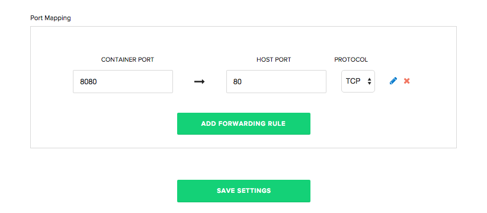

 

This tutorial will walk you through how to build and deploy a Docker container with a C# Web-Application. 

### Before You Begin

To successfully complete this tutorial, you need:

- A <a href="https://github.com/" target="_blank">GitHub</a>/<a href="https://bitbucket.org/" target="_blank">BitBucket</a> Repository to hold your files
- A <a href="https://hub.docker.com/" target="_blank">Docker Hub</a>/<a href="https://aws.amazon.com/ecr/" target="_blank">Amazon EC2 Container Registry</a> (ECR) Repository
- A server you can deploy your application to and has Docker installed
- A Pipelines Account

### Setting-Up

For this tutorial we will use a basic "Hello World" C# web-application. To start create a directory to store your application and create a file called `webserver.cs`. Below are the contents of my C# web-application:

~~~
using System;
using System.Net;
using System.Threading;
using System.Linq;
using System.Text;
 
namespace SimpleWebServer
{
    public class WebServer
    {
        private readonly HttpListener _listener = new HttpListener();
 
        public WebServer()
        {
            if (!HttpListener.IsSupported)
                throw new NotSupportedException("Needs Windows XP SP2, Server 2003 or later.");
 
            _listener.Prefixes.Add("http://*:8080/");
        }
 
        public void start()
        {
            _listener.Start();
            for(;;)
            {
                HttpListenerContext ctx = _listener.GetContext();
                new Thread(new Worker(ctx).ProcessRequest).Start();
            }
        }

        public void Stop()
        {
            _listener.Stop();
            _listener.Close();
        }

        static public void Main ()
        {
            WebServer webServer = new WebServer();
            webServer.start();
        }
    }

    public class Worker
    {
        private HttpListenerContext context;
 
       public Worker(HttpListenerContext context)
       {
          this.context = context;
       }
 
       public void ProcessRequest()
       {
          StringBuilder sb = new StringBuilder();
          sb.Append("&#60;html&#62;&#60;body&#62;&#60;h1&#62;Hello World from C# and Distelli&#60;/h1&#62;");
 
          byte[] b = Encoding.UTF8.GetBytes(sb.ToString());
          context.Response.ContentLength64 = b.Length;
          context.Response.OutputStream.Write(b, 0, b.Length);
          context.Response.OutputStream.Close();
       }
    }
}
~~~

## Step 1. Create Dockerfile

To build our application in a Docker container, we need to create a Dockerfile. A Dockerfile contains the instructions to build your application in a container. The Dockerfile we will use for our C# application is below:

~~~
FROM mono:4.2.3.4

RUN mkdir -p release 
COPY release/* /release/

EXPOSE 8080
CMD [ "mono", "release/webserver.exe" ]
~~~

### Breakdown of the Dockerfile

In the first part of our Dockerfile we define our base image. For more information on the `mono` base image, please visit their <a href="https://github.com/mono/docker" target="_blank">GitHub</a>.

~~~
FROM mono:4.2.3.4
~~~

Next, we create our release directory in our image and copy the contents of our compiled C# application:

> **Note:** We will compile before we build our Docker Image. It will take place during our Build phase.

~~~
RUN mkdir -p release 
COPY release/* /release/
~~~

Finally, we expose port `8080` and run our application

~~~
EXPOSE  8080
CMD [ "mono", "release/webserver.exe" ]
~~~

### Push Files to Your Repository

The final step in creating our application is to push our files into a GitHub or BitBucket repository. If you are unfamiliar with using repositories, you can find more information for GitHub <a href="https://help.github.com/articles/set-up-git/" target="_blank">here</a> and more information for BitBucket <a href="https://confluence.atlassian.com/bitbucket/get-started-with-bitbucket-cloud-675385635.html" target="">here</a>.

## Step 2. Install the Pipelines Agent on your Server

If you do not have a Pipelines account, please [Sign Up](http://pipelines.puppet.com/signup) for one now. 

The next step in deploying our app is to make sure you have a server to run your application on. You can use any type of server - public cloud, private cloud or physical. Pipelines will let you deploy your code to  Vagrant VMs or servers in a VPC. You can even deploy to the server under your desk. For this tutorial I am going to be deploying to a server hosted by DigitalOcean. 

> **Note:** You will need remote access to the server you are deploying to & root (administrator) permissions.

### Install Pipelines Agent on Your Server

To be able to deploy your application to your server you will need to install the Pipelines Agent. You will need remote access to your server to complete the installation. Please consult the below information on how to install the Pipelines Agent on your server.

#### Linux and macOS X

To install on Linux or macOS X you can use either curl <b>or</b> wget with one of the following syntaxes.
##### wget example

~~~
wget -qO- https://pipelines.puppet.com/download/client | sh
~~~

##### curl example

~~~
curl -sSL https://pipelines.puppet.com/download/client | sh
~~~

#### Complete the Install

To complete the install of the agent, you must issue the `/usr/local/bin/distelli agent install` command.

~~~
/usr/local/bin/distelli agent install
~~~

~~~
ServerA:~$ <b>wget -qO- https://pipelines.puppet.com/download/client | sh</b>
This script requires superuser privileges to install packages
Please enter your password at the sudo prompt

[sudo] password for bmcgehee: 
    Installing Distelli CLI 3.51 for architecture 'Linux-x86_64'...
    Downloading https://s3.amazonaws.com/download.distelli.com/distelli.Linux-x86_64/distelli.Linux-x86_64-3.51.gz
To install the agent, run:
    sudo /usr/local/bin/distelli agent install
ServerA:~$ <b>sudo /usr/local/bin/distelli agent install</b>
Distelli Email: jdoe@distelli.com
      Password: 
    1: User: jdoe
    2: Team: janedoe/TeamJane
Team [2]: <b>1</b>
Server Info: https://www.distelli.com/jdoe/servers/12345678-4765-ac42-bd7a-080027c8277c
Starting upstart daemon with name:  
~~~

#### Verify the Install

To validate the agent is installed and working use the `/usr/local/bin/distelli agent status` command.

> **Note:** This installation requires root (administrator) permissions.

~~~
/usr/local/bin/distelli agent status
Distelli Agent (serverA) is Running with id 
~~~

If you would like more information on installing the Pipelines agent, visit [Installing the Pipelines Agent](./agent.html). 

## Step 3. Build And Upload the Docker Image

Now that we have our application in GitHub/BitBucket and our server is ready to be deployed to, we are going to build our Docker Image. Log into your Pipelines account and click the <b>New App</b> button in the right hand corner

Select the repository type where you are storing your application's files. 

After clicking the button to connect to our repository, select the appropriate repository that contains the files.

Select the appropriate branch for your deployment. We have a master branch, but you can deploy any branch from your repository.

Next, we set our build steps. This is the step where you declare that you are building a Docker container. In the right corner, click <b>Build With Docker File</b>, and enter in your Docker Hub or ECR credentials

Once you have entered in your credentials, Pipelines will inject the Docker build commands. Before we build our image we still need to compile our code. Enter in the following commands above your Docker Build commands:

~~~
mkdir release
sudo apt-get update
sudo apt-get install mono-mcs -y
mcs webserver.cs -out:release/webserver.exe
~~~

Finally, we make sure all of settings look correct and then click the <b>Looks Good. Start Build!</b> button to build your Docker container

After your build has started, click the build to view its progress. You can view realtime logs of your application building.

### Setting Up Port Mapping

To be able to access the application running in our Docker container, we need to set up Docker Port Mapping. Navigate to your application's page in Pipelines, click the <b>Settings</b> tab, and expand the <b>Docker</b> section. You will see a section to define your Docker Port Mapping. Set your Container Port to `8080` and the Host Port to `80`.

## Step 4. Deploy Your Docker Container

Now that we have successfully built our Docker image, we are ready to deploy it to our server. On the Builds page click <b>New Deployment</b> in the right hand corner.

The New Deployment page opens. Select the <b>Deploy a Release</b>

Now, select the application you want to deploy. Select the application we created earlier in the tutorial.

Next, select the release you would like to deploy. For now there should be only one release for deployment.

The last step in our deployment is to select the environment you want to deploy to. First, you create an environment by entering a name and selecting the <b>Add Environment</b>. 

Next, select the Environment you just created and click <b>All Done</b>.

Next, add your server. Click <b>Add Servers</b> to get started. Select the server you configured earlier in the tutorial, and add it to your account. Once you have added your server, you can close the <b>Add Servers</b> panel and continue with your deployment. You will see a final option to set your delay between deployments on your servers.

Click <b>Start Deployment</b> to begin your deployment. You are redirected to a page where you can view the progress of your deployment. <b>Log</b> enables you to view real time streaming logs for the deployment.

Now navigate to "http://<-Your Server's IP Address->" and see your C# Web-Application!

And that's it! You have built a C# Web-App, built a Docker image, and deployed that image as a container.

