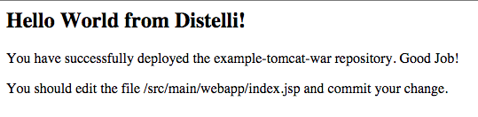
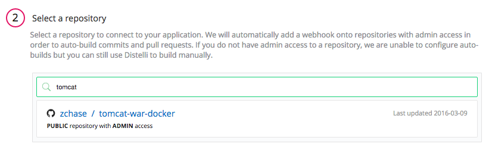
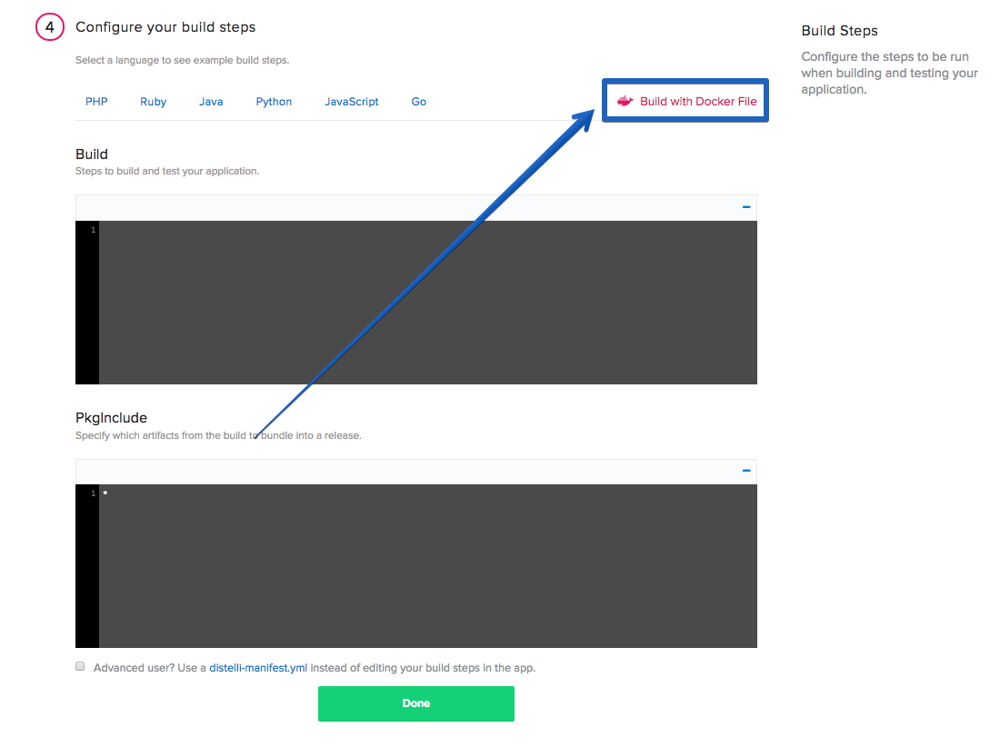
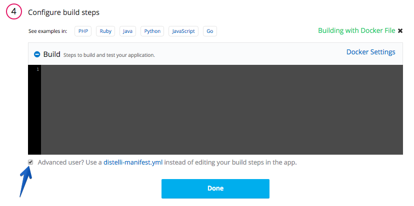
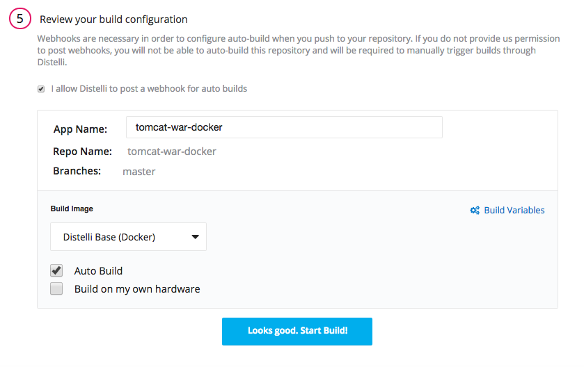
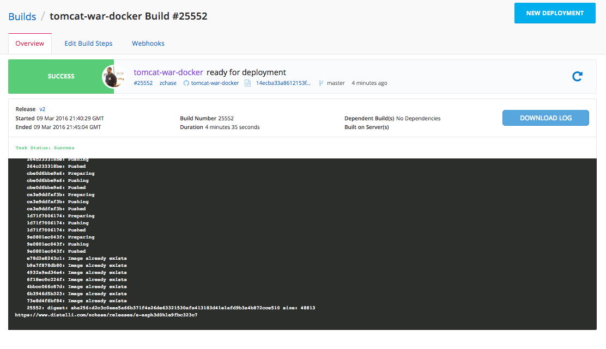
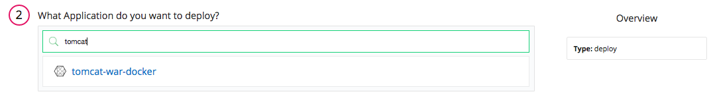
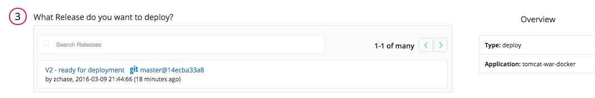
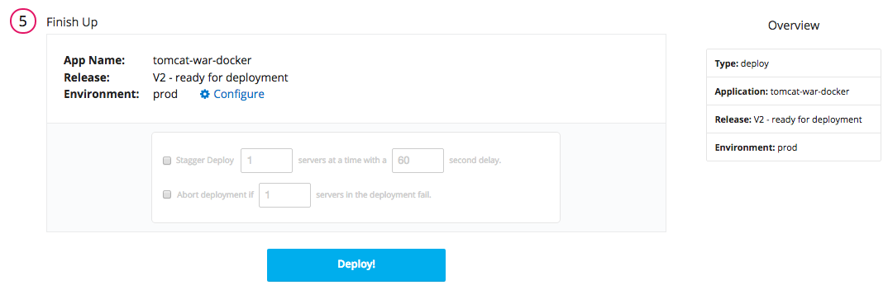
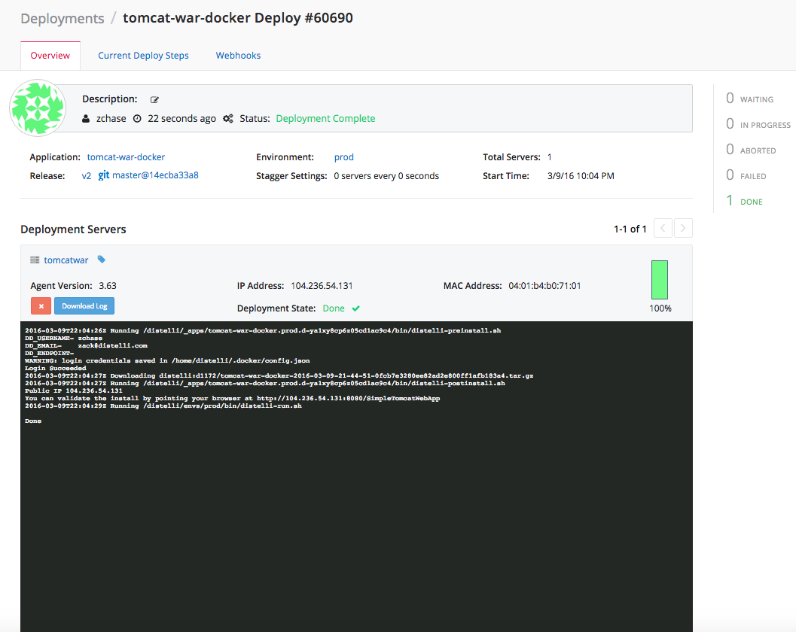

 

This tutorial will walk you through how to build and deploy a Docker container with a Tomcat-War-Docker Application. 

### Before You Begin

To successfully complete this tutorial, you need:

- A <a href="https://github.com/" target="_blank">GitHub</a>/<a href="https://bitbucket.org/" target="_blank">BitBucket</a> Repository to hold your files
- A <a href="https://hub.docker.com/" target="_blank">Docker Hub</a>/<a href="https://aws.amazon.com/ecr/" target="_blank">Amazon EC2 Container Registry</a> (ECR) Repository
- A server with Docker installed you can deploy your application to
- A Pipelines Account

### Setting-Up

For this tutorial, we will use a basic "Hello World" Tomcat-War-Docker app.

If you would like to use our example application, you can fork the repository, <a href="https://github.com/doct15/tomcat-war-docker" target="_blank">here</a>. You can also use your own application if you have one. 

## Step 1. Create Docker File

> **Note:** If you are using our example application you can skip this step.

If you are using your own Tomcat-War application you will have to build a Dockerfile. Our example application already has a `Dockerfile` and `distelli-manifest.yml` in the repository. The Dockerfile for our example application can be seen below:

~~~
FROM java:8-jre
#https://github.com/docker-library/tomcat

ENV CATALINA_HOME /usr/local/tomcat
ENV PATH $CATALINA_HOME/bin:$PATH

RUN mkdir -p "$CATALINA_HOME"
WORKDIR $CATALINA_HOME

# see https://www.apache.org/dist/tomcat/tomcat-8/KEYS
RUN gpg --keyserver pool.sks-keyservers.net --recv-keys \
    05AB33110949707C93A279E3D3EFE6B686867BA6 \
    07E48665A34DCAFAE522E5E6266191C37C037D42 \
    47309207D818FFD8DCD3F83F1931D684307A10A5 \
    541FBE7D8F78B25E055DDEE13C370389288584E7 \
    61B832AC2F1C5A90F0F9B00A1C506407564C17A3 \
    79F7026C690BAA50B92CD8B66A3AD3F4F22C4FED \
    9BA44C2621385CB966EBA586F72C284D731FABEE \
    A27677289986DB50844682F8ACB77FC2E86E29AC \
    A9C5DF4D22E99998D9875A5110C01C5A2F6059E7 \
    DCFD35E0BF8CA7344752DE8B6FB21E8933C60243 \
    F3A04C595DB5B6A5F1ECA43E3B7BBB100D811BBE \
    F7DA48BB64BCB84ECBA7EE6935CD23C10D498E23

ENV TOMCAT_MAJOR 8
ENV TOMCAT_VERSION 8.0.32
ENV TOMCAT_TGZ_URL https://www.apache.org/dist/tomcat/tomcat-$TOMCAT_MAJOR/v$TOMCAT_VERSION/bin/apache-tomcat-$TOMCAT_VERSION.tar.gz

RUN set -x \
    && curl -fSL "$TOMCAT_TGZ_URL" -o tomcat.tar.gz \
    && curl -fSL "$TOMCAT_TGZ_URL.asc" -o tomcat.tar.gz.asc \
    && gpg --verify tomcat.tar.gz.asc \
    && tar -xvf tomcat.tar.gz --strip-components=1 \
    && rm bin/*.bat \
    && rm tomcat.tar.gz*

ADD ./target/*.war $CATALINA_HOME/webapps/

EXPOSE 8080
CMD ["catalina.sh", "run"]
~~~

### Update Manifest

There is one change to the `distelli-manifest.yml` that needs to be made. Clone your repository on your local machine, and open the `distelli-manifest.yml` in the text editor of your choice. At the top of the file change the username to your Pipelines username and make sure the application name is correct as well.

~~~
<b>DISTELLI USERNAME</b>/tomcat-war-docker:

  Env:
    # Set the below enviornment variables for your environment
    - CATALINA_HOME: "/usr/local/tomcat"
    # The port number below is only for reference. Set it to the port number of your tomcat server.
    - PORT: "8080"

  Build:
    - echo "DD_USERNAME- $DISTELLI_DOCKER_USERNAME"
    - echo "DD_EMAIL-    $DISTELLI_DOCKER_EMAIL"
    - echo "DD_ENDPOINT- $DISTELLI_DOCKER_ENDPOINT"
    - mvn package
    ### Docker Build Commands ###
    - docker login -u "$DISTELLI_DOCKER_USERNAME" -p "$DISTELLI_DOCKER_PW" $DISTELLI_DOCKER_ENDPOINT
    - docker build --quiet=false -t "$DISTELLI_DOCKER_REPO" $DISTELLI_DOCKER_PATH
    - docker tag "$DISTELLI_DOCKER_REPO" "$DISTELLI_DOCKER_REPO:$DISTELLI_BUILDNUM"
    - docker push "$DISTELLI_DOCKER_REPO:$DISTELLI_BUILDNUM"
    ### End Docker Build Commands ###

  PkgInclude:
    - './target/*.war'

  PreInstall:
    - echo "DD_USERNAME- $DISTELLI_DOCKER_USERNAME"
    - echo "DD_EMAIL-    $DISTELLI_DOCKER_EMAIL"
    - echo "DD_ENDPOINT- $DISTELLI_DOCKER_ENDPOINT"
    ### Docker Pre Install Commands ###
    - sudo /usr/bin/docker login -u "$DISTELLI_DOCKER_USERNAME" -p "$DISTELLI_DOCKER_PW" "$DISTELLI_DOCKER_ENDPOINT"
    ### End Docker Pre Install Commands ###

  PostInstall:
    - publicip=$(curl -s ident.me)
    - echo "Public IP $publicip"
    - 'echo "You can validate the install by pointing your browser at http://$publicip:$PORT/SimpleTomcatWebApp"'
    
  Exec:
    #- cid=$(uuidgen)
    #- trap 'sudo docker stop $cid' SIGTERM
    #- sudo docker run --name=$cid --rm=true $DISTELLI_DOCKER_PORTS  "$DISTELLI_DOCKER_REPO:$DISTELLI_BUILDNUM" &
    #- wait
    #- 'true'
     - sudo docker run --rm=true $DISTELLI_DOCKER_PORTS "$DISTELLI_DOCKER_REPO:$DISTELLI_BUILDNUM"
~~~

## Step 2. Install the Pipelines Agent on your Server

To deploy the application to your server you, need to install the Pipelines Agent on the server. Make sure you have registered for a Pipelines account and follow the steps below to install the agent on your server. To complete the installation you will need remote access to your server.
> **Note:** This installation requires root (administrator) permissions.

<h3>Linux and macOS X</h3>

To install on Linux or macOS X you can use wget with the following command:
<h4>wget example</h4>

~~~
wget -qO- https://pipelines.puppet.com/download/client | sh
~~~

<h3>Windows</h3>

To install the Pipelines Agent on Windows, copy and paste the following powershell command into a command (cmd) window.

~~~
powershell -NoProfile -ExecutionPolicy Bypass -Command "iex ((new-object net.webclient).DownloadString('https://pipelines.puppet.com/download/client.ps1'))" & SET PATH=%PATH%;%ProgramFiles%/Distelli
~~~

<h3>Complete the Install</h3>

After downloading the agent, run the install command to install the agent. To do so use the `agent install` command.

> **Note:** This installation requires root (administrator) permissions.

~~~
jdoe@ServerB:~$ <b>wget -qO- https://pipelines.puppet.com/download/client | sh</b>
This script requires superuser privileges to install packages
Please enter your password at the sudo prompt

[sudo] password for jdoe:
    Installing Distelli CLI 3.55 for architecture 'Linux-x86_64'...
    Downloading https://s3.amazonaws.com/download.distelli.com/distelli.Linux-x86_64/distelli.Linux-x86_64-3.55.gz
To install the agent, run:
    sudo /usr/local/bin/distelli agent install
jdoe@ServerB:~$ <b>sudo /usr/local/bin/distelli agent install</b>
Distelli Email: <b>jdoe@distelli.com</b>
      Password:
    1: User: jdoe
    2: Team: janedoe/teamjane
Team [2]: <b>1</b>
Server Info: https://www.distelli.com/jdoe/servers/d0c4b300-9fcf-2846-ba90-080027c8277c
Starting upstart daemon with name:  
jdoe@ServerB:~$
~~~

<h3>Verify the Install</h3>

To confirm that the agent is installed and working, use the `agent status` command.

~~~
# /usr/local/bin/distelli agent status
Distelli Agent (serverA) is Running with id 
~~~

For more information on the Pipelines Agent, see the [Pipelines Agent Reference Guide](./agent.html).

## Step 3. Build And Upload the Docker Image

Now that we have our application in GitHub/BitBucket and our server is ready to be deployed to, we are going to build our Docker Image. Log into your Pipelines account and click the <b>New App</b> button in the right hand corner.

Select the repository type where you are storing your application's files. 

After clicking the button to connect to our repository, select the appropriate repository that contains the files.

Select the appropriate branch for your deployment. We have a master branch, but you can deploy any branch from your repository.

Next, we set our build steps. This is the step where you declare that you are building a Docker container. In the right corner, click <b>Build With Docker File</b>, and enter in your Docker Hub or ECR credentials.

Make sure to remove the <b>Build Steps</b> that were automatically injected and check the <b>Advanced user?</b> checkbox.

Finally, we make sure all of settings look correct and then click the <b>Looks Good. Start Build!</b> button to build your Docker container.

After your build has started, click the build to view its progress. You can view realtime logs of your application building.

### Setting Up Port Mapping

To be able to access the application running in our Docker container, we need to set up Docker Port Mapping. Navigate to your application's page in Pipelines, click the <b>Settings</b> tab, and expand the <b>Docker</b> section. You will see a section to define your Docker Port Mapping. Set your Container Port to `8080` and the Host Port to `80`.

## Step 4. Deploy Your Docker Container

Now that we have successfully built our Docker image, we are ready to deploy it to our server. On the Builds page click <b>New Deployment</b> in the right hand corner.

The New Deployment page opens. Select the <b>Deploy a Release</b>.

Now, select the application you want to deploy. Select the application we created earlier in the tutorial.

Next, select the release you would like to deploy. For now there should be only one release for deployment.

The last step in our deployment is to select the environment you want to deploy to. First, you create an environment by entering a name and selecting the <b>Add Environment</b>. 

Next, select the Environment you just created and click <b>All Done</b>.

Next, add your server. Click <b>Add Servers</b> to get started. Select the server you configured earlier in the tutorial, and add it to your account. Once you have added your server, you can close the <b>Add Servers</b> panel and continue with your deployment. You will see a final option to set your delay between deployments on your servers.

Click <b>Start Deployment</b> to begin your deployment. You are redirected to a page where you can view the progress of your deployment. <b>Log</b> enables you to view realtime streaming logs for the deployment.

Now navigate to "http://<-You Server's IP Address->/SimpleTomcatWebApp/" and see your Tomcat-War-Docker Application!

And that's it! You have built a Tomcat-War-Docker App, built a Docker image, and deployed that image as a container.

