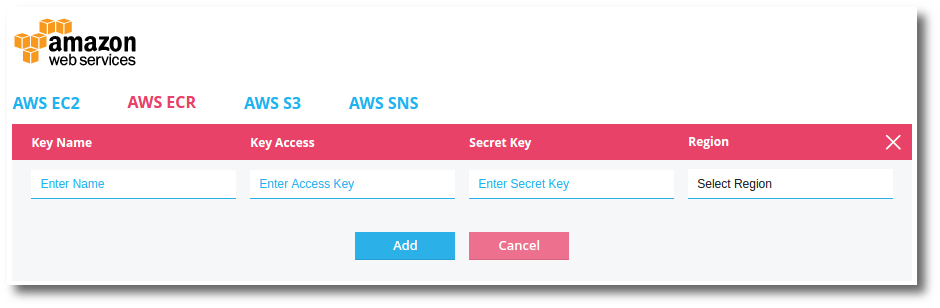

---
layout: default
title: "Using Docker with Pipelines for Applications"
--- 

With Pipelines, you can build your application as a Docker image, upload it to your Docker repository, and deploy the Docker container. 

Docker allows you to package an application with all of its dependencies into a standardized unit for software deployment. Docker consists of Docker images, a repository for the images, and running images as Docker containers.

A Docker image contains all the dependencies for an application (or applications) that include the base operating system, libraries, and database. Docker images are built from layers. An image consists of a base image and then various commands cause the creation of layers on top. This creation process is defined in a <b>Dockerfile</b>.

Here is an example Dockerfile.

~~~
FROM ubuntu:14.04

RUN sudo apt-get -y update
RUN sudo apt-get -y install apache2
ADD ./bin/server /

EXPOSE 8080
CMD ["/server", "8080"]
~~~

## Get started with Docker and Pipelines

Pipelines currently supports Docker hub and Amazon EC2 container registry, in the web UI. But any Docker repository/registry can be used. You can setup an account:

<ul>
<li><a href="https://hub.docker.com/" target="_blank">Docker Hub</a></li>
<li><a href="https://aws.amazon.com/ecr/" target="_blank">EC2 Container Registry</a></li>
<li><a href="https://cloud.google.com/container-registry/" target="_blank">Google Container Registry</a></li>
<li>Private Docker Registry</li>
</ul>

## Enable Docker on a New Application

When creating a new application in Pipelines you can now enable and configure Docker builds and deployments.

> **Note:** Before connecting a new application to a Docker registry you should first set up your Docker integrations.

> **Note:** To build with Docker requires a Dockerfile be included in your application. A Dockerfile defines the build instructions for a Docker image. For more information see the **Dockerfile reference** section.

The <b>new application</b> workflow allows you to specify whether you want to build and deploy with Docker. To begin:

<ol>
<li>In the Pipelines web UI click the <b>Applications</b> link at the top.</li>
<li>Click the <b>New App</b> button. This will take you to the new application workflow.</li>
<li><b>Connect your applicaiton to source control</b>. Select the source control for this application.</li>
<li><b>Select a repository</b>. Select the repository.</li>
<li><b>Select branches</b>. Select branch(es) or setup learning branches by regular expression.</li>

<li><b>Configure build steps</b>.</li>

By default Pipelines will suggest building with Docker and <b>Build with Docker</b> will already be selected.

<li>Select your docker registry from the options by <b>clicking on the docker registry icon</b>.</li>

You will be prompted for specific information depending on which registry you chose.

<li>When you are ready, click <b>Connect Repo</b></li>
<li>Click <b>Show Docker Settings</b>.</li>

In the above example, you can see:

<ul>
  <li>The user is using <b>Docker Hub</b> docker registry.</li>
  <li>The docker registry username and image is <b>doct15/test</b>.</li>
  <li>The Dockerfile Location is <b>.</b> (dot; indicating the root of the repository).</li>
  <li>The network Port Mapping that takes container port 3001 and maps it to host port 80 on TCP.</li>
</ul>

<li>Set your settings appropriately, then click <b>Save Settings</b>.</li>
<li><b>Build - Steps to build and test your application.</b></li>

The build steps should be automatically injected for you when you chose the Docker registry.

<figure>
  <pre>
    <code>
### Docker Build Commands ###
docker login -u "$DISTELLI_DOCKER_USERNAME" -p "$DISTELLI_DOCKER_PW" "$DISTELLI_DOCKER_ENDPOINT"
docker build --quiet=false -t "$DISTELLI_DOCKER_REPO" "$DISTELLI_DOCKER_PATH"
docker tag "$DISTELLI_DOCKER_REPO" "$DISTELLI_DOCKER_REPO:$DISTELLI_BUILDNUM"
docker push "$DISTELLI_DOCKER_REPO:$DISTELLI_BUILDNUM"
### End Docker Build Commands ###
    </code>
  </pre>
</figure>

<b>Note:</b>While you can use a <b>distelli-manifest.yml</b> file in your repository instead of using the Pipelines web UI manifest, you will have to manually add the Docker Build commands to your distelli-manifest.yml file. For more information see the "Docker with distelli-manifest.yml" section.

If you need to add some build commands before the container is built and pushed, you can add them in the build instructions.

<li>Click <b>I'm Done</b>.</li>

At this point you can adjust any build options. If building on Pipelines build servers you can find information for the various build images here <a href="./build-environment.html" target="_blank">Pipelines Build Environments</a>.

Enabling <b>Auto Build</b> will enable Continuous Integration and when code is commited to the repository/branch a build will occur.

You can configure your <b>Build Variables</b> here too.

If you choose to build on your own hardware see <a href="./server.html" target="_blank">Using your own Build Server</a>.

<li>When you are ready click the <b>Looks good. Start Build!</b> button.</li>
</ol>

You are on your way to building docker images with Pipelines.

## Enable Docker on an Existing Application

Existing applications can be modified to build and deploy with Docker.

To enable Docker build and deploy on an existing application in Pipelines:

<ol>
<li>In the Pipelines web UI navigate to the application you wish to enable Docker on.</li>
<li>At the top, click the <b>Settings</b> tab.</li>
<li>Click the <b>(+)</b> to expand the Docker section.</li>

<li>Select <b>[x] Inject Docker Environment variables</b>.</li>
<li>Select which <b>Container Registry</b> to use.</li>

If you have not configured your container registry credentials you will be prompted for them.

<li>Configure the Container Registry options for this application.</li>
<li>Choose where your <b>Dockerfile</b> will be located. This option defaults to '<b>.</b>'. For more information on Dockerfile see the "Docker Dockerfile" section.</li>
<li>Configure any network port mappings. For more information see the "Docker Settings" section.</li>
<li>Click <b>Save Settings</b> to save the settings.</li>
</ol>

You have completed the first part of enabling your application to build and deploy docker images. The next step is to add the appropriate commands to your manifest sections.

<h3>Enable Docker Build and Deploy in the Pipelines Manifest</h3>

You must add the appropriate commands to your Pipelines manifest. The following instructions will work whether you are using the Pipelines web UI manifest or the distelli-manifest.yml file in your repository.

Add the following commands to the appropriate sections of your Pipelines manifest.

#### Build Manifest Section

For building docker you must add the following commands <b>after</b> your existing application build commands.

~~~
### Application build commands should be first ###
###
### Docker Build Commands ###
docker login -u "$DISTELLI_DOCKER_USERNAME" -p "$DISTELLI_DOCKER_PW" $DISTELLI_DOCKER_ENDPOINT
docker build --quiet=false -t "$DISTELLI_DOCKER_REPO" "$DISTELLI_DOCKER_PATH"
docker tag "$DISTELLI_DOCKER_REPO" "$DISTELLI_DOCKER_REPO:$DISTELLI_BUILDNUM"
docker push "$DISTELLI_DOCKER_REPO:$DISTELLI_BUILDNUM"
### End Docker Build Commands ###
~~~

> **Note:** To build with Docker requires a Dockerfile be included in your application. A Dockerfile defines the build instructions for a Docker image. 

#### PreInstall Manifest Section

In this phase the commands ensure you are logged into your container registry.

~~~
### Docker Pre Install Commands ###
sudo docker login -u "$DISTELLI_DOCKER_USERNAME" -p "$DISTELLI_DOCKER_PW" "$DISTELLI_DOCKER_ENDPOINT"
### End Docker Pre Install Commands ###
~~~

#### Exec Manifest Section

In this phase the commands run your Docker image as a Docker container.

~~~
### Docker Exec Commands ###
cid=$(uuidgen)
trap 'sudo docker stop $cid' SIGTERM
sudo -E docker run --name=$cid $DISTELLI_DOCKER_ENVS --rm=true $DISTELLI_DOCKER_PORTS  "$DISTELLI_DOCKER_REPO:$DISTELLI_BUILDNUM" &
wait
"true"
### End Docker Exec Commands ###
~~~

> **Note:** Execution commands for your application, within the docker container, should be supplied in the <b>Dockerfile</b>. 

#### Done

After editing and saving your manifest, kick off a build of your application. 

## Docker environment variables

When building and deploying Docker enabled applications, Distelli uses environment variables to provide important information like options, usernames, and passwords to the Docker commands in your Distelli manifest. This document defines and describes each variable.

To see more about how these are used during build and deploy see the "Docker with distelli-manifest.yml" section.

<h3>Pipelines Docker Environment Variables.</h3>

<h4>DISTELLI_DOCKER_USERNAME</h4>

This is the user name you specified when integrating with your docker registry.

<h4>DISTELLI_DOCKER_PW</h4>

This is the password you specified when integrating with your docker registry.

<h4>DISTELLI_DOCKER_EMAIL</h4>

This is the user email you specified when integrating with your docker registry.

<h4>DISTELLI_DOCKER_ENDPOINT</h4>

This is the URL of the registry. This is specific to Amazon ECR.

<h4>DISTELLI_DOCKER_REPO</h4>

This is the registry repository you specified when integrating your application with your docker registry.

<h4>DISTELLI_DOCKER_PATH</h4>

This is the path to the Dockerfile in your application.

<h4>DISTELLI_BUILDNUM</h4>

This is not specifically a Docker environment value, but is used as a unique incremental value to tag docker images.

## Integrate with Docker Hub

Integrating your Pipelines account with Docker Hub provides the necessary credentials for you to successfully build and deploy Docker images/containers with Pipelines.

> **Note:** The following credential configuration can be completed when enabling Docker for new or existing applications, or via the Docker settings.

<h3>Configure Docker Hub Credentials</h3>

<ol>
<li>In the Pipelines web UI at the top right, click the <b>gear</b> to navigate to the account settings.</li>
<li>Click the <b>Integrations</b> link on the left.</li>
<li>Click the <b>Docker Hub</b> button.</li>

You will find yourself at the Docker Hub credentials dialog

<li>Enter your Docker Hub <b>Email, Username,</b> and <b>Password</b>.</li>
<li>Click <b>Save Credentials</b> when you are ready.</li>
</ol>

## Integrate with AWS ECR

Integrating your Pipelines account with AWS EC2 Container Registry provides the necessary credentials for you to successfully build and deploy Docker images/containers with Pipelines.

> **Note:** The following credential configuration can be completed when enabling Docker for new or existing applications, or via the Docker settings.

<h3>Configure AWS ECR Credentials</h3>

<ol>
<li>In the Pipelines web UI at the top right, click the <b>gear</b> to navigate to the account settings.</li>
<li>Click the <b>Integrations</b> link on the left.</li>
<li>Click the <b>AWS</b> icon.</li>

You will find yourself at the AWS integrations credentials page.

<li>Select the <b>AWS ECR</b> tab.</li>
<li>Click the <b>Add AWS ECR Credentials</b> link.</li>

<li>Enter your AWS ECR <b>Key Name, Access Key,</b> and <b>Secret Key</b>.</li>
<li>Click <b>Add</b> when you are ready.</li>
</ol>

## Integrate with Google GCR

Integrating your Pipelines account with Google Compute Container Registry provides the necessary credentials for you to successfully build and deploy Docker images/containers with Pipelines.

> **Note:** The following credential configuration can be completed when enabling Docker for new or existing applications, or via the Docker settings.

<h3>Configure Google GCR Credentials</h3>

<ol>
<li>In the Pipelines web UI at the top right, click the <b>gear</b> to navigate to the account settings.</li>
<li>Click the <b>Integrations</b> link on the left.</li>
<li>Click the <b>Google Cloud</b> icon.</li>

You will find yourself at the Google Cloud credentials page.

<li>Click <b>Connect Google Cloud Platform</b>.</li>

You will be directed to Google to authorize the Pipelines application access to your Google Container Registry.

<li>Click <b>Allow</b> when you are ready.</li>
</ol>

You have connected your Google Cloud account with Pipelines.

<h3>Configure Application GCR Docker Repository</h3>

When configuring an application to use Google Compute Container Registry, use the following values for the Repository.

> **Note:** You must have your Google Compute Project name.

~~~
gcr.io/PROJECT_NAME/DOCKER_IMAGE_NAME
~~~

Below is an example where:
<ul>
<li> PROJECT_NAME = distelli-alpha</li>
<li> DOCKER_IMAGE_NAME = tomcat-war-docker-example</li>
</ul>

## Pass environment variables to Docker run

You can dynamically pass environment variables to a docker container as it is run on deployment from Pipelines.

<h3>Pipelines Environment Variables</h3>

The first step is to define your environment variables in Pipelines.

<ol>
  <li>Navigate to your application environment.</li>
  <li>Set the environment variables you wish passed to your deployed docker container.</li>

  

  
In the above example, I want to pass the following environment variables to my running Docker container.

  <ul>
    <li>PORT</li>
    <li>MYSQL_USERNAME</li>
    <li>MYSQL_PASSWORD</li>
    <li>DOCKERFILE</li>
    <li>TEST</li>
  </ul>

  <li>Add the Pipelines env variable <b>DISTELLI_DOCKER_ENVS</b>.</li>
  
  

  
The DISTELLI_DOCKER_ENVS is a list of environment variables you wish to pass to the running docker container. Each variable must be preceeded by a <b>-e</b> and delineated by a <b>space</b>. The string I have entered is:

  <code>DISTELLI_DOCKER_ENVS="-e PORT -e MYSQL_USERNAME -e MYSQL_PASSWORD -e DOCKERFILE -e TEST"</code>  

  <li>In your distelli-manifest.yml, update your Exec: section <b>docker run</b> syntax to the following:</li>
</ol>

~~~
  Exec:
    - cid=$(uuidgen)
    - trap 'sudo docker stop $cid' SIGTERM
    - (sudo <b>-E</b> docker run --name=$cid <b>$DISTELLI_DOCKER_ENVS</b> --rm=true $DISTELLI_DOCKER_PORTS  "$DISTELLI_DOCKER_REPO:$DISTELLI_BUILDNUM") &
    - wait
    - "true"
~~~

Note the added <b>-E</b> and <b>$DISTELLI_DOCKER_ENVS</b>.

Now, next time you deploy this container with Pipelines, the container will have the environment variables. You can validate this by connecting to the container and viewing the variables.

## Docker with distelli-manifest.yml

Enabling Docker with new applications in Pipelines will automate the generation of the Docker commands in your manifest, while you use the web UI Pipelines manifest.

If instead you are using the <b>distelli-manifest.yml</b> you will need to supply the appropriate commands in your distelli-manifest.yml file. This document details those commands.

You will still need to configure your application, in Pipelines, to integrate with Docker for these commands to work correctly. 

When you integrate your application in Pipelines with a Docker container registry and repository, Pipelines populates environment variables during build and deploy to inject the appropriate values.

The syntax for the commands in your manifest to use these environment variables is the same whether you are using Docker Hub or AWS ECR.

<h3>Build</h3>

During a Pipelines build with Docker the following steps must occur.

<ol>
<li>Build the application first.</li>

You will first want to <b>build</b> and <b>test</b> your application. If this is successful, then, and only then, proceed to build the Docker image.

<li>Login to the Docker container registry.</li>

Using the credentials supplied, login to the Docker container registry so that when the image is ready it can be pushed.

<li>Build the Docker Image.</li>

Using a supplied Dockerfile, build the Docker image.

<li>Tag the Docker Image.</li>

Pipelines tags the image with a unique incrementing value, the build number.

<li>Push the Docker Image to the container registry.</li>

The final step pushes the completed tagged image up to the container registry.

</ol>

The above steps can be accomplished with the following syntax/commands in the distelli-manifest.yml <b>Build:</b> section.

~~~
  Build:
    ### Application build commands should be first ###
    ###
    ### Docker Build Commands ###
    - docker login -u "$DISTELLI_DOCKER_USERNAME" -p "$DISTELLI_DOCKER_PW" $DISTELLI_DOCKER_ENDPOINT
    - docker build --quiet=false -t "$DISTELLI_DOCKER_REPO" "$DISTELLI_DOCKER_PATH"
    - docker tag "$DISTELLI_DOCKER_REPO" "$DISTELLI_DOCKER_REPO:$DISTELLI_BUILDNUM"
    - docker push "$DISTELLI_DOCKER_REPO:$DISTELLI_BUILDNUM"
    ### End Docker Build Commands ###
~~~

<h3>Deploy</h3>

During a Pipelines deploy with Docker the following steps must occur.

> **Note:** The following assumes that <b>Docker</b> is <a href="https://docs.docker.com/engine/installation/" target="_blank">installed</a> on the server being deployed to.

<ol>
<li>Login to the Docker container registry.</li>

Using the credentials supplied, login to the Docker container registry so the image can be pulled.

<li>* Pull the Docker image.</li>

* The pull is not required as doing a run will initiate a pull if necessary.

<li>Run the Docker image as a container.</li>

Finally run the Docker container. * Pull is not required as a run will initiate a pull if necessary.

</ol>

The above steps must be entered in 2 different manifest sections. In the below example, the login is included in the PreInstall section. The <code>docker run</code> command <b>must</b> occur in the <b>Exec:</b> section.

~~~
  PreInstall:
    ### Docker Pre Install Commands ###
    - sudo docker login -u "$DISTELLI_DOCKER_USERNAME" -p "$DISTELLI_DOCKER_PW" $DISTELLI_DOCKER_ENDPOINT
    ### End Docker Pre Install Commands ###
  Exec:
    ### Docker Exec Commands ###
    - cid=$(uuidgen)
    - trap 'sudo docker stop $cid' SIGTERM
    - sudo -E docker run --name=$cid $DISTELLI_DOCKER_ENVS --rm=true $DISTELLI_DOCKER_PORTS  "$DISTELLI_DOCKER_REPO:$DISTELLI_BUILDNUM" &
    - wait
    - "true"
    ### End Docker Exec Commands ###
~~~

After you have completed the above steps you can build and deploy Docker with Pipelines.

## Docker Dockerfile

A <b>Dockerfile</b> defines the build steps run information for a Docker image/container.

When building Docker images with Pipelines, a Dockerfile is required.

This document provides a basic example to get started building with Docker on Pipelines.

For more information on Docker Dockerfile see the <a href="https://docs.docker.com/engine/reference/builder/" target="_blank">Dockerfile reference</a>.

<h3>Example Dockerfile</h3>

~~~
FROM ubuntu:14.04

RUN sudo apt-get -y update
RUN sudo apt-get -y install apache2
ADD ./bin/server /

EXPOSE 8080
CMD ["/server", "8080"]
~~~

<h3>Anatomy of a Dockerfile</h3>

<ul>
<li><b>FROM</b> - Specifies a base Docker image to start from. To find a listing of base images look <a href="https://docs.docker.com/docker-hub/official_repos/" target="_blank">here</a>.</li>
<li><b>RUN</b> - Allows you to run commands that will build on top of the base image. This is similar to the PreInstall section of the Pipelines manifest.</li>
<li><b>ADD</b> - Allows you to specify what build artifacts (files) to package into the Docker image. This is a <code>source destination</code> mapping. In the example <b>./bin/server</b> from the build artifact will be placed in <b>/</b> on the Docker image/container.</li>
<li><b>EXPOSE</b> - Allows you to export specific network ports from the Docker container.</li>
<li><b>CMD</b> - Specifies the command(s) to run when running this container.</li>
</ul>

<h3>Using Dockerfile with Pipelines Builds</h3>

Building Docker images with Pipelines requires a Dockerfile. Typically this file exists in the root of your application repository, but can exist in a directory of the repository. See the "Docker settings" section for specifying an alternate path to the Dockerfile.

The above information should be enough to get you started building Docker images with Pipelines.

<h3>Using Dockerfile with Pipelines K8S Builds</h3>

Building Docker images with Pipelines for use in Kubernetes will require adding the repository (container) to a project. For more information see: <a href="https://puppet.com/docs/pipelines-for-containers/container.html">Adding a container to a project.</a>

## Docker settings

Once you have enabled Docker on an application in Pipelines you may find the need to adjust the Docker options. In particular, the network port mappings or the path to your dockerfile.

<h3>Docker Settings</h3>

To navigate to the Docker settings for an application:

<ol>
<li>In the Pipelines web UI click the <b>Applications</b> link at the top. This will take you to a list of your applications.</li>
<li>Find the application that is enabled for Docker and click on the application name. This will take you to the application.</li>
<li>Click the <b>Settings</b> tab. This will take you to the settings page.</li>
<li>Click the <b>(+)</b> to expand the <b>Docker</b> section.</li>
</ol>

Here you can adjust your docker settings.

<ul>
<li><b>Inject Docker Environment Variables</b> - Enables the following fields to be populated. These field values are injected as Pipelines Docker environment variables during build and deploys.</li>
<li><b>Docker Registry</b> - Choose what registry to integrate with.</li>
<li><b>Docker Repository</b> - Enter the address to your repository.</li>
<li><b>Dockerfile Location</b> - Enter the path to the Dockerfile in your application repository. The default is '<b>.</b>'.</li>
<li><b>Port Mapping</b> - Enter TCP and/or UDP port mappings.</li>
</ul>

<h3>More about Port Mappings</h3>

Port mappings provides a mechanism to map a TCP/UDP network port from the running container to either the same or different port on the host system.

In the example above, there is an application running in the container on port 8002. The Dockerfile that built that image/container included an <code>EXPORT 8002</code> entry.

The port mapping example above will map the container service running on TCP port 8002 to TCP port 80 on the Docker host.

