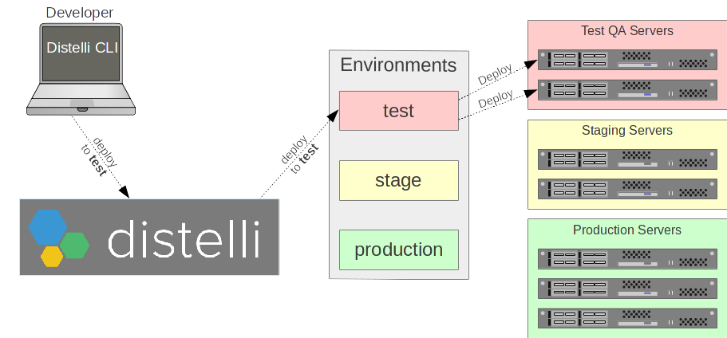
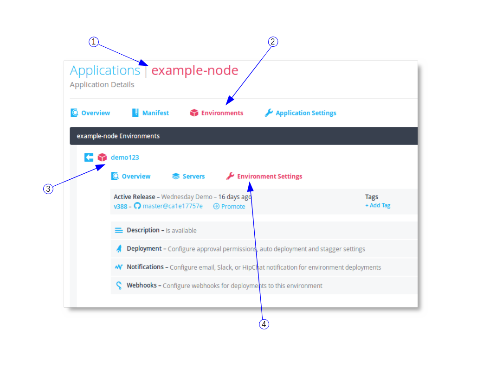
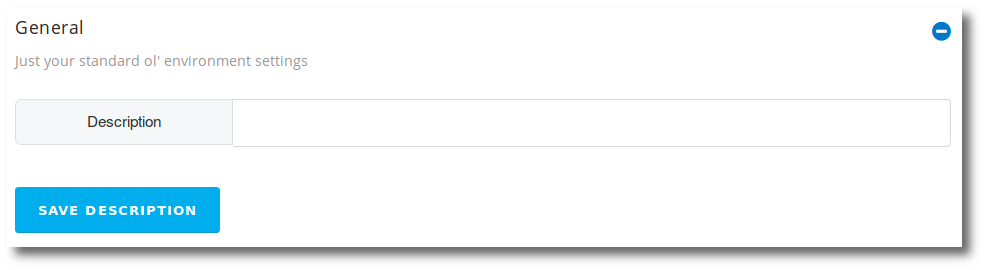
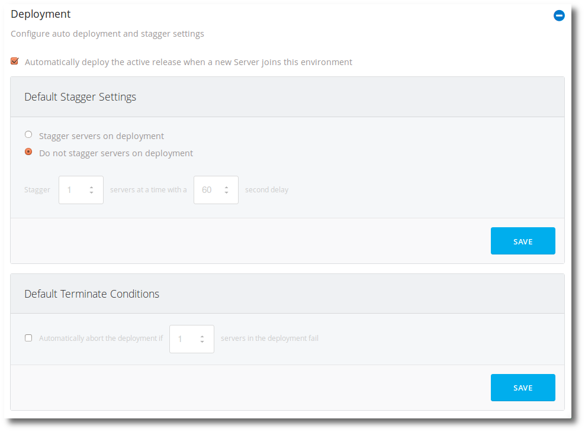
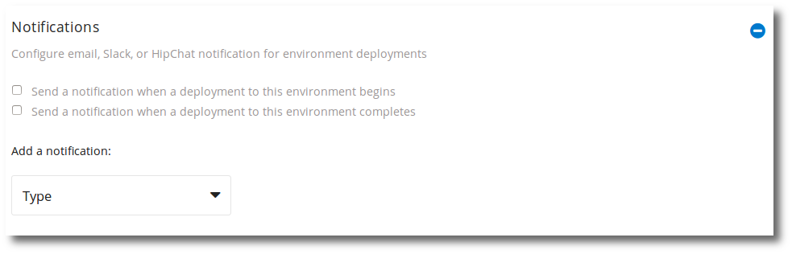
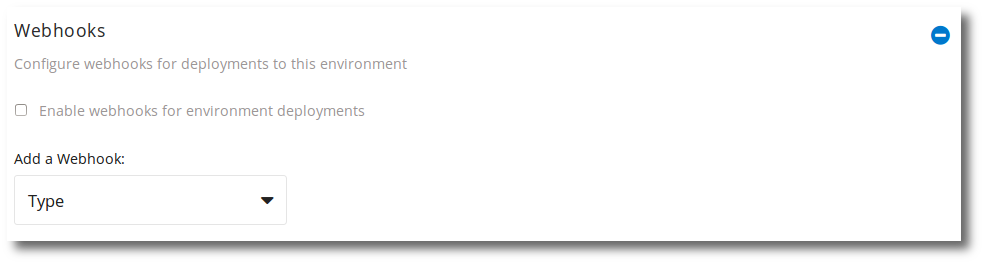
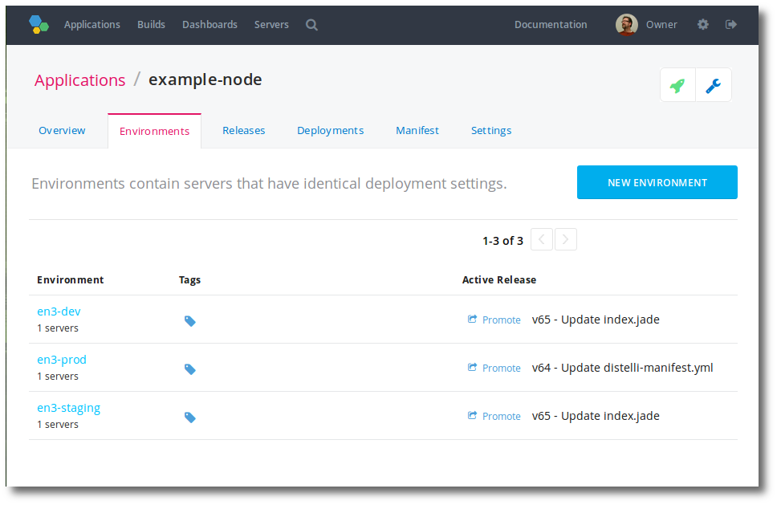
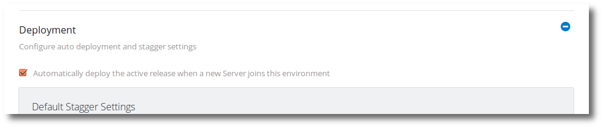
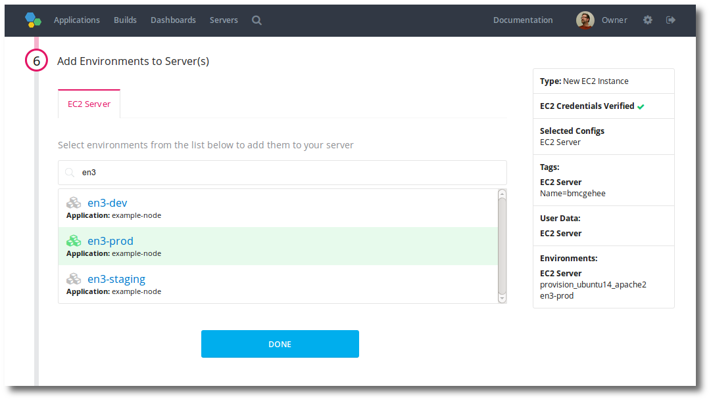

An environment exists as a child to an application. An environment is a collection of <i>like</i> servers for application deployments.
When you deploy an application, you deploy it to an environment which contains 1 or more servers.
An environment is specific to an application.

Environments fit into the Software Development Life Cycle (SDLC) process.

## Create an environment

Environments belong to applications. Before you can create an environment you must have an application.

To create an Environment, you must first select the application.
<ol>
  <li>In the Pipelines web UI, select the <b>application</b> you want to build an environment for.</li>
  <li>Click the <b>Environments</b> link.</li>

  
This will take you to the application environments, if any exist.

  <li>Click the <b>+Create Environment</b> link.</li>
  <li>Enter an <b>Environment Name</b> for the environment. Environment names must be unique in an account.</li>
  <li>Click the <b>Create</b> button.</li>
</ol>

This will take you to the newly created environment where you can adjust environment variables and environment settings.

> **Note:** To rename an environment, delete the existing environment and create a new one with the new name.

## Navigating to an environment

Remember, an environment is a child to an application so you must first navigate to the application.

### Navigate to an Environment

1. Login to the Pipelines web UI at [https://pipelines.puppet.com/login](https://pipelines.puppet.com/login).

1. In the application list, click the <b>Application</b> name that contains the environment you wish to navigate to.

1. Click the <b>Environments</b> link.

1. Click the <b>Environment name</b>.

You have navigated to the environment.

## Add a server to an environment

To add a server to an environment the server must first have the [Pipelines agent](./agent.html) installed. 

To add a server to an environment:

<ol>
  <li>First, have a server. If you don't have a server, you could use a virtual server.</li>

  <li>The Pipelines agent will need to be installed on the server.</li>
  <li>Navigate to the environment you want to add the server to. <a href="./environment.html">Navigating to an Environment</a></li>
  <li>Click the <b>(+)</b> add server icon.</li>

  
You will see a list of servers you installed the Pipelines Agent on.

  <li>Click the <b>server(s)</b> you wish to select to add to the environment.</li>
  <li>Click the <b>Add Selected Servers</b> button.</li>
</ol>

You have added server(s) to your application environment.

### Adding Servers with /etc/distelli.yml

You can also <b>automate</b> the Pipelines agent install, including logging the agent into a specific Pipelines account, automatically joining environment(s), and initiating an automatic initial deploy.

For more information see [Pipelines distelli.yml Usage](./distelliyml.html).

## Environment settings

Application environments have configurable settings. To get to an application environment settings:

<ol>
  <li>Navigate to the <b>application</b> where the environment exists.</li>
  <li>Click the <b>Environments</b> link.</li>
  <li>Click the <b>environment name</b> whose settings you wish to view.</li>
  <li>Click the <b>Environment Settings</b> link.</li>

  

  <li>Click any section to expand it vertically.</li>
</ol>

### General

<b>Description</b>

This is the application environment description.

### Deployment

<b>Automatically deploy the active release when a new Server joins this environment</b>

If this feature is checked (enabled), when adding servers to environments via a [Pipelines distelli.yml](./distelliyml.html) file, Pipelines will initiate a deploy of the latest successful release to the server. This is checked (enabled) by default.

For more information see [Pipelines distelli.yml Usage](./distelliyml.html).

<b>Default Stagger Settings</b>

This defines the default stagger settings, on deploy, for this application environment.

<b>&nbsp;&nbsp;- Stagger servers on deployment</b>

This sets the default stagger settings for deployments to this application environment.

<b>&nbsp;&nbsp;&nbsp;&nbsp;- Stagger #N servers at a time with a #T second delay</b>

This will batch deploy to #N servers at a time and wait #T seconds between batch deploys.

<b>&nbsp;&nbsp;- Do not stagger servers on deployment</b>

All servers will be deployed to at the same time. This does not work with Default Terminate Conditions (below).

<b>Default Terminate Conditions</b>

<b>&nbsp;&nbsp;&nbsp;&nbsp;- Automatically abort the deployment if #N servers in the deployment fail.</b>

The full deployment will stop and fail if #N servers fail. This works with stagger settings.

### Notifications

Environment notifications can send notifications for:

<b>Send a Notification when a Deployment to this Environment Begins</b>

If this feature is checked (enabled), when a deployment begins, a notification will be sent to all the notification types that have been added.
This is unchecked (disabled) by default.

<b>Send a Notification when a Deployment to this Environment Completes</b>

If this feature is checked (enabled), when a deployment completes, a notification will be sent to all the notification types that have been added.
This is unchecked (disabled) by default.

> **Note:**: For more information on notifications, see [Notifications](./notification.html).

### Webhooks

> **Note:** For more information on webhooks, see [Intro to Webhooks](./webhook.html).

## View an environment's deployments

Applications are deployed to environments. You can see information on the deployments made to a specific environment.

### View Environment Deployments

<ol>
<li>In the Pipelines web UI <a href="./environment.html">navigate to an environment</a>.</li>

<li>Click the <b>Deployments</b> link.</li>

</ol>
You you will find a list of deployments to the environment. This list will include:
<ul>
<li>Deployment ID</li>

<li>Release deployed</li>

<li>Status of deploy</li>

<li>Who deployed</li>

<li>When it was deployed</li>

</ul>

## Enable deployment approvals

Approvals are environment specific. To enable approvals:

<ol>
  <li><a href="./environment.html">Navigate to the environment</a> you wish to enable approvals for.</li>
  <li>Click <b>Settings</b>.</li>
  <li>Expand the <b>Deployment</b> section.</li>
  <li>Check the option <b>Set Approval Permissions</b>.</li>
  <li>Select a <b>Group</b> that contains the user(s) that are authorized to approve deployments to this environment.</li>
</ol> 

Any deployments to this environment will now require approval before the deployment is executed.

## Environment active release

An active release is specific to an application environment.

When a release is successfully deployed to server(s) in an environment, that release becomes the active release.

> **Note:** The active release can also be set with the [SetEnvActiveRelease API command](./api-environments.html).

### Environment Active Release

Each application environment that has a successful deploy will have an active release. If no release has been successfully deployed, an environment will not have an active release.

### Auto-Deploying the Active Release

When new servers join the environment they can be configured to automatically deploy the active release. This is enabled by default. This option can be found in the environment settings.

<ol>
<li>Navigate to the <b>application</b> where the environment exists.</li>
<li>Navigate to the <b>environment</b>.</li>
<li>Click the <b>Settings</b> tab.</li>
<li>Expand the <b>Deployment</b> section.</li>
</ol>

Here you will find the option:

~~~
[x] Automatically deploy the active release when a new Server joins this environment
~~~

As noted, this is enabled by default.

Auto deploy to new servers joining this environment will not occur if this option is unchecked.

The [App Pipeline](./pipeline.html) automated deployments is unaffected by this setting. This setting is specific to new servers joining environments.

### Joining Environment Auto Deploys

Adding a server to the environment via the Pipelines web UI will prompt you to deploy the active release.

New EC2 instances added to environments during the creation process will auto-deploy the active release.

New servers that use a `distelli.yml` file to authenticate and join environments will auto-deploy the active release. For more information on using the distelli.yml, see [Automated Install of the Pipelines agent](./agent-automate.html).

## Delete an environment

You can delete an environment only if it has no servers in it.
You should [terminate](./application-manage.html) any running apps deployed to the environment before deleting it.

1. In the Pipelines web UI, navigate to the <b>application</b> that contains the environment you wish to delete.
1. Click the <b>Environments</b> link.
1. For the environment you wish to delete, click the delete <b>trash can</b> icon on the far right.

    > **Warning:** If there are servers still in the environment, you will be given a warning. You must remove all servers in the environment before deleting.

    You will be prompted "Are you sure you want to delete environment ENV_NAME?"

1. Click <b>Delete</b>

## Remove servers from an environment

You can remove servers from an environment. This will not remove the server from your Pipelines account and you can add it to the same or different environment.

1. In the Pipelines web UI navigate to the Environment you wish to remove server(s) from.
1. Click the <b>Servers</b> link.
1. Click the <b>Remove Servers</b> link.
1. In the list find the <b>server(s)</b> you want to remove and click the checkbox on the right.

   > **Note:** You can select multiple servers across multiple pages.

1. After you have selected all the servers you want to remove click the <b>Remove Selected Servers</b> link.

